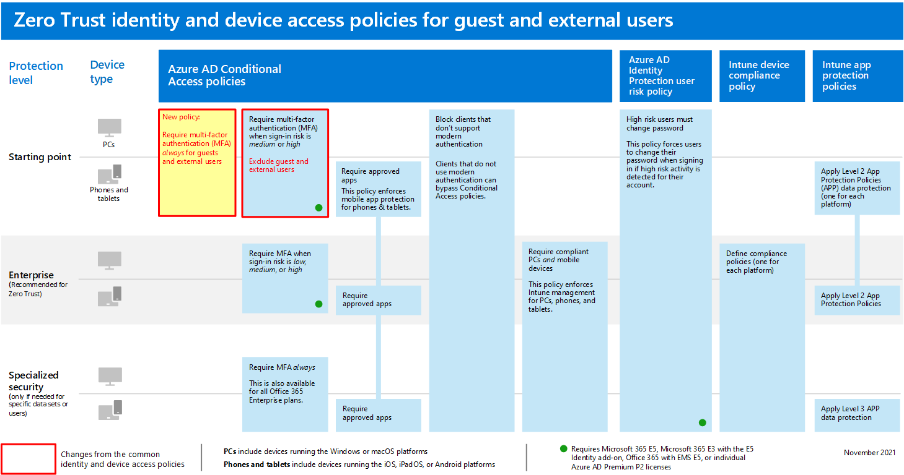
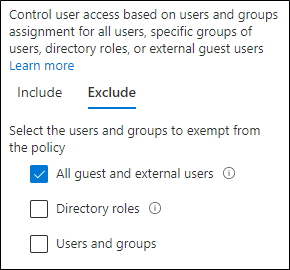

# Policies for allowing guest and external B2B access

This article describes how to adjust the recommended common identity and device access policies to allow access for guest and external users that have an Azure Active Directory (Azure AD) Business-to-Business (B2B) account. This guidance builds on the [common identity and device access policies](identity-access-policies.md).

These recommendations are designed to apply to the **baseline** tier of protection. However, you can also adjust the recommendations based on the granularity of your needs for **sensitive** and **highly regulated** protection.

Providing a path for B2B accounts to authenticate with your Azure AD tenant doesn't give these accounts access to your entire environment. B2B users and their accounts only have access to resources that are shared with them (such as files) within the services granted in Conditional Access policies.

## Updating the common policies to allow and protect guest and external access

To protect guest and external access with Azure AD B2B accounts, the following diagram illustrates which policies to add or update from the the common identity and device access policies.

[See a larger version of this image](https://github.com/MicrosoftDocs/microsoft-365-docs/raw/public/microsoft-365/media/microsoft-365-policies-configurations/identity-access-ruleset-guest.png)

The following table lists the policies you either need to create and update. The common policies link to the associated configuration instructions in the [Common identity and device access policies](identity-access-policies.md) article.

|Protection level|Policies|More information|
|---|---|---|
|**Baseline**|[Require MFA always for guest and external users](identity-access-policies.md#require-mfa-based-on-sign-in-risk)|Create this new policy and configure: <ul><li> For **Assignments > Users and groups > Include**, choose **Select users and groups**, and then select **All guest and external users**. </li><li> For **Assignments > Conditions > Sign-in**, leave all options unchecked to always enforce multi-factor authentication (MFA).</li>|
||[Require MFA when sign-in risk is *medium* or *high*](identity-access-policies.md#require-mfa-based-on-sign-in-risk)|Modify this policy to exclude guest and external users.|
||[Require compliant PCs](identity-access-policies.md#require-compliant-pcs-but-not-compliant-phones-and-tablets)|Modify this policy to exclude guest and external users.|

To include or exclude guest and external users in Conditional Access policies, for **Assignments > Users and groups > Include** or **Exclude**, check **All guest and external users**.

## More information

### Guest and external access with Microsoft Teams

Microsoft Teams defines the following:

- **Guest access** uses an Azure AD B2B account that can be added as a member of a team and have all permissioned access to the communications and resources of the team.

- **External access** is for an external user that does not have a B2B account. External access can include invitations and participation in calls, chats, and meetings, but does not include team membership and access to the resources of the team.

For more information, see the [comparison between guest and external access for teams](https://docs.microsoft.com/microsoftteams/communicate-with-users-from-other-organizations#compare-external-and-guest-access).

See [Policy recommendations for securing Teams chats, groups, and files](teams-access-policies.md) for more information about securing identity and device access policies for Teams.

### Require MFA always for guest and external users

This policy prompts guests to register for MFA in your tenant, regardless of whether they're registered for MFA in their home tenant. When accessing resources in your tenant, guest and external users are required to use MFA for every request.

### Excluding guest and external users from risk-based MFA

While organizations can enforce risk-based policies for B2B users using Azure AD Identity Protection, there are limitations in the implementation of Azure AD Identity Protection for B2B collaboration users in a resource directory due to their identity existing in their home directory. Due to these limitations, Microsoft recommends you exclude guest users from risk-based MFA policies and require these users to always use MFA.

For more information, see [Limitations of Identity Protection for B2B collaboration users](https://docs.microsoft.com/azure/active-directory/identity-protection/concept-identity-protection-b2b#limitations-of-identity-protection-for-b2b-collaboration-users).

### Excluding guest and external users from device management

Only one organization can manage a device. If you don't exclude guest and external users from policies that require device compliance, these policies will block these users.

## Next step

Configure Conditional Access policies for:

- [Microsoft Teams](teams-access-policies.md)
- [Exchange Online](secure-email-recommended-policies.md)
- [SharePoint](sharepoint-file-access-policies.md)
