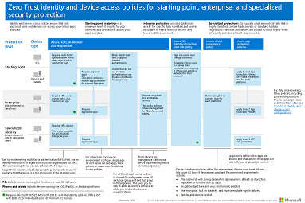

# Common security policies for Microsoft 365 organizations

Organizations have lots to worry about when deploying Microsoft 365 for their organization. The Conditional Access, app protection, and device compliance policies referenced in this article are based on Microsoft's recommendations and the three guiding principles of [Zero Trust](/security/zero-trust/zero-trust-overview):

- Verify explicitly
- Use least privilege
- Assume breach

Organizations can take these policies as is or customize them to fit their needs. If possible, test your policies in a non-production environment before rolling out to your production users. Testing is critical to identify and communicate any possible effects to your users.

We group these policies into three protection levels based on where you are on your deployment journey:

- **Starting point** - Basic controls that introduce multifactor authentication, secure password changes, and app protection policies.
- **Enterprise** - Enhanced controls that introduce device compliance.
- **Specialized security** - Policies that require multifactor authentication every time for specific data sets or users.

The following diagram shows which level of protections each policy applies to and whether the policies apply to PCs or phones and tablets, or both categories of devices.

:::image type="content" source="../../media/microsoft-365-policies-configurations/identity-device-access-policies-byplan.png" alt-text="A Diagram showing common identity and device policies that support Zero Trust principles." lightbox="../../media/microsoft-365-policies-configurations/identity-device-access-policies-byplan.png":::

You can download this diagram as a [PDF](https://download.microsoft.com/download/e/d/0/ed03381c-16ce-453e-9c89-c13967819cea/zero-trust-identity-and-device-access-policies.pdf) file.

<!--

Here's a one-page PDF summary:

   [View as a PDF](../../downloads/MSFT-cloud-architecture-identity-device-protection-handout.pdf) \| [Download as a PDF](https://github.com/MicrosoftDocs/microsoft-365-docs/raw/public/microsoft-365/downloads/MSFT-cloud-architecture-identity-device-protection-handout.pdf)

-->

> [!TIP]
> Requiring the use of multifactor authentication (MFA) is recommended before enrolling devices in Intune to assure that the device is in the possession of the intended user. You must enroll devices in Intune before you can enforce device compliance policies.

## Prerequisites

### Permissions

- Users who will manage Conditional Access policies must be able to sign in to the Azure portal as a **Conditional Access Administrator**, **Security Administrator**, or **Global Administrator**.
- Users who will manage app protection and device compliance policies must be able to sign in to Intune as an **Intune Administrator** or **Global Administrator**.
- Those users who only need to view configurations can be assigned the **Security Reader** or **Global Reader** roles.

For more information about roles and permissions, see the article [Azure AD built-in roles](/azure/active-directory/roles/permissions-reference).

### User registration

Ensure your users register for multifactor authentication prior to requiring its use. If you have licenses that include Azure AD Premium P2, you can use the [MFA registration policy within Azure AD Identity Protection](/azure/active-directory/identity-protection/howto-identity-protection-configure-mfa-policy) to require that users register. We provide [communication templates](https://aka.ms/mfatemplates), you can download and customize, to promote registration.

### Groups

All Azure AD groups used as part of these recommendations must be created as a **Microsoft 365** group *not a Security group*. This requirement is important for the deployment of sensitivity labels when securing documents in Microsoft Teams and SharePoint later on. For more information, see the article [Learn about groups and access rights in Azure Active Directory](/azure/active-directory/fundamentals/concept-learn-about-groups#group-types)

### Assigning policies

Conditional Access policies may be assigned to users, groups, and administrator roles. Intune app protection and device compliance policies may be assigned to *groups only*. Before you configure your policies, you should identify who should be included and excluded. Typically, starting point protection level policies apply to everybody in the organization.

Here's an example of group assignment and exclusions for requiring MFA after your users have completed [user registration](#user-registration).

|&nbsp;|Azure AD Conditional Access policy|Include|Exclude|
|---|---|---|---|
|**Starting point**|Require multifactor authentication for medium or high sign-in risk|*All users*|<ul><li>Emergency access accounts</li><li>Conditional Access exclusion group</li></ul>|
|**Enterprise**|Require multifactor authentication for low, medium, or high sign-in risk|*Executive staff group*|<ul><li>Emergency access accounts</li><li>Conditional Access exclusion group</li></ul>|
|**Specialized security**|Require multifactor authentication always|*Top Secret Project Buckeye group*|<ul><li>Emergency access accounts</li><li>Conditional Access exclusion group</li></ul>|

Be careful when applying higher levels of protection to groups and users. **The goal of security isn't to add unnecessary friction** to the user experience. For example, members of the *Top Secret Project Buckeye group* will be required to use MFA every time they sign in, even if they aren't working on the specialized security content for their project. Excessive security friction can lead to fatigue.

You may consider enabling [passwordless authentication methods](/azure/active-directory/authentication/concept-authentication-passwordless), like Windows Hello for Business or FIDO2 security keys to reduce some friction created by certain security controls.

### Emergency access accounts

All organizations should have at least one emergency access account that is monitored for use and excluded from policies. **These accounts are only used in case all other administrator accounts and authentication methods become locked out or otherwise unavailable**. More information can be found in the article, [Manage emergency access accounts in Azure AD](/azure/active-directory/roles/security-emergency-access).

### Exclusions

A recommended practice is to create an Azure AD group for Conditional Access exclusions. This group gives you a means to provide access to a user while you troubleshoot access issues.

> [!WARNING]
> This group is recommended for use as a temporary solution only. Continuously monitor and audit this group for changes and be sure the exclusion group is being used only as intended.

To add this exclusion group to any existing policies:

1. Sign in to the **Azure portal** as a Conditional Access Administrator, Security Administrator, or Global Administrator.
1. Browse to **Azure Active Directory** > **Security** > **Conditional Access**.
1. Select an existing policy.
1. Under **Assignments**, select **Users or workload identities**.
   1. Under **Exclude**, select **Users and groups** and choose your organization's emergency access or break-glass accounts and Conditional Access exclusion group.

## Deployment

We recommend implementing the [starting point policies](#starting-point) in the order listed in this table. However, the MFA policies for [enterprise](#enterprise) and [specialized security](#specialized-security) levels of protection can be implemented at any time.

### Starting point

|Policy|More information|Licensing|
|---|---|---|
|[Require MFA when sign-in risk is *medium* or *high*](#require-mfa-based-on-sign-in-risk)|Use risk data from Azure AD Identity Protection to require MFA only when risk is detected|Microsoft 365 E5 or Microsoft 365 E3 with the E5 Security add-on|
|[Block clients that don't support modern authentication](#block-clients-that-dont-support-multifactor-authentication)|Clients that don't use modern authentication can bypass Conditional Access policies, so it's important to block them.|Microsoft 365 E3 or E5|
|[High risk users must change password](#high-risk-users-must-change-password)|Forces users to change their password when signing in if high-risk activity is detected for their account.|Microsoft 365 E5 or Microsoft 365 E3 with the E5 Security add-on|
|[Apply application protection policies for data protection](#app-protection-policies)|One Intune app protection policy per platform (Windows, iOS/iPadOS, Android).|Microsoft 365 E3 or E5|
|[Require approved apps and app protection policies](#require-approved-apps-and-app-protection-policies)|Enforces mobile app protection policies for phones and tablets using iOS, iPadOS, or Android.|Microsoft 365 E3 or E5|

### Enterprise

|Policy|More information|Licensing|
|---|---|---|
|[Require MFA when sign-in risk is *low*, *medium*, or *high*](#require-mfa-based-on-sign-in-risk)|Use risk data from Azure AD Identity Protection to require MFA only when risk is detected|Microsoft 365 E5 or Microsoft 365 E3 with the E5 Security add-on|
|[Define device compliance policies](#device-compliance-policies)|Set minimum configuration requirements. One policy for each platform.|Microsoft 365 E3 or E5|
|[Require compliant PCs and mobile devices](#require-compliant-pcs-and-mobile-devices)|Enforces the configuration requirements for devices accessing your organization|Microsoft 365 E3 or E5|

### Specialized security

|Policy|More information|Licensing|
|---|---|---|
|[*Always* require MFA](#always-require-mfa)|Users must perform MFA anytime they sign in to your organizations services|Microsoft 365 E3 or E5|

## App protection policies

[App protection policies](/mem/intune/apps/app-protection-policy) define which apps are allowed and the actions they can take with your organization's data. There are many choices available and it may be confusing to some. The following baselines are Microsoft's recommended configurations that may be tailored to your needs. We provide three templates to follow, but think most organizations will choose levels 2 and 3.

Level 2 maps to what we consider [starting point](#starting-point) or [enterprise](#enterprise) level security, level 3 maps to [specialized](#specialized-security) security.

- [Level 1 enterprise basic data protection](/mem/intune/apps/app-protection-framework#level-1-enterprise-basic-data-protection) – Microsoft recommends this configuration as the minimum data protection configuration for an enterprise device.

- **[Level 2 enterprise enhanced data protection](/mem/intune/apps/app-protection-framework#level-2-enterprise-enhanced-data-protection)** – Microsoft recommends this configuration for devices where users access sensitive or confidential information. This configuration is applicable to most mobile users accessing work or school data. Some of the controls may affect user experience.

- **[Level 3 enterprise high data protection](/mem/intune/apps/app-protection-framework#level-3-enterprise-high-data-protection)** – Microsoft recommends this configuration for devices run by an organization with a larger or more sophisticated security team, or for specific users or groups who are at uniquely high risk (users who handle highly sensitive data where unauthorized disclosure causes considerable material loss to the organization). An organization likely to be targeted by well-funded and sophisticated adversaries should aspire to this configuration.

### Create app protection policies

Create a new app protection policy for each platform (iOS and Android) within Microsoft Intune using the data protection framework settings by:

- Manually create the policies by following the steps in [How to create and deploy app protection policies with Microsoft Intune](/mem/intune/apps/app-protection-policies).
- Import the sample [Intune App Protection Policy Configuration Framework JSON templates](https://github.com/microsoft/Intune-Config-Frameworks/tree/master/AppProtectionPolicies) with [Intune's PowerShell scripts](https://github.com/microsoftgraph/powershell-intune-samples).

## Device compliance policies

Intune device compliance policies define the requirements that devices must meet to be determined as compliant.

You must create a policy for each PC, phone, or tablet platform. This article will cover recommendations for the following platforms:

- [Android](#enrollment-and-compliance-settings-for-android)
- [iOS/iPadOS](#enrollment-and-compliance-settings-for-iosipados)
- [Windows 10 and later](#recommended-compliance-settings-for-windows-10-and-later)

### Create device compliance policies

To create device compliance policies, sign in to the [Microsoft Intune admin center](https://endpoint.microsoft.com), and navigate to **Devices** > **Compliance policies** > **Policies**. Select **Create Policy**.

For step-by-step guidance on creating compliance policies in Intune, see [Create a compliance policy in Microsoft Intune](/mem/intune/protect/create-compliance-policy).

#### Enrollment and compliance settings for iOS/iPadOS

iOS/iPadOS supports several enrollment scenarios, two of which are covered as part of this framework:

- [Device enrollment for personally owned devices](/mem/intune/enrollment/ios-enroll) – these devices are personally owned and used for both work and personal use.
- [Automated device enrollment for corporate-owned devices](/mem/intune/enrollment/device-enrollment-program-enroll-ios) – these devices are corporate-owned, associated with a single user, and used exclusively for work and not personal use.

Using the principles outlined in [Zero Trust identity and device access configurations](microsoft-365-policies-configurations.md):

- The [starting point](#starting-point) and [enterprise](#enterprise) protection levels map closely with the level 2 enhanced security settings.
- The [specialized](#specialized-security) security protection level maps closely to the level 3 high security settings.

##### Compliance settings for personally enrolled devices

- [Personal basic security (Level 1)](/mem/intune/enrollment/ios-ipados-personal-device-security-configurations#personal-basic-security-level-1) – Microsoft recommends this configuration as the minimum security configuration for personal devices where users access work or school data. This configuration is done by enforcing password policies, device lock characteristics, and disabling certain device functions, like untrusted certificates.
- **[Personal enhanced security (Level 2)](/mem/intune/enrollment/ios-ipados-personal-device-security-configurations#personal-enhanced-security-level-2)** – Microsoft recommends this configuration for devices where users access sensitive or confidential information. This configuration enacts data sharing controls. This configuration is applicable to most mobile users accessing work or school data on a device.
- **[Personal high security (Level 3)](/mem/intune/enrollment/ios-ipados-personal-device-security-configurations#personal-high-security-level-3)** – Microsoft recommends this configuration for devices used by specific users or groups who are uniquely high risk (users who handle highly sensitive data where unauthorized disclosure causes considerable material loss to the organization). This configuration enacts stronger password policies, disables certain device functions, and enforces extra data transfer restrictions.

##### Compliance settings for automated device enrollment

- [Supervised basic security (Level 1)](/mem/intune/enrollment/ios-ipados-supervised-device-security-configurations#supervised-basic-security-level-1) – Microsoft recommends this configuration as the minimum security configuration for supervised devices where users access work or school data. This configuration is done by enforcing password policies, device lock characteristics, and disabling certain device functions, like untrusted certificates.
- **[Supervised enhanced security (Level 2)](/mem/intune/enrollment/ios-ipados-supervised-device-security-configurations#supervised-enhanced-security-level-2)** – Microsoft recommends this configuration for devices where users access sensitive or confidential information. This configuration enacts data sharing controls and blocks access to USB devices. This configuration is applicable to most mobile users accessing work or school data on a device.
- **[Supervised high security (Level 3)](/mem/intune/enrollment/ios-ipados-supervised-device-security-configurations#supervised-high-security-level-3)** – Microsoft recommends this configuration for devices used by specific users or groups who are uniquely high risk (users who handle highly sensitive data where unauthorized disclosure causes considerable material loss to the organization). This configuration enacts stronger password policies, disables certain device functions, enforces extra data transfer restrictions, and requires apps to be installed through Apple's volume purchase program.

#### Enrollment and compliance settings for Android

Android Enterprise supports several enrollment scenarios, two of which are covered as part of this framework:

- [Android Enterprise work profile](/mem/intune/enrollment/android-work-profile-enroll) – this enrollment model is typically used for personally owned devices, where IT wants to provide a clear separation boundary between work and personal data. Policies controlled by IT ensure that the work data can't be transferred into the personal profile.
- [Android Enterprise fully managed devices](/mem/intune/enrollment/android-fully-managed-enroll) – these devices are corporate-owned, associated with a single user, and used exclusively for work and not personal use.

The Android Enterprise security configuration framework is organized into several distinct configuration scenarios, providing guidance for work profile and fully managed scenarios.

Using the principles outlined in [Zero Trust identity and device access configurations](microsoft-365-policies-configurations.md):

- The [starting point](#starting-point) and [enterprise](#enterprise) protection levels map closely with the level 2 enhanced security settings.
- The [specialized](#specialized-security) security protection level maps closely to the level 3 high security settings.

##### Compliance settings for Android Enterprise work profile devices

- Because of the settings available for personally owned work profile devices, there's no basic security (level 1) offering. The available settings don't justify a difference between level 1 and level 2.
- **[Work profile enhanced security (Level 2)](/mem/intune/enrollment/android-work-profile-security-settings#personally-owned-work-profile-enhanced-security)**– Microsoft recommends this configuration as the minimum security configuration for personal devices where users access work or school data. This configuration introduces password requirements, separates work and personal data, and validates Android device attestation.
- **[Work profile high security (Level 3)](/mem/intune/enrollment/android-work-profile-security-settings#personally-owned-work-profile-high-security)** – Microsoft recommends this configuration for devices used by specific users or groups who are uniquely high risk (users who handle highly sensitive data where unauthorized disclosure causes considerable material loss to the organization). This configuration introduces mobile threat defense or Microsoft Defender for Endpoint, sets the minimum Android version, enacts stronger password policies, and further restricts work and personal separation.

##### Compliance settings for Android Enterprise fully managed devices

- [Fully managed basic security (Level 1)](/mem/intune/enrollment/android-fully-managed-security-settings#fully-managed-basic-security) – Microsoft recommends this configuration as the minimum security configuration for an enterprise device. This configuration is applicable to most mobile users accessing work or school data. This configuration introduces password requirements, sets the minimum Android version, and enacts certain device restrictions.
- **[Fully managed enhanced security (Level 2)](/mem/intune/enrollment/android-fully-managed-security-settings#fully-managed-enhanced-security)** – Microsoft recommends this configuration for devices where users access sensitive or confidential information. This configuration enacts stronger password policies and disables user/account capabilities.
- **[Fully managed high security (Level 3)](/mem/intune/enrollment/android-fully-managed-security-settings#fully-managed-high-security)** - Microsoft recommends this configuration for devices used by specific users or groups who are uniquely high risk. These users may handle highly sensitive data where unauthorized disclosure may cause considerable material loss to the organization. This configuration increases the minimum Android version, introduces mobile threat defense or Microsoft Defender for Endpoint, and enforces extra device restrictions.

#### Recommended compliance settings for Windows 10 and later

The following settings are configured in **Step 2: Compliance settings**, of the [compliance policy creation process for Windows 10 and newer devices](/mem/intune/protect/compliance-policy-create-windows). These settings align with the principles outlined in [Zero Trust identity and device access configurations](microsoft-365-policies-configurations.md).

For **Device health > Windows Health Attestation Service evaluation rules**, see this table.

|Property|Value|
|---|---|
|Require BitLocker|Require|
|Require Secure Boot to be enabled on the device|Require|
|Require code integrity|Require|

For **Device properties**, specify appropriate values for operating system versions based on your IT and security policies.

For **Configuration Manager Compliance**, if you are in a co-managed environment with Configuration Manager select **Require** otherwise select **Not configured**.

For **System security**, see this table.

|Property|Value|
|---|---|
|Require a password to unlock mobile devices|Require|
|Simple passwords|Block|
|Password type|Device default|
|Minimum password length|6|
|Maximum minutes of inactivity before a password is required|15 minutes|
|Password expiration (days)|41|
|Number of previous passwords to prevent reuse|5|
|Require password when device returns from idle state (Mobile and Holographic)|Require|
|Require encryption of data storage on device|Require|
|Firewall|Require|
|Antivirus|Require|
|Antispyware|Require|
|Microsoft Defender Antimalware|Require|
|Microsoft Defender Antimalware minimum version|Microsoft recommends versions no more than five behind from the most recent version.|
|Microsoft Defender Antimalware signature up to date|Require|
|Real-time protection|Require|

For **Microsoft Defender for Endpoint**

|Property|Value|
|---|---|
|[Require the device to be at or under the machine-risk score](/mem/intune/protect/advanced-threat-protection-configure#create-and-assign-compliance-policy-to-set-device-risk-level)|Medium|

## Conditional Access policies

Once your app protection and device compliance policies are created in Intune, you can enable enforcement with Conditional Access policies.

### Require MFA based on sign-in risk

Follow the guidance in the article [Common Conditional Access policy: Sign-in risk-based multifactor authentication](/azure/active-directory/conditional-access/howto-conditional-access-policy-risk) to create a policy to require multifactor authentication based on sign-in risk.

When configuring your policy, use the following risk levels.

|Level of protection|Risk level values needed|Action|
|---|---|---|
|Starting point|High, medium|Check both.|
|Enterprise|High, medium, low|Check all three.|

### Block clients that don't support multifactor authentication

Follow the guidance in the article [Common Conditional Access policy: Block legacy authentication](/azure/active-directory/conditional-access/howto-conditional-access-policy-block-legacy) to block legacy authentication.

### High risk users must change password

Follow the guidance in the article [Common Conditional Access policy: User risk-based password change](/azure/active-directory/conditional-access/howto-conditional-access-policy-risk-user) to require users with compromised credentials to change their password.

Use this policy along with [Azure AD password protection](/azure/active-directory/authentication/concept-password-ban-bad), which detects and blocks known weak passwords and their variants in addition to terms specific to your organization. Using Azure AD password protection ensures that changed passwords are stronger.

### Require approved apps and app protection policies

**You must create a Conditional Access policy** to enforce the app protection policies created in Intune. Enforcing app protection policies requires a Conditional Access policy **and** a corresponding app protection policy.

To create a Conditional Access policy that requires approved apps and APP protection, follow the steps in [Require approved client apps or app protection policy with mobile devices](/azure/active-directory/conditional-access/howto-policy-approved-app-or-app-protection). This policy only allows accounts within mobile apps protected by app protection policies to access Microsoft 365 endpoints.

Blocking legacy authentication for other client apps on iOS and Android devices ensures that these clients can't bypass Conditional Access policies. If you're following the guidance in this article, you've already configured [Block clients that don't support modern authentication](#block-clients-that-dont-support-multifactor-authentication).

### Require compliant PCs and mobile devices

The following steps will help create a Conditional Access policy to require devices accessing resources be marked as compliant with your organization's Intune compliance policies.

> [!CAUTION]
> Make sure that your device is compliant before enabling this policy. Otherwise, you could get locked out and be unable to change this policy until your user account has been added to the Conditional Access exclusion group.

1. Sign in to the **Azure portal**.
1. Browse to **Azure Active Directory** > **Security** > **Conditional Access**.
1. Select **New policy**.
1. Give your policy a name. We recommend that organizations create a meaningful standard for the names of their policies.
1. Under **Assignments**, select **Users or workload identities**.
   1. Under **Include**, select **All users**.
   1. Under **Exclude**, select **Users and groups** and choose your organization's emergency access or break-glass accounts.
1. Under **Cloud apps or actions** > **Include**, select **All cloud apps**.
   1. If you must exclude specific applications from your policy, you can choose them from the **Exclude** tab under **Select excluded cloud apps** and choose **Select**.
1. Under **Access controls** > **Grant**.
   1. Select **Require device to be marked as compliant**.
   1. Select **Select**.
1. Confirm your settings and set **Enable policy** to **On**.
1. Select **Create** to create to enable your policy.

> [!NOTE]
> You can enroll your new devices to Intune even if you select **Require device to be marked as compliant** for **All users** and **All cloud apps** in your policy. **Require device to be marked as compliant** control does not block Intune enrollment and the access to the Microsoft Intune Web Company Portal application.

#### Subscription activation

Organizations using the [Subscription Activation](/windows/deployment/windows-10-subscription-activation) feature to enable users to "step-up" from one version of Windows to another, may want to exclude the Universal Store Service APIs and Web Application, AppID 45a330b1-b1ec-4cc1-9161-9f03992aa49f from their device compliance policy.

### Always require MFA

Follow the guidance in the article [Common Conditional Access policy: Require MFA for all users](/azure/active-directory/conditional-access/howto-conditional-access-policy-all-users-mfa) to require your specialized security level users to always perform multifactor authentication.

> [!WARNING]
> When configuring your policy, select the group that requires specialized security and use that **instead of selecting All users**.

## Next steps

[Learn about policy recommendations for guest and external users](identity-access-policies-guest-access.md)
