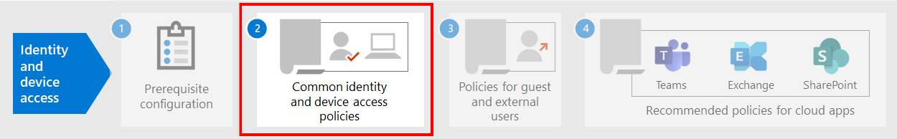

# Prerequisite work for implementing identity and device access policies

**Applies to**
- [Exchange Online Protection](exchange-online-protection-overview.md)
- [Microsoft Defender for Office 365 plan 1 and plan 2](office-365-atp.md)
- Azure

This article describes the prerequisites admins must meet to use recommended identity and device access policies, and to use Conditional Access. It also discusses the recommended defaults for configuring client platforms for the best single sign-on (SSO) experience.

## Prerequisites

Before using the identity and device access policies that are recommended, your organization needs to meet prerequisites. The requirements are different for the various identity and authentication models listed:

- Cloud-only
- Hybrid with password hash sync (PHS) authentication
- Hybrid with pass-through authentication (PTA)
- Federated

The following table details the prerequisite features and their configuration that apply to all identity models, except where noted.

|Configuration|Exceptions|
|---|:---:|
|[Configure PHS](https://docs.microsoft.com/azure/active-directory/hybrid/how-to-connect-password-hash-synchronization).  This must be enabled to detect leaked credentials and to act on them for risk-based Conditional Access. **Note:** This is required regardless of whether your organization uses federated authentication.|Cloud-only|
|[Enable seamless single sign-on](https://docs.microsoft.com/azure/active-directory/connect/active-directory-aadconnect-sso) to automatically sign users in when they are on their organization devices connected to your organization network.|Cloud-only and federated|
|[Configure named locations](https://docs.microsoft.com/azure/active-directory/reports-monitoring/quickstart-configure-named-locations). Azure AD Identity Protection collects and analyzes all available session data to generate a risk score. We recommend you specify your organization's public IP ranges for your network in the Azure AD named locations configuration. Traffic coming from these ranges is given a reduced risk score, and traffic from outside the organization environment is given a higher risk score.||
|[Register all users for self-service password reset (SSPR) and multi-factor authentication (MFA)](https://docs.microsoft.com/azure/active-directory/authentication/concept-registration-mfa-sspr-converged). We recommend you register users for Azure AD Multi-Factor Authentication ahead of time. Azure AD Identity Protection makes use of Azure AD Multi-Factor Authentication to perform additional security verification. Additionally, for the best sign-in experience, we recommend users install the [Microsoft Authenticator app](https://docs.microsoft.com/azure/active-directory/user-help/microsoft-authenticator-app-how-to) and the Microsoft Company Portal app on their devices. These can be installed from the app store for each platform.||
|[Enable automatic device registration of domain-joined Windows computers](https://docs.microsoft.com/azure/active-directory/active-directory-conditional-access-automatic-device-registration-setup). Conditional Access will make sure devices connecting to apps are domain-joined or compliant. To support this on Windows computers, the device must be registered with Azure AD.  This article discusses how to configure automatic device registration.|Cloud-only|
|**Prepare your support team**. Have a plan in place for users that cannot complete MFA. This could be adding them to a policy exclusion group, or registering new MFA information for them. Before making either of these security-sensitive changes, you need to ensure that the actual user is making the request. Requiring users' managers to help with the approval is an effective step.||
|[Configure password writeback to on-premises AD](https://docs.microsoft.com/azure/active-directory/active-directory-passwords-getting-started). Password writeback allows Azure AD to require that users change their on-premises passwords when a high-risk account compromise is detected. You can enable this feature using Azure AD Connect in one of two ways: either enable **Password Writeback** in the optional features screen of the Azure AD Connect setup wizard, or enable it via Windows PowerShell.|Cloud-only|
|[Configure Azure AD password protection](https://docs.microsoft.com/azure/active-directory/authentication/concept-password-ban-bad). Azure AD Password Protection detects and blocks known weak passwords and their variants, and can also block additional weak terms that are specific to your organization. Default global banned password lists are automatically applied to all users in an Azure AD tenant. You can define additional entries in a custom banned password list. When users change or reset their passwords, these banned password lists are checked to enforce the use of strong passwords.||
|[Enable Azure Active Directory Identity Protection](https://docs.microsoft.com/azure/active-directory/identity-protection/overview-identity-protection). Azure AD Identity Protection enables you to detect potential vulnerabilities affecting your organization's identities and configure an automated remediation policy to low, medium, and high sign-in risk and user risk.||
|**Enable modern authentication** for [Exchange Online](https://docs.microsoft.com/Exchange/clients-and-mobile-in-exchange-online/enable-or-disable-modern-authentication-in-exchange-online) and for [Skype for Business Online](https://social.technet.microsoft.com/wiki/contents/articles/34339.skype-for-business-online-enable-your-tenant-for-modern-authentication.aspx). Modern authentication is a prerequisite for using MFA. Modern authentication is enabled by default for Office 2016 and 2019 clients, SharePoint, and OneDrive for Business.||
|

## Recommended client configurations

This section describes the default platform client configurations we recommend to provide the best SSO experience to your users, as well as the technical prerequisites for Conditional Access.

### Windows devices

We recommend the Windows 10 (version 2004 or later), as Azure is designed to provide the smoothest SSO experience possible for both on-premises and Azure AD. Work or school-issued devices should be configured to join Azure AD directly or if the organization uses on-premises AD domain join, those devices should be [configured to automatically and silently register with Azure AD](https://docs.microsoft.com/azure/active-directory/active-directory-conditional-access-automatic-device-registration-setup).

For BYOD Windows devices, users can use **Add work or school account**. Note that users of the Google Chrome browser on Windows 10 devices need to [install an extension](https://chrome.google.com/webstore/detail/windows-10-accounts/ppnbnpeolgkicgegkbkbjmhlideopiji?utm_source=chrome-app-launcher-info-dialog) to get the same smooth sign-in experience as Microsoft Edge users. Also, if your organization has domain-joined Windows 8 or 8.1 devices, you can install Microsoft Workplace Join for non-Windows 10 computers. [Download the package to register](https://www.microsoft.com/download/details.aspx?id=53554) the devices with Azure AD.

### iOS devices

We recommend installing the [Microsoft Authenticator app](https://docs.microsoft.com/azure/multi-factor-authentication/end-user/microsoft-authenticator-app-how-to) on user devices before deploying Conditional Access or MFA policies. At a minimum, the app should be installed when users are asked to register their device with Azure AD by adding a work or school account, or when they install the Intune company portal app to enroll their device into management. This depends on the configured Conditional Access policy.

### Android devices

We recommend users install the [Intune Company Portal app](https://play.google.com/store/apps/details?id=com.microsoft.windowsintune.companyportal&hl=en) and [Microsoft Authenticator app](https://docs.microsoft.com/azure/multi-factor-authentication/end-user/microsoft-authenticator-app-how-to) before Conditional Access policies are deployed or when required during certain authentication attempts. After app installation, users may be asked to register with Azure AD or enroll their device with Intune. This depends on the configured Conditional Access policy.

We also recommend that organization-owned devices are standardized on OEMs and versions that support Android for Work or Samsung Knox to allow mail accounts, be managed and protected by Intune MDM policy.

### Recommended email clients

The following email clients support modern authentication and Conditional Access.

|Platform|Client|Version/Notes|
|---|---|---|
|**Windows**|Outlook|2019, 2016, 2013 
 [Enable modern authentication](../../admin/security-and-compliance/enable-modern-authentication.md) 
 [Required updates](https://support.office.com/article/Outlook-Updates-472c2322-23a4-4014-8f02-bbc09ad62213)|
|**iOS**|Outlook for iOS|[Latest](https://itunes.apple.com/us/app/microsoft-outlook-email-and-calendar/id951937596?mt=8)|
|**Android**|Outlook for Android|[Latest](https://play.google.com/store/apps/details?id=com.microsoft.office.outlook&hl=en)|
|**macOS**|Outlook|2019 and 2016|
|**Linux**|Not supported||
|

### Recommended client platforms when securing documents

The following clients are recommended when a secure documents policy has been applied.

|Platform|Word/Excel/PowerPoint|OneNote|OneDrive App|SharePoint App|[OneDrive sync client](https://docs.microsoft.com/onedrive/enable-conditional-access)|
|---|---|---|---|---|---|
|Windows 8.1|Supported|Supported|N/A|N/A|Supported|
|Windows 10|Supported|Supported|N/A|N/A|Supported|
|Android|Supported|Supported|Supported|Supported|N/A|
|iOS|Supported|Supported|Supported|Supported|N/A|
|macOS|Supported|Supported|N/A|N/A|Not supported|
|Linux|Not supported|Not supported|Not supported|Not supported|Not supported|
|

### Microsoft 365 client support

For more information about client support in Microsoft 365, see the following articles:

- [Microsoft 365 Client App Support - Conditional Access](../../enterprise/microsoft-365-client-support-conditional-access.md)
- [Microsoft 365 Client App Support - Multi-factor authentication](../../enterprise/microsoft-365-client-support-multi-factor-authentication.md)

## Protecting administrator accounts

For Microsoft 365 E3 or E5 or with separate Azure AD Premium P1 or P2 licenses, you can require MFA for administrator accounts with a manually-created Conditional Access policy. See [Conditional Access: Require MFA for administrators](https://docs.microsoft.com/azure/active-directory/conditional-access/howto-conditional-access-policy-admin-mfa) for the details.

For editions of Microsoft 365 or Office 365 that do not support Conditional Access, you can enable [security defaults](https://docs.microsoft.com/azure/active-directory/fundamentals/concept-fundamentals-security-defaults) to require MFA for all accounts.

Here are some additional recommendations:

- Use [Azure AD Privileged Identity Management](https://docs.microsoft.com/azure/active-directory/privileged-identity-management/pim-getting-started) to reduce the number of persistent administrative accounts.
- [Use privileged access management](../../compliance/privileged-access-management-overview.md) to protect your organization from breaches that may use existing privileged admin accounts with standing access to sensitive data or access to critical configuration settings.
- Create and use separate accounts that are assigned [Microsoft 365 administrator roles](../../admin/add-users/about-admin-roles.md) *only for administration*. Admins should have their own user account for regular non-administrative use and only use an administrative account when necessary to complete a task associated with their role or job function.
- Follow [best practices](https://docs.microsoft.com/azure/active-directory/admin-roles-best-practices) for securing privileged accounts in Azure AD.

## Next step

[Configure the common identity and device access policies](identity-access-policies.md)
