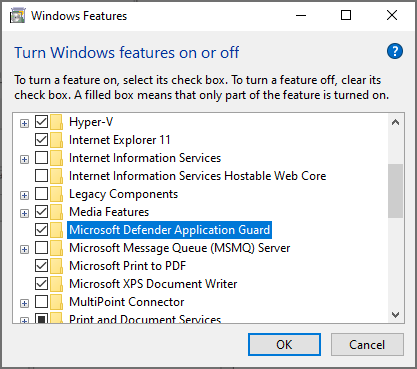
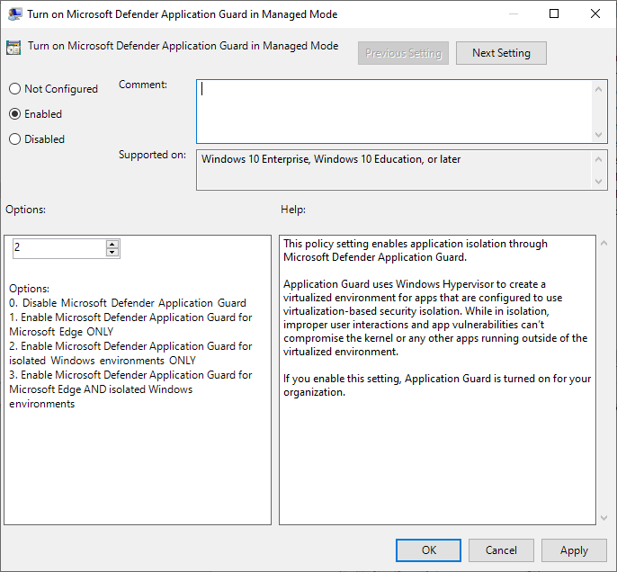
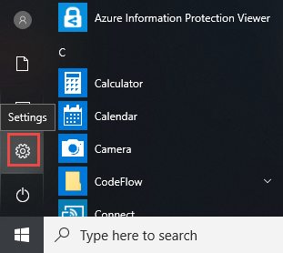
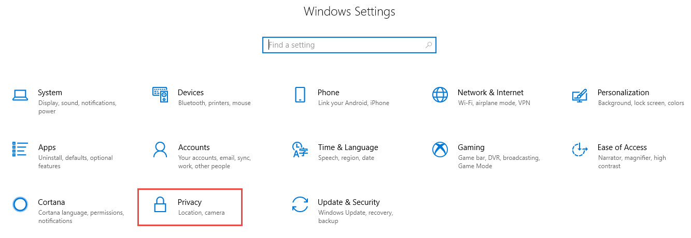
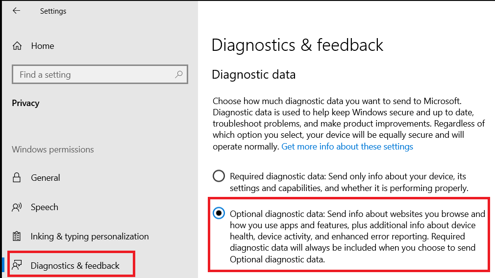
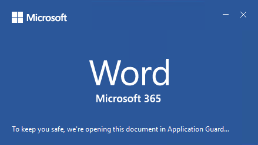
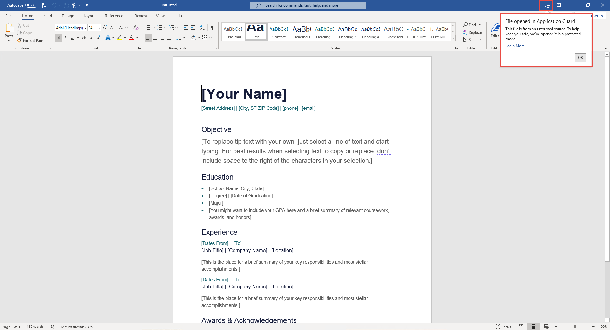
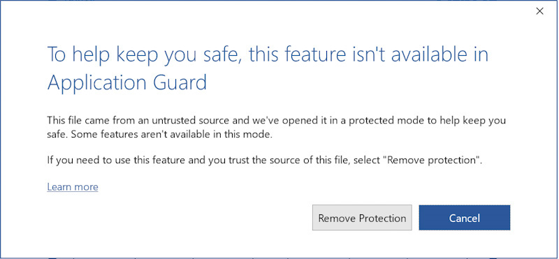

# Application Guard for Office for admins

**Applies to:** Word, Excel, and PowerPoint for Microsoft 365, Windows 10
Enterprise

Microsoft Defender Application Guard for Office (Application Guard for Office) helps prevent untrusted files from accessing trusted resources, keeping your enterprise safe from new and emerging attacks. This article walks admins through setting up devices for a preview of Application Guard for Office. It provides information about system requirements and installation steps to enable Application Guard for Office on a device.

## Prerequisites

### Minimum hardware requirements

* **CPU**: 64-bit, 4 cores (physical or virtual), virtualization extensions (Intel VT-x OR AMD-V), Core i5 equivalent or higher recommended
* **Physical memory**: 8-GB RAM
* **Hard disk**: 10 GB of free space on the system drive (SSD recommended)

### Minimum software requirements

* **Windows 10**: Windows 10 Enterprise edition, Client Build version 2004 (20H1) build 19041 or later
* **Office**: Office Current Channel and Monthly Enterprise Channel, Build version 2011 16.0.13530.10000 or later. Both 32-bit and 64-bit versions of Office are supported.
* **Update package**: Windows 10 cumulative monthly security update [KB4571756](https://support.microsoft.com/help/4571756/windows-10-update-KB4571756)

For detailed system requirements, refer to [System requirements for Microsoft Defender Application Guard](/windows/security/threat-protection/microsoft-defender-application-guard/reqs-md-app-guard). Also, please refer to your computer manufacturer's guides on how to enable virtualization technology.
To learn more about Office update channels, see [Overview of update channels for Microsoft 365](/deployoffice/overview-update-channels).

### Licensing requirements

* Microsoft 365 E5 or Microsoft 365 E5 Security

## Deploy Application Guard for Office

### Enable Application Guard for Office

1. Download and install **Windows 10 cumulative monthly security updates KB4571756**.

2. Select **Microsoft Defender Application Guard** under Windows Features and  select **OK**. Enabling the Application Guard feature will prompt a system reboot. You can choose to reboot now or after step 3.

   

   The feature can also be enabled by running the following PowerShell command as administrator:

   ```powershell
   Enable-WindowsOptionalFeature -online -FeatureName Windows-Defender-ApplicationGuard
   ```

3. Search for **Microsoft Defender Application Guard in Managed Mode**, a group policy in **Computer Configuration\\Administrative Templates\\Windows Components\\Microsoft Defender Application Guard**. Turn on this policy by setting the value under Options as **2** or **3**, and then selecting **OK** or **Apply**.

   

   Instead, you can set the corresponding CSP policy:

   > OMA-URI: **./Device/Vendor/MSFT/WindowsDefenderApplicationGuard/Settings/AllowWindowsDefenderApplicationGuard** <br> Data type: **Integer** <br> Value: **2**

4. Restart the system.

### Set Diagnostics & feedback to send full data

> [!NOTE]
> This is not required, however, configuring optional diagnostics data will help diagnose reported issues.

This step ensures that the data necessary to identify and fix problems is
reaching Microsoft. Follow these steps to enable diagnostics on your Windows
device:

1. Open **Settings** from the Start menu.

   

2. On **Windows Settings**, select **Privacy**.

   

3. Under Privacy, select **Diagnostics & feedback** and select **Optional diagnostic data**.

   

For more on configuring Windows diagnostic settings, refer to [Configuring Windows diagnostic data in your organization](/windows/privacy/configure-windows-diagnostic-data-in-your-organization#enterprise-management).

### Confirm that Application Guard for Office is enabled and working

Before confirming that Application Guard for Office is enabled, launch Word, Excel, or PowerPoint on a device where the policies have been deployed. Make sure Office is activated. You may need to use your work identity to activate the Office product first.

To confirm that Application Guard for Office is enabled, launch Word, Excel, or PowerPoint, and then open an untrusted document. For example, you can open a document that was downloaded from the internet or an email attachment from someone outside your organization.

When you first open an untrusted file, you may see an Office splash screen like the following example. It might be displayed for some time while Application Guard for Office is being activated and the file is being opened. Subsequent openings of untrusted files should be faster.



Upon being opened, the file should display a few visual indicators that the file was opened inside Application Guard for Office:

* A callout in the ribbon

  

* The application icon with a shield in the taskbar

  

## Configure Application Guard for Office

Office supports the following policies to enable you to configure the capabilities of Application Guard for Office. These policies can be configured through Group policies or through the [Office Cloud Policy Service](/DeployOffice/overview-office-cloud-policy-service).
See configuration set by your administrator by reviewing group policy settings in  **User Configuration\\Administrative Templates\\Microsoft Office 2016\\Security Settings\\ Trust Center\\Application Guard**.


> [!NOTE]
> Configuring these policies can disable some functionalities for files opened in Application Guard for Office.

|Policy|Description|
|---|---|
|Don't use Application Guard for Office|Enabling this policy will force Word, Excel, and PowerPoint to use the Protected View isolation container instead of Application Guard for Office. This policy can be used to temporarily disable Application Guard for Office when there are issues in leaving it enabled for Microsoft Edge.|
|Configure Application Guard for Office container pre-creation|This policy determines if the Application Guard for Office container, for isolating untrusted files, is pre-created for improved run-time performance. If you enable this setting, you can specify the number of days to continue pre-creating a container or let the Office built-in heuristic pre-create the container.
|Don't allow copy/paste for Office documents opened in Application Guard for Office|Enabling this policy will prevent a user from copying and pasting content from a document opened in Application Guard for Office to a document opened outside of it.|
|Disable hardware acceleration in Application Guard for Office|This policy controls whether Application Guard for Office uses hardware acceleration to render graphics. If you enable this setting, Application Guard for Office uses software-based (CPU) rendering and won't load any third-party graphics drivers or interact with any connected graphics hardware.
|Disable unsupported file types protection in Application Guard for Office|This policy controls whether Application Guard for Office will block unsupported file types from being opened or if it will enable the redirection to Protected View.
|Turn off camera and microphone access for documents opened in Application Guard for Office|Enabling this policy will remove Office access to the camera and microphone inside Application Guard for Office.|
|Restrict printing from documents opened in Application Guard for Office|Enabling this policy will limit the printers that a user can print to from a file opened in Application Guard for Office. For example, you can use this policy to restrict users to only print to PDF.|
|Prevent users from removing Application Guard for Office protection on files|Enabling this policy will remove the option (within the Office application experience) to disable Application Guard for Office protection or to open a file outside Application Guard for Office. <p> **Note:** Users can still bypass this policy by manually removing the mark-of-the-web property from the file or by moving a document to a Trusted location.|
|

> [!NOTE]
> The following policies will require the user to sign out and sign in again to Windows to take effect:
>
> * Disable copy/paste for documents opened in Application Guard for Office
> * Restrict printing for documents opened in Application Guard for Office
> * Turn off camera and mic access to documents opened in Application Guard for Office

## Submit feedback

### Submit feedback via Feedback Hub

If you encounter any issues when launching Application Guard for Office, you're encouraged to submit your feedback via Feedback Hub:

1. Open the **Feedback Hub app** and sign in.

2. If you get an error dialog while launching Application Guard, select **Report to Microsoft** in the error dialog to start a new feedback submission. Otherwise, navigate to <https://aka.ms/mdagoffice-fb> to select the correct category for Application Guard, then select **+&nbsp;Add new feedback** near the top right.

3. Enter a summary in the **Summarize your feedback** box if it isn't already filled in for you.

4. Enter a detailed description of the issue that you experienced and what steps you took in the **Explain in more detail** box, then select **Next**.

5. Select the bubble next to **Problem**. Make sure the category selected is **Security and Privacy \> Microsoft Defender Application Guard – Office**, then select **Next**.

6. Select **New feedback**, then **Next**.

7. Collect traces about the issue:

   1. Expand the **Recreate my problem** tile.

   2. If the issue you're experiencing occurs while Application Guard is running, open an Application Guard instance. Opening an instance allows additional traces to be collected from within the Application Guard container.

   3. Select **Start recording**, and wait for the tile to stop spinning and say *Stop recording*.

   4. Fully reproduce the issue with Application Guard. Reproduction might include attempting to launch an Application Guard instance and waiting until it fails, or reproducing an issue in a running Application Guard instance.

   5. Select the **Stop recording** tile.

   6. Keep any running Application Guard instance(s) open, even for a few minutes after submission, so that container diagnostics can also be collected.

8. Attach any relevant screenshots or files related to the problem.

9. Select **Submit**.

### Submit feedback via Office Customer Voice

You may also submit feedback from within Office if the issue happens when Office documents are opened in Application Guard. Refer to the [Office Insider Handbook](https://insider.office.com/handbook) for submitting feedback.

## Integration with Microsoft Defender for Endpoint and Microsoft Defender for Office 365

Application Guard for Office is integrated with Microsoft Defender for Endpoint to provide monitoring and alerting on malicious activity that happens in the isolated environment.

[Safe Documents in Microsoft E365 E5] (/microsoft-365/security/office-365-security/safe-docs) is a feature that uses Microsoft Defender for Endpoint to scan documents opened in Application Guard for Office. For an additional layer of protection, users can't leave Applicatio Guard for Office until results of the scan have been determined.

Microsoft Defender for Endpoint is a security platform designed to help enterprise networks prevent, detect, investigate, and respond to advanced threats. For more details about this platform, see [Microsoft Defender for Endpoint](https://www.microsoft.com/microsoft-365/windows/microsoft-defender-atp). To learn more about onboarding devices to this platform, see [Onboard devices to the Microsoft Defender for Endpoint service](/windows/security/threat-protection/microsoft-defender-atp/onboard-configure).

You can also configure Microsoft Defender for Office 365 to work with Defender for Endpoint. For more info, refer to [Integrate Defender for Office 365 with Microsoft Defender for Endpoint](integrate-office-365-ti-with-mde.md).

## Limitations and considerations

* Application Guard for Office is a protected mode that isolates untrusted documents so that they can't access trusted corporate resources, an intranet, the user's identity, and arbitrary files on the computer. As a result, if a user tries to access a feature that has a dependency on such access—for example, inserting a picture from a local file on disk—the access will fail and produce a prompt like the following example. To enable an untrusted document to access trusted resources, users must remove Application Guard protection from the document.

  

  > [!NOTE]
  > Advise users to only remove protection if they trust the file and its source or where it came from.

* Active content in documents like macros and ActiveX controls are disabled in Application Guard for Office. Users need to remove Application Guard protection to enable active content.

* Untrusted files from network shares or files shared from OneDrive, OneDrive for Business, or SharePoint Online from a different organization open as read-only in Application Guard. Users can save a local copy of such files to continue working in the container or remove protection to directly work with the original file.

* Files that are protected by Information Rights Management (IRM) are blocked by default. If users want to open such files in Protected View, an administrator must configure policy settings for unsupported file types for the organization.

* Any customizations to Office applications in Application Guard for Office won't persist after a user signs out and signs in again or after the device restarts.

* Only Accessibility tools that use the UIA framework can provide an accessible experience for files opened in Application Guard for Office.

* Network connectivity is required for the first launch of Application Guard after installation. Connectivity is required for Application Guard to validate the license.

* In the document's info section, the *Last Modified By* property may display **WDAGUtilityAccount** as the user. WDAGUtilityAccount is the anonymous user configured in Application Guard. The desktop user's identity isn't shared inside the Application Guard container.

## Performance optimizations for Application Guard for Office

This section provides an overview of the performance optimizations used in Application Guard for Office. This information can help administrators diagnose reports from users related to the performance of Office or the overall system when Application Guard is enabled.

Application Guard uses a virtualized container to isolate untrusted documents away from the system. The process of creating a container and setting up the Application Guard container to open Office documents has a performance overhead that might negatively affect user experience when users open an untrusted document.

To provide users with the expected file-opening experience, Application Guard uses logic to pre-create a container when the following heuristic is met on a system: A user has opened a file in either Protected View or Application Guard in the past 28 days.

When this heuristic is met, Office will pre-create an Application Guard container for the user after they sign in to Windows. While this pre-create operation is in progress, the system may experience slow performance, but the effect will resolve as soon as the operation completes.

> [!NOTE]
> The hints needed for the heuristic to pre-create the container are generated by Office applications as a user uses them. If a user installs Office on a new system where Application Guard is enabled, Office will not pre-create the container until after the first time a user opens an untrusted document on the system. The user will observe that this first file takes longer to open in Application Guard.

## Known issues

* Selecting web links (`http` or `https`) doesn't open the browser.
* Pasting rich text format (RTF) content or images in Office documents opened with Application Guard isn't supported at this time.
* Default setting for unsuported file types protection policy is to block opening untrusted unsupported file types of IRM (Information Rights Management), CSV or HTML
* Updates to .NET cause files to fail to open in Application Guard. As a workaround, users can restart their device when they come across this failure. Learn more about the issue at [Receiving an error message when attempting to open Windows Defender Application Guard or Windows Sandbox](https://support.microsoft.com/help/4575917/receiving-an-error-message-when-attempting-to-open-windows-defender-ap).
