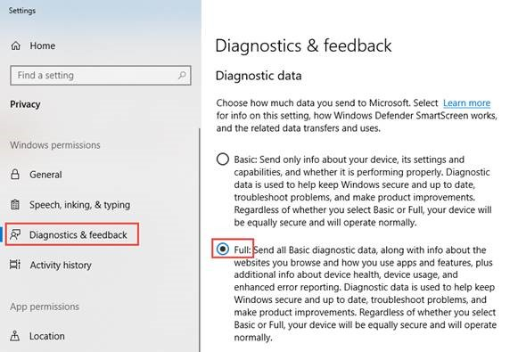
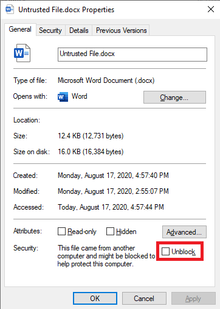

# Application Guard for Office 365 (public preview) for admins

**Applies to:** Word, Excel, and PowerPoint for Microsoft 365, Windows 10
Enterprise

>[!IMPORTANT]
>Some information relates to a prereleased product which may be substantially modified before it's commercially released. Microsoft makes no warranties, express or implied, with respect to the information provided here.

Microsoft Defender Application Guard for Office 365 (Application Guard) helps prevent untrusted files from accessing trusted resources, keeping your enterprise safe from new and emerging attacks. This article walks admins through setting up devices for a preview of Application Guard. It provides
information about system requirements, detailed installation steps, and usage
instructions for Application Guard.

## Prerequisites

### Minimum hardware requirements

* **CPU**: 64-bit, 4 cores (physical or virtual), virtualization extensions
    (Intel VT-x OR AMD-V)
* **Physical Memory**: 8-GB RAM
* **Hard Disk**: 10 GB of free space on the system drive (SSD recommended)

### Minimum software requirements

* **Windows 10**: Windows 10 Enterprise edition, Client Build version 2004 (20H1) build 19041
* **Office**: Office Build version 16.0.13115.20000 or later
* **Update package**: Windows 10 cumulative update KB4571744 pre-release package 

For detailed system requirements, refer to [System requirements for Microsoft Defender Application Guard](https://docs.microsoft.com/en-us/windows/security/threat-protection/microsoft-defender-application-guard/reqs-md-app-guard). To learn more about Office Insider Preview builds, refer to [Getting started on deploying Office Insider builds](https://insider.office.com/en-us/business/deploy).

## Deploy Application Guard for Office 365

### Enable Application Guard for Office 365

1.  Download and install **Windows 10 cumulative update KB4571744**. 

2.  Select **Microsoft Defender Application Guard** under Windows Features and
    select **OK**. Enabling the Application Guard feature will prompt a system
    reboot. You can choose to reboot now or after step 3.

    

3.  Look for the Microsoft Defender Application Guard in Managed Mode group
    policy located at **Computer Configuration\\Administrative
    Templates\\Windows Components\\Microsoft Defender Application Guard**. Turn on this policy by setting the value under Options as **2** or **3** then
    clicking **OK** or **Apply**.

    
  

6.  Reboot the system.

### Set Diagnostics & feedback to send full data

This step ensures that the data necessary to identify and fix problems is
reaching Microsoft. Follow these steps to enable diagnostics on your Windows
device:

1.  Open **Settings** from the Start menu.

    

2.  On **Windows Settings**, select **Privacy**.

    

3.  Under Privacy, select **Diagnostics & feedback** and select **Full**.

    

For more on configuring Windows diagnostic settings, refer to [Configuring
Windows diagnostic data in your
organization](https://docs.microsoft.com/en-us/windows/privacy/configure-windows-diagnostic-data-in-your-organization#enterprise-management).

### Confirm that Application Guard is enabled and working

Before confirming that the Application Guard for Office is enabled, launch Word,
Excel, or PowerPoint on a device where the policies have been deployed. Make
sure Office is activated. You may need to use your work identity to activate the Office product first.

To confirm that Application Guard for Office is now enabled, launch any Office
application and open an untrusted document. For example, you can open a document
downloaded from the internet or an email attachment from someone outside your
organization.

On the first launch of an untrusted file, you may see an Office Splash screen
like the one below. It might show for some time while Application Guard is being
activated and the file is being opened. Subsequent launches of untrusted files
should be faster.

Upon being opened, the file should display a few visual indicators that the file was opened inside Application Guard.

## Configure Application Guard for Office

Office supports the following policies to enable you to configure the capabilities of Application Guard for Office. Configuring these policies can
disable some functionalities for files opened in Application Guard.

| Policy                                                                          | Description                                                                                                                                                                                                                                                                                             |
|---------------------------------------------------------------------------------|---------------------------------------------------------------------------------------------------------------------------------------------------------------------------------------------------------------------------------------------------------------------------------------------------------|
| Disable Application Guard for Office                                            | Enabling this policy will force Word, Excel, and PowerPoint to use the Protected View isolation container instead of Application Guard. This policy can be used to temporarily disable Application Guard when there are issues in leaving Application Guard enabled for Edge.                                  |
| Prevent users from removing Application Guard protection on files               | Enabling this policy will remove the option (within the Office application experience) to disable Application Guard protection or open a file outside Application Guard.   **Note:** Users can still bypass this policy by manually [removing the Mark of the Web property from the file](#Mark-of-the-Web) or by [moving a document to a Trusted location](#Trusted-Locations). |
| Restrict printing from documents opened in Application Guard                    | Enabling this policy will limit printers a user can print to from a file opened in Application Guard. For example, you can use this policy to restrict users to only print to PDF.                                                                                                                      |
| Disable copy/paste for documents opened in Application Guard                    | Enabling this policy will prevent a user from copying and pasting content from a document opened in Application Guard to a document opened outside Application Guard.                                                                                                                                   |
| Turn off camera and microphone access for documents opened in Application Guard | Enabling this policy will remove Office’s access to Camera and Microphone inside Application Guard.                                                                                                                                                                                                     |

>[!NOTE] 
>The following policies will require the user to log off and re-login to Windows to take effect:
> 
> *  Disable copy/paste for documents opened in Application Guard
>*  Restrict printing for documents opened in Application Guard
> *  Turn off camera and mic access to documents opened in Application Guard

## Configure Trust Center  

You can choose which documents open in Application Guard via the Trust Center. To access these settings, open Word, Excel, or PowerPoint. Then select **File > Options > Trust Center > Trust Center Settings.** 
 
### Trust Center options 

#### Trusted Locations
You can choose to make certain file paths trusted locations which will always open Office files as trusted files (i.e they will not open in Application Guard). Even if a file is individually untrusted, if it moved into a trusted location the file will open as a trusted file. You can disable all trusted locations by selecting the **Disable all Trusted Locations** option. 

#### Trusted Documents
You can choose to make individual files trusted through trust promotion. To do this, select **File > Info > Remove Protection**. The Trust Center options for Trusted Documents allow you to either enable trusted files on networks, or to disable individually trusted files altogether. There is also a button to clear the current list of individually trusted files. 

#### Application Guard 
Here you can choose which types of files will open in Application Guard. 

* **Files originating from the internet** – This setting will open files with Mark of the Web (MOTW) in Application Guard. Individually trusted files or files located in trusted locations will not open in Application Guard even if files have a MOTW.

* **Files located in potentially unsafe locations** – This setting will open any     file located in unsafe locations (for example, your Temporary Internet Files folder) in Application Guard. 

* **Outlook attachments** – This setting will open Outlook file attachments in Application Guard. Outlook file attachments downloaded to a trusted location and then opened from there will not open in Application Guard. 
 
### Mark of the Web 

Mark of the Web (MOTW) is a file property that is set on files originating from
untrusted sources such as files downloaded from the internet or from email
attachments. By default, when opening a file with MOTW, Office will open the
file using Application Guard. 

* **MOTW requirements** - MOTW requires an NTFS file system. Therefore, if you move
a MOTW file to a location that does not use NTFS (for example, a USB stick formatted
with FAT32 or WebDAV-based network shares), the file will lose its MOTW property. 
* **Removing MOTW** - If you want to remove MOTW from a file, right-click on the
file and select **Properties**. Under the **General** tab, select **Unblock** as shown below: 

     

>[!NOTE] Removing MOTW from a file can't be undone.

## Submit feedback

### Submit feedback via Feedback Hub

If you encounter any issues when launching Application Guard for Office, you are
encouraged to submit your feedback via Feedback Hub:

1.  Open the **Feedback Hub app** and sign in.

2.  If you get an error dialog while launching Application Guard for Office, select **Report to Microsoft** in the error dialog to start a new feedback
    submission. Otherwise, navigate to <https://aka.ms/wdagoffice-fb> to select
    the correct category for Application Guard for Office, then select **+ Add
    new feedback** near the top right.

3.  Fill in the **Summarize your feedback** box if it isn’t already filled in
    for you.

4.  Fill in the **Explain in more detail** box with a detailed description of
    the issue you experienced and what steps you took, then select **Next**.

5.  Select the bubble next to Problem, make sure the category selected is
    **Security and Privacy \> Microsoft Defender Application Guard – Office**,
    then select **Next**.

6.  Select **New feedback**, then **Next**.

7.  Collect traces about the issue:

    1. Expand the **Recreate my problem** tile.

    2.  If the issue you’re experiencing occurs while Application Guard is
        running, open an Application Guard instance. Doing this will allow additional
        traces to be collected from within the Application Guard container.

    3.  Select **Start recording** and wait for the tile to stop spinning and say
        *Stop recording*.

    4.  Fully reproduce the issue with Application Guard. This might include
        attempting to launch an Application Guard instance and waiting until it
        fails, or reproducing an issue in a running Application Guard instance.

    5.  Select the **Stop recording** tile.

    6.  Keep any running Application Guard instance/s open, even until a few
        minutes after submission, so that container diagnostics can also be
        collected.

8.  Attach any relevant screenshots or files related to the problem.

9.  Select **Submit**.

10. Select the **Feedback** tab in the left-hand menu and go to **My
    Feedback**.

11. Find the feedback you filed, open it, and select **Share**.

12. Send us the generated URL.

>[!IMPORTANT]
>Doing steps 10 to 12 ensures that your feedback can be found quickly. 

### Submit feedback via Office Customer Voice

You may also submit feedback from within Office if the issue happens when
running Office documents are opened in Application Guard. Refer to the [Office
Insider Handbook](https://insider.office.com/en-us/handbook) for submitting
feedback.

## Integration with Microsoft Defender ATP and Office ATP

Application Guard for Office is integrated with Microsoft Defender Advance
Threat Protection (ATP) to provide monitoring and alerting on malicious activity
happening in the isolated environment.

Microsoft Defender ATP is a security platform designed to help enterprise
networks prevent, detect, investigate, and respond to advanced threats. For more
details about this platform, visit the [Microsoft Defender Advanced Threat
Protection](https://www.microsoft.com/en-us/microsoft-365/windows/microsoft-defender-atp)
page. Learn more about onboarding devices to this platform at [Onboard devices to the
Microsoft Defender ATP
service](https://docs.microsoft.com/en-us/windows/security/threat-protection/microsoft-defender-atp/onboard-configure).

You can also configure Office ATP to work with Microsoft Defender ATP. Refer to [Integrate Office 365 ATP with Microsoft Defender ATP](https://docs.microsoft.com/en-us/microsoft-365/security/office-365-security/integrate-office-365-ti-with-wdatp?view=o365-worldwide).

## Limitations

* Application Guard isolates untrusted documents from accessing trusted corporate resources, intranet, and other trusted files present on the    computer. As a result, if an untrusted document tries to connect to a trusted resource, intranet, or a linked file on a computer, it will fail and produce an error like the prompt below. To enable an untrusted document to access trusted resources, remove Application Guard protection from the document.

    

    
* Active content in documents like macros and ActiveX controls are disabled in
    Application Guard. Users need to remove Application Guard protection to
    enable active content.

* Untrusted files opened from network shares or files shared from OneDrive,
    OneDrive for Business, or SharePoint Online from a different organization
    open as read-only in Application Guard.

* Files that are protected by Information Rights Management (IRM) continue to
    open in Protected View.

* In the document's info section, the *Last Modified By* property may display
    WDAGUtilityAccount as the user. This is the anonymous user configured in
    Application Guard because the desktop user's identity is not shared
    inside the Application Guard container.

* Network connectivity is required for the first launch of Application Guard
    after installation. This is required for Application Guard to validate the
    license.

## Performance optimizations for Application Guard 

This section provides an overview of the performance optimizations used in Application Guard. This information can help administrators diagnose reports from users related to the performance of Office or the overall system when Application Guard is enabled. 

Application Guard uses a virtualized container to isolate untrusted documents away from the system. The process of creating a container and setting up the Application Guard container to open Office documents has a performance overhead that might negatively impact user experience when users open an  untrusted document. 

To provide users with the expected file opening experience, Application Guard uses logic to pre-create a container when the following heuristic is met on a system: A user has opened a file in either Protected View or Application Guard in the past 28 days. 

When this heuristic is met, Office will pre-create an Application Guard container for the user after they log in to Windows. When this pre-create operation is in progress, the system may experience slow performance. This will resolve as soon as the operation completes. 

>[!NOTE] 
>The hints needed for the heuristic used to pre-create the container are generated by Office applications as a user uses them. If a user installs Office on a new system where Application Guard is enabled, Office will not pre-create the container until after the first time a user opens an untrusted document on the system. The user will observe that this first file takes longer to open in Application Guard. 

## Known issue in preview

* .NET updates cause files to fail to open in Application Guard. As a
    workaround, users can reboot their device when this issue is encountered.
    Learn more about the issue at [Receiving an error message when attempting to
    open Windows Defender Application Guard or Windows
    Sandbox](https://support.microsoft.com/en-us/help/4575917/receiving-an-error-message-when-attempting-to-open-windows-defender-ap).
