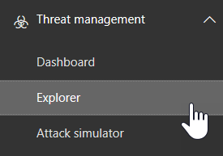
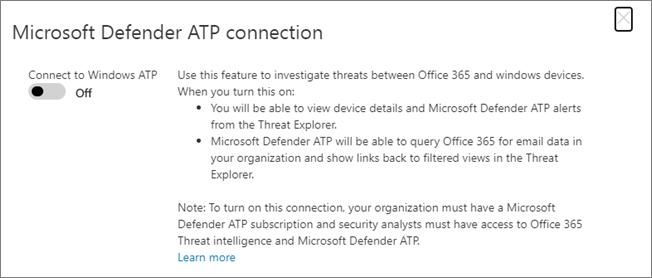
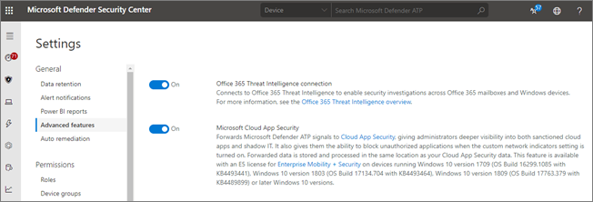

# Use Microsoft Defender for Office 365 together with Microsoft Defender for Endpoint

[!INCLUDE [Microsoft 365 Defender rebranding](../includes/microsoft-defender-for-office.md)]

[Microsoft Defender for Office 365](office-365-atp.md) can be configured to work with [Microsoft Defender for Endpoint](https://docs.microsoft.com/windows/security/threat-protection).

Integrating Microsoft Defender for Office 365 with Microsoft Defender for Endpoint can help your security operations team monitor and take action quickly if users' devices are at risk. For example, once integration is enabled, your security operations team will be able to see the devices that are potentially affected by a detected email message, as well as how many recent alerts were generated for those devices in Microsoft Defender for Endpoint.

The following image depicts what the **Devices** tab looks like have Microsoft Defender for Endpoint integration enabled:

In this example, you can see that the recipients of the detected email message have four devices and one has an alert. Clicking the link for a device opens its page in the Microsoft Defender Security Center (<https://securitycenter.windows.com>).

> [!TIP]
> **[Learn more about the Microsoft Defender Security Center](https://docs.microsoft.com/windows/security/threat-protection/microsoft-defender-atp/use)** (also referred to as the Microsoft Defender for Endpoint portal.)

## Requirements

- Your organization must have Microsoft Defender for Office 365 (or Office 365 E5) and Microsoft Defender for Endpoint.

- You must be a global administrator or have a security administrator role (such as Security Administrator) assigned in the [Security & Compliance Center](https://protection.office.com). (See [Permissions in the Security & Compliance Center](permissions-in-the-security-and-compliance-center.md))

- You must have access to both [Explorer (or real-time detections)](threat-explorer.md) in the Security & Compliance Center and the Microsoft Defender Security Center.

## To integrate Microsoft Defender for Office 365 with Microsoft Defender for Endpoint

Integrating Microsoft Defender for Office 365 with Microsoft Defender for Endpoint is set up by using both the Security & Compliance Center AND the Microsoft Defender Security Center.

1. As a global administrator or a security administrator, go to <https://protection.office.com> and sign in. (This takes you to the Office 365 Security & Compliance Center.)

2. In the navigation pane, choose **Threat management** \> **Explorer**.

   

3. In the upper right corner of the screen, choose **Defender for Endpoint Settings (MDE Settings)**.

4. In the Microsoft Defender for Endpoint connection dialog box, turn on **Connect to Microsoft Defender for Endpoint**.

   

5. Go to the Microsoft Defender Security Center (<https://securitycenter.windows.com>).

6. In the navigation bar, choose **Settings**. Then, under **General**, choose **Advanced features**.

7. Scroll down to **Office 365 Threat Intelligence connection**, and turn the connection on.

   

## Related articles

[Threat investigation and response capabilities in Office 365](office-365-ti.md)

[Microsoft Defender for Office 365](office-365-atp.md)

[Microsoft Defender for Endpoint](https://docs.microsoft.com/windows/security/threat-protection)
