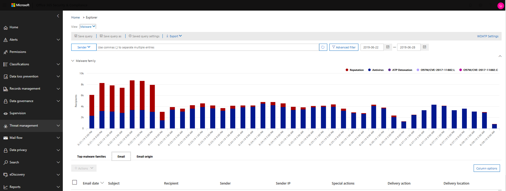

# Investigate and remediate malicious email that was delivered in Office 365

[Office 365 Advanced Threat Protection](office-365-atp.md) enables you to investigate activities that put people in your organization at risk, and to take action to protect your organization. For example, if you are part of your organization's security team, you can find and investigate suspicious email messages that were delivered. You can do this by using [Threat Explorer (or real-time detections)](threat-explorer.md).
  
## Before you begin...

Make sure that the following requirements are met:
  
- Your organization has [Office 365 Advanced Threat Protection](office-365-atp.md) and [licenses are assigned to users](https://docs.microsoft.com/office365/admin/subscriptions-and-billing/assign-licenses-to-users).
    
- [Office 365 audit logging](../../compliance/turn-audit-log-search-on-or-off.md) is turned on for your organization. 
    
- Your organization has policies defined for anti-spam, anti-malware, anti-phishing, and so on. See [Protect against threats in Office 365](protect-against-threats.md).
    
- You are an Office 365 global administrator, or you have either the Security Administrator or the Search and Purge role assigned in the Security &amp; Compliance Center. See [Permissions in the Office 365 Security &amp; Compliance Center](permissions-in-the-security-and-compliance-center.md). For some actions, you must also have a new Preview role assigned. 

#### Preview role permissions

To perform certain actions, such as viewing message headers or downloading email message content, you must have a new role called *Preview* added to another appropriate Office 365 role group. The following table clarifies required roles and permissions.

|Activity  |Role group |Preview role needed?  |
|---------|---------|---------|
|Use Threat Explorer (and real-time detections) to analyze threats ​    |Office 365 Global Administrator   Security Administrator   Security Reader     | No   |
|Use Threat Explorer (and real-time detections) to view headers for email messages ​as well as preview and download quarantined email messages    |Office 365 Global Administrator   Security Administrator  Security Reader   |       No  |
|Use Threat Explorer to view headers and download email messages delivered to mailboxes     |Office 365 Global Administrator  Security Administrator   Security Reader   Preview   |   Yes      |

> [!NOTE]
> *Preview* is a role and not a role group; the Preview role must be added to an existing role group for Office 365. The Office 365 Global Administrator role is assigned the Microsoft 365 admin center ([https://admin.microsoft.com](https://admin.microsoft.com)), and the Security Administrator and Security Reader roles are assigned in the Office 365 Security & Compliance Center ([https://protection.office.com](https://protection.office.com)). To learn more about roles and permissions, see [Permissions in the Office 365 Security & Compliance Center](permissions-in-the-security-and-compliance-center.md).

## Find and delete suspicious email that was delivered

Threat Explorer is a powerful report that can serve multiple purposes, such as finding and deleting messages, identifying the IP address of a malicious email sender, or starting an incident for further investigation. The following procedure focuses on using Explorer to find and delete malicious email from recipients mailboxes.

1. Go to [https://protection.office.com](https://protection.office.com) and sign in using your work or school account for Office 365. This takes you to the Security &amp; Compliance Center. 
    
2. In the left navigation, choose **Threat management** \> **Explorer**.

    

    You may notice the new **Special actions** column. This feature is aimed at telling admins the outcome of processing an email. The **Special actions** column can be accessed in the same place as **Delivery action** and **Delivery location**. Special actions might be updated at the end of Threat Explorer's email timeline, which is a new feature aimed at making the hunting experience better for admins.

3. To view an email timeline, click on the subject of an email message, and then click **Email timeline**. (It appears among other headings on the panel like **Summary** or **Details**.)

    Once you've opened the email timeline, you should see a table that tells you the post-delivery events for that mail. In the case of no further events for the email, you should see a single event for the original delivery that states a result like **Blocked** with a verdict like **Phish**. The tab also has the option to export the entire email timeline, and this exports all the details on the tab and details on the email (things like Subject, Sender, Recipient, Network, and Message ID).

    The email timeline cuts down on randomization because there is less time spent checking different locations to try to understand events that happened since the email arrived. When multiple events happen at, or close to, the same time on an email, those events show up in a timeline view. 
    
    Some events that happen post-delivery to your mail are captured in the **Special actions** column. Combining the information from the email timeline along with special actions taken on email post-delivery gives admins insight into how their policies work, where the email was finally routed, and, in some cases, what the final assessment was. 

4. In the **View** menu, choose **All email**.

    
  
    Notice the labels that appear in the report, such as **Delivered**, **Unknown**, or **Delivered to junk**.

    
    
    (Depending on the actions that were taken on email messages for your organization, you might see other labels, such as **Blocked** or **Replaced**.)
    
6. In the report, choose **Delivered** to view only email messages that ended up in users' inboxes.

    
  
7. Below the chart, review the **Email** list below the chart.

    
  
8. In the list, choose an item to view more details about that email message. For example, you can click the subject line to view information about the sender, recipients, attachments, and other similar email messages.

    
  
9. After viewing information about email messages, select one or more items in the list to activate **+ Actions**.
    
10. Use the **+ Actions** list to apply an action, such as **Move to deleted** items. This deletes the selected messages from the recipients' mailboxes.

    

## Dealing with suspicious email messages

Malicious attackers might be sending mail to people in your organization in an attempt to phish their credentials and gain access to your corporate secrets. To help prevent this, you use the threat protection services in Office 365, including [Exchange Online Protection](exchange-online-protection-overview.md) and [Advanced Threat Protection](office-365-atp.md). However, it occasionally happens that an attacker sends email that contains a link (URL) that only later points to malicious content (such as malware). Or, you might realize too late that someone in your organization has been compromised, and while they were compromised, an attacker used their account to send email to other people in your organization. As part of dealing with either of these scenarios, you can remove suspicious email messages from user inboxes. To do that, you can use [Threat Explorer](threat-explorer.md).

## Finding re-routed email messages after actions are taken

Threat Explorer provides your security operations team with the details they need to investigate suspicious email. Your security operations team can:

- [View the email headers and download the email body](#view-the-email-headers-and-download-the-email-body) 

- [Check the delivery action and location](#check-the-delivery-action-and-location)

- [View the timeline of your email](#view-the-timeline-of-your-email)

### View the email headers and download the email body

The ability to preview email headers and download the body of an email body are powerful capabilities in Threat Explorer. Appropriate [permissions](permissions-in-the-security-and-compliance-center.md) must be assigned. See [Preview role permissions](#preview-role-permissions).

To access your message header and email download options, follow these steps: 

1. Go to [https://protection.office.com](https://protection.office.com) and sign in using your work or school account for Office 365. This takes you to the Security &amp; Compliance Center. 
    
2. In the left navigation, choose **Threat management** \> **Explorer**.

3. Click on a subject in the Threat Explorer table. 

    This opens the flyout, where both header preview and email download links are positioned.

    

> [!IMPORTANT]
> This capability doesn't show up for email messages that were never found in a user's mailbox, which can happen if an email was dropped or its delivery failed. In cases where email messages were deleted from users' mailboxes, admins see a "Mail not found" error message.

### Check the delivery action and location

In [Threat Explorer (and real-time detections)](threat-explorer.md), you now have **Delivery Action** and **Delivery Location** columns instead of the former **Delivery Status** column. This results in a more complete picture of where your email messages land. Part of the goal of this change is to make hunting easier for security operations, but the net result is knowing the location of problem email messages at a glance.

Delivery Status is now broken out into two columns:

- **Delivery action** - What is the status of this email?

- **Delivery location** - Where was this email routed as a result?

Delivery action is the action taken on an email due to existing policies or detections. Here are the possible actions an email can take:

- **Delivered** – email was delivered to inbox or folder of a user and the user can directly access it.

- **Junked** – email was sent to either user's junk folder or deleted folder, and the user has access to email messages in their Junk or Deleted folder.

- **Blocked** – any email messages that are quarantined, that failed, or were dropped. (This is completely inaccessible by the user.)

- **Replaced** – any email where malicious attachments are replaced by .txt files that state the attachment was malicious.
 
Delivery location shows the results of policies and detections that run post-delivery. It's linked to a Delivery Action. This field was added to give insight into the action taken when a problem mail is found. Here are the possible values of delivery location:

- **Inbox or folder** – The email is in the inbox or a folder (according to your email rules).

- **On-prem or external** – The mailbox doesn't exist on cloud but is on-premises.

- **Junk folder** – The email is in a user's Junk folder.

- **Deleted items folder** – The email is in a user's Deleted items folder.

- **Quarantine** – The email in quarantine, and not in a user's mailbox.

- **Failed** – The email failed to reach the mailbox.

- **Dropped** – The email gets lost somewhere in the mail flow.

### View the timeline of your email
  
**Email Timeline** is a field in Threat Explorer that makes hunting easier for your security operations team. When multiple events happen at or close to the same time on an email, those events show up in a timeline view. Some events that happen post-delivery to email are captured in the **Special actions** column. Combining information from the timeline of an email message with any special actions that were taken post-delivery gives admins insight into policies and threat handling (such as where the mail was routed, and, in some cases, what the final assessment was).
  
## Related topics

[Office 365 Advanced Threat Protection](office-365-ti.md)
  
[Protect against threats in Office 365](protect-against-threats.md)
  
[View reports for Office 365 Advanced Threat Protection](view-reports-for-atp.md)
  

