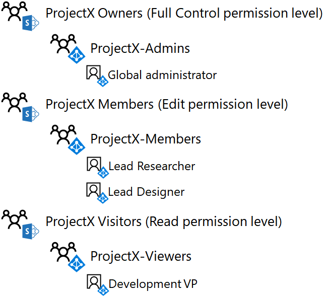

# Isolated SharePoint Online team site dev/test environment

[!INCLUDE [Microsoft 365 Defender rebranding](../includes/microsoft-defender-for-office.md)]

**Applies to**
- [Exchange Online Protection](exchange-online-protection-overview.md)
- [Microsoft Defender for Office 365 plan 1](office-365-atp.md)
- SharePoint Online 


 **Summary:** Configure a SharePoint Online team site that is isolated from the rest of the organization in your Microsoft 365 dev/test environment.

SharePoint Online team sites in Microsoft 365 are locations for collaboration using a common document library, a OneNote notebook, and other services. In many cases, you want wide access and collaboration across departments or organizations. However, in some cases, you want to tightly control the access and permissions for collaboration among a small group of people.

Access to SharePoint Online team sites and what users can do is controlled by SharePoint groups and permission levels. By default, SharePoint Online sites have three levels of access:

- **Members**, who can view, create, and modify resources on the site.
- **Owners**, who have complete control of the site, including the ability to change permissions.
- **Visitors**, who only can view resources on the site.

This article steps you through the configuration of an isolated SharePoint Online team site for a secret research project named ProjectX. The access requirements are:

- Only members of the project can access the site and its contents (documents, OneNote Notebook, Pages), with edit and view SharePoint permission levels controlled through group membership.

- Only the site creator and members of an Admins group for the site can perform site administration, which includes modifying site-level permissions.

There are three phases to setting up an isolated SharePoint Online team site in your Microsoft 365 dev/test environment:

1. Create the Microsoft 365 dev/test environment.

2. Create the users and groups for ProjectX.

3. Create a new ProjectX SharePoint Online team site and isolate it.

> [!TIP]
> Click [here](https://aka.ms/catlgstack) for a visual map to all the articles in the One Microsoft Cloud Test Lab Guide stack.

## Phase 1: Build out your lightweight or simulated enterprise Microsoft 365 dev/test environment

If you just want to create an isolated SharePoint Online team site in a lightweight way with the minimum requirements, follow the instructions in phases 2 and 3 of [The lightweight base configuration](../../enterprise/lightweight-base-configuration-microsoft-365-enterprise.md).

If you want to create an isolated SharePoint Online team site in a simulated enterprise configuration, follow the instructions in [Password hash synchronization for your Microsoft 365 test environment](../../enterprise/password-hash-sync-m365-ent-test-environment.md).

> [!NOTE]
> Creating an isolated SharePoint Online site does not require the simulated enterprise dev/test environment, which includes a simulated intranet connected to the Internet and directory synchronization for a Active Directory Domain Services (AD DS) forest. It is provided here as an option so that you can test an isolated SharePoint Online site and experiment with it in an environment that represents a typical organization.

## Phase 2: Create user accounts and access groups

Use the instructions in [Connect to Office 365 PowerShell](../../enterprise/connect-to-microsoft-365-powershell.md) to connect to your trial subscription with your global administrator account from:

- Your computer (for the lightweight Microsoft 365 dev/test environment).

- The CLIENT1 virtual machine (for the simulated enterprise Microsoft 365 dev/test environment).

To create the new access groups for the ProjectX SharePoint Online team site, run these commands from the Windows Azure Active Directory Module for Windows PowerShell prompt:

```powershell
$groupName="ProjectX-Members"
$groupDesc="People allowed to collaborate for ProjectX."
New-MsolGroup -DisplayName $groupName -Description $groupDesc
$groupName="ProjectX-Admins"
$groupDesc="People allowed to administer SharePoint for ProjectX."
New-MsolGroup -DisplayName $groupName -Description $groupDesc
$groupName="ProjectX-Viewers"
$groupDesc="People allowed to view the SharePoint resources for ProjectX."
New-MsolGroup -DisplayName $groupName -Description $groupDesc
```

Fill in your organization name (example: contosotoycompany), the two-character country code for your location, and then run the following commands from the Windows Azure Active Directory Module for Windows PowerShell prompt:

```powershell
$orgName="<organization name>"
$loc="<two-character country code, such as US>"
$licAssignment= $orgName + ":ENTERPRISEPREMIUM"
$userName= "designer@" + $orgName + ".onmicrosoft.com"
New-MsolUser -DisplayName "Lead Designer" -FirstName Lead -LastName Designer -UserPrincipalName $userName -UsageLocation $loc -LicenseAssignment $licAssignment -ForceChangePassword $false
```

From the display of the **New-MsolUser** command, note the generated password for the Lead Designer account and record it in a safe location.

Run the following commands from the Windows Azure Active Directory Module for Windows PowerShell prompt:

```powershell
$userName= "researcher@" + $orgName + ".onmicrosoft.com"
New-MsolUser -DisplayName "Lead Researcher" -FirstName Lead -LastName Researcher -UserPrincipalName $userName -UsageLocation $loc -LicenseAssignment $licAssignment -ForceChangePassword $false
```

From the display of the **New-MsolUser** command, note the generated password for the Lead Researcher account and record it in a safe location.

Run the following commands from the Windows Azure Active Directory Module for Windows PowerShell prompt:

```powershell
$userName= "devvp@" + $orgName + ".onmicrosoft.com"
New-MsolUser -DisplayName "Development VP" -FirstName Development -LastName VP -UserPrincipalName $userName -UsageLocation $loc -LicenseAssignment $licAssignment -ForceChangePassword $false
```

From the display of the **New-MsolUser** command, note the generated password for the Development VP account and record it in a safe location.

Next, to add the new accounts to the new access groups, run these PowerShell commands from the Windows Azure Active Directory Module for Windows PowerShell prompt:

```powershell
$grpName="ProjectX-Members"
$userUPN="designer@" + $orgName + ".onmicrosoft.com"
Add-MsolGroupMember -GroupObjectId (Get-MsolGroup | Where { $_.DisplayName -eq $grpName }).ObjectID -GroupMemberObjectId (Get-MsolUser | Where { $_.UserPrincipalName -eq $userUPN }).ObjectID -GroupMemberType "User"
$userUPN="researcher@" + $orgName + ".onmicrosoft.com"
Add-MsolGroupMember -GroupObjectId (Get-MsolGroup | Where { $_.DisplayName -eq $grpName }).ObjectID -GroupMemberObjectId (Get-MsolUser | Where { $_.UserPrincipalName -eq $userUPN }).ObjectID -GroupMemberType "User"
$grpName="ProjectX-Admins"
Add-MsolGroupMember -GroupObjectId (Get-MsolGroup | Where { $_.DisplayName -eq $grpName }).ObjectID -GroupMemberObjectId (Get-MsolUser | Where { $_.UserPrincipalName -eq $userCredential.UserName }).ObjectID -GroupMemberType "User"
$grpName="ProjectX-Viewers"
$userUPN="devvp@" + $orgName + ".onmicrosoft.com"
Add-MsolGroupMember -GroupObjectId (Get-MsolGroup | Where { $_.DisplayName -eq $grpName }).ObjectID -GroupMemberObjectId (Get-MsolUser | Where { $_.UserPrincipalName -eq $userUPN }).ObjectID -GroupMemberType "User"
```

Results:

- The ProjectX-Members access group contains the Lead Designer and Lead Researcher user accounts

- The ProjectX-Admins access group contains the global administrator account for your trial subscription

- The ProjectX-Viewers access group contains the Development VP user account

Figure 1 shows the access groups and their membership.

**Figure 1**:


## Phase 3: Create a new ProjectX SharePoint Online team site and isolate it

To create a SharePoint Online team site for ProjectX, do the following:

1. Using a browser on either your local computer (lightweight configuration) or on CLIENT1 (simulated enterprise configuration), sign in to the Microsoft 365 admin center (<https://admin.microsoft.com>) using your global administrator account.

2. In the list of tiles, click **SharePoint**.

3. On the new SharePoint tab in your browser, click **+ Create site**.

4. In **Team site name**, type **ProjectX**. In **Privacy settings**, select **Private - only members can access this site**.

5. In **Team site description**, type **SharePoint site for ProjectX**, and then click **Next**.

6. On the **Who do you want to add**? pane, click **Finish**.

7. On the new **ProjectX-Home** tab in your browser, in the tool bar, click the settings icon, and then click **Site permissions**.

8. In the **Site permissions** pane, click **Advanced permissions settings**.

9. In the new **Permissions: Project X** tab in your browser, click **Access Request Settings**.

10. In the **Access Requests Settings** dialog box, clear **Allow members to share the site and individual files and folders** and **Allow access requests** (so that all three check boxes are cleared), and then click **OK**.

11. Click **ProjectX Members** in the list.

12. On the **People and Groups** page, click **New**.

13. In the **Share** dialog box, type **ProjectX-Members**, select it, and then click **Share**.

14. Click the back button on your browser.

15. Click **ProjectX Owners** in the list.

16. On the **People and Groups** page, click **New**.

17. In the **Share** dialog box, type **ProjectX-Admins**, select it, and then click **Share**.

18. Click the back button on your browser.

19. Click **ProjectX Visitors** in the list.

20. On the **People and Groups** page, click **New**.

21. In the **Share** dialog box, type **ProjectX-Viewers**, select it, and then click **Share**.

22. Close the **People and Groups** tab in your browser, click the **ProjectX-Home** tab in your browser, and then close the **Site permissions** pane.

Here are the results of configuring permissions:

- The ProjectX Members SharePoint group contains only the ProjectX-Members access group (which contains only the Lead Designer and Lead Researcher user accounts) and the ProjectX group (which contains only the global administrator user account).

- The ProjectX Owners SharePoint group contains only the ProjectX-Admins access group (which contains only the global administrator user account).

- The ProjectX Visitors SharePoint group contains only the ProjectX-Viewers access group (which contains only the Development VP user account).

- Members cannot modify site-level permissions (this can only be done by members of the ProjectX-Admins group).

- Other user accounts cannot access the site or its resources or request access to the site.

Figure 2 shows the SharePoint groups and their membership.

**Figure 2**



Now let's demonstrate access using the Lead Designer user account:

1. Close the **ProjectX-Home** tab in your browser, and then click the **Microsoft Office Home** tab in your browser.

2. Click the name of your global administrator, and then click **Sign out**.

3. Sign in to the Microsoft 365 admin center (<https://admin.microsoft.com>) using the Lead Designer account name and its password.

4. In the list of tiles, click **SharePoint**.

5. On the new **SharePoint** tab in your browser, type **ProjectX** in the search box, activate the search, and then click the **ProjectX** team site. You should see a new tab in your browser for the ProjectX team site.

6. Click the settings icon. Notice that there is no option for **Site Permissions**. This is correct because only the members of the ProjectX-Admins group can modify permissions on the site

7. Open Notepad or a text editor of your choice.

8. Copy the URL of the ProjectX team site and paste it on a new line in Notepad or your text editor.

9. On the new **ProjectX-Home** tab in your browser, click **Documents**.

10. Copy the URL of the ProjectX documents folder and paste it on a new line in Notepad or your text editor.

11. On the new **ProjectX-Documents** tab in your browser, click **New > Word document**.

12. Type some text on the page, wait for the status to indicate **Saved**, click the back button on your browser, and then refresh the page. You should see a new **Document.docx** in the **Documents** folder.

13. Click the ellipsis for the **Document.docx** document, and then click **Get a link**.

14. Copy the URL in the **Share 'Document.docx'** dialog box and paste it on a new line in Notepad or your text editor, and then close the **Share 'Document.docx'** dialog box.

15. Close the **ProjectX-Documents** and **SharePoint** tabs in your browser, and then click the **Microsoft Office Home** tab.

16. Click the **Lead Designer** name, and then click **Sign out**.

Now let's demonstrate access using the Development VP user account:

1. Sign in to the Microsoft 365 admin center (<https://admin.microsoft.com>) using the Development VP account name and its password.

2. In the list of tiles, click **SharePoint**.

3. On the new **SharePoint** tab in your browser, type **ProjectX** in the search box, activate the search, and then click the **ProjectX** team site. You should see a new tab in your browser for the ProjectX team site.

4. Click **Documents**, and then click the **Document.docx** file.

5. In the **Document.docx** tab in your browser, try to modify the text. You should see a message stating **This document is read-only.** This is expected because the Development VP user account only has view permissions for the site.

6. Close the **Document.docx**, **ProjectX-Documents**, and **SharePoint** tabs in your browser.

7. Click the **Microsoft Office Home** tab, click the **Development VP** name, and then click **Sign out**.

Now let's demonstrate access with a user account that has no permissions:

1. Sign in to the Microsoft 365 admin center (<https://admin.microsoft.com>) using the User 3 account name and its password.

2. In the list of tiles, click **SharePoint**.

3. On the new **SharePoint** tab in your browser, type **ProjectX** in the search box and then activate the search. You should see the message **Nothing here matches your search.**

4. From the open instance of Notepad or your text editor, copy the URL for the ProjectX site into the address bar of your browser and press **Enter**. You should see an **Access Denied** page.

5. From Notepad or your text editor, copy the URL for the ProjectX Documents folder into the address bar of your browser and press **Enter**. You should see an **Access Denied** page.

6. From Notepad or your text editor, copy the URL for the Documents.docx file into the address bar of your browser and press **Enter**. You should see an **Access Denied** page.

7. Close the **SharePoint** tab in your browser, click the **Microsoft Office Home** tab, click the **User 3** name, and then click **Sign out**.

Your isolated SharePoint Online site is now ready for your additional experimentation.

## Next Step

When you are ready to deploy an isolated SharePoint Online team site in production, see the step-by-step design considerations in [Design an isolated SharePoint Online team site](design-an-isolated-sharepoint-online-team-site.md).

## See Also

[Isolated SharePoint Online team sites](isolated-sharepoint-online-team-sites.md)

[Cloud adoption Test Lab Guides (TLGs)](../../enterprise/cloud-adoption-test-lab-guides-tlgs.md)

[The simulated enterprise base configuration](../../enterprise/simulated-ent-base-configuration-microsoft-365-enterprise.md)

[The lightweight base configuration](../../enterprise/lightweight-base-configuration-microsoft-365-enterprise.md)

[Microsoft 365 solution and architecture center](../../solutions/index.yml)
