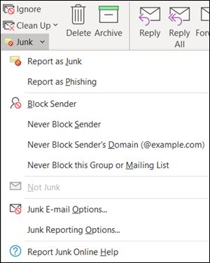
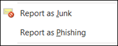
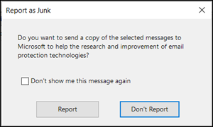
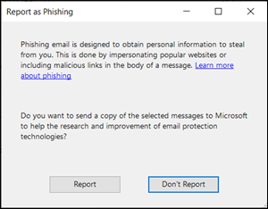
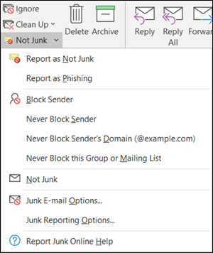
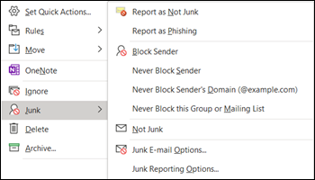
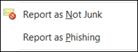
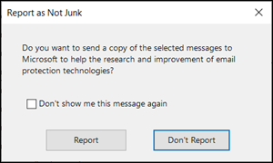

# Install and use the Junk Email Reporting add-in for Microsoft Outlook

[!INCLUDE [Microsoft 365 Defender rebranding](../includes/microsoft-defender-for-office.md)]

**Applies to**
- [Exchange Online Protection](exchange-online-protection-overview.md)
- [Microsoft Defender for Office 365 plan 1 and plan 2](office-365-atp.md)
- [Microsoft 365 Defender](../mtp/microsoft-threat-protection.md)

> [!NOTE]
> If you aren't currently using the Junk E-mail Reporting add-in, we recommend the [Report Message add-in](enable-the-report-message-add-in.md) or the [Report Phishing add-in](enable-the-report-phish-add-in.md) instead. For more information, see [Report messages and files to Microsoft](report-junk-email-messages-to-microsoft.md).

The Junk Email Reporting Add-in for Microsoft Outlook allows users to submit false positives (good email marked as spam), false negatives (bad email allowed) and phishing messages to Microsoft. If your organization doesn't use Exchange Online Protection (for example, on-premises Exchange or email services other than Exchange Online), your junk email report submission will not affect your spam filtering.

This topic explains how to install and use the Junk Email Reporting add-in.

## What do you need to know before you begin?

- To install the Junk Email Reporting add-in, see the [Install the Junk Email Reporting add-in](#install-the-junk-email-reporting-add-in) section later in this article.

- The Junk Email Reporting add-in works with the following versions of Outlook:

  - Outlook 2013 or later
  - Outlook included with Microsoft 365 Apps for enterprise

- For more information about reporting messages to Microsoft, see [Report messages and files to Microsoft](report-junk-email-messages-to-microsoft.md).

## Use the Junk Email Reporting add-in to report spam and phishing messages

1. For messages in the Inbox or any other email folder except Junk Email, use any of the following methods to report spam and phishing messages:

   - Select the message or open the message. In the **Home** or **Message** tab in the ribbon, click **Junk**, and then select **Report as Junk** or **Report as Phishing**.

     

   - Right-click on the message, select **Junk**, and then select **Report as Junk** or **Report as Phishing**.

     

   - Select multiple messages, right-click, and then select **Report as Junk** or **Report as Phishing**.

     

2. In the dialog that appears, read the information and click **Report**. If you change your mind, click **Don't Report**.

   

   

3. The selected messages will be sent to Microsoft for analysis and:

   - Moved to the Junk Email folder if it was reported as spam.
   - Deleted if it was reported as phishing.

   To confirm that the messages have been submitted, open your **Sent Items** folder to view the submitted messages.

## Use the Junk Email Reporting add-in to report non-spam and phishing messages from the Junk Email folder

1. In the Junk Email folder, use any of the following methods to report spam false positives or phishing messages:

   - Select the message or open the message. In the **Home** or **Message** tab in the ribbon, click **Not Junk**, and then select **Report as Not Junk** or **Report as Phishing**.

     

   - Right-click on the message, click **Junk**, and then select **Report as Not Junk** or **Report as Phishing**.

     

   - Select multiple messages, right-click, and then select **Report as Not Junk** or **Report as Phishing**.

     

2. In the dialog that appears, read the information and click **Report**. If you change your mind, click **Don't Report**.

   

   

3. The selected messages will be sent to Microsoft for analysis and:

   - Moved to the Junk Email folder if it was reported as spam.
   - Deleted if it was reported as phishing.

   To confirm that the messages have been submitted, open your **Sent Items** folder to view the submitted messages.

## Install the Junk Email Reporting add-in

- You need to have administrator privileges on the computer where you're installing the add-in.

- Go to <https://www.microsoft.com/download/details.aspx?id=18275> and download the appropriate .msi file for your version of Office to a location that's easy to find:

  - **32-bit**: `Junk Reporting Add-in for Office 2007, 2010, 2013, and 2016 (32-bit).msi`
  - **64-bit**: `Junk Reporting Add-in for Office 2007, 2010, 2013, and 2016 (64-bit).msi`

- For Outlook 2013 or later, the only prerequisite is the Microsoft .NET Framework 2.0. In Windows 10, you don't install the .NET Framework 2.0 from a download.

### Install the Junk Email Reporting Add-in using the Setup wizard

1. On your computer, close Outlook.

2. In Windows 10, verify the .NET Framework 2.0 is enabled. For instructions, see [Enable the .NET Framework 3.5 in Control Panel](https://docs.microsoft.com/dotnet/framework/install/dotnet-35-windows-10#enable-the-net-framework-35-in-control-panel).

3. Locate the .msi file you downloaded and double-click on it.

4. On the **Welcome to Microsoft Junk Email Reporting Add-in Setup** page, click **Next**.

5. Review the license agreement, click **I accept the terms in the License Agreement** if you agree to the terms, and then click **Next**.

6. When the wizard is complete, click **Finish**.

Start Outlook.

Look for the **Junk** button on your Outlook ribbon. You can now report junk email messages to Microsoft by selecting the junk email messages in your Inbox and clicking the **Report Junk** button.

Choose the down arrow next to **Junk** for more options such as **Report as Phishing** if you want to report phishing scam emails to Microsoft. In your junk mail folder, you can also select, **Report not junk** if an email was incorrectly identified as junk mail.

### Install the Junk Email Reporting Add-In using Silent Mode

1. On your computer, close Outlook.

2. In Windows 10, install the .NET Framework 2.0 by running the following command:

   ```dos
   DISM /Online /Enable-Feature /FeatureName:NetFx3 /All
   ```

3. To install the add-in without any user interaction, open a Command Prompt and use the following syntax:

   ```dos
   msiexec /qn /i "<PathToMSIFile>\<MSIFile>" [MaxMessageSelection=<1-50>] [BccEmailAddress="<EmailAddress1>; <EmailAddress2>"...]
   ```

   - `MaxMessageSelection` specifies the maximum number of messages that you can select for a single submission. Valid values are from 1 to 50. The default value is 15.

   - `BccEmailAddress` specifies additional Bcc recipients who will receive a copy of all user submissions. The default value is blank (no additional Bcc recipients).

   This example installs the 64-bit version of the add-in from the specified path with the default settings.

   ```dos
   msiexec /qn /i "C:\Downloads\Junk Reporting Add-in for Office 2007, 2010, 2013, and 2016 (64-bit).msi"
   ```

   This example installs the 32-bit version of the add-in from the specified path with the following additional settings:

   - Up to 20 messages can be selected in a single submission.
   - junkreports@contoso.com and hollyd@treyresearch.net receive Bcc copies of all submissions.

   ```dos
   msiexec /qn /i "C:\Downloads\Junk Reporting Add-in for Office 2007, 2010, 2013, and 2016 (32-bit).msi" MaxMessageSelection=20 BccEmailAddress="junkreports@contoso.com; hollyd@treyresearch.net"
   ```

### How do you know this worked?

To verify that you've successfully installed the Junk Email Reporting Add-in, do the any of the following steps in Outlook:

- Select the message or open the message. In the **Home** or **Message** tab in the ribbon, click **Junk**, and verify that the following options are available:

  - **Report as Junk**
  - **Report as Phishing**
  - **Junk Reporting Options**
  - **Report Junk Online Help**

  

- Right-click on the message, select **Junk**, and verify that the following options are available:

  - **Report as Junk**
  - **Report as Phishing**
  - **Junk Reporting Options**
  - **Report Junk Online Help**

  

- Select multiple messages, right click, and verify that the following options are available:

  - **Report as Junk**
  - **Report as Phishing**

  

- Do the previous actions in the **Junk Email** folder and verify the previous **Junk** reporting options are now **Not Junk**.

  

  

  

## Uninstall the Junk Email Reporting Add-in

After you close Outlook, use any of the following procedures to uninstall the Junk Email Reporting Add-in:

- **Control Panel**: Press the Windows key + R. In the **Run** dialog that opens, enter `control appwiz.cpl` and then click **OK**.

  Find and select **Microsoft Junk Email Reporting Add-in** in the list, and then click **Uninstall**.

- **Windows Installer package**: Find or download the appropriate .msi file, and double-click on it.

  - **32-bit**: `Junk Reporting Add-in for Office 2007, 2010, 2013, and 2016 (32-bit).msi`

  - **64-bit**: `Junk Reporting Add-in for Office 2007, 2010, 2013, and 2016 (64-bit).msi`

  In the dialog that appears, select **Remove Microsoft Junk Email Reporting Add-in for Outlook** and then click **Next**.

- **Silent Mode**: Find or download the appropriate .msi file. In a Command Prompt window, replace \<PathToFile\> with the location of the .msi file, and run one of the following commands:

  - **32-bit**:

    ```dos
    msiexec /x "<PathToFile>\Junk Reporting Add-in for Office 2007, 2010, 2013, and 2016 (32-bit).msi" /qn MSIRESTARTMANAGERCONTROL="DisableShutdown"
    ```

  - **64-bit**:

    ```dos
    msiexec /x "<PathToFile>\Junk Reporting Add-in for Office 2007, 2010, 2013, and 2016 (64-bit).msi" /qn MSIRESTARTMANAGERCONTROL="DisableShutdown"
    ```

When you open Outlook after the uninstall, the junk, not junk, and phishing reporting options should be gone.

## Troubleshooting the Junk Email Reporting add-in

Occasionally, you might experience trouble with Outlook after adding the Junk Email Reporting Add-In. This section describes problems that you might encounter, along with tips for resolving these issues.

### Troubleshooting for users

You experience one or more of the following problems:

- Nothing happens when you click **Report Junk**
- Outlook stops responding after you select an email message
- Reported junk mail cannot be delivered due to an "undeliverable" reply

To fix this problem, do the following steps:

1. Close and restart Outlook.
2. Create and send a test message, and verify that the recipient received the message.
3. If the problem persists, contact your admin.

For other methods that you can use to submit messages to Microsoft, see [Report messages and files to Microsoft](report-junk-email-messages-to-microsoft.md).

### Troubleshooting for admins

#### Problem: An error message continually appears that asks users to contact their system administrator

1. Verify or set the `LoggingLevel` registry key to the value "Verbose":

   - **32-bit Outlook on 32-bit Windows**:

     ```text
     Windows Registry Editor Version 5.00

     [HKEY_LOCAL_MACHINE\Software\Microsoft\Junk Email Reporting\Addins]
     "LoggingLevel"="Verbose"
     ```

   - **32-bit Outlook on 64-bit Windows**:

     ```text
     Windows Registry Editor Version 5.00

     [HKEY_LOCAL_MACHINE\Software\Wow6432Node\Microsoft\Junk Email Reporting\Addins]
     "LoggingLevel"="Verbose"
     ```

   - **64-bit Outlook**:

     ```text
     Windows Registry Editor Version 5.00

     [HKEY_LOCAL_MACHINE\Software\Microsoft\Junk E-mail Reporting\Addins]
     "LoggingLevel"="Verbose"
     ```

2. Restart Outlook and ask users to report back when they see the error message.

3. Collect the log information found at the following location:

   `%LOCALAPPDATA%\Microsoft\Junk Email Reporting Add-in\SpamReporterAddinLog.txt`

4. Contact Exchange Online Protection Technical Support and provide them with the log information.

#### Problem: Users selected not to receive a confirmation prompt when they report messages, and now they want the prompt back

1. Create the `ConfirmReportJunk`registry key with the value "True":

   ```text
   Windows Registry Editor Version 5.00

   HKEY_CURRENT_USER\Software\Microsoft\Junk E-mail Reporting\Preferences]
   "ConfirmReportJunk"="True"
   ```

2. Restart Outlook.
