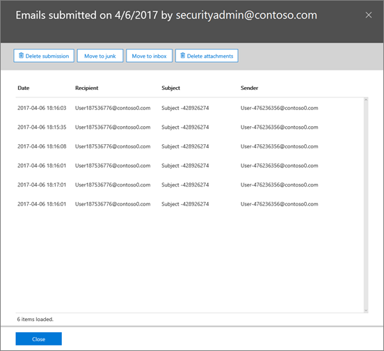

# Keep your organization safe with Office 365 threat investigation and response capabilities

Do you know which of your Office 365 users are under attack, or worse - compromised? Do know how to mitigate and recover from attacks that are targeting your users? Did you know you can do exactly this with security capabilities that are already available to you in Office 365 E5?

[Office 365 threat investigation and response](office-365-ti.md) capabilities are included in your Office 365 E5 subscription (as part of [Office 365 Advanced Threat Protection](office-365-atp.md) Plan 2). These capabilities have helped Microsoft IT reduce average time to resolution for social engineering incidents by 80%, and increased case throughput dramatically. Recently, new capabilities were added to help improve how you can detect and recover from threats. Read this article to see how threat investigation and response capabilities can help your security operations team be more effective and efficient.

## Detect intrusions and threats

[Threat Explorer](threat-explorer.md) (also referred to as Explorer) helps security administrators and analysts identify and understand threats that are active in your organization. Even the most complex security settings can be circumvented by seemingly innocuous user configurations like safe-sender allow lists. Explorer helps Office 365 global or security administrators quickly determine whether users have been compromised by threats, such as malware or phish. This helps prioritize which user accounts are most at risk for a threat and the requisite response.

Explorer also helps administrators navigate the relationships between users and mail. Know of a particular mail that was bad? Search for it to see what users received the mail, then follow the series of events and see what those users in turn have done.

## Quickly mitigate and recover from threats

Once security administrators have identified something suspicious or malicious happening in their tenant, they can quickly contain and respond to that threat with the **Incident Framework**. Group unwanted messages with one-click and quickly remove the email messages from your user's mailboxes.

 **UPDATE:** The ability to delete (soft or hard delete) email messages directly from the Incident framework has been added. Previously administrators could only move mails to a user's junk folder, where users could recover the item. With the newly released Delete capabilities, you can now be sure that a malicious or unwanted mail is removed permanently.

## Leverage the threat telemetry of Microsoft

Office 365 threat investigation and response capabilities are powered with data from the [Microsoft Intelligent Security Graph](https://cloud-platform-assets.azurewebsites.net/intelligent-security-graph/). The graph acquires the latest threat signal from over 1 billion Windows devices, 450 billion monthly Azure logins, and 400 billion monthly email messages in Office 365. This unrivaled threat signal is what gives the broad visibility your security operations team have for a more complete view of the threats impacting your organization.

## Next steps

- Learn more about [Office 365 Advanced Threat Protection](office-365-atp.md).

- Learn more about Office 365 threat investigation and response capabilities in this recorded session: [Stay Ahead of the Cyberattacks with Office 365](https://myignite.microsoft.com/videos/53723).

- If you don't already have Office 365 Advanced Threat Protection Plan 2, try or buy it now. See [Office 365 Advanced Threat Protection: Plans and pricing](https://products.office.com/exchange/advance-threat-protection#pmg-allup-content).

- Extend protection with [Microsoft Defender Advanced Threat Protection](https://docs.microsoft.com/windows/security/threat-protection/microsoft-defender-atp/microsoft-defender-advanced-threat-protection).
