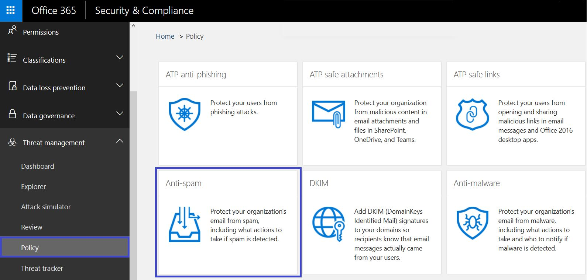
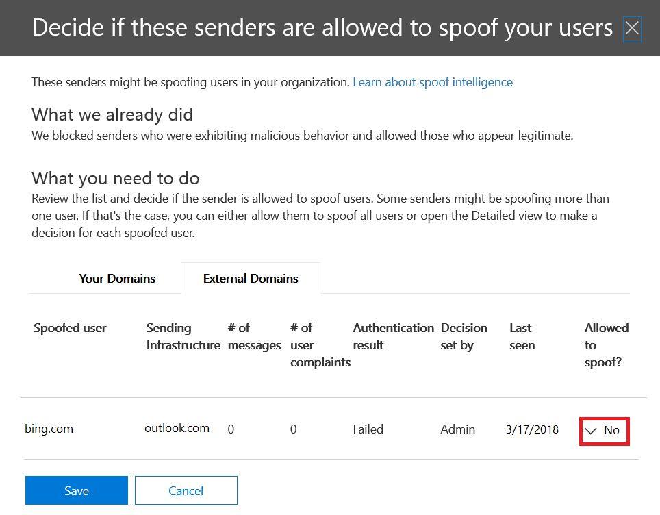
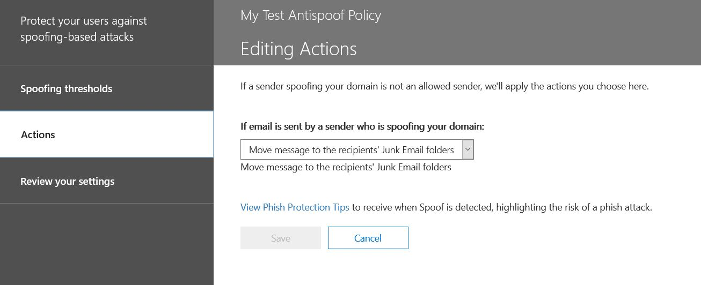

# Learn more about spoof intelligence

Use spoof intelligence in the Security & Compliance Center on the **Anti-spam settings page** to review all senders who are spoofing either domains that are part of your organization, or spoofing external domains. Spoof intelligence is available as part of Office 365 Enterprise E5 or separately as part of Advanced Threat Protection (ATP) and as of October, 2018 Exchange Online Protection (EOP).

## What types of email spoofing can I review and which should I protect against with spoof intelligence?

For domains you own, you can review senders who are spoofing your domain and then choose to allow the sender to continue or block the sender. For external domains, you can allow the sender domain combined with the sending infrastructure, although not an individual sending email address.

When a sender spoofs an email address, they appear to be sending mail on behalf of one or more user accounts within one of your organization's domains, or an external domain sending to your organization. Surprisingly, there are some legitimate business reasons for spoofing. For example, in these cases, you wouldn't block the sender from spoofing your domain:

- You have third-party senders who use your domain to send bulk mail to your own employees for company polls.

- You have hired an external company to generate and send out advertising or product updates on your behalf.

- An assistant who regularly needs to send email for another person within your organization.

- An application that is configured to spoof its own organization in order to send internal notifications by email.

External domains frequently send spoofed email, and many of these reasons are legitimate. For example, here are some legitimate cases when external senders send spoofed email:

- The sender is on a discussion mailing list, and the mailing list is relaying the email from the original sender to all the participants on the mailing list.

- An external company is sending email on behalf of another company (for example, an automated report, or a software-as-a-service company).

You need a way to ensure that the mail sent by legitimate spoofers doesn't get caught up in spam filters in Office 365 or external email systems. Normally, Office 365 treats these email messages as spam. As an Office 365 admin, you have the ability to prevent this by setting up spoof filters in the Security & Compliance Center. If you own the domain, you can configure SPF, DKIM, and DMARC to allow for these senders.

On the other hand, malicious spoofers, those senders that are spoofing your domain, or external domains, to send spam or phishing email, need to be blocked. Spoofing is also a common way for attackers to get user credentials. Office 365 has built-in spoof protection to help shield your organization from senders of these malicious emails. Spoof protection for your organization's domains is always on for all Office 365 customers, and external domain spoof protection is on by default for Advanced Threat Protection customers and as of October, 2018 EOP customers as well. To further strengthen this protection, tell us which senders are authorized to spoof your organization's domains and send email on your behalf, and if any external domains are permitted to spoof. Any email sent from a sender that you don't authorize will be treated as spam or spoofing by Office 365. Keep an eye on the senders spoofing your domain and help us improve spoof intelligence by using the Security & Compliance Center.

## Managing spoof intelligence in the Security & Compliance Center

The spoof intelligence policy you set up is always enforced by Office 365. You cannot disable it, but you can choose how much you want to actively manage it.

You can review the senders who are spoofing your domain, or external domains, and then decide whether each sender should be allowed to do so by using the Security & Compliance Center. For each spoofed user account that a sender spoofs from your domain or an external domain, you can view the information in the following table.

|**Parameter**|**Description**|
|:-----|:-----|
|Sender|Also called the true sender. This is usually the domain from which the spoof email originates. Office 365 determines the domain of the pointer (PTR) DNS record of the sending IP address that is spoofing your organization. If no domain is found, the report displays the sender's IP address instead.|
|Spoofed user|The user account that is being spoofed by the sender.    **Internal** tab only. This field contains a single email address, or if the sender is spoofing multiple user accounts, it contains **More than one**.    **External** tab only. External domains only contain a sending domain, and do not contain a full email address.    **Tip! For advanced admins.** The spoofed user is the From (5322.From) address which is also the address displayed as the From address by the mail client. This is sometimes called the header.from address. The validity of this address is not checked by SPF.|
|Number of messages|The number of mail messages sent by the sender to your organization on behalf of the identified spoofed sender or senders within the last 30 days.|
|Number of user complaints|Complaints filed by users against this sender by your users within the last 30 days. Complaints are usually in the form of junk submissions to Microsoft.|
|Authentication result|This value is **Passed** if the sender passed Exchange Online Protection (EOP) sender authentication checks, such as SPF or DKIM, **Failed** if the sender failed EOP sender authentication checks, or **Unknown** if the result of these checks isn't known.|
|Decision set by|Shows whether the Office 365 administrator or the spoof intelligence policy determined whether or not the sender is allowed to spoof the user.|
|Last seen|The last date on which a message was received by this sender on behalf of this spoofed user.|
|Allowed to spoof?| Displays whether or not this sender is allowed to send email on behalf of the spoofed user. Possible values include:    **Yes** All spoofed addresses from this spoofing sender will be allowed to spoof your organization.    **No** Spoofed addresses from this spoofing sender won't be allowed to spoof your organization. Instead, messages from this sender will be marked as spam by Office 365.    **Some users** If a sender is spoofing multiple users, some spoofed addresses from this sender will be allowed to spoof your organization, the rest will be marked as spam. Use the **Detailed** tab to see the specific addresses.|
|Spoof Type|This value is **Internal** if the domain is one of your organization's provisioned domains, otherwise the value is **External**.|

 **To manage senders who are spoofing your domain by using the Security & Compliance Center**

1. Go to the [Security & Compliance Center](https://protection.office.com).

2. Sign in to Office 365 with your work or school account. Your account must have administrator credentials in your Office 365 organization.

3. In the Security & Compliance Center, expand **Threat Management** \> **Policy** \> **Anti-spam**.

    

4. On the **Anti-spam settings** page in the right pane, scroll down and expand **Spoof intelligence policy**.

    

5. To view the list of senders spoofing your domain, choose **Review new senders** and select the **Your Domains** tab.

    If you've already reviewed senders, and want to change some of your previous choices, you can choose **Show me senders I already reviewed** instead. In either case, the following panel appears.

    

    Each spoofed user is displayed in a separate row so that you can choose whether to allow or block the sender from spoofing each user individually.

    To add a sender to the allow list for a user, select **Yes** from the **Allowed to spoof** column. To add a sender to the block list for a user, choose **No**.

    To set the policy for domains you do not own, select the **External Domains** tab. Change any sender to **Yes** in the **Allowed to Spoof** column to permit that sender to send unauthenticated email into your organization. Alternatively, if you think Office 365 has made a mistake in permitting the sender to send spoofed email, change the **Allowed to spoof** column to **No**.

    

6. Choose **Save** to save any changes.

If you have an Office 365 Enterprise E5 subscription or have separately purchased Advanced Threat Protection as an add-on, you can also manage senders who are spoofing your domain through the [Spoof Intelligence insight](walkthrough-spoof-intelligence-insight.md).

## Configuring the anti-spoofing policy

In addition to allowing or blocking a particular sender from sending spoofed email into your organization, you can also configure how strict you want the filter to be, and the action to take when a spoofing message is found.

Anti-spoofing protection is applied to email from senders from domains that are external to your Office 365 organization. You can apply the policy to recipients whose mailboxes are licensed for Office 365 Enterprise E5, Advanced Threat Protection and as of October, 2018 EOP customers as well. You manage the anti-spoofing policy along with the other anti-phishing settings. For more information about anti-phishing settings, see [Set up Office 365 ATP anti-phishing and anti-phishing policies](set-up-anti-phishing-policies.md).

Office 365 includes default anti-spoofing protection that's always running. This default protection is not visible in the Security & Compliance Center or retrievable through Windows PowerShell cmdlets. You can't modify the default anti-spoofing protection. Instead, you can configure how strictly Office 365 enforces the anti-spoofing protection in each anti-phishing policy that you create.

Even though the anti-spoofing policy appears under the anti-phishing policy in the Security & Compliance Center, it does not inherit its default behavior from the existing phishing setting under the Anti-spam configuration. If you have settings under **Anti-spam** \> **Phishing** that you want to replicate for anti-spoofing, you will need to create an anti-phishing policy, then edit the spoof portion of the anti-phishing policy to reflect your spoof settings as described in the following section, rather than accepting the default settings that run in the background.

 **To configure anti-spoofing protection within an anti-phishing policy by using the Security & Compliance Center**

1. Go to the [Security & Compliance Center](https://protection.office.com).

2. Sign in to Office 365 with your work or school account. Your account must have administrator credentials in your Office 365 organization.

3. In the Security & Compliance Center, expand **Threat Management** \> **Policy** \> **Anti-phishing**.

4. On the **Anti-phishing** page in the right pane, select the anti-phishing policy you want to configure.

5. On the page that appears, in the **Spoof** row, choose **Edit**.

6. Next, configure the actions to take when a message is detected as a cross-domain spoof. The default behavior is to move the message to the recipient's junk email folder. The other option is to send the message to the quarantine. For more information about managing messages sent to quarantine, see [Quarantine email messages in Office 365](quarantine-email-messages.md).

    

7. Make your choice and then choose **Save**.

## Other ways to manage spoofing and phishing with Office 365

Be diligent about spoofing and phishing protection. Here are related ways to check on senders spoofing your domain and help prevent them from damaging your organization:

- Check the Exchange Online Protection spoof mail report as part of your routine. You can use this report often to view and help manage spoofed senders. For information, see **Spoof mail report** in [Use mail protection reports in Office 365 to view data about malware, spam, and rule detections](https://docs.microsoft.com/exchange/monitoring/use-mail-protection-reports).

For more advanced Office 365 admins, you can also complete these checks:

- Review your Sender Policy Framework (SPF) configuration. For a quick introduction to SPF and to get it configured quickly, see [Set up SPF in Office 365 to help prevent spoofing](set-up-spf-in-office-365-to-help-prevent-spoofing.md). For a more in-depth understanding of how Office 365 uses SPF, or for troubleshooting or non-standard deployments such as hybrid deployments, start with [How Office 365 uses Sender Policy Framework (SPF) to prevent spoofing](how-office-365-uses-spf-to-prevent-spoofing.md).

- Review your DomainKeys Identified Mail (DKIM) configuration. You should use DKIM in addition to SPF and DMARC to help prevent spoofers from sending messages that look like they are coming from your domain. DKIM lets you add a digital signature to email messages in the message header. For information, see [Use DKIM to validate outbound email sent from your custom domain in Office 365](use-dkim-to-validate-outbound-email.md).

- Review your Domain-based Message Authentication, Reporting, and Conformance (DMARC) configuration. Implementing DMARC with SPF and DKIM provides additional protection against spoofing and phishing email. DMARC helps receiving mail systems determine what to do with messages sent from your domain that fail SPF or DKIM checks. For information, see [Use DMARC to validate email in Office 365](use-dmarc-to-validate-email.md).

- Use the [Get-PhishFilterPolicy](https://docs.microsoft.com/powershell/module/exchange/advanced-threat-protection/get-phishfilterpolicy) cmdlet in Exchange Online PowerShell or Exchange Online Protection PowerShell to gather detailed data on spoofed senders, generate allow and block lists, and help you determine how to generate more comprehensive SPF, DKIM, and DMARC DNS records without having your legitimate email get caught in external spam filters. For more information, see [How antispoofing protection works in Office 365](https://blogs.msdn.microsoft.com/tzink/2016/02/23/how-antispoofing-protection-works-in-office-365/).
