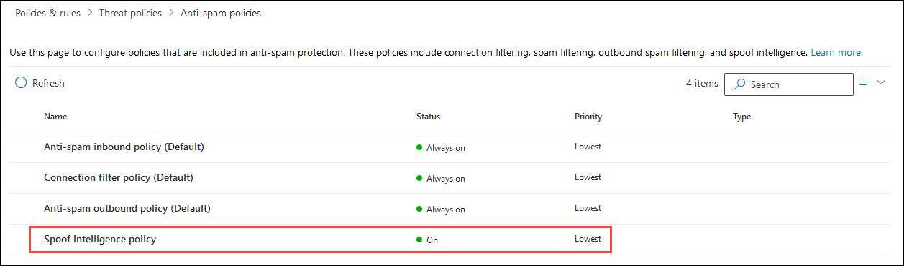

# Configure spoof intelligence in Microsoft 365

If you're an Microsoft 365 customer with mailboxes in Exchange Online or a standalone Exchange Online Protection (EOP) customer without Exchange Online mailboxes, inbound email messages are automatically protected against spoofing by EOP as of October 2018. EOP uses spoof intelligence as part of your organization's overall defense against phishing. For more information, see [Anti-spoofing protection in Microsoft 365](anti-spoofing-protection.md).

When a sender spoofs an email address, they appear to be a user in one of your organization's domains, or a user in an external domain that sends email to your organization. Attackers who spoof senders to send spam or phishing email need to be blocked. But there are scenarios where legitimate senders are spoofing. For example:

- Legitimate scenarios for spoofing internal domains:

  - Third-party senders use your domain to send bulk mail to your own employees for company polls.

  - An external company generates and sends advertising or product updates on your behalf.

  - An assistant regularly needs to send email for another person within your organization.

  - An internal application sends email notifications.

- Legitimate scenarios for spoofing external domains:

  - The sender is on a mailing list (also known as a discussion list), and the mailing list relays email from the original sender to all the participants on the mailing list.

  - An external company sends email on behalf of another company (for example, an automated report or a software-as-a-service company).

Spoof intelligence, and specifically the default (and only) spoof intelligence policy, helps ensure that the spoofed email sent by legitimate senders doesn't get caught up in spam filters in Microsoft 365 or external email systems, while protecting your users from spam or phishing attacks.

You can manage spoof intelligence in the Microsoft 365 Security & Compliance Center, or in PowerShell (Exchange Online PowerShell for Microsoft 365 customers; Exchange Online Protection PowerShell for standalone EOP customers).

## What do you need to know before you begin?

- You open the Security & Compliance Center at <https://protection.office.com/>. To go directly to the **Anti-spam settings** page, use <https://protection.office.com/antispam>. To go directly to the **Anti-phishing** page, use <https://protection.office.com/antiphishing>.

- To connect to Exchange Online PowerShell, see [Connect to Exchange Online PowerShell](https://docs.microsoft.com/powershell/exchange/exchange-online/connect-to-exchange-online-powershell/connect-to-exchange-online-powershell). To connect to standalone Exchange Online Protection PowerShell, see [Connect to Exchange Online Protection PowerShell](https://docs.microsoft.com/powershell/exchange/exchange-eop/connect-to-exchange-online-protection-powershell).

- You need to be assigned permissions before you can perform these procedures. To modify the spoof intelligence policy or enable or disable spoof intelligence, you need to be a member of the **Organization Management** or **Security Administrator** role groups. For read-only access to the spoof intelligence policy, you need to be a member of the **Security Reader** role group. For more information about role groups in the Security & Compliance Center, see [Permissions in the Office 365 Security & Compliance Center](permissions-in-the-security-and-compliance-center.md).

- For our recommended settings for spoof intelligence, [EOP default anti-phishing policy settings](recommended-settings-for-eop-and-office365-atp.md#eop-default-anti-phishing-policy-settings).

## Use the Security & Compliance Center to manage spoofed senders

> [!NOTE]
> If you have an Office 365 Enterprise E5 subscription or have separately purchased and Advanced Threat Protection (ATP) add-on, you can also manage senders who are spoofing your domain through the [Spoof Intelligence insight](walkthrough-spoof-intelligence-insight.md).

1. In the Security & Compliance Center, go to **Threat management** \> **Policy** \> **Anti-spam**.

2. On the **Anti-spam settings** page, click  to expand **Spoof intelligence policy**.

   

3. Make one of the following selections:

   - **Review new senders**
   - **Show me senders I already reviewed**

4. In the **Decide if these senders are allowed to spoof your users** flyout that appears, select one of the following tabs:

   - **Your Domains**: Senders spoofing users in your internal domains.
   - **External Domains**: Senders spoofing users in external domains.

5. Click  in the **Allowed to spoof?** column. Choose **Yes** to allow the spoofed sender, or choose **No** to mark the message as spoofed. The action is controlled by the default anti-phishing policy or custom ATP anti-phishing policies (the default value is **Move message to Junk Email folder**). For more information, see [Spoof settings in anti-phishing policies](set-up-anti-phishing-policies.md#spoof-settings).

   

   The columns and values that you see are explained in the following list:

   - **Spoofed user**: The user account that's being spoofed. This is the message sender in the From address (also known as the `5322.From` address) that's shown in email clients. The validity of this address is not checked by SPF.

     - On the **Your Domains** tab, the value contains a single email address, or if the source email server is spoofing multiple user accounts, it contains **More than one**.

     - On the **External Domains** tab, the value contains the domain of the spoofed user, not the full email address.

   - **Sending Infrastructure**: The domain found in a reverse DNS lookup (PTR record) of the source email server's IP address, or the IP address if the source has no PTR record.

     For more information about message sources and message senders, see [An overview of email message standards](how-office-365-validates-the-from-address.md#an-overview-of-email-message-standards).

   - **# of messages**: The number of messages from the sending infrastructure to your organization that contain the specified spoofed sender or senders within the last 30 days.

   - **# of user complaints**: Complaints filed by your users against this sender within the last 30 days. Complaints are usually in the form of junk submissions to Microsoft.

   - **Authentication result**: One of the following values:

      - **Passed**: The sender passed sender email authentication checks (SPF or DKIM).
      - **Failed**: The sender failed EOP sender authentication checks.
      - **Unknown**: The result of these checks isn't known.

   - **Decision set by**: Shows who determined if the sending infrastructure is allowed to spoof the user:

       - **Spoof intelligence policy** (automatic)
       - **Admin** (manual)

   - **Last seen**: The last date when a message was received from the sending infrastructure that contains the spoofed user.

   - **Allowed to spoof?**: The values that you see here are:

     - **Yes**: Messages from the combination of spoofed user and sending infrastructure are allowed and not treated as spoofed email.

     - **No**: Messages from the combination of spoofed user and sending infrastructure are marked as spoofed. The action is controlled by the default anti-phishing policy or custom ATP anti-phishing policies (the default value is **Move message to Junk Email folder**). See the next section for more information.

     - **Some users** (**Your Domains** tab only): A sending infrastructure is spoofing multiple users, where some spoofed users are allowed and others are not. Use the **Detailed** tab to see the specific addresses.

6. At the bottom of the page, click **Save**.

## Use PowerShell to manage spoofed senders

To view allowed and blocked senders in spoof intelligence, use the following syntax:

```powershell
Get-PhishFilterPolicy [-AllowedToSpoof <Yes | No | Partial>] [-ConfidenceLevel <Low | High>] [-DecisionBy <Admin | SpoofProtection>] [-Detailed] [-SpoofType <Internal | External>]
```

This example returns detailed information about all senders that are allowed to spoof users in your domains.

```powershell
Get-PhishFilter -AllowedToSpoof Yes -Detailed -SpoofType Internal
```

For detailed syntax and parameter information, see [Get-PhishFilterPolicy](https://docs.microsoft.com/powershell/module/exchange/advanced-threat-protection/get-phishfilterpolicy).

To configure allowed and blocked senders in spoof intelligence, follow these steps:

1. Capture the current list of detected spoofed senders by writing the output of the **Get-PhishFilterPolicy** cmdlet to a CSV file:

   ```powershell
   Get-PhishFilterPolicy -Detailed | Export-CSV "C:\My Documents\Spoofed Senders.csv"
   ```

2. Edit the CSV file to add or modify the **SpoofedUser** (email address) and **AllowedToSpoof** (Yes or No) values. Save the file, read the file, and store the contents as a variable named `$UpdateSpoofedSenders`:

   ```powershell
   $UpdateSpoofedSenders = Get-Content -Raw "C:\My Documents\Spoofed Senders.csv"
   ```

3. Use the `$UpdateSpoofedSenders` variable to configure the spoof intelligence policy:

   ```powershell
   Set-PhishFilterPolicy -Identity Default -SpoofAllowBlockList $UpdateSpoofedSenders
   ```

For detailed syntax and parameter information, see [Set-PhishFilterPolicy](https://docs.microsoft.com/powershell/module/exchange/advanced-threat-protection/set-phishfilterpolicy).

## Use the Security & Compliance Center to configure spoof intelligence

The configuration options for spoof intelligence are described in [Spoof settings in anti-phishing policies](set-up-anti-phishing-policies.md#spoof-settings).

You can configure spoof intelligence settings in the default anti-phishing policy, and also in custom policies. For instructions based on your subscription, see one of the following topics:

- [Configure anti-phishing policies in EOP](configure-anti-phishing-policies-eop.md).

- [Configure ATP anti-phishing policies in Microsoft 365](configure-atp-anti-phishing-policies.md).

## How do you know these procedures worked?

To verify that you've configured spoof intelligence with senders who are allowed and not allowed to spoof, and that you've configured the spoof intelligence settings, use any of the following steps:

- In the Security & Compliance Center, go to **Threat management** \> **Policy** \> **Anti-spam** \> expand **Spoof intelligence policy** \> select **Show me senders I already reviewed** \> select the **Your Domains** or **External Domains** tab, and verify the **Allowed to spoof?** value for the sender.

- In PowerShell, run the following commands to view the senders who are allowed and not allowed to spoof:

  ```powershell
  Get-PhishFilter -AllowedToSpoof Yes -SpoofType Internal
  Get-PhishFilter -AllowedToSpoof No -SpoofType Internal
  Get-PhishFilter -AllowedToSpoof Yes -SpoofType External
  Get-PhishFilter -AllowedToSpoof No -SpoofType External
  ```

- In PowerShell, run the following command to export the list of all spoofed senders to a CSV file:

   ```powershell
   Get-PhishFilterPolicy -Detailed | Export-CSV "C:\My Documents\Spoofed Senders.csv"
   ```

- In Microsoft 365 organizations with Exchange Online mailboxes, do either of the following steps:

  - In the Security & Compliance Center, go to **Threat management** \> **Policy** \> **Anti-phishing** \> click **Default policy** and view the details in the flyout.

  - In Exchange Online PowerShell, run the following command and verify the settings:

    ```PowerShell
    Get-AntiPhishPolicy -Identity "Office365 AntiPhish Default"
    ```

- In Microsoft 365 ATP organizations, do either of the following steps:

  - In the Security & Compliance Center, go to **Threat management** \> **Policy** \> **ATP anti-phishing** and do either of the following steps:

    - Select a policy from the list. In the flyout that appears, verify the values in the **Spoof** section.
    - Click **Default policy**. In the flyout that appears, verify the values in the **Spoof** section.

  - In Exchange Online PowerShell, replace \<Name\> with Office365 AntiPhish Default or the name of a custom ATP anti-phishing policy, and run the following command and verify the settings:

    ```PowerShell
    Get-AntiPhishPolicy -Identity "<Name>"
    ```

## Other ways to manage spoofing and phishing

Be diligent about spoofing and phishing protection. Here are related ways to check on senders spoofing your domain and help prevent them from damaging your organization:

- Check the **Spoof Mail Report**. You can use this report often to view and help manage spoofed senders. For information, see [Spoof Detections report](view-email-security-reports.md#spoof-detections-report).

- Review your Sender Policy Framework (SPF) configuration. For a quick introduction to SPF and to get it configured quickly, see [Set up SPF in Microsoft 365 to help prevent spoofing](set-up-spf-in-office-365-to-help-prevent-spoofing.md). For a more in-depth understanding of how Office 365 uses SPF, or for troubleshooting or non-standard deployments such as hybrid deployments, start with [How Office 365 uses Sender Policy Framework (SPF) to prevent spoofing](how-office-365-uses-spf-to-prevent-spoofing.md).

- Review your DomainKeys Identified Mail (DKIM) configuration. You should use DKIM in addition to SPF and DMARC to help prevent attackers from sending messages that look like they are coming from your domain. DKIM lets you add a digital signature to email messages in the message header. For information, see [Use DKIM to validate outbound email sent from your custom domain in Office 365](use-dkim-to-validate-outbound-email.md).

- Review your Domain-based Message Authentication, Reporting, and Conformance (DMARC) configuration. Implementing DMARC with SPF and DKIM provides additional protection against spoofing and phishing email. DMARC helps receiving mail systems determine what to do with messages sent from your domain that fail SPF or DKIM checks. For information, see [Use DMARC to validate email in Office 365](use-dmarc-to-validate-email.md).