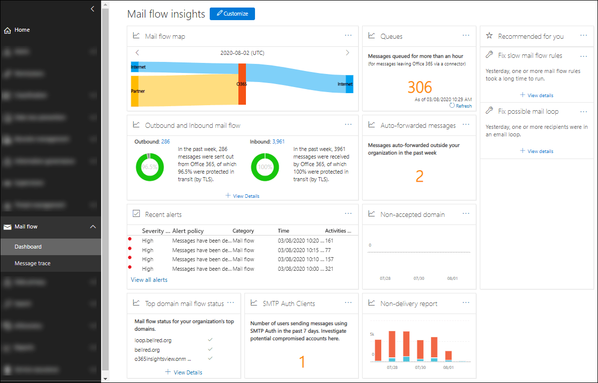

# Mail flow insights in the Security & Compliance Center

[!INCLUDE [Microsoft 365 Defender rebranding](../includes/microsoft-defender-for-office.md)]

**Applies to**
- [Exchange Online Protection](exchange-online-protection-overview.md)
- [Microsoft Defender for Office 365 plan 1 and plan 2](office-365-atp.md)
- [Microsoft 365 Defender](../mtp/microsoft-threat-protection.md)

Admins can use Mail flow dashboard in the Security & Compliance Center to discover trends, insights, and take actions to fix issues related to mail flow in their organization.

The available insights are:

- [Auto-forwarded messages insight](mfi-auto-forwarded-messages-report.md)

- [Fix possible mail loop insight](mfi-mail-loop-insight.md)1

- [Fix slow mail flow rules insight](mfi-slow-mail-flow-rules-insight.md)1

- [Mail flow map](mfi-mail-flow-map-report.md)

- [New domains being forwarded email insight](mfi-new-domains-being-forwarded-email.md)2

- [New users forwarding email insight](mfi-new-users-forwarding-email.md)2

- [Non-accepted domain report](mfi-non-accepted-domain-report.md)

- [Non-delivery report](mfi-non-delivery-report.md)

- [Outbound and inbound mail flow insight](mfi-outbound-and-inbound-mail-flow.md)

- [Queues insight](mfi-queue-alerts-and-queues.md)

- [SMTP Auth clients insight and report](mfi-smtp-auth-clients-report.md)

- [Top domain mail flow status insight](mfi-domain-mail-flow-status-insight.md)

1 This insight appears in the **Recommended for you** area of the Mail flow dashboard only after the issue is detected. Otherwise, you won't see it.

2 This insight doesn't appear on the Mail flow dashboard, but is visible on the [Forwarding report](view-mail-flow-reports.md#forwarding-report) page after the issue is detected. Otherwise, you won't see it.

## Permissions required to view the Mail flow dashboard

The Mail flow dashboard is available to members of the following role groups:

- **Organization Management** in the Security & Compliance Center (global admins).

- **[Exchange Administrator](/azure/active-directory/users-groups-roles/directory-assign-admin-roles#exchange-administrator)** in Azure Active Directory.

- **MailFlow Administrator** in the Security & Compliance Center. If the account is not also a member of the Organization Management or Exchange Administrator role groups, consider the following issues:
  - The user must sign in to the Security & Compliance Center directly at <https://protection.office.com>.
  - The user will only have read-only permission to the Mail flow dashboard.
  - The user won't have access to the Microsoft 365 admin center.

For more information about permissions, see [Permissions in the Security & Compliance Center](permissions-in-the-security-and-compliance-center.md) and [Give users access to the Security & Compliance Center](grant-access-to-the-security-and-compliance-center.md).

## Where to find the Mail flow dashboard

Open the Security & Compliance Center at <https://protection.office.com>, expand **Mail flow**, and then select **Dashboard**.

To go directly to the Mail flow dashboard, open <https://protection.office.com/mailflow/dashboard>.