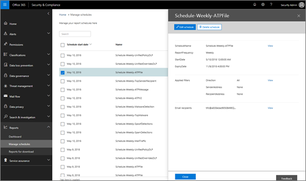

# Manage schedules for multiple reports in the Security &amp; Compliance Center

In the Security &amp; Compliance Center, several [reports and insights](reports-and-insights-in-security-and-compliance.md) are available to help your organization's security team mitigate and address threats to your organization. If you're a member of your organization's security team, you can manage schedules for one or more reports. 
  
## Manage schedules for reports

> [!IMPORTANT]
> Make sure that you have the necessary [permissions assigned in the Security &amp; Compliance Center](permissions-in-the-security-and-compliance-center.md). In general, global administrators, security administrators, and security readers can access reports in the Security &amp; Compliance Center. 
  

1. Go to [https://protection.office.com](https://protection.office.com) and sign in. This takes you to the Security & Compliance Center.

2. In the Security &amp; Compliance Center, go to **Reports** \> **Manage schedules**.
    
3. Select an item in the list.
    
4. Review the information for the report's schedule.
    
5. As appropriate, edit or delete the schedule, and then click **Close**.
    
## Related topics

[Reports and insights in the Security &amp; Compliance Center](reports-and-insights-in-security-and-compliance.md)
  
[Create a schedule for a report in the Security &amp; Compliance Center](create-a-schedule-for-a-report.md)
  
[Download a custom report in the Security &amp; Compliance Center](set-up-and-download-a-custom-report.md)
  
[Download existing reports in the Security &amp; Compliance Center](download-existing-reports.md)
  

