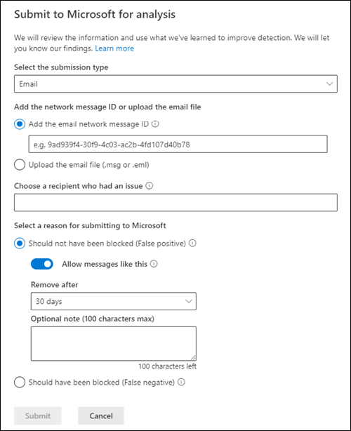

# Add allows in the Tenant Allow/Block List

[!INCLUDE [Microsoft 365 Defender rebranding](../includes/microsoft-defender-for-office.md)]

**Applies to**
- [Exchange Online Protection](exchange-online-protection-overview.md)
- [Microsoft Defender for Office 365 plan 1 and plan 2](defender-for-office-365.md)
- [Microsoft 365 Defender](../defender/microsoft-365-defender.md)

Allows cannot be added directly to the Tenant Allow/Block List. Use the admin submission process to add URL, file, and/or sender allows to the Tenant Allow/Block List. Microsoft doesn't let admins add allows directly, but determines what was blocked and provides an allow for you. In most cases, the allows are added to give the system some time and allow it naturally if warranted. In some cases, Microsoft manages the allow for you.

## Add allows using the Submissions portal 

Allow files, URLs, and senders in the Submissions section of Microsoft 365 Defender. 

1. In the Microsoft 365 Defender portal, go to **Email & collaboration** \> **Submissions**.

2. On the **Submissions** page, verify that the **Submitted for analysis** tab is selected, and then click  **Submit to Microsoft for analysis**.

3. Use the **Submit to Microsoft for review** flyout to mark the sender, file, or URL as false positive. 

4. In the **Select a reason for submitting to Microsoft** section, select **Should not have been blocked (false positive)**. 

5. Turn on **Allow messages like this** option. 

6. From the **Remove after** drop-down list, specify how long you want the allow option to work.

7. When you're finished, click the **Submit** button.

> [!div class="mx-imgBorder"]
> 

## Create spoofed sender allow entries using Microsoft 365 Defender

**Notes**:

- Only the _combination_ of the spoofed user _and_ the sending infrastructure as defined in the domain pair is specifically allowed or blocked from spoofing.
- When you configure an allow or block entry for a domain pair, messages from that domain pair no longer appear in the spoof intelligence insight.
- Entries for spoofed senders never expire.
- Spoof supports both allow and block. URL supports only allow.

1. In the Microsoft 365 Defender portal, go to **Policies & rules** \> **Threat Policies** \> **Rules** section \> **Tenant Allow/Block Lists**.

2. On the **Tenant Allow/Block List** page, select the **Spoofing** tab, and then click  **Add**.

3. In the **Add new domain pairs** flyout that appears, configure the following settings:
   - **Add new domain pairs with wildcards**: Enter one domain pair per line, up to a maximum of 20. For details about the syntax for spoofed sender entries, see [Manage the Tenant Allow/Block List](tenant-allow-block-list.md).
   - **Spoof type**: Select one of the following values:
     - **Internal**: The spoofed sender is in a domain that belongs to your organization (an [accepted domain](/exchange/mail-flow-best-practices/manage-accepted-domains/manage-accepted-domains)).
     - **External**: The spoofed sender is in an external domain.
   - **Action**: Select **Allow** or **Block**.

4. When you're finished, click **Add**.

## Add spoofed sender allow entries using PowerShell

To add spoofed sender entries in the Tenant Allow/Block List, use the following syntax:

```powershell
New-TenantAllowBlockListSpoofItems -SpoofedUser <Domain | EmailAddress | *> -SendingInfrastructure <Domain | IPAddress/24> -SpoofType <External | Internal> -Action <Allow | Block>
```

For detailed syntax and parameter information, see [New-TenantAllowBlockListSpoofItems](/powershell/module/exchange/new-tenantallowblocklistspoofitems).

## Related articles

- [Admin submissions](admin-submission.md)
- [Report false positives and false negatives](report-false-positives-and-false-negatives.md)