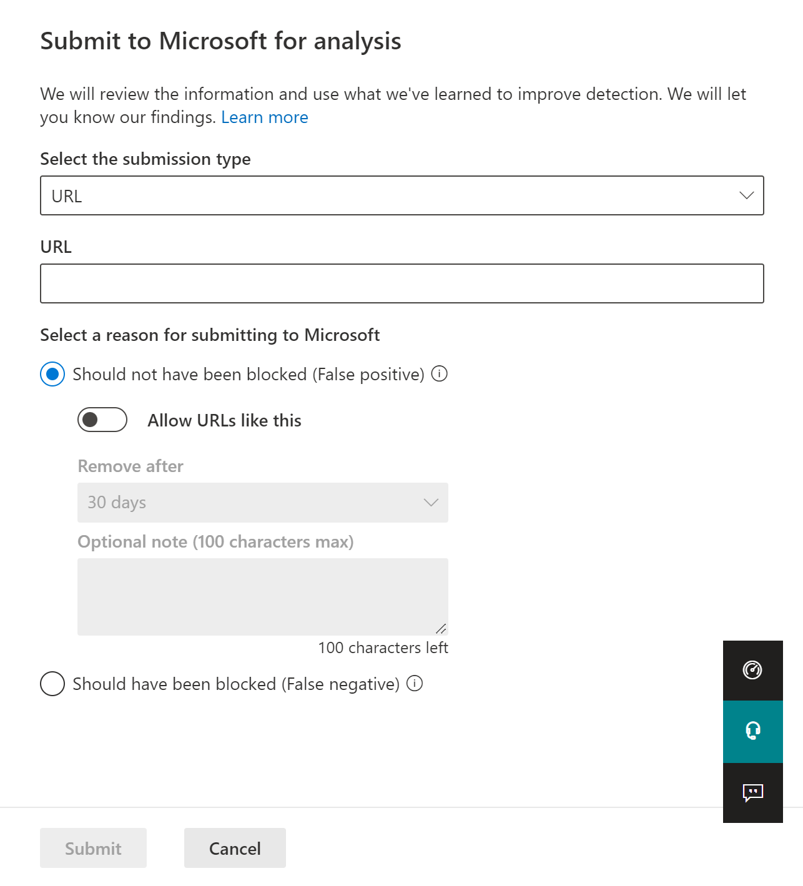
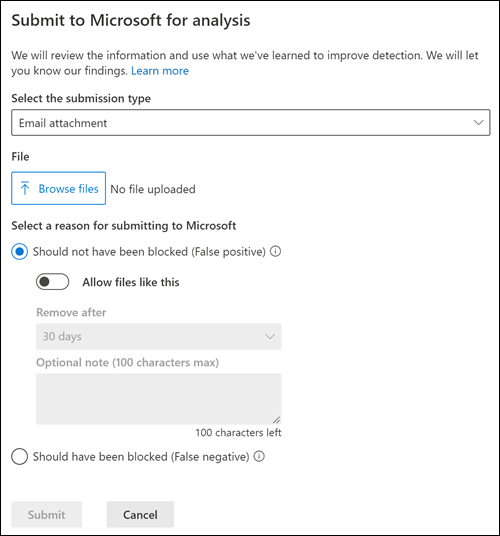

# Add allows in the Tenant Allow/Block List

[!INCLUDE [Microsoft 365 Defender rebranding](../includes/microsoft-defender-for-office.md)]

**Applies to**
- [Exchange Online Protection](exchange-online-protection-overview.md)
- [Microsoft Defender for Office 365 plan 1 and plan 2](defender-for-office-365.md)
- [Microsoft 365 Defender](../defender/microsoft-365-defender.md)

Admins can't add allows directly to the Tenant Allow/Block List. Instead, you use the admin submission process to submit the message that were blocked so the corresponding URL, file, and/or senders will be added to the Tenant Allow/Block List. If a block of the file, URL, or sender has not happened, then the allow will not be created. In most cases where the message was determined to be a false positive that was incorrectly blocked, the allows are kept for as long as needed to give the system time to allow them naturally.

> [!IMPORTANT]
> Since Microsoft manages the allows for you, sender, URL, or file allows that are not needed or considered to be bad will be removed. This is to protect your environment and prevent a misconfiguration of allows. In cases where you may disagree, a support cases may be needed to help determine why a message is still considered as bad.

## Add sender allows using the Submissions portal

Allow senders (or domains) on the **Submissions** page in Microsoft 365 Defender.

1. In the Microsoft 365 Defender portal at <https://security.microsoft.com>, go to **Actions & submissions** \> **Submissions**. Or, to go directly to the **Submissions** page, use <https://security.microsoft.com/reportsubmission>.

2. On the **Submissions** page, verify that the **Emails** tab is selected, and then click  **Submit to Microsoft for analysis**.

3. Use the **Submit to Microsoft for review** flyout to submit a message by adding the network message ID or uploading the email file.

4. In the **Select a reason for submitting to Microsoft** section, select **Should not have been blocked (false positive)**.

5. Turn on **Allow messages like this** option.

6. From the **Remove after** drop-down list, specify how long you want the allow option to work.

7. When you're finished, click the **Submit** button.

> 

## Add URL allows using the Submissions portal

Allow URLs on the **Submissions** page in Microsoft 365 Defender.

1. In the Microsoft 365 Defender portal at <https://security.microsoft.com>, go to **Actions & submissions** \> **Submissions**. Or, to go directly to the **Submissions** page, use <https://security.microsoft.com/reportsubmission>.

2. On the **Submissions** page, select the **URLs** tab, and then click  **Submit to Microsoft for analysis**.

3. Use the **Submit to Microsoft for review** flyout to submit a message by adding the URL.

4. In the **Select a reason for submitting to Microsoft** section, select **Should not have been blocked (false positive)**.

5. Turn on the **Allow URLs like this** option.

6. From the **Remove after** drop-down list, specify for how long you want the allow option to work.

7. When you're finished, click the **Submit** button.

> [!div class="mx-imgBorder"]
> 

## Add File allows using the Submissions portal

Allow Files  on the **Submissions** page in Microsoft 365 Defender.

1. In the Microsoft 365 Defender portal at <https://security.microsoft.com>, go to **Actions & submissions** \> **Submissions**. Or, to go directly to the **Submissions** page, use <https://security.microsoft.com/reportsubmission>.

2. On the **Submissions** page, select the **Email attachments** tab, and then click  **Submit to Microsoft for analysis**.

3. Use the **Submit to Microsoft for review** flyout to submit a message by adding the file or files.

4. In the **Select a reason for submitting to Microsoft** section, select **Should not have been blocked (false positive)**.

5. Turn on the **Allow files like this** option.

6. From the **Remove after** drop-down list, specify for how long you want the allow option to work.

7. When you're finished, click the **Submit** button.

> [!div class="mx-imgBorder"]
> 

## Create spoofed sender allow entries using Microsoft 365 Defender

> [!NOTE]
>
> - Only the _combination_ of the spoofed user _and_ the sending infrastructure as defined in the domain pair is specifically allowed or blocked from spoofing.
> - When you configure an allow or block entry for a domain pair, messages from that domain pair no longer appear in the spoof intelligence insight.
> - Entries for spoofed senders never expire.
> - Spoof supports both allow and block. URL supports only allow.

1. In the Microsoft 365 Defender portal at <https://security.microsoft.com>, go to **Email & collaboration** \> **Policies & rules** \> **Threat policies** \> **Tenant Allow/Block Lists** in the **Rules** section. Or, to go directly to the **Tenant Allow/Block Lists** page, use <https://security.microsoft.com/tenantAllowBlockList>.

2. On the **Tenant Allow/Block List** page, select the **Spoofing** tab, and then click  **Add**.

3. In the **Add new domain pairs** flyout that appears, configure the following settings:
   - **Add new domain pairs with wildcards**: Enter one domain pair per line, up to a maximum of 20. For details about the syntax for spoofed sender entries, see [Manage the Tenant Allow/Block List](tenant-allow-block-list.md).
   - **Spoof type**: Select one of the following values:
     - **Internal**: The spoofed sender is in a domain that belongs to your organization (an [accepted domain](/exchange/mail-flow-best-practices/manage-accepted-domains/manage-accepted-domains)).
     - **External**: The spoofed sender is in an external domain.
   - **Action**: Select **Allow**.

4. When you're finished, click **Add**.

## Add spoofed sender allow entries using PowerShell

To add spoofed sender entries in the Tenant Allow/Block List in [Exchange Online PowerShell](/exchange/connect-to-exchange-online-powershell), use the following syntax:

```powershell
New-TenantAllowBlockListSpoofItems -SpoofedUser <Domain | EmailAddress | *> -SendingInfrastructure <Domain | IPAddress/24> -SpoofType <External | Internal> -Action <Allow | Block>
```

For detailed syntax and parameter information, see [New-TenantAllowBlockListSpoofItems](/powershell/module/exchange/new-tenantallowblocklistspoofitems).

## Related articles

- [Admin submissions](admin-submission.md)
- [Report false positives and false negatives](report-false-positives-and-false-negatives.md)
