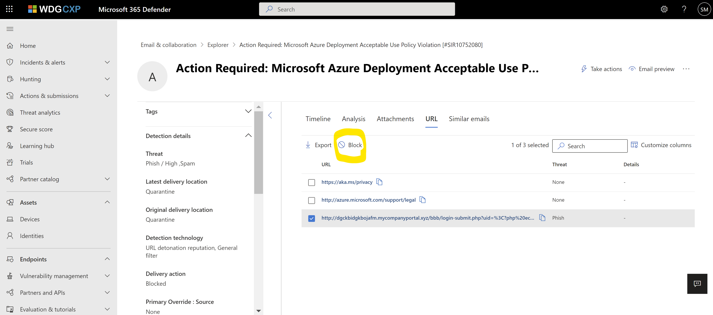
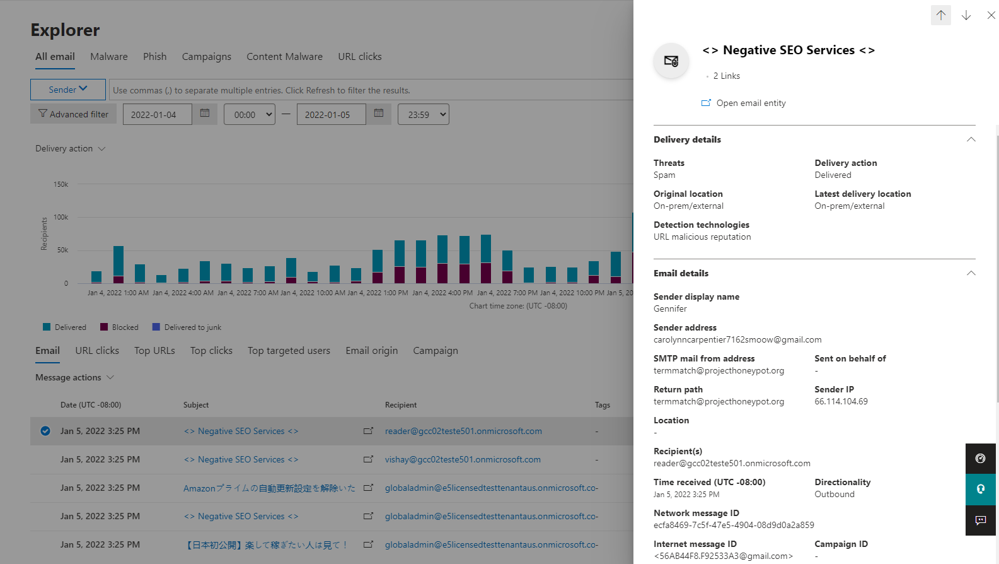

# The Email entity page

[!INCLUDE [MDO Trial banner](../includes/mdo-trial-banner.md)]

Admins of Microsoft 365 E5, and Microsoft Defender for Office 365 Plan 1 and and Plan 2 have a 360-degree view of email using the **Email entity page**. This go-to email page was created to enhance information delivered throughout Microsoft Defender for Office 365 and Microsoft 365 Defender.

See email details in the experiences below, including [previewing and downloading the email](#email-preview-and-download-for-cloud-mailboxes), the email headers *with the option to copy*, Detection details, Threats detected, Latest and Original delivery locations, Delivery actions, and IDs like Alert ID, Network Message ID and more.

## How to get to the email entity page

Anywhere you find email details throughout the Microsoft Defender for Office 365, the email entity details are available. This includes:

- Threat Explorer
- Advanced Hunting
- Alerts
- Quarantine
- Submissions
- Reporting
- Action Center

One way to get to the email entity page is Threat Explorer, but the steps remain the same from wherever you find email details. Navigate to the Microsoft 365 Defender portal at <https://security.microsoft.com>, **Email & collaboration** \> **Explorer**. Or, to go directly to the **Explorer** page, use <https://security.microsoft.com/threatexplorer>.

1. In **Explorer**, select the subject of an email you're investigating.
1. The email fly-out for that mail opens.
1. You see **Open email entity**.
1. Select it for your email deep dive.

:::image type="content" source="../../media/email-entities-1-navigation-to-ee.png" alt-text="With the email selected, you get a fly out with details, and Open entity page for the email at the top." lightbox="../../media/email-entities-1-navigation-to-ee.png":::

:::image type="content" source="../../media/email-entities-2-eep.png" alt-text="The graphic of the email entity page that focuses on headings that you'll see" lightbox="../../media/email-entities-2-eep.png":::

> [!NOTE]
> The permissions needed to view and use this page are the same as to view **Explorer**. The admin must be a member of Global admin or global reader, or Security admin or Security Reader. For more information, see [Permissions in the Microsoft 365 Defender portal](mdo-portal-permissions.md).

## How to read the email entity page

The structure is designed to be easy to read and navigate through at a glance. Various tabs along the top of the page allow you to investigate in more detail. Here's how the layout works:

1. The most required fields are on the left side of the fly-out. These details are 'sticky', meaning they're anchored to the left no matter the tab you navigate to in the rest of the fly-out.

    :::image type="content" source="../../media/email-entities-3-left-panel.png" alt-text="The Graphic of the email entity page with the left side highlighted" lightbox="../../media/email-entities-3-left-panel.png":::

2. On the top-right corner are the actions that can be taken on an email. Any actions that can be taken through **Explorer** are also available through email entity page.

    :::image type="content" source="../../media/email-entities-5-preview.png" alt-text="The Graphic of the email entity page with the right side highlighted" lightbox="../../media/email-entities-5-preview.png":::

3. Deeper analysis can be done by sorting through the rest of the page. Check the email detection details, email authentication status, and header. This area should be looked on a case-by-case basis, but the info in these tabs is available for any email.

    :::image type="content" source="../../media/email-entities-4-middle-panel.png" alt-text="The main panel of the page which includes the email header and authentication status" lightbox="../../media/email-entities-4-middle-panel.png":::

### How to use the email entity page tabs

The tabs along the top of the entity page allow you to investigate email efficiently.

1. **Timeline**: The timeline view for an email (per **Explorer** timeline) shows the original delivery to post-delivery events that happen on an email. For emails that have no post-delivery actions, the view shows the original delivery row in timeline view. Events like: Zero-hour auto purge (ZAP), Remediations, User and Admin submissions, Quarantine information, URL clicks and more, from sources like: system, admin, and user, show up here, in the order in which they occurred.
2. **Analysis**: Analysis shows fields that help admins analyze an email in depth. For cases where admins need to understand more about detection, sender / recipient, and email authentication details, they should use the Analysis tab. Links for Attachments and URLs are also found on this page, under 'Related Entities'. Both attachments and identified threats are numbered here, and clicking takes you straight to the Attachments and URL pages. This tab also has a View header option to *show the email header*. Admins can compare any detail from email headers, side by side with information on the main panel, for clarity.
3. **Attachments**: This examines attachments found in the email with other details found on attachments. The number of attachments shown is currently limited to 10. Notice that detonation details for attachments found to be malicious is also shown here.
4. **URLs**: This tab lists URLs found in the email with other details about the URLs. The number of URLs is limited to 10 right now, but these 10 are prioritized to show *malicious URLs first*. Prioritization saves you time and guess-work. The URLs that were found to be malicious and detonated are also shown here.
5. **Similar emails**: This tab lists all emails similar to the *network message id + recipient* combination specific to this email. Similarity is based on the *body of the message*, only. The determinations made on mails to categorize them as 'similar' don't include a consideration of *attachments*.

## Available on the email entity page

Here are some helpful specifics to get started.

### Email preview and download for Cloud mailboxes

Admins can preview and download emails in Cloud mailboxes, ***if*** the mails are still accessible to Microsoft in an Exchange Online mailbox. In case of a soft delete (by an admin, or user), or ZAP (to quarantine), the emails are no longer present in the Exchange Online mailbox. In that case, admins won't be able to preview or download those specific emails. Emails that were dropped, or where delivery failed, never made it into the mailbox and as a result, admins won't be able to preview or download those emails either.

> [!WARNING]
> Previewing and downloading emails requires a special role called **Preview**. You can add this role in the Microsoft 365 Defender portal as described in [Email & collaboration roles in the Microsoft 365 Defender portal](mdo-portal-permissions.md#email--collaboration-roles-in-the-microsoft-365-defender-portal). You might need to create a new **Email & collaboration** role group there and add the **Preview** role to that new role group or add the **Preview** role to a role group that allows admins in your organization to work in **Explorer**.

### Detonation details

These details are specific to email attachments and URLs. Users can see these details by going to Explorer and applying the *detection technology* filter set to file detonation or URL detonation. Emails filtered for file detonation will contain a malicious file with detonation details, and those filtered for URLs contain a malicious URL and its detonation details.

Users see enriched detonation details for known malicious attachments or URLs found in their emails, which got detonated for their specific tenant. It includes the Detonation chain, Detonation summary, Screenshot, and Observed behavior details to help customers understand why the attachment or URL was deemed malicious and detonated.

1. *Detonation chain*. A single file or URL detonation can trigger multiple detonations. The Detonation chain tracks the path of detonations, including the original malicious file or URL that caused the verdict, and all other files or URLs affected by the detonation. These URLs or attached files may not be directly present in the email, but including that analysis is important to determining why the file or URL was found to be malicious.

    > [!NOTE]
    > This may show just the top level item if none of the entities linked to it were found to be problematic, or were detonated.

1. *Detonation Summary* gives a basic summary for detonation such as *analysis time*, the time when detonation occurred, OS and application, the operating system and application in which the detonation occurred, file size, and verdict reason.
1. *Screenshots* show the screenshots captured during detonation. There can be multiple screenshots during detonation. No screenshots are captured for
    - Container type files like .zip or .rar.
    - If a URL opens into a link that directly downloads a file. However, you'll see the downloaded file in the detonation chain.
1. *Behavior Details* are an export that shows behavior details like exact events that took place during detonation, and observables that contain URLs, IPs, domains, and files that were found during detonation (and can either be problematic or benign). Be aware, there may be no behavior details for:
    - Container files like .zip or .rar that are holding other files.

:::image type="content" source="../../media/email-entities-6-detonation-page.png" alt-text="The detonation summary showing the chain, summary, detonation details, and screenshot under the heading *Deep Analysis*" lightbox="../../media/email-entities-6-detonation-page.png":::

### Other features that make the Email entity page helpful

*Tags*: These are tags applied to users. If the user is a recipient, admins will see a *recipient* tag. Likewise, if the user is a sender, a *sender* tag. This appears in the left side of the email entities page (in the part that's described as *sticky* and, thus, anchored to the page).

*Latest delivery location*: The latest delivery location is the location where an email landed after system actions like ZAP, or admin actions like Move to Deleted Items, finish. Latest delivery location isn't intended to inform admins of the message's *current* location. For example, if a user deletes a message, or moves it to archive, the delivery location won't be updated. However, if a system action has taken place and updated the location (like a ZAP resulting in an email moving to quarantine) this would update the Latest delivery location to quarantine.

*Email details*: Details required for a deeper understanding of email available in the *Analysis* tab.

- *Exchange mail flow rules (also known as transport rules)*: These rules are applied to a message at the transport layer and take precedence over phish and spam verdicts. Mail flow rules are created and modified in the Exchange admin center at <https://admin.exchange.microsoft.com/#/transportrules>, but if any mail flow rule applies to a message, the rule name and GUID will be shown here. Valuable information for tracking purposes.

- *Primary Override: Source*: Primary override and source refer to the tenant or user setting which impacted the delivery of the email, overriding the delivery location given by the system (as per the threat and detection technology). As an example, this could be an email blocked due to a tenant configured mail flow rule or an email allowed due to an end-user setting for Safe Senders.

- *All Overrides*: All Overrides refer to the list of overrides (tenant or user settings) that was applied on the email, which may or may not have impacted the delivery of an email. As an example, if a tenant configured mail flow rule, as well as a tenant configured policy setting (for example, from the Tenant Allow/Block List), is applied to an email, then both will be listed in this field. You can check the primary override field to determine the setting that impacted the delivery of the email.

- *Bulk Complaint Level (BCL)*: The bulk complaint level (BCL) of the message. A higher BCL indicates a bulk mail message is more likely to generate complaints (the natural result if the email is likely to be spam).

- *Spam Confidence Level (SCL)*: The spam confidence level (SCL) of the message. A higher value indicates the message is more likely to be spam.

- *Client type*: Indicates the Client type from which the email was sent like REST.

- *Forwarding*: For scenarios with autoforwarding, it indicates the forwarding user as well as the forwarding type like ETR or SMTP forwarding.

- *Distribution list*: Shows the distribution list, if the recipient received the email as a member of the list. It shows the top level distribution list if there are nested distribution lists involved.

- *To, Cc*: Indicates the addresses that are listed in To, Cc fields of an email. The information in these fields is restricted to 5000 characters.

- *Domain Name*: Is the sender domain name.

- *Domain Owner*: Specifies the owner of the sending domain.

- *Domain Location*: Specifies the location of the sending domain.

- *Domain Created Date*: Specifies the date of creation of the sending domain. A newly created domain is something you could be cautious of if other signals indicate some suspicious behavior.

*Email Authentication*: Email authentication methods used by Microsoft 365 include SPF, DKIM, and DMARC.

- Sender Policy Framework (**SPF**):  Describes results for SPF check for the message. Possible values can be:
  - Pass (IP address): The SPF check for the message passed and includes the sender's IP address. The client is authorized to send or relay email on behalf of the sender's domain.
  - Fail (IP address): The SPF check for the message failed, and includes the sender's IP address. This is sometimes called hard fail.
  - Softfail (reason): The SPF record designated the host as not being allowed to send but is in transition.
  - Neutral: The SPF record explicitly states that it doesn't assert whether the IP address is authorized to send.
  - None: The domain doesn't have an SPF record, or the SPF record doesn't evaluate to a result.
  - Temperror: A temporary error has occurred. For example, a DNS error. The same check later might succeed.
  - Permerror: A permanent error has occurred. For example, the domain has a badly formatted SPF record.

- DomainKeys Identified Mail (**DKIM**):
  - Pass: Indicates the DKIM check for the message passed.
  - Fail (reason): Indicates the DKIM check for the message failed and why. For example, if the message wasn't signed or the signature wasn't verified.
  - None: Indicates that the message wasn't signed. This may or may not indicate that the domain has a DKIM record or the DKIM record doesn't evaluate to a result, only that this message wasn't signed.

- Domain-based Message Authentication, Reporting, and Conformance (**DMARC**):
  - Pass: Indicates the DMARC check for the message passed.
  - Fail: Indicates the DMARC check for the message failed.
  - Bestguesspass: Indicates that no DMARC TXT record for the domain exists, but if one had existed, the DMARC check for the message would have passed.
  - None: Indicates that no DMARC TXT record exists for the sending domain in DNS.

*Composite Authentication*: This is a value used by Microsoft 365 to combine email authentication like SPF, DKIM, and DMARC, to determine if the message is authentic. It uses the *From:* domain of the mail as the basis of evaluation.

## Actions you can take on the Email entity Page

Security teams can now take email actions like soft delete and hard delete, move to junk, move to inbox, trigger an investigation, submit to Microsoft for review in line, and et cetera. **Tenant level block** actions like file and URL or sender can also be triggered from the Email entity page.

You'll be able to select **Take actions** from the top right corner of the entity page and this will open the Action wizard for you to select the specific action you need.

In the Action wizard you can take email actions, email submissions, block sender and sender domain, investigative actions and two step approval (add to remediation) in the same side pane. This follows a consistent flow for ease of use. The Action wizard uses the same system as is used by Explorer actions (for Delete, Submissions, and Investigation actions), for example. You'll be able to see and track these actions in the
 [Unified action center](https://security.microsoft.com/action-center/history) (for deleted emails), in the
  [Submission portal](https://security.microsoft.com/reportsubmission) (for submissions), and in the [Tenant Allow/Block List](https://security.microsoft.com/tenantAllowBlockList) page for (Tenant Allow/Block List blocks).

We're also bringing Tenant level block URL and attachment to the respective Email entity URL and Attachments tabs. Upon approval, the block URL and block attachment entries can be tracked on the **URLs** and **Files** tabs on the Tenant Allow/Block List page.

See [permissions](mdo-portal-permissions.md) required to take these actions.

### The Email summary panel

The email summary panel is a summarized view of the full email entity page. It contains standardized details about the email (for example, detections), as well as context-specific information (for example, for Quarantine or Submissions metadata). The email summary panel replaces the traditional email flyouts throughout Microsoft Defender for Office 365.

> [!div class="mx-imgBorder"]
> 

> [!NOTE]
> To view all the components, click on the **Open email entity** link to open the full email entity page.

The email summary panel is divided into the following sections:

- *Delivery details*: Contains information about threats and corresponding confidence level, detection technologies, and original and latest delivery location.

- *Email details*: Contains information about email properties like sender name, sender address, time received, authentication details, and other several other details.

- *URLs*: By default, you see 3 URLs and their corresponding threats. You can always select **View all URLs** to expand and see all URLs and export them.

- *Attachments*: By default, you see 3 attachments. You can always select **View all attachments** to expand and see all attachments.

In addition to the above sections, you also see sections specific to few experiences that are integrated with the summary panel:

- Submissions:

  - *Submission details*: Contains information about the specific submissions such as:
    - Date submitted
    - Subject
    - Submission type
    - Reason for submitting
    - Submission ID
    - Submitted by

  - *Result details*: Messages that are submitted are reviewed. You can see the result of your submission as well as any recommended next steps.

- Quarantine:

  - *Quarantine details*: Contains quarantine-specific details. For more information, see [Manage quarantined messages](quarantine-admin-manage-messages-files.md#view-quarantined-email-details).

    - Expires: The date/time when the message is automatically and permanently deleted from quarantine.
    - Released to: All email addresses (if any) to which the message has been released.
    - Not yet released to: All email addresses (if any) to which the message hasn't yet been released.

  - *Quarantine actions*: For more information on different quarantine actions, see [Manage quarantined messages](quarantine-admin-manage-messages-files.md#take-action-on-quarantined-email).
