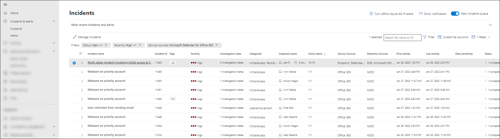
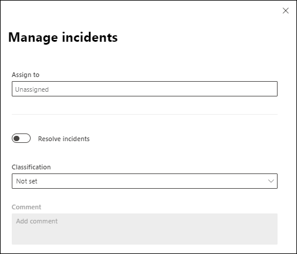
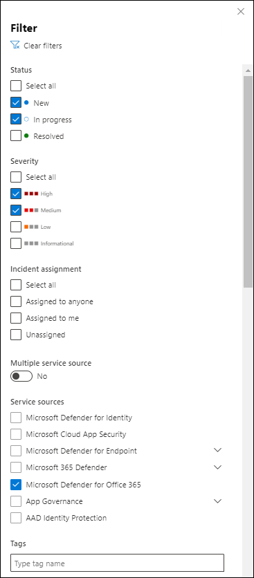
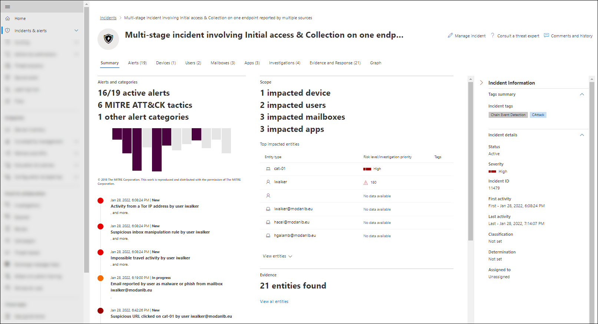
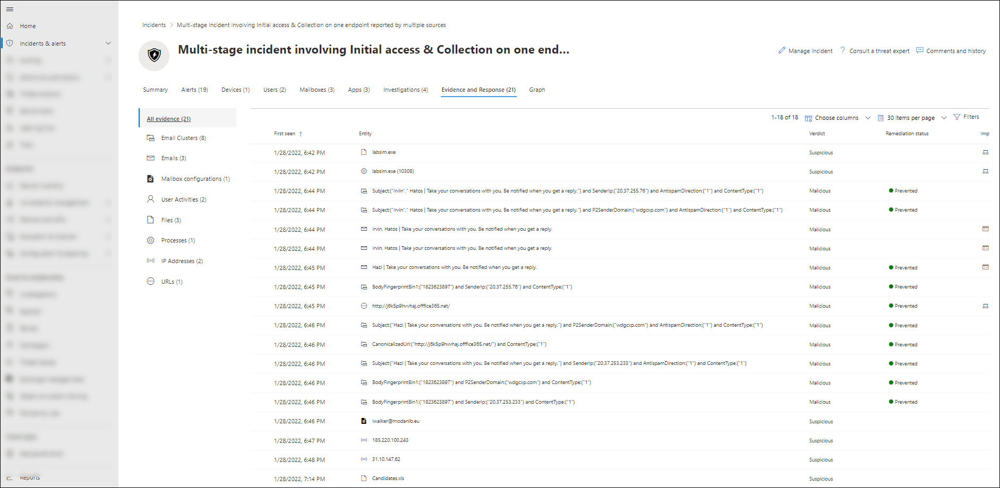
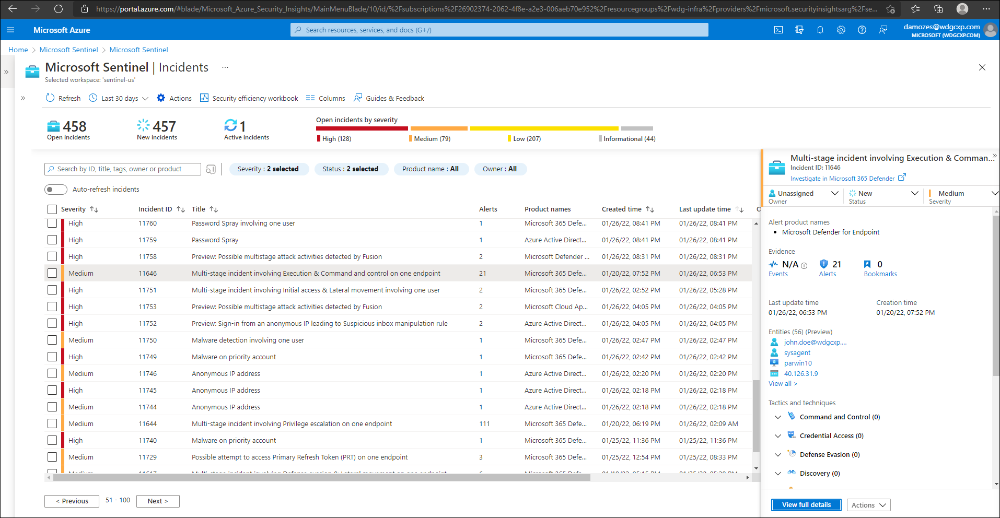
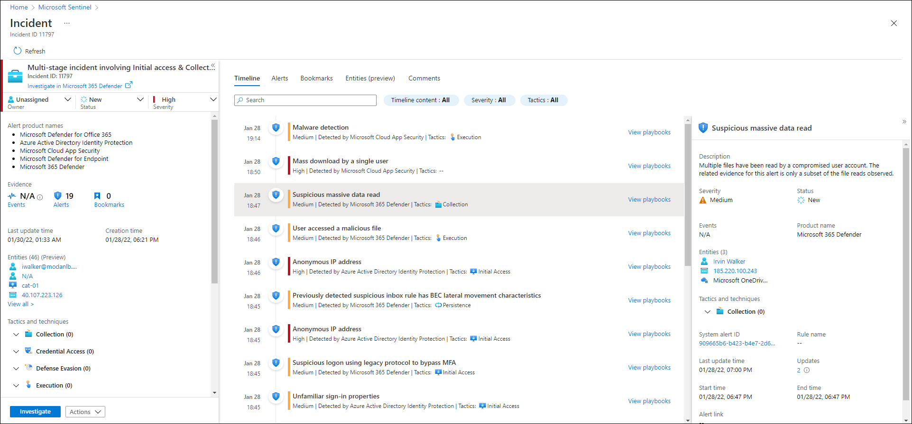

# Microsoft Defender for Office 365 Security Operations Guide

The articles in this series give an overview of the requirements for successfully operating Microsoft Defender for Office 365 in your organization. By properly operating your deployment, your security operations center (SOC) can provide a high-quality, reliable service to protect, detect, and respond to email and collaboration-related security threats.

This operations guide gives you an overview of the tasks and activities that are required for optimal on-boarding and consistent management of Defender for Office 365 by your security teams.

The tasks and activities in this guide are grouped into the following categories:

- Regular activities (daily, weekly, monthly, and ad-hoc.)
- Efficiently managing the incident and alert queues

The rest of this guide describes the required activities for SecOps personnel.

## Daily activities

The activities in this section are critical, and need to be done daily.

### Monitor the Microsoft 365 Defender Incident queue

In the Microsoft 365 Defender Incident queue, you can monitor alerts from the following Defender for Office 365 sources:

- [Defender for Office 365 alerts](../../compliance/alert-policies.md#default-alert-policies).
- [Automated investigation and response (AIR)](automated-investigation-response-office.md).

For more information about the Incident queue, see [Prioritize incidents in Microsoft 365 Defender](../defender/incident-queue.md).

You triage plan for monitoring the Incident queue for Defender for Office 365 alerts should use the following order of precedence for alerts:

1. **A potentially malicious URL click was detected**.
2. **User restricted from sending email**.
3. **Suspicious email sending patterns detected**.
4. **Email reported by user as malware or phish**, and **Multiple users reported email as malware or phish**.
5. **Email messages containing malicious file removed after delivery**, **Email messages containing malicious URL removed after delivery**, and **Email messages from a campaign removed after delivery**.
6. **Phish delivered due to an ETR override**, **Phish delivered because a user's Junk Mail folder is disabled**, and **Phish delivered due to an IP allow policy**
7. **Malware not zapped because ZAP is disabled** and **Phish not zapped because ZAP is disabled**.

Incident queue management and the responsible personas are described in the following table:

|Activity|Cadence|Description|Persona|
|---|---|---|---|
|Triage incidents in the Incident queue|Daily|Verify that all **Medium** and **High** severity incidents from Defender for Office 365 are triaged.|Security Operation Team|
|Investigate and take Response actions on incidents|Daily|Investigate all incidents and actively take the recommended or manual response actions.|Security Operation Team|
|Resolve incidents|Daily|If the incident has been remediated, resolve the incident. Resolving the incident resolves all linked and related active alerts.|Security Operation Team|
|Classify incidents|Daily|Classify incidents as true or false. For true alerts, specify the threat type. This classifications helps your security team see threat patterns and defend your organization from them.|Security Operation Team|

### Manage false positive and false negative detections

In Defender for Office 365, you manage false positives (good mail marked as bad) and false negatives (bad mail allowed) in the following locations:

- [Submissions portal (admin submissions)](admin-submission.md).
- The [Tenant Allow/Block List](tenant-allow-block-list.md)

False positive and false negative management and the responsible personas are described in the following table:

|Activity|Cadence|Description|Persona|
|---|---|---|---|
|Submit false positives and false negatives to Microsoft|Daily|Provide signals to Microsoft by reporting incorrect email, URL, and file detections.|Security Operation Team|
|Analyze admin submission details|Daily|Understand the following items: <ul><li>What caused the detection.</li><li>The state of your organization at the time of submission.</li><li>Whether you need to make changes to your Defender for Office 365 configuration settings.</li></ul>|Security Operation Team    Security Administration|
|Add block entries in the Tenant Allow/Block List|Daily|Use the Tenant Allow/Block List to add block entries for URLs, files, or senders as needed for false negatives.|Security Operation Team|
|Release false negatives from quarantine.|Daily|After the recipient confirms that the message was incorrectly quarantined, you can release or approve release requests for users.    To control what users can do to their own quarantined messages base on why the message was quarantined, see [Quarantine policies](quarantine-policies.md).|Security Operations Team    Messaging Team|

### Review phishing and malware campaigns that resulted in delivered mail

|Activity|Cadence|Description|Persona|
|---|---|---|---|
|Review email campaigns|Daily|[Review email campaigns](campaigns.md) that targeted your organization. Focus on campaigns that resulted in messages being delivered to recipients.    Remove messages from phishing or malware campaigns that exist in user mailboxes. This action is required only when a campaign contains email that hasn't already been remediated by actions from incidents, zero-hour auto purge (ZAP), or manual remediation.|Security Operation Team|

## Weekly activities

### Review detection trends in Defender for Office 365 reports

In Defender for Office 365, you can use the following reports to review detection trends in your organization:

- The [Mailflow status report](view-mail-flow-reports.md#mailflow-status-report)
- The [Threat Protection status report](view-email-security-reports.md#threat-protection-status-report)

|Activity|Cadence|Description|Persona|
|---|---|---|---|
|Review Defender for Office 365 detection trends|Weekly|Review email detection trends for malware, phishing, and spam as compared to good email. Observation over time allows you to see threat patterns and determine whether you need to adjust your Defender for Office 365 policies.|Security Administration    Security Operations Team|

### Track and respond to emerging threats using Threat analytics

Use [Threat analytics](/microsoft-365/security/defender-endpoint/threat-analytics) to review active, trending threats.

|Activity|Cadence|Description|Persona|
|---|---|---|---|
|Review threats in Threat analytics.|Weekly|Threat analytics reports provide detailed analysis, including the following items: <ul><li>IOCs.</li><li>Hunting queries about active threat actors and their campaigns.</li><li>Popular and new attack techniques.</li><li>Critical vulnerabilities.</li><li>Common attack surfaces.</li><li>Prevalent malware.</li></ul>    Use the **Threat analytics** page in the Microsoft 365 Defender portal at <https://security.microsoft.com/threatanalytics3>.|Security Operation Team    Threat hunting team|

### Review top targeted users for malware and phishing

Use [Top targeted users](threat-explorer.md#top-targeted-users) in Threat Explorer to discover or confirm the users who are the top targets for malware and phishing email.

|Activity|Cadence|Description|Persona|
|---|---|---|---|
|Review **Top targeted users** in Threat Explorer.|Weekly|Use the information to decide if you need to adjust policies and the protection configuration for these users. Add the affected users to [Priority accounts](/microsoft-365/admin/setup/priority-accounts) to: <ul<li>Gain visibility when incidents affect them.</li><li>Provide additional protection when needed.</li></ul>|Security Administration    Security Operations Team|

### Review top malware and phishing campaigns that target your organization

Campaign Views reveals malware and phishing attacks against your organization. For more information, see [Campaign Views in Microsoft Defender for Office 365](campaigns.md).

|Activity|Cadence|Description|Persona|
|---|---|---|---|
|Use **Campaign Views** at <https://security.microsoft.com/campaigns> to review malware and phishing attacks that affect you.|Weekly|Learn about the attacks and techniques and what Defender for Office 365 was able to identify and block.    Use **Download threat report** in Campaign Views for detailed information about a campaign.|Security Operations Team|

## Ad-hoc activities

### Manual investigation and removal of email

|Activity|Cadence|Description|Persona|
|---|---|---|---|
|Investigate and remove bad email based on user requests.|Ad-hoc|Use the **Trigger investigation** action in Threat Explorer to start an automated investigation and response playbook on any email from the last 30 days. This action can save time and effort by including: <ul><li>A root investigation.</li><li>Steps to identify and correlate threats.</li><li>Recommended actions to mitigate those threats.</li></ul>    For more information, see [Example: A user-reported phish message launches an investigation playbook](automated-investigation-response-office.md#example-a-security-administrator-triggers-an-investigation-from-threat-explorer)    Or, you can use Threat Explorer to [manually investigate email](investigate-malicious-email-that-was-delivered.md) with powerful search and filtering capabilities and [take manual response action](remediate-malicious-email-delivered-office-365.md) directly from the same place. Available manual actions: <ul><li>Move to Inbox</li><li>Move to Junk</li><li>Move to Deleted items</li><li>Soft delete</li><li>Hard delete.</li></ul>|Security Operations Team|

### Proactive hunting for threats

|Activity|Cadence|Description|Persona|
|---|---|---|---|
|Regular proactive hunting for threats.|Ad-hoc|Search for threats using Threat Explorer and Advanced hunting.|Security Operations Team    Threat hunting team|
|Share hunting queries|Ad-hoc|Actively share frequently used, useful hunting queries within the security team for faster manual hunting for threats and remediation.    Use [Threat trackers](threat-trackers.md) and [shared queries in Advance Hunting](/microsoft-365/security/defender/advanced-hunting-shared-queries).|Security Operations Team    Threat hunting team|
|Create custom detection rules|Ad-hoc|Create custom detections rules to proactively monitor various events, patterns, threats based on Defender for Office 365 data in Advance Hunting. Detection rules are running automatically at regular intervals, generating alerts whenever there are matches with the Advance Hunting query defined within them.|Security Operations Team    Threat hunting team|

### Review Defender for Office 365 policy configurations

|Activity|Cadence|Description|Persona|
|---|---|---|---|
|Review the configuration of Defender for Office 365 policies.|Ad-hoc    Monthly|Configuration analysis to compare your policy settings to the [recommended Standard or Strict values for Defender for Office 365](recommended-settings-for-eop-and-office365.md) helps to identify accidental or malicious changes that can lower the security posture of your organization.    Use the following tools: <ul><li>The **Configuration drift analysis and history** tab of the **Configuration analyzer** at <https://security.microsoft.com/configurationAnalyzer>.</li><li>The PowerShell-based [ORCA tool](https://aka.ms/getorca).</li></ul>|Security Administration    Messaging Team|
|Review overrides of detections by Defender for Office 365|Ad-hoc    Monthly|Use the [View data by System override \> Chart breakdown by Reason view](view-email-security-reports.md#view-data-by-system-override-and-chart-breakdown-by-reason) in the **Threat Protection status report** at <https://security.microsoft.com/reports/TPSAggregateReportATP> to review email that was detected as phishing but delivered due to policy or user override settings.    Actively investigate, remove, or fine tune overrides to avoid delivery of email that was determined to be malicious.|Security Administration    Messaging Team|

### Review spoof and impersonation detections

|Activity|Cadence|Description|Persona|
|---|---|---|---|
|Review Spoof and Impersonation detection insights.|Ad-hoc    Monthly|Use the [spoof intelligence insight](learn-about-spoof-intelligence.md) and the [impersonation insight in Defender for Office 365](impersonation-insight.md) on the **Anti-phishing** page at <https://security.microsoft.com/antiphishing> to adjust filtering for spoof and impersonation detections. Use allow/block entries from the insights to reduce false positive or false negatives.|Security Administration    Messaging Team|

### Review priority account membership

|Activity|Cadence|Description|Persona|
|---|---|---|---|
|Review who's defined as a priority account.|Ad-hoc|Keep the membership of [priority accounts](/microsoft-365/admin/setup/priority-accounts) current with organizational changes to get: <ul><li>Better visibility in reports.</li><li>Filtering in incidents and alerts</li><li>Additional heuristic tailored for executive mail flow patterns via priority account protection</li></ul>    Use custom [user tags](user-tags.md) for other users to get: <ul><li>Better visibility in reports.</li><li>Filtering in incidents and alerts.</li></ul>|Security Operations Team|

## Manage incident and alert queues

An [incident](/microsoft-365/security/defender/incidents-overview) in Microsoft 365 Defender is a collection of correlated alerts and associated data that make up the story of an attack. Defender for Office 365 [alerts](/microsoft-365/compliance/alert-policies#default-alert-policies), [automated investigation and response (AIR)](office-365-air.md#the-overall-flow-of-air), and the outcome of the investigations are natively integrated and correlated into Microsoft 365 Defender incidents.

Alerts are created when suspicious or malicious event or activity detected impacted an entity (for example, email, users, or mailboxes) and can provide valuable insights about a finished or ongoing attack. However, as the attack progress, it can impact multiple entities and result in multiple alerts from different sources. Some built-in alerts will automatically trigger AIR playbooks. These playbooks do a series of investigation steps to look for other impacted email messages, users, mailboxes, or suspicious activities.

Defender for Office 365 alerts, investigations, and their data are automatically correlated. When a relationship is determined, an incident is created by the system to give security teams visibility for the entire attack.

We strongly recommend that SecOps teams manage Defender for Office 365 through Microsoft 365 Defender incidents. This approach has the following benefits:

- The Incident queue in Microsoft 365 Defender gives multiple options for [management](/microsoft-365/security/defender/manage-incidents):
  - Prioritization
  - Filtering
  - Classification
  - Tag management.

  You can take incidents directly from the queue or assign them to someone. Comments and comment history can help track progress.

- If the attack impacts other workloads that are protected by Microsoft Defender\*, the related alerts, investigations, and their data are also correlated to the same incident.

  \*Microsoft Defender for Endpoint, Microsoft Defender for Identity, and Microsoft Defender for Cloud Apps.

- Complex correlation logic isn't required, because the correlation logic is provided by the system.

- If the correlation logic doesn't fully meet your needs, you can add alerts to existing incidents or create new incidents.

- Related Defender for Office 365 alerts, AIR investigations, and pending actions from investigations are automatically added to incidents.

- If the AIR investigation finds no threat, the related alerts are automatically resolved by the system. If all alerts within an incident are resolved, the incident status also changes to **Resolved**.

- Related evidence and response actions are automatically aggregated on the **Evidence and response** tab of the incident.

- Security team members can take response actions directly from the incidents. For example, they can soft-delete email in mailboxes or remove suspicious Inbox rules from mailboxes.

- Recommended email actions are created only when the latest delivery location of a malicious email is a cloud mailbox.

- Pending email actions are updated based on the latest delivery location. If the email was already remediated by a manual action, the status will reflect that.

- Recommended actions are created only for email and email clusters that are determined to be the most critical threats:
  - Malware
  - High confidence phishing
  - Malicious URLs
  - Malicious files

> [!NOTE]
> Incidents don't just represent static events. They also represent attack stories that happen over a period of time. As the attack is in progress, new Defender for Office 365 alerts, AIR investigations, and their data are continuously added to the existing incident.

Manage incidents on the **Incidents** page in the Microsoft 365 Defender portal at <https://security.microsoft.com/incidents-queue>:

Manage incidents on the **Incidents** page in Microsoft Sentinel at <https://portal.azure.com/#blade/Microsot_Azure_Security_Insights/ManeMenuBlade>:

## Appendix

### Learn about Microsoft Defender for Office 365 tools and processes

Security operations and response team members need to integrate Defender for Office 365 tools and features into existing investigations and response processes. Learning about new tools and capabilities can take time but it's a critical part of the on-boarding process. The simplest way for SecOps and email security team members to learn about Defender for Office 365 is to use the training content that's available as part of the Ninja training content at <https://aka.ms/mdoninja>.

The content is structured for different knowledge levels (Fundamentals, Intermediate, and Advanced) with multiple modules per level.

### Permissions for Defender for Office 365 activities and tasks

Permissions for managing Defender for Office 365 in the Microsoft 365 Defender portal and PowerShell are based on the role-based access control (RBAC) permissions model. RBAC is the same permissions model that's used by most Microsoft 365 services. For more information, see [Permissions in the Microsoft 365 Defender portal](permissions-microsoft-365-security-center.md).

The following permissions (roles and role groups) are available in the portal and can be used to grant access to security team members:

- **Azure AD roles**: Centralized roles that assign permissions for _all_ Microsoft 365 services, including Defender for Office 365. You can view the Azure AD roles and assigned users in the Microsoft 365 Defender portal, but you can't manage them directly there. Instead, you manage Azure AD roles and members at <https://aad.portal.azure.com/#blade/Microsoft_AAD_IAM/ActiveDirectoryMenuBlade/RolesAndAdministrators>. The most frequent roles used by security teams are:
  - **Security administrator**
  - **Security operator**
  - **Security reader**

- **Email & collaboration roles**: Roles and role groups that grant permission specific to Microsoft Defender for Office 365. The following role are not available in Azure AD, but can be important for security teams:

  - **Preview** role: Assign this role to team members who need to preview or download email messages as part of investigation activities. Allows users to [preview and download](investigate-malicious-email-that-was-delivered.md#preview-role-permissions) email messages in cloud mailboxes using the [email entity page](mdo-email-entity-page.md#email-preview-for-cloud-mailboxes).

    By default, this role is assigned only to the following role groups:

    - Data Investigator
    - eDiscovery Manager

    To assign this role to a new or existing role group, see [Modify Email & collaboration role membership in the Microsoft 365 Defender portal](permissions-microsoft-365-security-center.md#modify-email--collaboration-role-membership-in-the-microsoft-365-defender-portal).

  - **Search and Purge** role: Approve the deletion of malicious messages as recommended by AIR or take manual action on messages in hunting experiences like Threat Explorer.

    By default, this role is assigned only to the following role groups:

    - Data Investigator
    - Organization Management

    To assign this role to a new or existing role group, see [Modify Email & collaboration role membership in the Microsoft 365 Defender portal](permissions-microsoft-365-security-center.md#modify-email--collaboration-role-membership-in-the-microsoft-365-defender-portal).

  - **Tenant AllowBlockList Manager**: Manage allow and block list entries using the [Tenant Allow/Block List](tenant-allow-block-list.md). Blocking URLs, files (using file hash) or senders is a useful response action to take when investigating malicious email that was delivered.

    By default, this role is assigned to the **Security Operator** role.

### SIEM/SOAR integration

Defender for Office 365 exposes most of its data through a set of programmatic APIs. These APIs help you automate workflows and make full use of Defender for Office 365 capabilities. Data is available through the [Microsoft 365 Defender APIs](/microsoft-365/security/defender/api-overview) and can be used to integrate Defender for Office 365 into existing SIEM/SOAR solutions.

- [Incident API](/microsoft-365/security/defender/api-incident): Defender for Office 365 alerts and automated investigations are active parts of incidents in Microsoft 365 Defender. Security teams can focus on what's critical by grouping the full attack scope and all impacted assets together.

- [Event streaming API](/microsoft-365/security/defender/streaming-api): Allows shipping of real-time events and alerts into a single data stream as they happen. Supported Defender for Office 365 event types include:
  - [EmailEvents](/microsoft-365/security/defender/advanced-hunting-emailevents-table)
  - [EmailUrlInfo](/microsoft-365/security/defender/advanced-hunting-emailurlinfo-table)
  - [EmailAttachmentInfo](/microsoft-365/security/defender/advanced-hunting-emailattachmentinfo-table)
  - [EmailPostDeliveryEvents](/microsoft-365/security/defender/advanced-hunting-emailpostdeliveryevents-table)

  The events contain data from processing all email (including intra-org messages) in the last 30 days.

- [Advance Hunting API](/microsoft-365/security/defender/api-advanced-hunting): Allows cross-product threat hunting.

- [Threat Assessment API](/graph/api/resources/threatassessment-api-overview?view=graph-rest-1.0): Can be used to report spam, phishing URLs, or malware attachments directly to Microsoft.

To connect Defender for Office 365 incidents and raw data with Microsoft Sentinel, you can use the [Microsoft 365 Defender (M365D) connector](/azure/sentinel/connect-microsoft-365-defender?tabs=MDO)

<!--- Docs for Splunk, Qradar other 3rd party guidance/connector of already available? --->

You can use this simple "Hello World" example to test API access to Microsoft Defender APIs: [Hello World for Microsoft 365 Defender REST API](/microsoft-365/security/defender/api-hello-world).

## Response actions to take

Security teams can take wide variety of response actions on email using Defender for Office 365 tools:

- You can delete messages, but you can also take the following actions on email:
  - Move to Inbox
  - Move to Junk
  - Move to Deleted Items
  - Soft delete
  - Hard delete.

  You can take these actions from the following locations:

  - The **Evidence and response** tab from the details of the incident on the **Incidents** page** at <https://security.microsoft.com/incidents-queue> (recommended).
  - **Threat Explorer** at <https://security.microsoft.com/threatexplorer>.
  - The unified **Action center** at  <https://security.microsoft.com/action-center/pending>.

- You can start an AIR playbook manually on any email message using the **Trigger investigation** action in Threat Explorer.

- You can report false positive or false negative detections directly to Microsoft using [Threat Explorer](threat-explorer.md) or [admin submissions](admin-submission.md).

- You can block undetected malicious files, URLs, or senders using the [Tenant Allow/Block List](tenant-allow-block-list.md).

Defender for Office 365 actions are seamlessly integrated into hunting experiences and the history of actions are visible on the **History** tab in the unified **Action center** at <https://security.microsoft.com/action-center/history>.

The most effective way to take action is to use the built-in integration with Microsoft 365 Defender incidents. You can simply approve the actions that were recommended by AIR in Defender for Office 365 on the [Evidence and response](/microsoft-365/security/defender/investigate-incidents#evidence-and-response) tab of a Microsoft 365 Defender incident. This method of tacking action is recommended for the following reasons:

- You investigate the complete attack story
- You benefit from the built-in correlation with other workloads: Microsoft Defender for Endpoint, Microsoft Defender for Identity, and Microsoft Defender for Cloud Apps.
- You take actions on email from a single place.

You take action on email based on the result of a manual investigation or hunting activity. [Threat Explorer](threat-explorer.md) allows security team members to take action on any email messages that might still exist in cloud mailboxes. They can take action on intra-org messages that were sent between users in your organization. TThreat Explorer data is available for the last 30 days.

## Address false positives and false negatives in Defender for Office 365

User submission and admin submissions of email messages are critical positive reinforcement signals for our machine learning based detection systems. They help us review, triage, rapidly learn, and mitigate attacks. Actively reporting false positives and false negatives is an important activity that provides feedback to Defender for Office 365 when mistakes are made during detection.

Organizations have multiple options for configuring user submissions. Depending on the configuration, security teams might have more active involvement when users submit false positives or false negatives to Microsoft:

- User submissions are sent to Microsoft for analysis when the [user reported message settings](user-submission.md) are configured with either of the following settings:
- Send reported messages to Microsoft.
- Send reported messages to Microsoft and the organization's mailbox.

  Security teams members should do add-hoc [admin submissions](admin-submission.md) when false positives or false negatives that were not reported by users were discovered by the operations teams.

- When user reported messages are configured to send messages only to the organization's mailbox, security teams should actively send user-reported false positives and false negatives to Microsoft via admin submissions.

In both cases, if a user reported an email as phishing, Defender for Office 365 generates an alert and the alert will trigger an AIR playbook. Incident logic will correlate this information to other alerts and events where possible. This consolidation of information helps security teams triage, investigate, and respond to user reported email.

User submissions and admin submissions are handled by the submission pipeline by Microsoft, which follows a tightly integrated process. This process includes:

- Noise reduction
- Automated triage
- Grading by security analysts and human-partnered machine learning-based solutions.

For more information, see [Reporting an email in Defender for Office 365 - Microsoft Tech Community](https://techcommunity.microsoft.com/t5/microsoft-defender-for-office/reporting-an-email-in-microsoft-defender-for-office-365/ba-p/2870231).

Security team members can do admin submission from multiple location in the Microsoft 365 Defender portal at<https://security.microsoft.com>:

- [Admin submission](admin-submission.md): Use the Submissions portal to submit suspected spam, phishing, URLs, and files to Microsoft.
- Directly from Threat Explorer using one of the following message actions:
  - Report clean
  - Report phishing
  - Report malware
  - Report spam.

  You can select up to 10 messages to perform a bulk submission. Admin submissions created this way also visible in the Submission portal.

For the short-term mitigation of false negatives, security teams can directly manage [block entries](manage-tenant-blocks.md) for file, URL, and sender entries in the [Tenant Allow/Block List](tenant-allow-block-list.md), along with reporting the false negatives via admin submissions.

For the short-term mitigation of false negatives, security teams can't can manage [allow entries](manage-tenant-allows.md) in the Tenant Allow/Block List. Instead, they need to use the **Allow messages like this** setting during admin submissions.

[Quarantine](manage-quarantined-messages-and-files.md) in Defender for Office 365 holds potentially dangerous or unwanted messages and files. Security teams can view, release, and delete all types of quarantined messages for all users. This capability enables security teams to respond effectively when a false positive message or file is quarantined.

## Integrate third-party reporting tools with Defender for Office 365 user submission

If your organization using a third-party reporting tool to allow users reporting suspicious email to the security operations team you can integrate the tool with Defender for Office 365 user submissions capabilities. Through this integration security operations teams can benefit from the automated investigation and response (AIR) capabilities of Defender for Office 365 to simplify the triage process and reduce investigation and response time when a user report a potentially malicious email delivered to a mailbox.

Use the **Use this custom mailbox to receive user reported submissions** setting in the [user reported message settings page](user-submission.md) to define the custom mailbox where the third-party reporting tool send reported messages.

Note: The custom mailbox should be an Exchange Online mailbox. The original reported message reported by the third-party tool must be included as a .EML or .MSG attachment (not compressed) in the message that's sent to the custom mailbox (don't just forward the original message to the custom mailbox).

When a user reported email arrives to the custom mailbox Defender for Office 365 will automatically generates the alert **Email reported by user as malware or phish** which launches an [automated investigation and response (AIR) playbook](automated-investigation-response-office.md#example-a-user-reported-phish-message-launches-an-investigation-playbook). The playbooks performs a series of automated investigations steps. It gathers data about the email in question and threats, entities related to that email. Such entities can include files, URLs, and recipients. It provides recommended actions to take for security operations team based on the investigation findings.

**Email reported by user as malware or phish** alerts, automated investigations and their recommended actions are automatically correlated to Microsoft 365 Defender Incidents to further simply the triage and response process for security teams. If multiple users are reporting similar or the same email they will be part of the same Incident as a result of the correlation.

Alerts, investigations and their data from Defender for Office 365 are automatically correlated to ones from Microsoft Defender for Endpoint, Microsoft Defender for Cloud Apps, Microsoft Defender for Identity. When there is a relation between them an Incident is created by the system to give security teams visibility for the entire attack.
