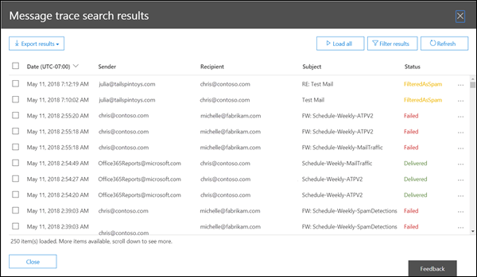
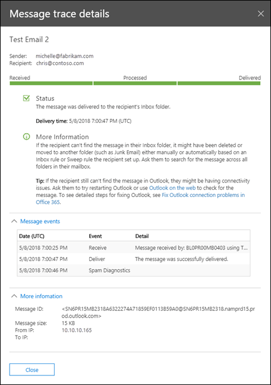

# Message trace in the Security & Compliance Center

[!INCLUDE [Microsoft 365 Defender rebranding](../includes/microsoft-defender-for-office.md)]

**Applies to**
- [Exchange Online Protection](exchange-online-protection-overview.md)
- [Microsoft Defender for Office 365 plan 1 and plan 2](defender-for-office-365.md)
- [Microsoft 365 Defender](../defender/microsoft-365-defender.md)

Message trace in the Security & Compliance Center follows email messages as they travel through your Exchange Online organization. You can determine if a message was received, rejected, deferred, or delivered by the service. It also shows what actions were taken on the message before it reached its final status.

You can use the information from message trace to efficiently answer user questions about what happened to messages, troubleshoot mail flow issues, and validate policy changes.

## What do you need to know before you begin?

- You need to be a member of the **Organization Management**, **Compliance Management** or **Help Desk** role groups in **Exchange Online** to use message trace. For more information, see [Permissions in Exchange Online](/exchange/permissions-exo/permissions-exo).

  **Notes**: Membership in the corresponding Azure Active Directory role in the Microsoft 365 admin center gives users the required permissions _and_ permissions for other features in Microsoft 365. For more information, see [About admin roles](../../admin/add-users/about-admin-roles.md).

- The maximum number of messages that are displayed in the results of a message trace depends on the report type you selected (see the [Choose report type](#choose-report-type) section for details). The [Get-HistoricalSearch](/powershell/module/exchange/get-historicalsearch) cmdlet in Exchange Online PowerShell or standalone EOP PowerShell returns all messages in the results.

## Open message trace

Open the Security & Compliance Center at <https://protection.office.com/>, and then go to **Mail flow** \> **Message trace**.

To go directly to the **Message trace** page, open <https://protection.office.com/messagetrace>.

## Message trace page

From here you can start a new default trace by clicking on the **Start a trace** button. This will search for all messages for all senders and recipients for the last two days. Or you can use one of the stored queries from the available query categories and either run them as-is or use them as starting points for your own queries:

- **Default queries**: Built-in queries provided by Microsoft 365.
- **Custom queries**: Queries saved by admins in your organization for future use.
- **Autosaved queries**: The last ten most recently run queries. This list makes it simple to pick up where you left off.

Also on this page is a **Downloadable reports** section for the requests you've submitted, as well as the reports themselves when they're are available for download.

## Options for a new message trace

### Filter by senders and recipients

The default values are **All senders** and **All recipients**, but you can use the following fields to filter the results:

- **By these people**: Click in this field to select one or more senders from your organization. You can also start to type a name and the items in the list will be filtered by what you've typed, much like how a search page behaves.
- **To these people**: Click in this field to select one or more recipients in your organization.

> [!NOTE]
>
> - You can also type the email addresses of external senders and recipients. Wildcards are supported (for example, `*@contoso.com`), but you can't use multiple wildcard entries in the same field at the same time.
> - You can paste multiple senders or recipients lists separated by semicolons (`;`). spaces (`\s`), carriage returns (`\r`), or next lines (`\n`).

### Time range

The default value is **2 days**, but you can specify date/time ranges of up to 90 days. When you use date/time ranges, consider these issues:

- By default, you select the time range in **Slider** view using a time line. You can only select the day or time settings that are displayed. Trying to select an in-between value will snap the start/end bubble to the nearest displayed setting.

  

  But, you can also switch to **Custom** view where you can specify the **Start date** and **End date** values (including times), and you can also select the **Time zone** for the date/time range. Note that the **Time zone** setting applies to both your query inputs and your query results.

  

  For 10 days or less, the results are available instantly as a **Summary** report. If you specify a time range that's even slightly greater than 10 days, the results will be delayed as they are only available as a downloadable CSV file ( **Enhanced summary** or **Extended** reports).

  For more information about the different report types, see the [Choose report type](#choose-report-type) section in this article.

  > [!NOTE]
  > Enhanced summary and Extended reports are prepared using archived message trace data, and it can take up to several hours before your report is available for download. Depending on how many other admins have also submitted report requests around the same time, you might also notice a delay before processing starts for your queued request.

- Saving a query in **Slider** view saves the relative time range (for example, 3 days from today). Saving a query in **Custom** view saves the absolute date/time range (for example, 2018-05-06 13:00 to 2018-05-08 18:00).

### More search options

#### Delivery status

You can leave the default value **All** selected, or you can select one of the following values to filter the results:

- **Delivered**: The message was successfully delivered to the intended destination.
- **Pending**: Delivery of the message is being attempted or re-attempted.
- **Expanded**: A distribution group recipient was expanded before delivery to the individual members of the group.
- **Failed**: The message was not delivered.
- **Quarantined**: The message was quarantined (as spam, bulk mail, or phishing). For more information, see [Quarantined email messages in EOP](quarantine-email-messages.md).
- **Filtered as spam**: The message was identified spam, and was rejected or blocked (not quarantined).
- **Getting status:** The message was recently received by Microsoft 365, but no other status data is yet available. Check back in a few minutes.

> [!NOTE]
> The values **Pending,** **Quarantined**, and **Filter as spam** are only available for searches less than 10 days. Also, there might be a 5 to 10 minute delay between the actual and reported delivery status.

#### Message ID

This is the internet message ID (also known as the Client ID) that's found in the **Message-ID:** header field in the message header. Users can give you this value to investigate specific messages.

This value is constant for the lifetime of the message. For messages created in Microsoft 365 or Exchange, the value is in the format `<GUID@ServerFQDN>`, including the angle brackets (\< \>). For example, `<d9683b4c-127b-413a-ae2e-fa7dfb32c69d@DM3NAM06BG401.Eop-nam06.prod.protection.outlook.com>`. Other messaging systems might use different syntax or values. This value is supposed to be unique, but not all email systems strictly follow this requirement. If the **Message-ID:** header field doesn't exist or is blank for incoming messages from external sources, an arbitrary value is assigned.

When you use **Message ID** to filter the results, be sure to include the full string, including any angle brackets.

#### Direction

You can leave the default value **All** selected, or you can select **Inbound** (messages sent to recipients in your organization) or **Outbound** (messages sent from users in your organization) to filter the results.

#### Original client IP address

You can filer the results by client IP address to investigate hacked computers that are sending large amounts of spam or malware. Although the messages might appear to come from multiple senders, it's likely that the same computer is generating all of the messages.

> [!NOTE]
> The client IP address information is only available for 10 days, and is only available in the **Enhanced summary** or **Extended** reports (downloadable CSV files).

### Choose report type

The available report types are:

- **Summary**: Available if the time range is less than 10 days, and requires no additional filtering options. The results are available almost immediately after you click **Search**. The report returns up to 20000 results.
- **Enhanced summary** or **Extended**: These reports are only available as downloadable CSV files, and require one or more of the following filtering options regardless of the time range: **By these people**, **To these people**, or **Message ID**. You can use wildcards for the senders or the recipients (for example, \*@contoso.com). The Enhanced summary report returns up to 50000 results. The Extended report returns up to 1000 results.

> [!NOTE]
>
> - Enhanced summary and Extended reports are prepared using archived message trace data, and it can take up to several hours before your report is available to download. Depending on how many other admins have also submitted report requests around the same time, you might also notice a delay before your queued request starts to be processed.
> - While you can select an Enhanced summary or Extended report for any date/time range, commonly the last four hours of archived data will not yet be available for these two types of reports.
> - The maximum size for a downloadable report is 500 MB. If a downloadable report exceeds 500 MB, you can't open the report in Excel or Notepad.

When you click **Next**, you're presented with a summary page that lists the filtering options that you selected, a unique (editable) title for the report, and the email address that receives the notification when the message trace completes (also editable, and must be in one of your organization's accepted domains). Click **Prepare report** to submit the message trace. On the main **Message trace** page, you can see the status of the report in the **Downloadable reports** section.

For more information about the information that's returned in the different report types, see the next section.

## Message trace results

The different report types return different levels of information. The information that's available in the different reports is described in the following sections.

### Summary report output

After running the message trace, the results will be listed, sorted by descending date/time (most recent first).

The summary report contains the following information:

- **Date**: The date and time at which the message was received by the service, using the configured UTC time zone.
- **Sender**: The email address of the sender (*alias*@*domain*).
- **Recipient**: The email address of the recipient or recipients. For a message sent to multiple recipients, there's one line per recipient. If the recipient is a distribution group, dynamic distribution group, or mail-enabled security group, the group will be the first recipient, and then each member of the group is on a separate line.
- **Subject**: The first 256 characters of the message's **Subject:** field.
- **Status**: These values are described in the [Delivery status](#delivery-status) section.

By default, the first 250 results are loaded and readily available. When you scroll down, there's a slight pause as the next batch of results are loaded. Instead of scrolling, you can click **Load all** to load all of the results up to a maximum of 10,000.

You can click on the column headers to sort the results by the values in that column in ascending or descending order.

You can click **Filter results** to filter the results by one or more columns.

You can export the results after you've selected one or more rows by clicking **Export results** and then selecting **Export all results**, **Export loaded results**, or **Export selected**.

#### Find related records for this message

Related message records are records that shared the same Message ID. Remember, even a single message sent between two people can generate multiple records. The number of records increases when the message is affected by distribution group expansion, forwarding, mail flow rules (also known as transport rules), etc.

After you select a row's check box, you can find related records for the message by clicking the **Find related** button that appears, or by selecting **More options**  \> **Find related records for this message**).

For more information about the Message ID, see the Message ID section earlier in this article.

#### Message trace details

In the summary report output, you can view details about a message by using either of the following methods:

- Select the row (click anywhere in the row except the check box).
- Select the row's check box and click **More options**  \> **View message details**.

   

The message trace details contain the following additional information that's not present in the summary report:

- **Message events**: This section contains classifications that help categorize the actions that the service takes on messages. **Some of the more interesting events** that you might encounter are:
  - **Receive**: The message was received by the service.
  - **Send**: The message was sent by the service.
  - **Fail**: The message failed to be delivered.
  - **Deliver**: The message was delivered to a mailbox.
  - **Expand**: The message was sent to a distribution group that was expanded.
  - **Transfer**: Recipients were moved to a bifurcated message because of content conversion, message recipient limits, or agents.
  - **Defer**: The message delivery was postponed and might be re-attempted later.
  - **Resolved**: The message was redirected to a new recipient address based on an Active Directory look up. When this happens, the original recipient address is listed in a separate row in the message trace along with the final delivery status for the message.

  > [!NOTE]
  >
  > - An uneventful message that's successfully delivered will generate multiple **Event** entries in the message trace.
  > - This list is not meant to be exhaustive. For descriptions of more events, see [Event types in the message tracking log](/Exchange/mail-flow/transport-logs/message-tracking#event-types-in-the-message-tracking-log). Note that this link is an Exchange Server (on-premises Exchange) topic.

- **More information**: This section contains the following details:
  - **Message ID**: This value is described in the [Message ID](#message-id) section earlier in this article. For example, `<d9683b4c-127b-413a-ae2e-fa7dfb32c69d@DM3NAM06BG401.Eop-nam06.prod.protection.outlook.com>`.
  - **Message size**
  - **From IP**: The IP address of the computer that sent the message. For outbound messages sent from Exchange Online, this value is blank.
  - **To IP**: The IP address or addresses where the service attempted to deliver the message. If the message has multiple recipients, these are displayed. For inbound messages sent to Exchange Online, this value is blank.

### Enhanced summary reports

Available (completed) Enhanced summary reports are available in the **Downloadable reports** section at the beginning message trace. The following information is available in the report:

- **origin_timestamp***: The date and time when the message was initially received by the service, using the configured UTC time zone.
- **sender_address**: The sender's email address (*alias*@*domain*).
- **Recipient_status**: The status of the delivery of the message to the recipient. If the message was sent to multiple recipients, it will show all the recipients and the corresponding status for each, in the format: \<*email address*\>##\<*status*\>. For example:
  - **##Receive, Send** means the message was received by the service and was sent to the intended destination.
  - **##Receive, Fail** means the message was received by the service but delivery to the intended destination failed.
  - **##Receive, Deliver** means the message was received by the service and was delivered to the recipient's mailbox.
- **message_subject**: The first 256 characters of the message's **Subject** field.
- **total_bytes**: The size of the message in bytes, including attachments.
- **message_id**: This value is described in the [Message ID](#message-id) section earlier in this article. For example, `<d9683b4c-127b-413a-ae2e-fa7dfb32c69d@DM3NAM06BG401.Eop-nam06.prod.protection.outlook.com>`.
- **network_message_id**: A unique message ID value that persists across all copies of the message that might be created due to bifurcation or distribution group expansion. An example value is `1341ac7b13fb42ab4d4408cf7f55890f`.
- **original_client_ip**: The IP address of the sender's client.
- **directionality**: Indicates whether the message was sent inbound (1) to your organization, or whether it was sent outbound (2) from your organization.
- **connector_id**: The name of the source or destination connector. For more information about connectors in Exchange Online, see [Configure mail flow using connectors in Office 365](/Exchange/mail-flow-best-practices/use-connectors-to-configure-mail-flow/use-connectors-to-configure-mail-flow).
- **delivery_priority***: Whether the message was sent with **High**, **Low**, or **Normal** priority.

* These properties are only available in Enhanced summary reports.

### Extended reports

Available (completed) Extended reports are available in the **Downloadable reports** section at the beginning of message trace. Virtually all of the information from an Enhanced summary report is available in an Extended report (with the exception of **origin_timestamp** and **delivery_priority**). The following additional information is only available in an Extended report:

- **client_ip**: The IP address of the email server or messaging client that submitted the message.
- **client_hostname**: The host name or FQDN of the email server or messaging client that submitted the message.
- **server_ip**: The IP address of the source or destination server.
- **server_hostname**: The host name or FQDN of the destination server.
- **source_context**: Extra information associated with the **source** field. For example:
  - `Protocol Filter Agent`
  - `3489061114359050000`
- **source**: The Exchange Online component that's responsible for the event. For example:
  - `AGENT`
  - `MAILBOXRULE`
  - `SMTP`
- **event_id**: These correspond to the **Message event** values that are explained in the [Find related records for this message](#find-related-records-for-this-message) section.
- **internal_message_id**: A message identifier that's assigned by the Exchange Online server that's currently processing the message.
- **recipient_address**: The email addresses of the message's recipients. Multiple email addresses are separated by the semicolon character (;).
- **recipient_count**: The total number of recipients in the message.
- **related_recipient_address**: Used with `EXPAND`, `REDIRECT`, and `RESOLVE` events to display other recipient email addresses that are associated with the message.
- **reference**: This field contains additional information for specific types of events. For example:
  - **DSN**: Contains the report link, which is the **message_id** value of the associated delivery status notification (also known as a DSN, non-delivery report, NDR, or bounce message) if a DSN is generated subsequent to this event. If this is a DSN message, this field contains the **message_id** value of the original message that the DSN was generated for.
  - **EXPAND**: Contains the **related_recipient_address** value of the related messages.
  - **RECEIVE**: Might contain the **message_id** value of the related message if the message was generated by other processes (for example, Inbox rules).
  - **SEND**: Contains the **internal_message_id** value of any DSN messages.
  - **TRANSFER**: Contains the **internal_message_id** value of the message that's being forked (for example, by content conversion, message recipient limits, or agents).
  - **MAILBOXRULE**: Contains the **internal_message_id** value of the inbound message that caused the Inbox rule to generate the outbound message. For other types of events, this field is usually blank.
- **return_path**: The return email address specified by the **MAIL FROM** command that sent the message. Although this field is never empty, it can have the null sender address value represented as `<>`.
- **message_info**: Additional information about the message. For example:
  - The message origination date-time in UTC for `DELIVER` and `SEND` events. The origination date-time is the time when the message first entered the Exchange Online organization. The UTC date-time is represented in the ISO 8601 date-time format: `yyyy-mm-ddThh:mm:ss.fffZ`, where `yyyy` = year, `mm` = month, `dd` = day, `T` indicates the beginning of the time component, `hh` = hour, `mm` = minute, `ss` = second, `fff` = fractions of a second, and `Z` signifies `Zulu`, which is another way to denote UTC.
  - Authentication errors. For example, you might see the value `11a` and the type of authentication that was used when the authentication error occurred.
- **tenant_id**: A GUID value that represents the Exchange Online organization (for example, `39238e87-b5ab-4ef6-a559-af54c6b07b42`).
- **original_server_ip**: The IP address of the original server.
- **custom_data**: Contains data related to specific event types. For more information, see the following sections.

#### custom_data values

The **custom_data** field for an `AGENTINFO` event is used by a variety of Exchange Online agents to log message processing details. Some of the more interesting agents are described in the following sections.

#### Spam filter agent

A **custom_data** value that starts with `S:SFA` is from the spam filter agent. The key details are described in the following table:

 

****

|Value|Description|
|---|---|
|`SFV=NSPM`|The message was marked as non-spam and was sent to the intended recipients.|
|`SFV=SPM`|The message was marked as spam by anti-spam filtering (also known as content filtering).|
|`SFV=BLK`|Filtering was skipped and the message was blocked because it originated from a blocked sender.|
|`SFV=SKS`|The message was marked as spam prior to being processed by anti-spam filtering. This includes messages where the message matched a mail flow rule (also known as a transport rule) to automatically mark it as spam and bypass all additional filtering.|
|`SCL=<number>`|For more information about the different SCL values and what they mean, see [Spam confidence levels](spam-confidence-levels.md).|
|`PCL=<number>`|The Phishing Confidence Level (PCL) value of the message. These can be interpreted the same way as the SCL values documented in [Spam confidence levels](spam-confidence-levels.md).|
|`DI=SB`|The sender of the message was blocked.|
|`DI=SQ`|The message was quarantined.|
|`DI=SD`|The message was deleted.|
|`DI=SJ`|The message was sent to the recipient's Junk Email folder.|
|`DI=SN`|The message was routed through the normal outbound delivery pool.|
|`DI=SO`|The message was routed through the higher risk delivery pool. For more information, see [High-risk delivery pool for outbound messages](high-risk-delivery-pool-for-outbound-messages.md).|
|`SFS=[a]|SFS=[b]`|This denotes that spam rules were matched.|
|`IPV=CAL`|The message was allowed through the spam filters because the IP address was specified in an IP Allow list in the connection filter.|
|`H=<EHLOstring>`|The HELO or EHLO string of the connecting email server.|
|`PTR=<ReverseDNS>`|The PTR record of the sending IP address, also known as the reverse DNS address.|
|

An example **custom_data** value for a message that's filtered for spam like this:

`S:SFA=SUM|SFV=SPM|IPV=CAL|SRV=BULK|SFS=470454002|SFS=349001|SCL=9|SCORE=-1|LIST=0|DI=SN|RD=ftmail.inc.com|H=ftmail.inc.com|CIP=98.129.140.74|SFP=1501|ASF=1|CTRY=US|CLTCTRY=|LANG=en|LAT=287|LAT=260|LAT=18;`

#### Malware filter agent

A **custom_data** value that starts with `S:AMA` is from the malware filter agent. The key details are described in the following table:

 

****

|Value|Description|
|---|---|
|`AMA=SUM|v=1|` or `AMA=EV|v=1`|The message was determined to contain malware. `SUM` indicates the malware could've been detected by any number of engines. `EV` indicates the malware was detected by a specific engine. When malware is detected by an engine this triggers the subsequent actions.|
|`Action=r`|The message was replaced.|
|`Action=p`|The message was bypassed.|
|`Action=d`|The message was deferred.|
|`Action=s`|The message was deleted.|
|`Action=st`|The message was bypassed.|
|`Action=sy`|The message was bypassed.|
|`Action=ni`|The message was rejected.|
|`Action=ne`|The message was rejected.|
|`Action=b`|The message was blocked.|
|`Name=<malware>`|The name of the malware that was detected.|
|`File=<filename>`|The name of the file that contained the malware.|
|

An example **custom_data** value for a message that contains malware looks like this:

`S:AMA=SUM|v=1|action=b|error=|atch=1;S:AMA=EV|engine=M|v=1|sig=1.155.974.0|name=DOS/Test_File|file=filename;S:AMA=EV|engine=A|v=1|sig=201707282038|name=Test_File|file=filename`

#### Transport Rule agent

A **custom_data** value that starts with`S:TRA` is from the Transport Rule agent for mail flow rules (also known as transport rules). The key details are described in the following table:

 

****

|Value|Description|
|---|---|
|`ETR|ruleId=<guid>`|The rule ID that was matched.|
|`St=<datetime>`|The date and time in UTC when the rule match occurred.|
|`Action=<ActionDefinition>`|The action that was applied. For a list of available actions, see [Mail flow rule actions in Exchange Online](/exchange/security-and-compliance/mail-flow-rules/mail-flow-rule-actions).|
|`Mode=<Mode>`|The mode of the rule. Valid values are:<ul><li>**Enforce**: All actions on the rule will be enforced.</li><li>**Test with Policy Tips:**: Any Policy Tip actions will be sent, but other enforcement actions will not be acted on.</li><li>**Test without Policy Tips**: Actions will be listed in a log file, but senders will not be notified in any way, and enforcement actions will not be acted on.</li></ul>|
|

An example **custom_data** value for a messages that matches the conditions of a mail flow rule looks like this:

`S:TRA=ETR|ruleId=19a25eb2-3e43-4896-ad9e-47b6c359779d|st=7/17/2017 12:31:25 AM|action=ApplyHtmlDisclaimer|sev=1|mode=Enforce`
