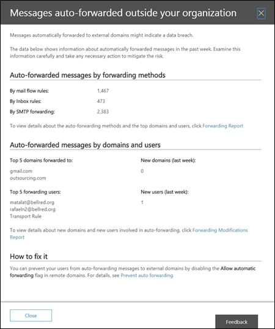

# Auto-forwarded messages report

The **Auto-forwarded messages** report in the mail flow dashboard displays information on messages that are automatically forwarded from your organization to recipients in external domains.

## Auto-forwarded messages details

When you click the number of messages in the widget, a flyout pane appears that shows the auto-forwarded message status. You can see the details by clicking the **Forwarding Report** link.

## Insights

Two insights are generated based on the report data: **New forwarding users** and **New forwarding domains**. Each insight provides a summary of the number of new forwarders or domains with a link to the **New Forwarding Report** that provides more detail for the two types of data. The **New Forwarding Report** also shows a timeline view of new activity and the details table identifies who started forwarding and to which domains.

## See also

For more information about other mail flow insights in the mail flow dashboard, see [Mail flow insights in the Security & Compliance Center](mail-flow-insights-v2.md).
