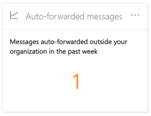
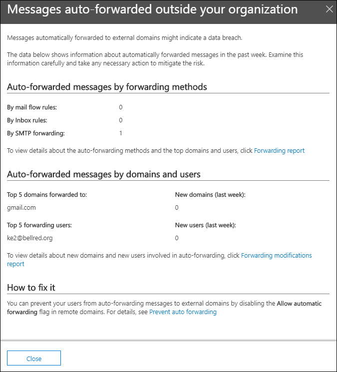

# Auto-forwarded messages insight in the Security & Compliance Center

[!INCLUDE [Microsoft 365 Defender rebranding](../includes/microsoft-defender-for-office.md)]

**Applies to**
- [Exchange Online Protection](exchange-online-protection-overview.md)
- [Microsoft Defender for Office 365 plan 1 and plan 2](office-365-atp.md)
- [Microsoft 365 Defender](../mtp/microsoft-threat-protection.md)

The **Auto-forwarded messages** insight in the [Mail flow dashboard](mail-flow-insights-v2.md) in the [Security & Compliance Center](https://protection.office.com) displays information about messages that are automatically forwarded from your organization to recipients in external domains.

## Auto-forwarded messages details

When you click the number of messages in the widget, a flyout pane appears that shows more information about the auto-forwarded messages:

- **Auto-forwarded messages by forwarding methods**:

  - **By mail flow rules**
  - **By Inbox rules**
  - **By SMTP forwarding**: This method indicates automatic forwarding that admins can configure on a mailbox as described in [Configure email forwarding for a mailbox](https://docs.microsoft.com/Exchange/recipients-in-exchange-online/manage-user-mailboxes/configure-email-forwarding).
  - A link to the [Forwarding report](view-mail-flow-reports.md#forwarding-report) for more details.

- **Auto-forwarded messages by domains and users**:

  - **Top 5 domains forwarded to**
  - **New domains (last week)**
  - **Top 5 forwarding users**
  - **New users (last week)**
  - A link to the [Forwarding modifications report](mfi-new-users-forwarding-email.md#forwarding-modifications-report) for more details.

## Insights

Two insights are generated based on the report data:

- [New users forwarding email](mfi-new-users-forwarding-email.md)
- [New domains being forwarded email](mfi-new-domains-being-forwarded-email.md)

## See also

For information about other insights in the Mail flow dashboard, see [Mail flow insights in the Security & Compliance Center](mail-flow-insights-v2.md).
