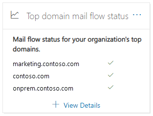
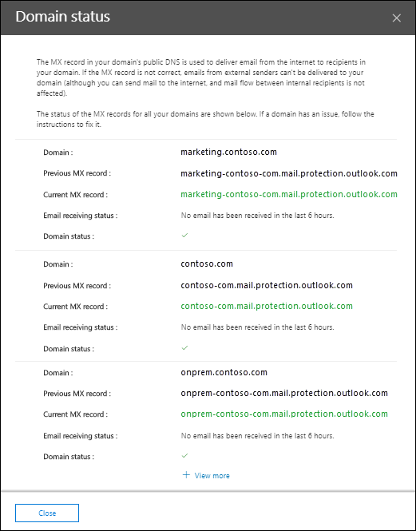

# Top domain mail flow status insight in the Security & Compliance Center

The **Top domain mail flow status** insight in the [Mail flow dashboard](mail-flow-insights-v2.md) in the Security & Compliance Center gives you the current status for your organization's domains in terms of mail flow. This insight helps you identify and troubleshoot domains that are experiencing ***mail flow impacting*** issues (for example, unable to receive external email), especially domain expirations or domains with incorrect MX records.

When you click **View details** in the widget, a **Domain status** flyout appears that shows you more details for the status of each domain:

- **Domain**
- **Previous MX record**
- **Current MX record**
- **Email receiving status**
- **Domain status**: A green check mark indicates the current MX record (at the time you clicked on the widget) matches the value we have on record, and that the domain has received email during the past two hours.

  A red X indicates the MX record has been changed, and that the domain has received no email during the past 6 hours. This likely indicates that your domain has expired, or that the MX record has been incorrectly updated. Check with your domain registrar or DNS hosting service to see if the domain has expired, or if the domain's MX record is incorrect.

You can click **View more** to see the same information for more domains.

## Related topics

For information about other insights in the Mail flow dashboard, see [Mail flow insights in the Security & Compliance Center](mail-flow-insights-v2.md).
