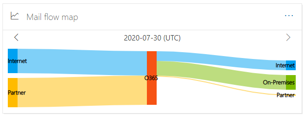
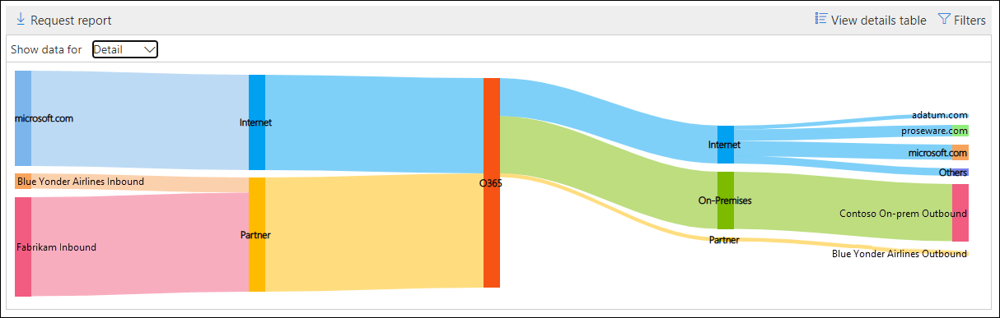
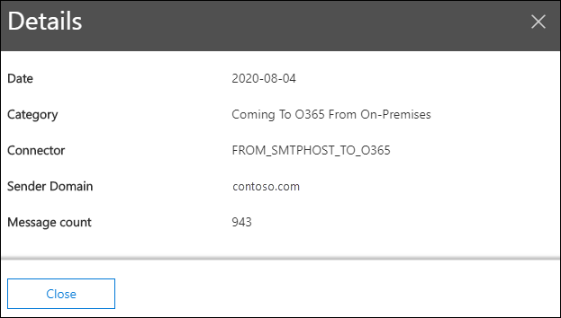

# Mail flow map in the Security & Compliance Center

[!INCLUDE [Microsoft 365 Defender rebranding](../includes/microsoft-defender-for-office.md)]

The **Mail flow map** in the [Mail flow dashboard](mail-flow-insights-v2.md) in the [Security & Compliance Center](https://protection.office.com) gives insight as to how mail flows through your organization. You can use this information to learn patterns, identify anomalies, and fix issues as they occur.

By default, the widget shows the mail flow pattern from the previous day in a chart known as a *Sankey* diagram. You can use the left arrow  and right arrow  to show information from different days. Each different color represents mail flow over a different inbound or outbound connector (or without using connectors). If you hover over a specific color, the number of messages is displayed for that type of connector.

## Report view for the Mail flow map

Clicking on the **Mail flow map** widget will take you to the **Mail flow map** report.

The following charts are available in the report view:

- **Show data for: Overview**: This is basically a larger view of the widget. If you hover over a specific color, the number of messages is displayed for that type of connector.

  

- **Show data for: Detail**: This view shows details about the connectors and destination domains. The top sender and recipient domains are listed, and the rest are put in **Others**. If you hover over a specific color and section, the number of messages is displayed.

  

If you click **Filters** in a report view, you can specify a date range with **Start date** and **End date**.

To email the report for a specific date range to one or more recipients, click **Request download**.

Related insights are shown beneath the Mail flow map if they're available (for example, the [Fix possible mail loop insight](mfi-mail-loop-insight.md)).

## Details table view for the Mail flow map

If you click **View details table** in a report view, the following information is shown:

- **Date**
- **Category**
- **Connector / Third-party service provider**
- **Sender/Recipient domain**
- **Message count**

If you click **Filters** in a details table view, you can specify a date range with **Start date** and **End date**.

If you select a row, similar details are shown in a flyout:

To email the report for a specific date range to one or more recipients, click **Request download**.

To go back to the reports view, click **View report**.

## See also

For information about other insights in the Mail flow dashboard, see [Mail flow insights in the Security & Compliance Center](mail-flow-insights-v2.md).
