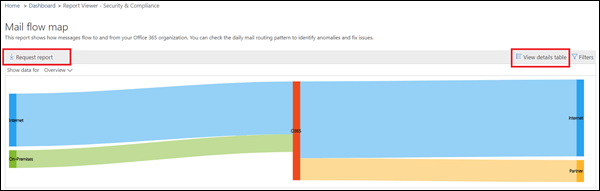
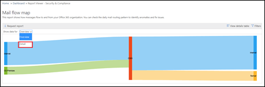
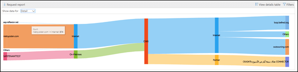

# Mail flow map report

This report gives insights as to how mail flows through your organization. You can use this information to learn patterns, identify anomalies, and fix issues as they arise.

## Mail flow map widget

By default, the mail flow map shows the high level mail flow pattern from the previous day. You can use the left and right arrows for different days. Hovering your mouse cursor over each area in the report will show the volume of mail to and from your organization as shown in the following diagram:

## Overview

Clicking on the **Mail flow map** widget will take you to the **Mail flow map** report. Here you can see more granular level of report, you can click View details table to see detailed data. You can also download the detailed report by clicking Request report.

## Details

By default, **Show data for** is set to the value **Overview**. When you click on the drop down and select **Detail**, the view switches to the domain level detail.

The top sender and recipient domains are listed, and the rest will be put in **Others** as shown in the following diagrams:

## Related insights

Related insights are shown beneath the Mail flow map if they're available (for example, the Sender domain insight or the Mail loop insight).

## See also

For more information about other mail flow insights in the mail flow dashboard, see [Mail flow insights in the Security & Compliance Center](mail-flow-insights-v2.md).
