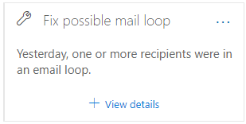
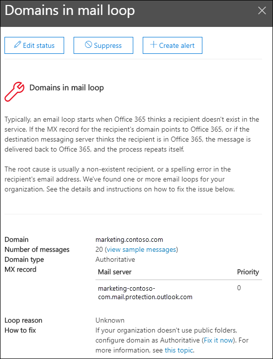

# Fix possible mail loop insight in the Security & Compliance Center

[!INCLUDE [Microsoft 365 Defender rebranding](../includes/microsoft-defender-for-office.md)]

Mail loops are bad because:

- They waste system resources.
- They consume your organization's mail volume quota.
- They send confusing non-delivery reports (also known as NDRs or bounce messages) to the original message senders.

The **Fix possible mail loop** insight in the **Recommended for you** area of the [Mail flow dashboard](mail-flow-insights-v2.md) in the [Security & Compliance Center](https://protection.office.com) notifies you when a mail loop is detected in your organization.

This insight appears only after the condition is detected (if you don't have any mail loops, you won't see the insight).

When you click **View details** on the widget, a flyout appears with more information:

- **Domain**
- **Number of messages**: You can click **View sample messages** to see the [message trace](message-trace-scc.md) results for a sample of the messages that were affected by the loop.
- **Domain type**" For example, Authoritative or Non-authoritative.
- **MX record**: The host (**Mail server**) and **Priority** values of the MX record for the domain.
- **Loop reason** and **How to fix**: We'll identify the most common mail loop scenarios and provide recommended actions to fix the loop.

## See also

For information about other insights in the Mail flow dashboard, see [Mail flow insights in the Security & Compliance Center](mail-flow-insights-v2.md).
