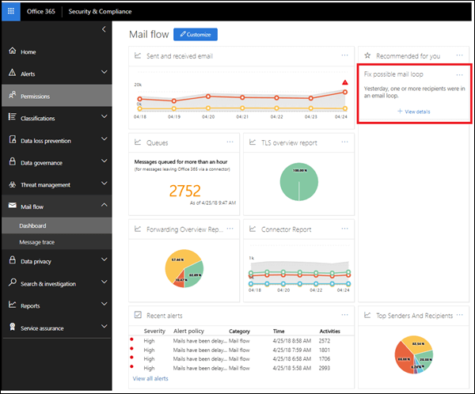
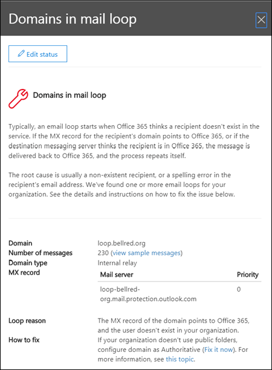

# Mail loop insight

A mail loop is bad because it wastes system resources, consumes your organization's mail volume quota, and sends confusing non-delivery reports (also known as NDRs or bounce messages) to the original senders. This insight reports when a mail loop is found in your organization, the email domains that are involved in the loop, and the number of messages from the previous day that were in the loop.

You can click **View details** to see the details in a flyout pane. We also identify the most common loop scenarios and provide the recommended actions (if available) to fix the loop.

## See also

For more information about other mail flow insights in the mail flow dashboard, see [Mail flow insights in the Security & Compliance Center](mail-flow-insights-v2.md).
