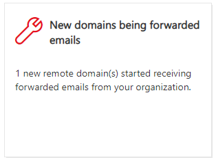
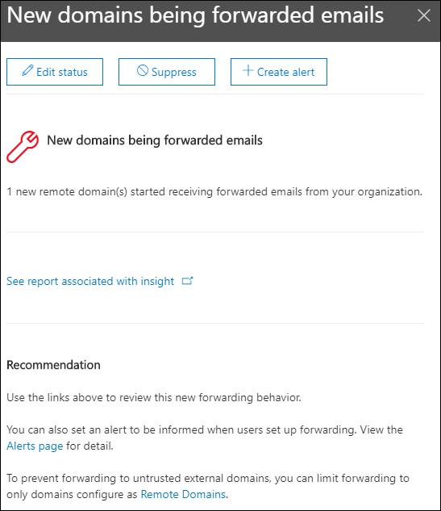

# New domains being forwarded email insight in the Security & Compliance Center

[!INCLUDE [Microsoft 365 Defender rebranding](../includes/microsoft-defender-for-office.md)]

**Applies to**
- [Exchange Online Protection](exchange-online-protection-overview.md)
- [Microsoft Defender for Office 365 plan 1 and plan 2](defender-for-office-365.md)
- [Microsoft 365 Defender](../defender/microsoft-365-defender.md)

There are valid business reasons to forward email messages to external recipients in specific domains. However, it's suspicious when users in your organization suddenly start forwarding messages to a domain where no one in your organization has ever forwarded messages to (a new domain).

This condition might indicate that the user accounts are compromised. If you suspect the accounts have been compromised, see [Responding to a compromised email account](responding-to-a-compromised-email-account.md).

The **New domains being forwarded email** insight in the [Security & Compliance Center](https://protection.office.com) notifies you when users in your organization are forwarding messages to new domains.

This insight appears only when the issue is detected, and it appears on the [Forwarding report](view-mail-flow-reports.md#forwarding-report) page.

When you click on the widget, a flyout appears where you can find more details about the forwarded messages, including a link back to the [Forwarding report](view-mail-flow-reports.md#forwarding-report).

You can also get to this details page when you select the insight after you click **View all** in the **Top insights & recommendations** area on (**Reports** \> **Dashboard** or <https://protection.office.com/insightdashboard>).

To prevent automatic message forwarding to external domains, configure a remote domain for some or all external domains. For more information, see [Manage remote domains in Exchange Online](/Exchange/mail-flow-best-practices/remote-domains/manage-remote-domains).

## Related topics

For information about other insights in the Mail flow dashboard, see [Mail flow insights in the Security & Compliance Center](mail-flow-insights-v2.md).