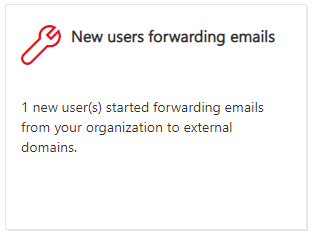
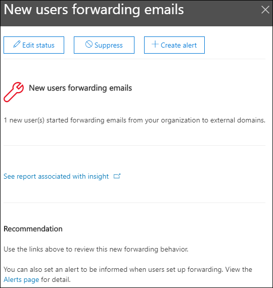
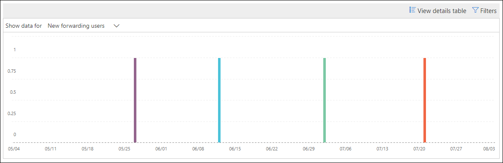
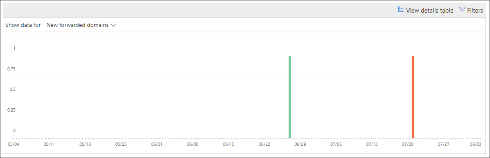

# New users forwarding email insight in the Security & Compliance Center

[!INCLUDE [Microsoft 365 Defender rebranding](../includes/microsoft-defender-for-office.md)]

It's suspicious when new user accounts in your organization suddenly start forwarding email messages to external domains.

The **New domains being forwarded email** insight in the [Security & Compliance Center](https://protection.office.com) notifies you when newly-created users in your organization are forwarding messages to external domains. This condition could indicate compromised admin accounts were used to create the new users. If you suspect the accounts have been compromised, see [Responding to a compromised email account](responding-to-a-compromised-email-account.md).

This insight appears only when the issue is detected, and it appears on the [Forwarding report](view-mail-flow-reports.md#forwarding-report) page.

When you click on the widget, a flyout appears where you can find more details about the forwarded messages, including a link to the [Forwarding modifications report](#forwarding-modifications-report) as described later in this article.

You can also get to this details page when you select the insight after you click **View all** in the **Top insights & recommendations** area on (**Reports** \> **Dashboard** or <https://protection.office.com/insightdashboard>).

You can click the **See report associated with insight** link to go to the **Forwarding modifications report** as described in the next section.

## Forwarding modifications report

The **Forwarding modifications report** shows details about messages that are being automatically forwarded from senders in your organization:

- Newly-created accounts that are forwarding messages to external domains.
- Accounts that are forwarding messages to external domains that have never been forwarded to by other senders in your organization.

These types of forwarded messages can pose a security or compliance risk, and might indicate compromised accounts.

The report contains data for up to 90 days. By default, the report shows data for the last 7 days.

This report isn't directly available in the [Mail flow dashboard](mail-flow-insights-v2.md) or in the [Reports dashboard](view-mail-flow-reports.md). In addition to clicking the **See report associated with insight** link in the **New users forwarding email** insight, you get to the report by:

- Clicking the **Forwarding notifications report** link in the details of the [New domains being forwarded email insight](mfi-new-domains-being-forwarded-email.md).
- Opening <https://protection.office.com/reportv2?id=MailFlowNewForwarding>.

### Report view for the Forwarding modifications report

The following charts are available in the report view:

- **Show data for: New forwarding users**:

  

- **Show data for: New forwarding domains**:

  

If you click **Filters** in a report view, you can specify a date range with **Start date** and **End date**.

### Details table view for the Forwarding modifications report

If you click **View details table**, the information that's shown depends on the chart you were looking at:

- **Show data for: New forwarding users**:

  - **Name**: The email address of the sender.
  - **Forwarding type**
  - **Recipient address**
  - **Details**
  - **Count**
  - **First forward date**

- **Show data for: New forwarding domains**:

  - **Name**: The email domain of the sender.
  - **Forwarding type**
  - **Recipient address**
  - **Details**
  - **Count**
  - **First forward date**

If you click **Filters** in a details table view, you can specify a date range with **Start date** and **End date**.

If you select a row from the table, a **Details** flyout appears with the following information:

- **Name**: This is either the sender's email address (from **Show data for: New forwarding users** view) or the sender's email domain (from **Show data for: New forwarding domains** view).
- **Forwarding type**
- **Recipient**
- **Details**
- **Count**
- **Start date**
- **Recommendation**: From here, you can click the link to manage the user in the Microsoft 365 admin center.

To go back to the reports view, click **View report**.

## Related topics

For information about other insights in the Mail flow dashboard, see [Mail flow insights in the Security & Compliance Center](mail-flow-insights-v2.md).
