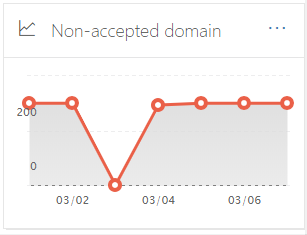
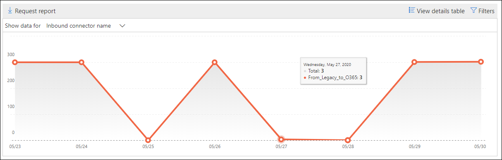
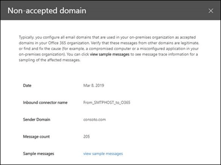

# Non-accepted domain report in the Security & Compliance Center

[!INCLUDE [Microsoft 365 Defender rebranding](../includes/microsoft-defender-for-office.md)]

**Applies to**
- [Exchange Online Protection](exchange-online-protection-overview.md)
- [Microsoft Defender for Office 365 plan 1 and plan 2](defender-for-office-365.md)
- [Microsoft 365 Defender](../defender/microsoft-365-defender.md)

The **Non-accepted domain** report in the [Mail flow dashboard](mail-flow-insights-v2.md) in the [Security & Compliance Center](https://protection.office.com) displays information about messages from your on-premises email organization where the sender's domain isn't configured as an accepted domain in your Microsoft 365 organization.

Microsoft 365 might throttle these messages if we have data to prove that the intent of these messages is malicious. Therefore, it's important for you to understand what's happening and to fix the issue.

## Report view for the Non-accepted domain report

Clicking the chart on the **Non-accepted domain** widget will take you to the **Non-accepted domain** report.

By default, the activity for all affected connectors is shown. If you click **Show data for**, you can select a specific connector from the dropdown.

If you hover over a data point (day) in the chart, you'll see the total number of messages for the connector.

## Details table view for the Non-accepted domain report

If you click **View details table** in a report view, the following information is shown:

- **Date**
- **Inbound connector name**
- **Sender domain**
- **Message count**
- **Sample messages**: The message IDs of a sample of affected messages.

If you click **Filters** in a details table view, you can specify a date range with **Start date** and **End date**.

To email the report for a specific date range to one or more recipients, click **Request download**.

When you select a row in the table, a flyout appears with the following information:

- **Date**
- **Inbound connector name**
- **Sender domain**
- **Message count**
- **Sample messages**: You can click **View sample messages** to see the [message trace](message-trace-scc.md) results for a sample of the affected messages.

To go back to the reports view, click **View report**.

## Related topics

For information about other insights in the Mail flow dashboard, see [Mail flow insights in the Security & Compliance Center](mail-flow-insights-v2.md).
