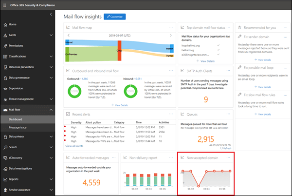

# Non-accepted domain report

Similar to the **Sender domain** insight, the **Non-accepted domain** insight identifies messages from your on-premises email organization, but the sender's domain isn't configured as an accepted domain in your Office 365 organization.

Office 365 might throttle these messages if we have data to prove that the intent of these messages is malicious. Therefore, it's important for you to understand what's happening and to fix the issue.

When you click on the widget, you're taken to the full report. In the full report, where you can click **View details** to view the information in a table as shown in the following diagram:

When you select a row in the table, a flyout will show you more details. You can click **view sample messages** to see some of the identified messages.

## See also

For more information about other mail flow insights in the mail flow dashboard, see [Mail flow insights in the Security & Compliance Center](mail-flow-insights-v2.md).
