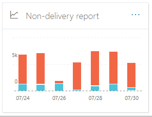
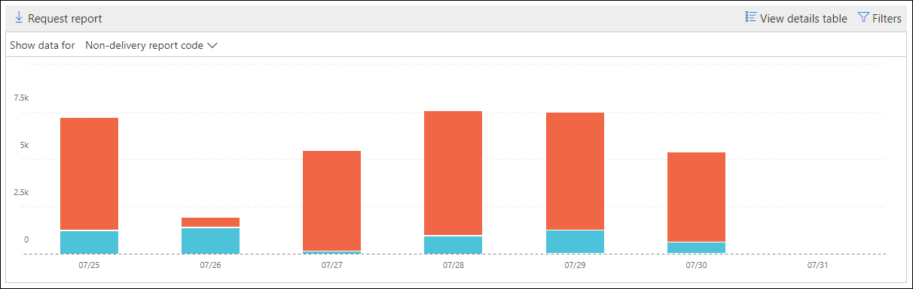

# Non-delivery report in the Security & Compliance Center

[!INCLUDE [Microsoft 365 Defender rebranding](../includes/microsoft-defender-for-office.md)]

The **Non-delivery report** in the [Mail flow dashboard](mail-flow-insights-v2.md) in the [Security & Compliance Center](https://protection.office.com) shows the most-encountered error codes in non-delivery reports (also known as NDRs or bounce messages) for users in your organization. This report shows the details of NDRs so you can troubleshoot email delivery problems.

## Report view for the Non-delivery report

Clicking on the **Non-delivery report** widget will take you to the **Non-delivery report**.

By default, the activity for all error codes is shown. If you click **Show data for**, you can select a specific error code from the dropdown.

If you hover over a specific color (error code) on a specific day in the chart, you'll see the total number of messages for the error.

## Details table view for the Non-delivery report

If you click **View details table** in a report view, the following information is shown:

- **Date**
- **Non-delivery report code**
- **Count**
- **Sample messages**: The message IDs of a sample of affected messages.

If you click **Filters** in a details table view, you can specify a date range with **Start date** and **End date**.

To email the report for a specific date range to one or more recipients, click **Request download**.

When you select a row in the table, a flyout appears with the following information:

- **Date**
- **Non-delivery report code**: You can click on the link to find for more information about the causes and solutions for the specific error code.
- **Count**
- **Sample messages**: You can click **View sample messages** to see the [message trace](message-trace-scc.md) results for a sample of the affected messages.

## Related topics

For information about other insights in the Mail flow dashboard, see [Mail flow insights in the Security & Compliance Center](mail-flow-insights-v2.md).
