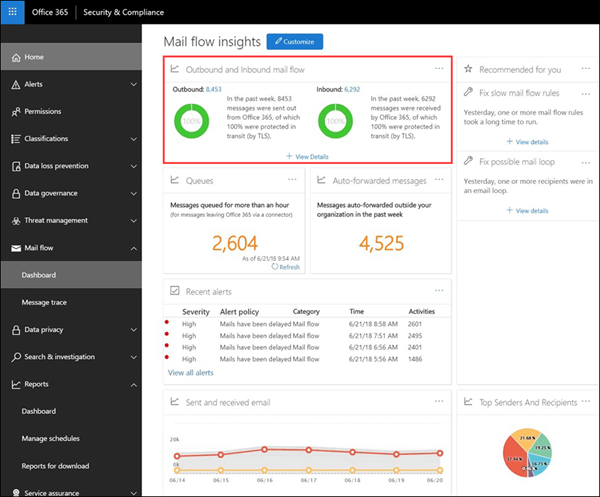

# Outbound and inbound mail flow

The **Outbound and inbound mail flow** widget combines the information from the **Connector Report** and the former **TLS Overview Report** in one place.

The information in the widget is related to connectors and TLS message protection in Office 365. For more information, see these topics:

- [Configure mail flow using connectors in Office 365](https://docs.microsoft.com/exchange/mail-flow-best-practices/use-connectors-to-configure-mail-flow/use-connectors-to-configure-mail-flow)

- [How Exchange Online uses TLS to secure email connections in Office 365](https://docs.microsoft.com/microsoft-365/compliance/exchange-online-uses-tls-to-secure-email-connections)

## Message protected in transit (by TLS)

The **Outbound and inbound mail flow** widget displays the TLS encryption that's used for the connection when messages are delivered to and from your Office 365 organization. The connections that are established with other email services are encrypted by TLS when TLS is offered by both sides. The widget offers a snapshot of the last week of mail flow. When you click **View Details**, the **Message protected in transit (by TLS)** flyout shows you the TLS protection for messages entering and leaving your organization.

Currently, TLS 1.2 is the most secure version of TLS that's offered by Office 365. Often, you'll need to know the TLS encryption that's being used for compliance audits. You probably don't have a direct relationship with most of the source and destination email servers (you don't own them, and neither does Microsoft), so you don't have many options to improve the TLS encryption that's used by those servers.

But, you can use [connectors](https://docs.microsoft.com/exchange/mail-flow-best-practices/use-connectors-to-configure-mail-flow/use-connectors-to-configure-mail-flow) to ensure the best available TLS protection for messages that are sent between your email servers and Office 365. Mail flow between Office 365 and your own email servers or servers that belong to your partners is often more important and sensitive than regular messages, so you'll want to apply extra security and vigilance to those messages. You can upgrade or fix your own email servers to improve the TLS encryption that's being used, or reach out to your partners to do the same. The **Connector Report** displays both mail flow volume and TLS encryption for messages that use your Office 365 connectors.

## Connector report

When you click on the **Connector Report** link from the **Message protected in transit (by TLS)** flyout, the report displays information about messages that are delivered to and from your Office 365 organization using connectors. You use connectors between your own email servers and Office 365 or your partner's servers and Office 365. The message volume for each connector and the TLS encryption for the connection is available. In addition, you can also view data for messages that were sent or received in Office 365 without using a connector.

The **Mail Flow** view shows the volume of messages through the connector for the past week. You can change the date range by selecting **Filter** where you can increase the range to a maximum of 30 days. The **All Mail Flow** view shows all mail flow to and from your Office 365 organization through all connectors. You can select a specific connector by name in the drop down menu.

You can select the **TLS usage** view from the drop down to see the breakdown of TLS protection for messages through the connector. As with the **TLS Overview Report** report, this view shows the percentage of the different TLS versions. For TLS 1.0 connections, you really need to get your email server or your partner's server upgraded or fixed to avoid any issues when TLS 1.0 support is eventually deprecated in Office 365. For more information, see [Technical reference details about encryption in Office 365](https://docs.microsoft.com/microsoft-365/compliance/technical-reference-details-about-encryption).

Insights point to connectors to help draw your attention to potential TLS encryption problems for the connector. The insights are: **No TLS is over 25%** or **TLS 1.0 is above 50%**. If you see these insights, you need to investigate your email servers that are associated with the connector, or reach out to your partner organization.

## See also

For more information about other mail flow insights in the mail flow dashboard, see [Mail flow insights in the Security & Compliance Center](mail-flow-insights-v2.md).
