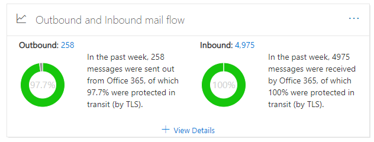
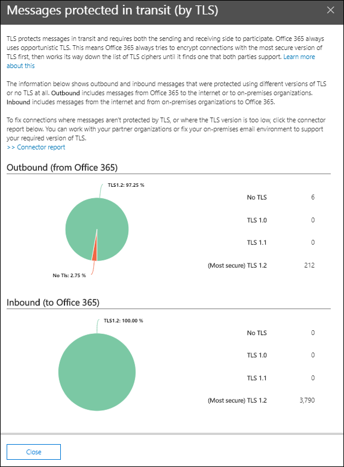

# Outbound and inbound mail flow insight in the Security & Compliance Center

[!INCLUDE [Microsoft 365 Defender rebranding](../includes/microsoft-defender-for-office.md)]

**Applies to**
- [Exchange Online Protection](exchange-online-protection-overview.md)
- [Microsoft Defender for Office 365 plan 1 and plan 2](office-365-atp.md)
- [Microsoft 365 Defender](../mtp/microsoft-threat-protection.md)

The **Outbound and inbound mail flow** insight in the [Mail flow dashboard](mail-flow-insights-v2.md) in the [Security & Compliance Center](https://protection.office.com) combines the information from the [Connector report](view-mail-flow-reports.md#connector-report) and the former **TLS overview report** in one place.

The widget displays the TLS encryption that's used for the connection when messages are delivered to and from your organization. The connections that are established with other email services are encrypted by TLS when TLS is offered by both sides. The widget offers a snapshot of the last week of mail flow.

The information in the widget is related to connectors and TLS message protection in Microsoft 365. For more information, see these topics:

- [Configure mail flow using connectors](/exchange/mail-flow-best-practices/use-connectors-to-configure-mail-flow/use-connectors-to-configure-mail-flow)
- [How Exchange Online uses TLS to secure email connections](../../compliance/exchange-online-uses-tls-to-secure-email-connections.md)
- [Technical reference details about encryption in Microsoft 365](../../compliance/technical-reference-details-about-encryption.md)

## Message protected in transit (by TLS)

When you click **View Details** on the widget, the **Message protected in transit (by TLS)** flyout shows you the TLS protection for messages entering and leaving your organization.

Currently, TLS 1.2 is the most secure version of TLS that's offered by Microsoft 365. Often, you'll need to know the TLS encryption that's being used for compliance audits. You probably don't have a direct relationship with most of the source and destination email servers (you don't own them, and neither does Microsoft), so you don't have many options to improve the TLS encryption that's used by those servers.

But, you can use [connectors](/exchange/mail-flow-best-practices/use-connectors-to-configure-mail-flow/use-connectors-to-configure-mail-flow) to ensure the best available TLS protection for messages that are sent between your email servers and Microsoft 365. Mail flow between Microsoft 365 and your own email servers or servers that belong to your partners is often more important and sensitive than regular messages, so you'll want to apply extra security and vigilance to those messages.

You can upgrade or fix your own email servers to improve the TLS encryption that's being used, or reach out to your partners to do the same. The **Connector Report** displays both mail flow volume and TLS encryption for messages that use your Microsoft 365 connectors.

You can click the **Connector report** link to go to the [Connector report](view-mail-flow-reports.md#connector-report). The following insights might be available on the **Connector report** page if the associated condition has been detected:

- **Inbound Partner connector seeing significant TLS1.0 mail flow**
- **Inbound OnPremises connector seeing significant TLS1.0 mail flow**

For TLS 1.0 connections, you really need to get your email server or your partner's server upgraded or fixed to avoid any issues when TLS 1.0 support is eventually deprecated in Microsoft 365.

## See also

For information about other insights in the Mail flow dashboard, see [Mail flow insights in the Security & Compliance Center](mail-flow-insights-v2.md).