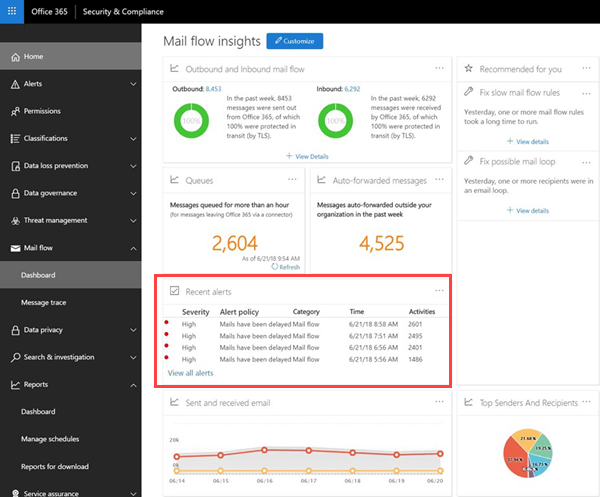
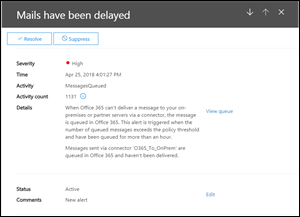
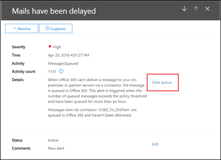
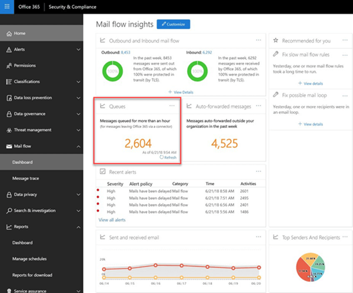

# Queue alerts and Queues

## Queue alerts

When messages can't be sent from your Office 365 organization to your on-premises or partner email servers using connectors, the messages are queued in Office 365. Common examples that cause this condition are:

- The connector is incorrectly configured.

- There have been networking or firewall changes in your on-premises environment.

Office 365 will continue to retry to delivery for 24 hours. After 24 hours, the messages will expire and will be returned to the senders in non-delivery reports (also known as a NDRs or bounce messages).

If the queued email volume exceeds the pre-defined threshold (the default value is 2000 messages), the alerts will be available in the mail flow dashboard at **Recent alerts**, and admins will receive an email notification (to their alternative email address). To configure the alert threshold, daily notification limit, and/or recipients of the alert, see the **Customize queue alerts** section below.

## Customize queue alerts

Mail flow insights create an alert policy named **Messages have been delayed** (the **Send email notifications** check box in the example screen shot below) found in **Alerts** \> **Alert Policies**. You can modify the threshold and alert recipients by clicking on the policy.

You'll see a new policy information blade, you can now click **Edit Policy**.

The information blade will change to the **Edit Policy**. You can now change the recipients for the alert email, the limit on the number of notifications sent per day, and the minimum threshold to trigger the alert (200 or more).

## Queue alert details

When you click the alert, the alert details appear in a flyout pane.

You can click **View queue** in the alert details to see the queue details, problems, and links to the available fixes in a new flyout pane.

## Queues

Even if the queued message volume hasn't exceeded the threshold, you can still use the **Queues** area of the mail flow dashboard to see messages that have been queued for more than one hour. You can use the **Queues** area to monitor the number of queued messages (the value 0 indicates mail flow is OK) and take action before the number of queued messages becomes too large.

When you click the number of queued messages in **Queues**, the queue details and guidance for how to fix the issue will appear in a flyout pane (the same flyout that appears after you click **View queue** in the details of a queue alert).

## See also

For more information about other mail flow insights in the mail flow dashboard, see [Mail flow insights in the Security & Compliance Center](mail-flow-insights-v2.md).
