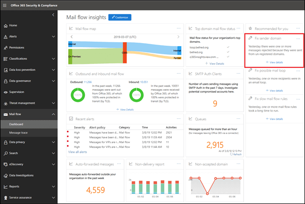

# Fix sender domain insight

Office 365 requires messages sending from internal on-premises email environments to Office 365 to meet certain security criteria:

- You've created an inbound connector in Office 365 to authenticate SMTP connections from your on-premises email server by using the source IP address or a certificate.

- You've configured your on-premises email server to relay email via Office 365 to external world.

- In your configuration, one of the following statements is true:

  - The sender's email domain is registered in your Office 365 organization. For more information, see Add Domains in Office 365.

  - Your on-premises email server is configured to use a certificate to send email to Office 365, the certificate contains or exactly matches a domain name that you've registered in Office 365, and you've created a certificate based connector in Office 365 with that domain. 

Messages that don't meet the criteria will not be attributed to the organization and could be rejected.

The **Fix sender domain** insight shows you email from your on-premises environment that doesn't meet the criteria, helps you to identify potentially compromised machines and user accounts in your on-premises email environment, and helps you to take remediation actions.

When you click **View details**, you are taken to another widget with more details as shown in the following diagram:

You'll see the inbound connector that was used to deliver the messages to Office 365. You can also click **view sample message IDs** to see details for the messages that were sent from your on-premises email environment. Because these messages were rejected by Office 365, you can't use message trace, but you can use the sample message ids to track the messages in your on-premises email environment.

## See also

For more information about other mail flow insights in the mail flow dashboard, see [Mail flow insights in the Security & Compliance Center](mail-flow-insights-v2.md).
