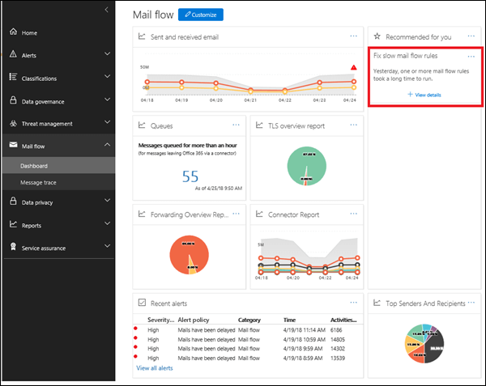
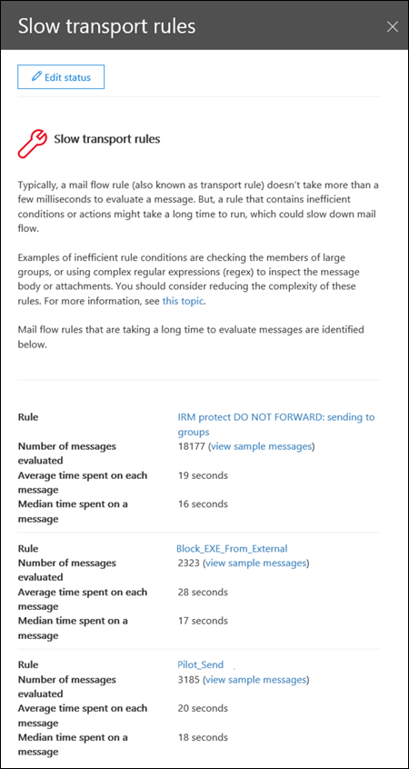

# Slow mail flow rules insight

Inefficient mail flow rules (also known as transport rules) can lead to mail flow delays for your organization. This insight reports mail flow rules that have an impact on your organization's mail flow. Examples of these types of rules are:

- Conditions that use **Is member of** for large groups.

- Conditions that use complex regular expression (regex) pattern matching.

- Conditions that use content checking in attachments.

The insight will help you to identify and fine-tune mail flow rules to help reduce mail flow delays.

When you click **View details**, a flyout pane appears where you can review the rule. In the flyout pane, can also click **view sample messages** to see what kind of messages are impacted by the rule.

## See also

For more information about other mail flow insights in the mail flow dashboard, see [Mail flow insights in the Security & Compliance Center](mail-flow-insights-v2.md).
