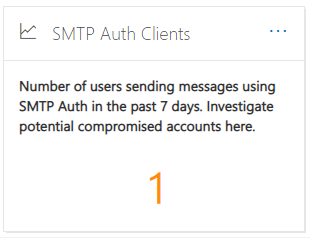
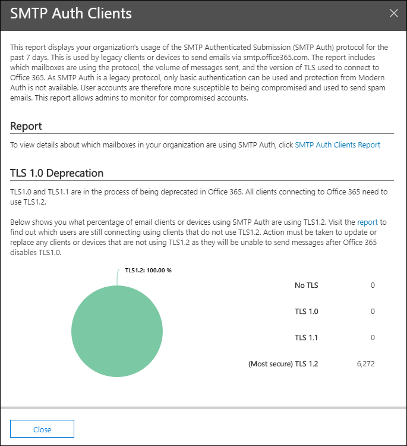
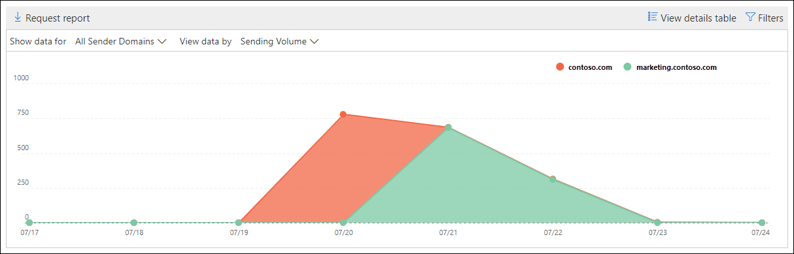
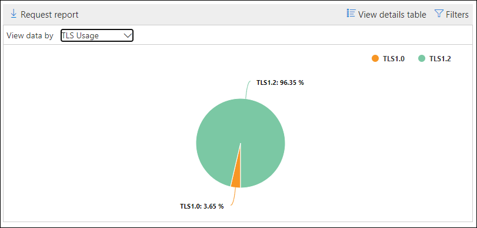
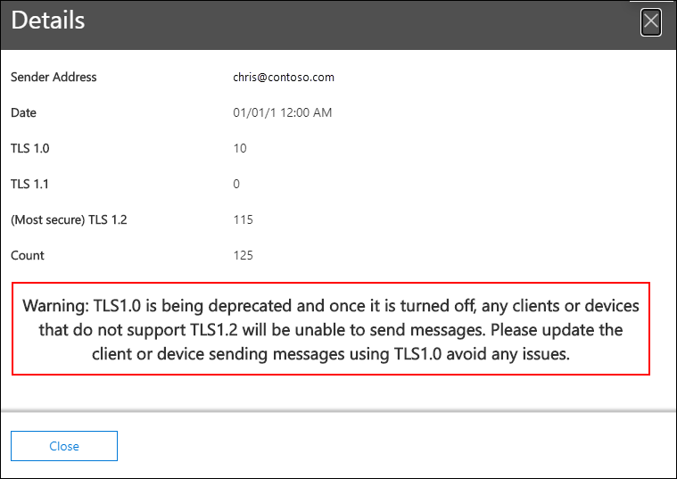

# SMTP Auth clients insight and report in the Security & Compliance Center

[!INCLUDE [Microsoft 365 Defender rebranding](../includes/microsoft-defender-for-office.md)]

**Applies to**
- [Exchange Online Protection](exchange-online-protection-overview.md)
- [Microsoft Defender for Office 365 plan 1 and plan 2](defender-for-office-365.md)
- [Microsoft 365 Defender](../mtp/microsoft-threat-protection.md)

The **SMTP Auth clients** insight in the [Mail flow dashboard](mail-flow-insights-v2.md) and the associated [SMTP Auth clients report](#smtp-auth-clients-report) in the [Security & Compliance Center](https://protection.office.com) highlight the use of the SMTP AUTH client submission protocol by users or system accounts in your organization. This legacy protocol (which uses the endpoint smtp.office365.com) only offers Basic authentication, and is susceptible to being used by compromised accounts to send email. The insight and report allow you to check for unusual activity for SMTP AUTH email submissions. It also shows the TLS usage data for clients or devices using SMTP AUTH.

The widget indicates the number of users or service accounts that have used the SMTP Auth protocol in the last 7 days.

If you click the number of messages on the widget, an **SMTP Auth clients** flyout appears. The flyout provides an aggregated view of the TLS usage and volumes for the last week.

You can click the **SMTP Auth clients report** link to go to the SMTP Auth clients report as described in the next section.

## SMTP Auth clients report

### Report view for the SMTP Auth clients report

By default, the report shows data for the last 7 days, but data is available for the last 90 days.

The overview section contains the following charts:

- **View data by: Sending volume**: By default, the chart shows the number of SMTP Auth client messages that were sent from all domains (**Show data for: All sender domains** is selected by default). You can filter the results to a specific sender domain by clicking **Show data for** and selecting the sender domain from the dropdown list. If you hover a specific data point (day), the number of messages is shown.

  

- **View data by: TLS Usage**: The chart shows the percentage of TLS usage for all SMTP Auth client messages during the selected time period. This chart allows you to identify and take action on users and system accounts that are still using older versions of TLS.

  

If you click **Filters** in a report view, you can specify a date range with **Start date** and **End date**.

Click **Request report** to receive a more detailed version of the report in an email message. You can specify the date range and the recipients to receive the report.

### Details table view for the SMTP Auth clients report

If you click **View details table**, the information that's shown depends on the chart you were looking at:

- **View data by: Sending volume**: The following information is shown in a table:

  - **Sender address**
  - **Message count**

  If you select a row, the same details are shown in a flyout.

- **View data by: TLS Usage**: The following information is shown in a table:

  - **Sender address**
  - **TLS1.0%**\*
  - **TLS1.1%**\*
  - **TLS1.2%**\*
  - **Message count**

  \* This column shows both the percentage and number of messages from the sender.

If you click **Filters** in a details table view, you can specify a date range with **Start date** and **End date**.

If you select a row, similar details are shown in a flyout:

Click **Request report** to receive a more detailed version of the report in an email message. You can specify the date range and the recipients to receive the report.

To go back to the reports view, click **View report**.

## Related topics

For information about other insights in the Mail flow dashboard, see [Mail flow insights in the Security & Compliance Center](mail-flow-insights-v2.md).
