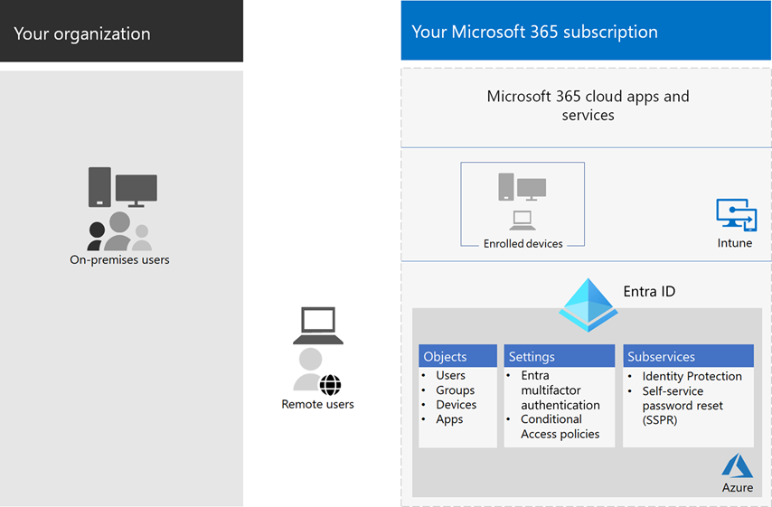

# Identity and device access configurations

**Applies to**
- [Exchange Online Protection](exchange-online-protection-overview.md)
- [Microsoft Defender for Office 365 plan 1 and plan 2](defender-for-office-365.md)

The modern security perimeter of your organization now extends beyond your network to include users accessing cloud-based apps from any location with a variety of devices. Your security infrastructure needs to determine whether a given access request should be granted and under what conditions.

This determination should be based on the user account of the sign-in, the device being used, the app the user is using for access, the location from which the access request is made, and an assessment of the risk of the request. This capability helps ensure that only approved users and devices can access your critical resources.

This series of articles describes a set of identity and device access prerequisite configurations and a set of Azure Active Directory (Azure AD) Conditional Access, Microsoft Intune, and other policies to secure access to Microsoft 365 for enterprise cloud apps and services, other SaaS services, and on-premises applications published with Azure AD Application Proxy.

Identity and device access settings and policies are recommended in three tiers: baseline protection, sensitive protection, and protection for environments with highly regulated or classified data. These tiers and their corresponding configurations provide consistent levels of protection across your data, identities, and devices.

These capabilities and their recommendations:

- Are supported in Microsoft 365 E3 and Microsoft 365 E5.
- Are aligned with [Microsoft Secure Score](https://docs.microsoft.com/microsoft-365/security/defender/microsoft-secure-score) as well as [identity score in Azure AD](/azure/active-directory/fundamentals/identity-secure-score), and will increase these scores for your organization.
- Will help you implement these [five steps to securing your identity infrastructure](/azure/security/azure-ad-secure-steps).

If your organization has unique environment requirements or complexities, use these recommendations as a starting point. However, most organizations can implement these recommendations as prescribed.

Watch this video for a quick overview of identity and device access configurations for Microsoft 365 for enterprise.
 
 
> [!VIDEO https://www.microsoft.com/videoplayer/embed/RWxEDQ]

> [!NOTE]
> Microsoft also sells Enterprise Mobility + Security (EMS) licenses for Office 365 subscriptions. EMS E3 and EMS E5 capabilities are equivalent to those in Microsoft 365 E3 and Microsoft 365 E5. See [EMS plans](https://www.microsoft.com/microsoft-365/enterprise-mobility-security/compare-plans-and-pricing) for the details.

## Intended audience

These recommendations are intended for enterprise architects and IT professionals who are familiar with Microsoft 365 cloud productivity and security services, which includes Azure AD (identity), Microsoft Intune (device management), and Azure Information Protection (data protection).

### Customer environment

The recommended policies are applicable to enterprise organizations operating both entirely within the Microsoft cloud and for customers with hybrid identity infrastructure, which is an on-premises Active Directory Domain Services (AD DS) forest that is synchronized with an Azure AD tenant.

Many of the provided recommendations rely on services available only with Microsoft 365 E5, Microsoft 365 E3 with the Identity & Threat Protection add-on, EMS E5, or Azure Premium P2 licenses.

For those organizations who do not have these licenses, Microsoft recommends you at least implement [security defaults](/azure/active-directory/fundamentals/concept-fundamentals-security-defaults), which is included with all Microsoft 365 plans.

### Caveats

Your organization may be subject to regulatory or other compliance requirements, including specific recommendations that may require you to apply policies that diverge from these recommended configurations. These configurations recommend usage controls that have not historically been available. We recommend these controls because we believe they represent a balance between security and productivity.

We've done our best to account for a wide variety of organizational protection requirements, but we're not able to account for all possible requirements or for all the unique aspects of your organization.

## Three tiers of protection

Most organizations have specific requirements regarding security and data protection. These requirements vary by industry segment and by job functions within organizations. For example, your legal department and administrators might require additional security and information protection controls around their email correspondence that are not required for other business units.

Each industry also has their own set of specialized regulations. Rather than providing a list of all possible security options or a recommendation per industry segment or job function, recommendations have been provided for three different tiers of security and protection that can be applied based on the granularity of your needs.

- **Baseline protection**: We recommend you establish a minimum standard for protecting data, as well as the identities and devices that access your data. You can follow these baseline recommendations to provide strong default protection that meets the needs of many organizations.
- **Sensitive protection**: Some customers have a subset of data that must be protected at higher levels, or they may require all data to be protected at a higher level. You can apply increased protection to all or specific data sets in your Microsoft 365 environment. We recommend protecting identities and devices that access sensitive data with comparable levels of security.
- **Highly regulated**: Some organizations may have a small amount of data that is highly classified, constitutes trade secrets, or is regulated data. Microsoft provides capabilities to help organizations meet these requirements, including added protection for identities and devices.

This guidance shows you how to implement protection for identities and devices for each of these tiers of protection. Use this guidance as a starting point for your organization and adjust the policies to meet your organization's specific requirements.

It's important to use consistent levels of protection across your data, identities, and devices. For example, if you implement this guidance, be sure to protect your data at comparable levels.

The **Identity and device protection for Microsoft 365** architecture model shows you which capabilities are comparable.

   [View as a PDF](../../downloads/MSFT_cloud_architecture_identity&device_protection.pdf) \| [Download as a PDF](https://github.com/MicrosoftDocs/microsoft-365-docs/raw/public/microsoft-365/downloads/MSFT_cloud_architecture_identity&device_protection.pdf)  \| [Download as a Visio](https://github.com/MicrosoftDocs/microsoft-365-docs/raw/public/microsoft-365/downloads/MSFT_cloud_architecture_identity&device_protection.vsdx)

Additionally, see the [Deploy information protection for data privacy regulations](../../solutions/information-protection-deploy.md) solution to protect information stored in Microsoft 365.

## Security and productivity trade-offs

Implementing any security strategy requires trade-offs between security and productivity. It's helpful to evaluate how each decision affects the balance of security, functionality, and ease of use.

The recommendations provided are based on the following principles:

- Know your users and be flexible to their security and functional requirements.
- Apply a security policy just in time and ensure it is meaningful.

## Services and concepts for identity and device access protection

Microsoft 365 for enterprise is designed for large organizations to empower everyone to be creative and work together securely.

This section provides an overview of the Microsoft 365 services and capabilities that are important for identity and device access.

### Azure AD

Azure AD provides a full suite of identity management capabilities. We recommend using these capabilities to secure access.

|Capability or feature|Description|Licensing|
|---|---|---|
|[Multi-factor authentication (MFA)](/azure/active-directory/authentication/concept-mfa-howitworks)|MFA requires users to provide two forms of verification, such as a user password plus a notification from the Microsoft Authenticator app or a phone call. MFA greatly reduces the risk that stolen credentials can be used to access your environment. Microsoft 365 uses the Azure AD Multi-Factor Authentication service for MFA-based sign-ins.|Microsoft 365 E3 or E5|
|[Conditional Access](/azure/active-directory/conditional-access/overview)|Azure AD evaluates the conditions of the user sign-in and uses Conditional Access policies to determine the allowed access. For example, in this guidance we show you how to create a Conditional Access policy to require device compliance for access to sensitive data. This greatly reduces the risk that a hacker with their own device and stolen credentials can access your sensitive data. It also protects sensitive data on the devices, because the devices must meet specific requirements for health and security.|Microsoft 365 E3 or E5|
|[Azure AD groups](/azure/active-directory/fundamentals/active-directory-manage-groups)|Conditional Access policies, device management with Intune, and even permissions to files and sites in your organization rely on the assignment to user accounts or Azure AD groups. We recommend you create Azure AD groups that correspond to the levels of protection you are implementing. For example, your executive staff are likely higher value targets for hackers. Therefore, it makes sense to add the user accounts of these employees to an Azure AD group and assign this group to Conditional Access policies and other policies that enforce a higher level of protection for access.|Microsoft 365 E3 or E5|
|[Device enrollment](/azure/active-directory/devices/overview)|You enroll a device into Azure AD to create an identity for the device. This identity is used to authenticate the device when a user signs in and to apply Conditional Access policies that require domain-joined or compliant PCs. For this guidance, we use device enrollment to automatically enroll domain-joined Windows computers. Device enrollment is a prerequisite for managing devices with Intune.|Microsoft 365 E3 or E5|
|[Azure AD Identity Protection](/azure/active-directory/identity-protection/overview)|Enables you to detect potential vulnerabilities affecting your organization's identities and configure automated remediation policy to low, medium, and high sign-in risk and user risk. This guidance relies on this risk evaluation to apply Conditional Access policies for multi-factor authentication. This guidance also includes a Conditional Access policy that requires users to change their password if high-risk activity is detected for their account.|Microsoft 365 E5, Microsoft 365 E3 with the Identity & Threat Protection add-on, EMS E5, or Azure Premium P2 licenses|
|[Self-service password reset (SSPR)](/azure/active-directory/authentication/concept-sspr-howitworks)|Allow your users to reset their passwords securely and without help-desk intervention, by providing verification of multiple authentication methods that the administrator can control.|Microsoft 365 E3 or E5|
|[Azure AD password protection](/azure/active-directory/authentication/concept-password-ban-bad)|Detect and block known weak passwords and their variants and additional weak terms that are specific to your organization. Default global banned password lists are automatically applied to all users in an Azure AD tenant. You can define additional entries in a custom banned password list. When users change or reset their passwords, these banned password lists are checked to enforce the use of strong passwords.|Microsoft 365 E3 or E5|
|

Here are the components of identity and device access, including Intune and Azure AD objects, settings, and subservices.

### Microsoft Intune

[Intune](/intune/introduction-intune) is Microsoft's cloud-based mobile device management service. This guidance recommends device management of Windows PCs with Intune and recommends device compliance policy configurations. Intune determines whether devices are compliant and sends this data to Azure AD to use when applying Conditional Access policies.

#### Intune app protection

[Intune app protection](/intune/app-protection-policy) policies can be used to protect your organization's data in mobile apps, with or without enrolling devices into management. Intune helps protect information, making sure your employees can still be productive, and preventing data loss. By implementing app-level policies, you can restrict access to company resources and keep data within the control of your IT department.

This guidance shows you how to create recommended policies to enforce the use of approved apps and to determine how these apps can be used with your business data.

### Microsoft 365

This guidance shows you how to implement a set of policies to protect access to Microsoft 365 cloud services, including Microsoft Teams, Exchange Online, SharePoint Online, and OneDrive for Business. In addition to implementing these policies, we recommend you also raise the level of protection for your tenant using these resources:

- [Configure your tenant for increased security](tenant-wide-setup-for-increased-security.md)

  Recommendations that apply to baseline security for your tenant.

- [Security roadmap: Top priorities for the first 30 days, 90 days, and beyond](security-roadmap.md)

  Recommendations that include logging, data governance, admin access, and threat protection.

### Windows 10 and Microsoft 365 Apps for enterprise

Windows 10 with Microsoft 365 Apps for enterprise is the recommended client environment for PCs. We recommend Windows 10 because Azure is designed to provide the smoothest experience possible for both on-premises and Azure AD. Windows 10 also includes advanced security capabilities that can be managed through Intune. Microsoft 365 Apps for enterprise includes the latest versions of Office applications. These use modern authentication, which is more secure and a requirement for Conditional Access. These apps also include enhanced security and compliance tools.

## Applying these capabilities across the three tiers of protection

The following table summarizes our recommendations for using these capabilities across the three tiers of protection.

|Protection mechanism|Baseline|Sensitive|Highly regulated|
|---|---|---|---|
|**Enforce MFA**|On medium or above sign-in risk|On low or above sign-in risk|On all new sessions|
|**Enforce password change**|For high-risk users|For high-risk users|For high-risk users|
|**Enforce Intune application protection**|Yes|Yes|Yes|
|**Enforce Intune enrollment for organization-owned device**|Require a compliant or domain-joined PC, but allow bring-your-own devices (BYOD) phones and tablets|Require a compliant or domain-joined device|Require a compliant or domain-joined device|
|

## Device ownership

The above table reflects the trend for many organizations to support a mix of organization-owned devices, as well as personal or BYODs to enable mobile productivity across the workforce. Intune app protection policies ensure that email is protected from exfiltrating out of the Outlook mobile app and other Office mobile apps, on both organization-owned devices and BYODs.

We recommend organization-owned devices be managed by Intune or domain-joined to apply additional protections and control. Depending on data sensitivity, your organization may choose to not allow BYODs for specific user populations or specific apps.

## Deployment and your apps

Prior to configuring and rolling out identity and device access configuration for your Azure AD-integrated apps, you must:

- Decide which apps used in your organization you want to protect.
- Analyze this list of apps to determine the sets of policies that provide appropriate levels of protection.

  You should not create separate sets of policies each for app because management of them can become cumbersome. Microsoft recommends that you group your apps that have the same protection requirements for the same users.

  For example, you could have one set of policies that include all Microsoft 365 apps for all of your users for baseline protection and a second set of policies for all sensitive apps, such as those used by human resources or finance departments, and apply them to those groups.

Once you have determined the set of policies for the apps you want to secure, roll the policies out to your users incrementally, addressing issues along the way.

For example, configure the policies that will be used for all your Microsoft 365 apps for just Exchange Online with the additional changes for Exchange. Roll these policies out to your users and work through any issues. Then, add Teams with its additional changes and roll this out to your users. Then, add SharePoint with its additional changes. Continue adding the rest of your apps until you can confidently configure these baseline policies to include all Microsoft 365 apps.

Similarly, for your sensitive apps, create the set of policies and add one app at a time and work through any issues until they are all included in the sensitive app policy set.

Microsoft recommends that you do not create policy sets that apply to all apps because it can result in some unintended configurations. For example, policies that block all apps could lock your admins out of the Azure portal and exclusions cannot be configured for important endpoints such as Microsoft Graph.

## Steps in the process of configuring identity and device access

1. Configure prerequisite identity features and their settings.
2. Configure the common identity and access Conditional Access policies.
3. Configure Conditional Access policies for guest and external users.
4. Configure Conditional Access policies for Microsoft 365 cloud apps such as Microsoft Teams, Exchange Online, and SharePoint.

After you have configured identity and device access, see the [Azure AD feature deployment guide](/azure/active-directory/fundamentals/active-directory-deployment-checklist-p2) for a phased checklist of additional features to consider and [Azure AD Identity Governance](/azure/active-directory/governance/) to protect, monitor, and audit access.

## Next step

[Prerequisite work for implementing identity and device access policies](identity-access-prerequisites.md)