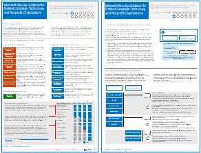

# Microsoft Security Guidance for Political Campaigns, Nonprofits, and Other Agile Organizations

[!INCLUDE [Microsoft 365 Defender rebranding](../includes/microsoft-defender-for-office.md)]

**Applies to**
- [Exchange Online Protection](exchange-online-protection-overview.md)
- [Microsoft Defender for Office 365 plan 1 and plan 2](office-365-atp.md)

 **Summary:** Planning and implementation guidance for fast-moving organizations that have an increased threat profile.

If your organization is agile, you have a small IT team, and your threat profile is higher than average, this guidance is designed for you. This solution demonstrates how to quickly build an environment with essential cloud services that include secure controls from the start. This guidance includes prescriptive security recommendations for protecting data, identities, email, and access from mobile devices.

## Security solution guidance

This guidance describes how to implement a secure cloud environment. The solution guidance can be used by any organization. It includes extra help for agile organizations with BYOD access and guest accounts. You can use this guidance as a starting-point for designing your own environment. We welcome your feedback at [CloudAdopt@microsoft.com](mailto:CloudAdopt@microsoft.com).

****

|Item|Description|
|---|---|
|**Microsoft Security Guidance for Political Campaigns**      [PDF](https://download.microsoft.com/download/B/4/D/B4D520C3-4D0C-4B4D-BFB9-09F0651C2775/MSFT_Cloud_architecture_security%20for%20political%20campaigns.pdf) \| [Visio](https://download.microsoft.com/download/B/4/D/B4D520C3-4D0C-4B4D-BFB9-09F0651C2775/MSFT_Cloud_architecture_security%20for%20political%20campaigns.vsdx)|This guidance uses a political campaign organization as an example. Use this guidance as a starting point for any environment.|
|**Microsoft Security Guidance for Nonprofits**      [PDF](https://download.microsoft.com/download/9/4/3/94389612-C679-4061-8DF2-D9A15D72B65F/Microsoft_Cloud%20Architecture_Security%20for%20Nonprofits.pdf) \| [Visio](https://download.microsoft.com/download/9/4/3/94389612-C679-4061-8DF2-D9A15D72B65F/Microsoft_Cloud%20Architecture_Security%20for%20Nonprofits.vsdx)|This guide is slightly revised for nonprofit organizations. For example, it references Office 365 Nonprofit plans. The technical guidance is the same as the political campaign solution guide.|
|

## Test Lab Guides

To create a dev/test environment for this solution, use the following test lab guides:

- [Configure groups and users for a political campaign dev/test environment](configure-groups-and-users-for-a-political-campaign-dev-test-environment.md)

  Create trial subscriptions for Office 365 and EMS and then create groups and users for a representative political campaign.

- [Create team sites in a political campaign dev/test environment](create-team-sites-in-a-political-campaign-dev-test-environment.md)

  Create four SharePoint Online team sites with Internal, Private, Sensitive, and Highly Confidential levels of security.

For additional security features for demonstration or proof of concept, see [Office 365 Test Lab Guides](https://aka.ms/o365tlgs).

## See Also

[Cloud adoption Test Lab Guides (TLGs)](../../enterprise/cloud-adoption-test-lab-guides-tlgs.md)

[Microsoft Cloud IT architecture resources](../../solutions/cloud-architecture-models.md)
