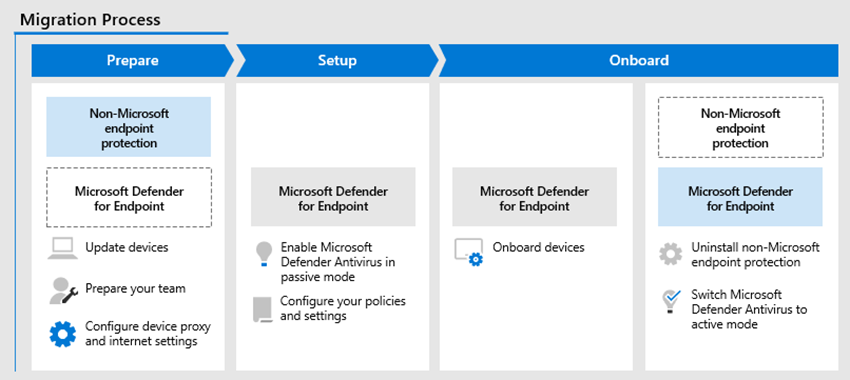

# Migrate from a third-party protection service or device to Microsoft Defender for Office 365

**Applies to**
- [Microsoft Defender for Office 365 plan 1 and plan 2](defender-for-office-365.md)

This article provides specific and actionable steps for migrating from a third-party protection service or device to Microsoft Defender for Office 365. This article assumes the following facts:

- You already have Microsoft 365 mailboxes, but you're currently using a third-party service or device for email protection. Mail from the internet flows through the protection service before delivery into your Microsoft 365 organization, and Microsoft 365 protection is as low as possible (it's never completely off; for example, malware protection is always enforced).

- You're beyond the investigation and consideration phase for protection by Defender for Office 365. If you need to evaluate Defender for Office 365 to decide whether it's right for your organization, we recommend that you consider [Evaluation Mode](office-365-evaluation.md).

- You've already purchased Defender for Office 365 licenses.

- You need to retire your existing third-party protection service, which means you'll ultimately need to point the MX records for your email domains to Microsoft 365. When you're done, mail from the internet will flow directly into Microsoft 365 and will be protected exclusively by Exchange Online Protection (EOP) and Defender for Office 365.

Eliminating your existing protection service in favor of Defender for Office 365 is a big step that you shouldn't take lightly, nor should you rush to make the change. The guidance in this migration guide will help you transition your protection in an orderly manner with minimal disruption to your users.

## Why use the steps in this guide?

In the IT industry, surprises are generally bad. Simply flipping your MX records to point to Microsoft 365 without prior and thoughtful testing will result in many surprises. For example:

- You or your predecessors have likely spent a lot of time and effort customizing your existing protection service for optimal mail delivery (in other words, blocking what needs to be blocked, and allowing what needs to be allowed). It's almost a guaranteed certainty that not every customization in your current protection service is required in Defender for Office 365. It's also very possible that Defender for Office 365 will introduce new issues (allows or blocks) that didn't happen or weren't required in your current protection service.
- Your help desk and security personnel need to know what to do in Defender for Office 365. For example, if a user complains about a missing message, does your help desk know where or how to look for it? They're likely verify familiar with the tools in your existing protection service, but what about the tools in Defender for Office 365?

In contrast, if you follow the steps in this migration guide, you'll get the following tangible benefits for your migration:

- Minimal disruption to users.
- Objective data from Defender for Office 365 that you can use as you report on the progress and success of the migration to management.
- Early involvement and instruction for help desk and security personnel.

The more you familiarize yourself with how Defender for Office 365 will affect your organization, the better the transition will be for users, help desk personnel, security personnel, and management.

This migration guide gives you a plan for gradually "turning the dial" so you can monitor and test how Defender for Office 365 affects your users and their email so you can react quickly to any issues that you encounter.

## The migration process

The process of migrating to Defender for Office 365 can be divided into three phases as described in the following table:

|Phase|Description|
|---|---|
|[Prepare for your migration](migrate-to-defender-for-office-365-prepare.md)||
|[Set up Defender for Office 365](migrate-to-defender-for-office-365-setup.md)||
|[Onboard to Defender for Office 365](migrate-to-defender-for-office-365-onboard.md)||
|

## Next step

- Proceed to [Phase 1: Setup](migrate-to-defender-for-office-365-prepare.md).
