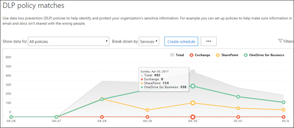
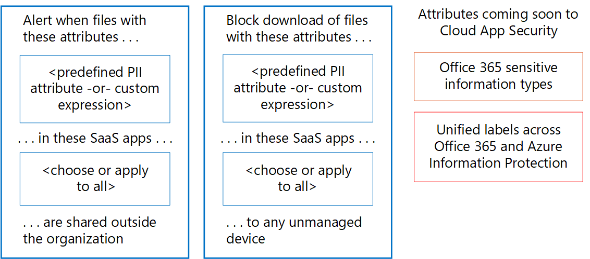

# Monitor for leaks of personal data

[!INCLUDE [Microsoft 365 Defender rebranding](../includes/microsoft-defender-for-office.md)]

There are many tools that can be used to monitor the use and transport of personal data. This topic describes three tools that work well.

In the illustration:

- Start with Microsoft 365 data loss prevention reports for monitoring personal data in SharePoint Online, OneDrive for Business, and email in transit. These reports provide the greatest level of detail for monitoring personal data. However, these reports don't include all services in Office 365.

- Next, use alert policies and the audit log to monitor activity across services. Set up ongoing monitoring or search the audit log to investigate an incident. The audit log works across services—Sway, Power BI, eDiscovery, Dynamics 365, Microsoft Flow, Microsoft Teams, Admin activity, OneDrive for Business, SharePoint Online, mail in transit, and mailboxes at rest. Skype conversations are included in mailboxes at rest.

- Finally, Use Microsoft Cloud App Security to monitor files with sensitive data in other SaaS providers. Coming soon is the ability to use sensitive information types and unified labels across Azure Information Protection and Office with Cloud App Security. You can set up policies that apply to all of your SaaS apps or specific apps (like Box). Cloud App Security doesn't discover files in Exchange Online, including files attached to email.

## Data loss prevention reports

After you create your data loss prevention (DLP) policies, you'll want to verify that they're working as you intended and helping you to stay compliant. With the DLP reports in Office 365, you can quickly view the number of DLP policy matches, overrides, or false positives; see whether they're trending up or down over time; filter the report in different ways; and view more details by selecting a point on a line on the graph.

You can use the DLP reports to:

- Focus on specific time periods and understand the reasons for spikes and trends.

- Discover business processes that violate your organization's DLP policies.

- Understand any business impact of the DLP policies.

- View the justifications submitted by users when they resolve a policy tip by overriding the policy or reporting a false positive.

- Verify compliance with a specific DLP policy by showing any matches for that policy.

- View a list of files with sensitive data that matches your DLP policies in the details pane.

In addition, you can use the DLP reports to fine-tune your DLP policies as you run them in test mode.

DLP reports are in the security center and the compliance center. Navigate to Reports \> View reports. Under Data loss prevention (DLP), go to either DLP policy and rule matches or DLP false positives and overrides.

For more information, see [View the reports for data loss prevention](https://docs.microsoft.com/microsoft-365/compliance/view-the-dlp-reports).

## audit log and alert policies

The audit log contains events from Exchange Online, SharePoint Online, OneDrive for Business, Azure Active Directory, Microsoft Teams, Power BI, Sway, and other services.

The security center and compliance center provide two ways to monitor and report against the audit log:

- Set up alert policies, view alerts, and monitor trends—Use the alert policy and alert dashboard tools in either the security center or compliance center.

- Search the audit log directly: Search for all events in a specified date rage. Or you can filter the results based on specific criteria, such as the user who performed the action, the action, or the target object.

Information security and compliance teams can use these tools to proactively review activities performed by both end users and administrators across services. Automatic alerts can be configured to send email notifications when certain activities occur on specific site collections - for example when content is shared from sites known to contain GDPR-related information. This allows those teams to follow up with users to ensure that corporate security policies are followed, or to provide additional training.

Information security teams can also search the audit log to investigate suspected data breaches and determine both root cause and the extent of the breach. This built-in capability facilitates compliance with article 33 and 34 of the GDPR, which require notifications be provided to the GDPR supervisory authority and to the data subjects themselves of a data breach within a specific time period. Audit log entries are only retained for 90 days within the service - it is often recommended and many organizations required that these logs be retained for longer periods of time.

Solutions are available that subscribe to the Unified Audit Logs through the Microsoft Management Activity API and can both store log entries as needed, and provide advanced dashboards and alerts. One example is [Microsoft Operations Management Suite (OMS)](https://docs.microsoft.com/azure/operations-management-suite/oms-solution-office-365).

More information about alert policies and searching the audit log:

- [Alert policies in the Microsoft 365 security and compliance centers](https://docs.microsoft.com/microsoft-365/compliance/alert-policies)

- [Search the audit log for user and admin activity in Office 365](https://docs.microsoft.com/microsoft-365/compliance/search-the-audit-log) (introduction)

- [Turn audit log search on or off](https://docs.microsoft.com/microsoft-365/compliance/turn-audit-log-search-on-or-off)

- [Search the audit log](https://docs.microsoft.com/microsoft-365/compliance/search-the-audit-log-in-security-and-compliance)

- [Search-UnifiedAuditLog](https://docs.microsoft.com/powershell/module/exchange/search-unifiedauditlog) (cmdlet)

- [Detailed properties in the audit log](https://docs.microsoft.com/microsoft-365/compliance/detailed-properties-in-the-office-365-audit-log)

## Microsoft Cloud App Security

Microsoft Cloud App Security helps you discover other SaaS apps in use across your networks and sensitive data sent to and from these apps.

Microsoft Cloud App Security is a comprehensive service providing deep visibility, granular controls, and enhanced threat protection for your cloud apps. It identifies more than 15,000 cloud applications in your network-from all devices-and provides risk scoring and ongoing risk assessment and analytics. No agents required: information is collected from your firewalls and proxies to give you complete visibility and context for cloud usage and shadow IT.

To better understand your cloud environment, the Cloud App Security investigate feature provides deep visibility into all activities, files, and accounts for sanctioned and managed apps. You can gain detailed information on a file level and discover where data travels in the cloud apps.

For examples, the following illustration demonstrates two Cloud App Security policies that can help with GDPR.

The first policy alerts when files with a predefined PII attribute or custom expression that you choose is shared outside the organization from the SaaS apps that you choose.

The second policy blocks downloads of files to any unmanaged device. You choose the attributes within the files to look for and the SaaS apps you want the policy to apply to.

These attribute types are coming soon to Cloud App Security:

- Sensitive information types
- Unified labels across Microsoft 365 and Azure Information Protection

### Cloud App Security dashboard

If you haven't yet started to use Cloud App Security, begin by starting it up. To access Cloud App Security: <https://portal.cloudappsecurity.com>.

Note: Be sure to enable 'Automatically scan files for Azure Information Protection classification labels' (in General settings) when getting started with Cloud App Security or before you assign labels. After setup, Cloud App Security does not scan existing files again until they are modified.

More information:

- [Deploy Cloud App Security](https://docs.microsoft.com/cloud-app-security/getting-started-with-cloud-app-security)

- [More information about Microsoft Cloud App Security](https://www.microsoft.com/cloud-platform/cloud-app-security)

- [Block downloads of sensitive information using the Microsoft Cloud App Security proxy](https://docs.microsoft.com/cloud-app-security/use-case-proxy-block-session-aad)

## Example file and activity policies to detect sharing of personal data

### Detect sharing of files containing PII — Credit card number

Alert when a file containing a credit card number is shared from an approved cloud app.

****

|Control|Settings|
|---|---|
|Policy type|File policy|
|Policy template|No template|
|Policy severity|High|
|Category|DLP|
|Filter settings|Access level = Public (Internet), Public, External 
 App = \<select apps\> (use this setting if you want to limit monitoring to specific SaaS apps)|
|Apply to|All files, all owners|
|Content inspection|Includes files that match a present expression: All countries: Finance: Credit card number 
 Don't require relevant context: unchecked (this setting will match keywords as well as regex) 
 Includes files with at least 1 match 
 Unmask the last 4 characters of the violation: checked|
|Alerts|Create an alert for each matching file: checked 
 Daily alert limit: 1000 
 Select an alert as email: checked 
 To: infosec@contoso.com|
|Governance|Microsoft OneDrive for Business 
 Make private: check Remove External Users 
 All other settings: unchecked 
 Microsoft SharePoint Online 
 Make private: check Remove External Users 
 All other settings: unchecked|
|

Similar policies:

- Detect sharing of Files containing PII - Email Address
- Detect sharing of Files containing PII - Passport Number

### Detect Customer or HR Data in Box or OneDrive for Business

Alert when a file labeled as Customer Data or HR Data is uploaded to OneDrive for Business or Box.

Notes:

- Box monitoring requires a connector be configured using the API Connector SDK.
- This policy requires capabilities that are currently in private preview.

****

|Control|Settings|
|---|---|
|Policy type|Activity policy|
|Policy template|No template|
|Policy severity|High|
|Category|Sharing Control|
|Act on|Single activity|
|Filter settings|Activity type = Upload File 
 App = Microsoft OneDrive for Business and Box 
 Classification Label (currently in private preview): Azure Information Protection = Customer Data, Human Resources—Salary Data, Human Resources—Employee Data|
|Alerts|Create an alert: checked 
 Daily alert limit: 1000 
 Select an alert as email: checked 
 To: infosec@contoso.com|
|Governance|All apps 
 Put user in quarantine: check 
 All other settings: unchecked 
 Office 365 
 Put user in quarantine: check 
 All other settings: unchecked|
|

Similar policies:

- Detect large downloads of Customer data or HR Data—Alert when a large number of files containing customer data or HR data have been detected being downloaded by a single user within a short period of time.
- Detect Sharing of Customer and HR Data—Alert when files containing Customer or HR Data are shared.
