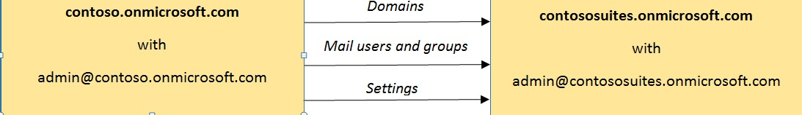

# Move domains and settings from one EOP organization to another

[!INCLUDE [Microsoft 365 Defender rebranding](../includes/microsoft-defender-for-office.md)]

**Applies to**
-  [Exchange Online Protection standalone](exchange-online-protection-overview.md)

Changing business requirements can sometimes require splitting one Microsoft Exchange Online Protection (EOP) organization (tenant) into two separate organizations, merging two organizations into one, or moving your domains and EOP settings from one organization to another organization. Moving from one EOP organization to a second EOP organization can be challenging, but with a few basic remote Windows PowerShell scripts and a small amount of preparation, this can be achieved with a relatively small maintenance window.

> [!NOTE]
>
> - Settings can be reliably moved only from an EOP standalone (Standard) organization to either another EOP Standard or an Exchange Enterprise CAL with Services (EOP Premium) organization, or from an EOP Premium organization to another EOP Premium organization. Because some premium features are not supported in EOP Standard organizations, moves from an EOP Premium organization to an EOP Standard organization might not be successful.
>
> - These instructions are for EOP filtering-only organizations. There are additional considerations in moving from one Exchange Online organization to another Exchange Online organization. Exchange Online organizations are out of scope for these instructions.

In the following example, Contoso, Ltd. has merged with Contoso Suites. The following image shows the process of moving domains, mail users and groups, and settings from the source EOP organization (contoso.onmicrosoft.com) to the target EOP organization (contososuites.onmicrosoft.com):



The challenge in moving domains from one organization to another is that a verified domain can't exist in two organizations at the same time. The following steps help you work through this.

## Step 1: Collect data from the source organization

In order to re-create the source organization in the target organization, make sure that you collect and store the following information about the source organization:

- Domains
- Mail users
- Groups
- Anti-spam
  - Anti-spam policies (also known as content filter policies)
  - Outbound spam filter policies
  - Connection filter policies
- Anti-malware policies
- Connectors
- Mail flow rules (also known as transport rules)

  > [!NOTE]
  > Cmdlet support for the export and import of the mail flow rule collection is currently only supported for EOP Premium subscription plans.

The easiest way to collect all of your settings is to use PowerShell. To connect to standalone EOP PowerShell, see [Connect to Exchange Online Protection PowerShell](https://docs.microsoft.com/powershell/exchange/connect-to-exchange-online-protection-powershell).

Next, you can collect all your settings and export them to an .xml file to be imported into the target tenant. In general, you can pipe the output of the **Get** cmdlet for each setting to the **Export-Clixml** cmdlet to save the settings in .xml files, as shown in the following code sample.

In standalone EOP PowerShell, create a directory called Export in a location that's easy to find and change to that directory. For example:

```PowerShell
mkdir C:\EOP\Export
```

```PowerShell
cd C:\EOP\Export
```

The following script can be used to collect all the mail users, groups, anti-spam settings, anti-malware settings, connectors, and mail flow rules in the source organization. Copy and paste the following text into a text editor like Notepad, save the file as Source_EOP_Settings.ps1 in the Export directory you just created, and run the following command:

```PowerShell
& "C:\EOP\Export\Source_EOP_Settings.ps1"
```

```PowerShell
#****************************************************************************
# Export Domains
#*****************************************************************************
Get-AcceptedDomain | Export-Clixml Domains.xml
#****************************************************************************
# Export mail users
#
#****************************************************************************
Get-Recipient -ResultSize unlimited -RecipientTypeDetails MailUser | Export-Clixml MailUsers.xml
#****************************************************************************
# Groups
#
# If you're using directory synchronization, you can skip this step and
# simply sync to the target
# tenant.
# First, you need to capture information about the distribution groups.
#****************************************************************************
Get-Recipient -ResultSize unlimited -RecipientTypeDetails MailUniversalDistributionGroup | Export-Clixml DistributionGroups.xml
Get-Recipient -ResultSize unlimited -RecipientTypeDetails MailUniversalSecurityGroup | Export-Clixml SecurityGroups.xml
#****************************************************************************
# And then we'll use that output to loop through each group and get the
# members.
#****************************************************************************
$DGs = Import-Clixml .\DistributionGroups.xml
ForEach ($dg in $DGs) {Get-DistributionGroupMember -Identity $dg.name | Export-Clixml $dg.ExternalDirectoryObjectId}
$SGs = Import-Clixml .\SecurityGroups.xml
ForEach ($sg in $SGs) {Get-DistributionGroupMember -Identity $sg.name | Export-Clixml $sg.ExternalDirectoryObjectId}
#*****************************************************************************
# Export dynamic distribution groups - EOP Premium Only
#
# If you're using directory synchronization, then you can skip this step and simply
# sync to the target tenant.
#*****************************************************************************
Get-DynamicDistributionGroup -ResultSize unlimited | Export-Clixml DynamicDistributionGroups.xml
#*****************************************************************************
# Export mail contacts - EOP Premium Only
#
# If you're using directory synchronization, then you can skip this step and simply
# sync to the target tenant.
#*****************************************************************************
Get-MailContact -ResultSize unlimited -RecipientTypeDetails MailContact | Export-Clixml MailContacts.xml
#****************************************************************************
# Anti-spam
#****************************************************************************
Get-HostedConnectionFilterPolicy | Export-Clixml HostedConnectionFilterPolicy.xml
Get-HostedContentFilterPolicy | Export-Clixml HostedContentFilterPolicy.xml
Get-HostedContentFilterRule | Export-Clixml HostedContentFilterRule.xml
Get-HostedOutboundSpamFilterPolicy | Export-Clixml HostedOutboundSpamFilterPolicy.xml
#****************************************************************************
# Anti-malware policies
#****************************************************************************
Get-MalwareFilterPolicy | Export-Clixml MalwareFilterPolicy.xml
Get-MalwareFilterRule | Export-Clixml MalwareFilterRule.xml
#****************************************************************************
# Connectors
#****************************************************************************
Get-InboundConnector | Export-Clixml InboundConnector.xml
Get-OutboundConnector | Export-Clixml OutboundConnector.xml
#****************************************************************************
# Exchange mail flow rules
#****************************************************************************
$file = Export-TransportRuleCollection
Set-Content -Path ".TransportRules.xml" -Value $file.FileData -Encoding Byte
```

Run the following commands from the Export directory to update the .xml files with the target organization. Replace contoso.onmicrosoft.com and contososuites.onmicrosoft.com with your source and target organization names.

```PowerShell
$files = ls
ForEach ($file in $files) { (Get-Content $file.Name) | Foreach-Object {$_ -replace 'contoso.onmicrosoft.com', 'contososuites.onmicrosoft.com'} | Set-Content $file.Name}
```

## Step 2: Add domains to the target organization

Add domains to the target organization by using the following script. Copy and paste the text into a text editor like Notepad, save the script as C:\EOP\Export\Add_Domains.ps1, and run the following command:

```PowerShell
& "C:\EOP\Export\Add_Domains.ps1"
```

These domains won't be verified and can't be used to route mail, but after the domains are added, you can collect the information needed to verify the domains and eventually update your MX records for the new tenant.

```PowerShell
#***********************************************************************
# Login to Azure Active Directory
#*****************************************************************************
$msolcred = Get-Credential
connect-msolservice -credential $msolcred
#****************************************************************************
# Add domains
#****************************************************************************
$Domains = Import-Clixml ".\Domains.xml"
Foreach ($domain in $Domains) {
    New-MsolDomain -Name $domain.Name
}
```

Now you can review and collect the information from the Microsoft 365 admin center of your target organization so you can quickly verify your domains when the time comes:

1. Sign in to the Microsoft 365 admin center at <https://portal.office.com>.

2. Click **Domains**.

   If you don't see domains, click **Customize navigation**, select **Setup**, and then click **Save**.

3. Click each **Start setup** link, and then proceed through the setup wizard.

4. On the **Confirm ownership** page, for **See step-by-step instructions for performing this step with**, select **General instructions**.

5. Record the MX record or TXT record that you'll use to verify your domain, and finish the setup wizard.

6. Add the verification TXT records to your DNS records. This will let you more quickly verify the domains in the source organization after they're removed from the target organization. For more information about configuring DNS, see [Create DNS records at any DNS hosting provider for Microsoft 365](../../admin/get-help-with-domains/create-dns-records-at-any-dns-hosting-provider.md).

## Step 3: Force senders to queue mail

While moving your domains from one tenant to another, you'll need to delete the domains from the source organization and then verify them in your target organization. During this time, you won't be able to route mail through EOP.

One option to force senders to queue mail is to update your MX records to point directly to your on-premises mail server.

Another option is to put an invalid MX record in each domain where the DNS records for your domain are kept (also known as your DNS hosting service). This will cause the sender to queue your mail and retry (typical retry attempts are for 48 hours, but this might vary from provider to provider). You can use invalid.outlook.com as an invalid MX target. Lowering the Time to Live (TTL) value to five minutes on the MX record will help the change propagate to DNS providers more quickly.

For more information about configuring DNS, see [Create DNS records at any DNS hosting provider for Microsoft 365](../../admin/get-help-with-domains/create-dns-records-at-any-dns-hosting-provider.md).

> [!IMPORTANT]
> Different providers queue mail for different periods of time. You'll need to set up your new tenant quickly and revert your DNS settings to avoid non-delivery reports (NDRs) from being sent to the sender if the queuing time expires.

## Step 4: Remove users, groups, and domains from the source organization

The following script removes users, groups, and domains from the source tenant by using Azure Active Directory PowerShell. Copy and paste the following text into a text editor like Notepad, save the file as C:\EOP\Export\Remove_Users_and_Groups.ps1, and run the following command:

```PowerShell
& "C:\EOP\Export\Remove_Users_and_Groups.ps1"
```

```PowerShell
#*****************************************************************************
# Login to Azure Active Directory
#*****************************************************************************
$msolcred= Get-Credential
connect-msolservice -credential $msolcred
#*****************************************************************************
# Remove users
#*****************************************************************************
$Users = Get-MSOLUser -All | sort UserPrincipalName
$user_count = $Users.count
write-host "Removing $user_count users."
Foreach ($User in $Users) {
write-host $User.UserPrincipalName
$User | Remove-MSOLUser -Force
}
#*****************************************************************************
# Remove groups
#*****************************************************************************
Get-MSOLGroup | Remove-MSOLGroup -Force
#*****************************************************************************
# Remove domains
# Note: Your onmicrosoft.com domain should be the default domain
#*****************************************************************************
$Domains = Get-MsolDomain
$Domain_count = $Domains.count
write-host "Removing $Domain_count domains."
Foreach ($Domain in $Domains) {
write-host $Domain.Name
Remove-MsolDomain -DomainName $Domain.Name -Force
}
```

## Step 5: Verify domains for the target organization

1. Sign in to the admin center at <https://portal.office.com>.

2. Click **Domains**.

3. Click each **Start setup** link for the target domain and proceed through the setup wizard.

## Step 6: Add mail users and groups to the target organization

A best practice for EOP is to use Azure Active Directory to sync your on-premises Active Directory to your target tenant. For more information about how to do this, see "Use directory synchronization to manage mail users" in [Manage mail users in EOP](manage-mail-users-in-eop.md). You can also use the following script to recreate your users and groups from your source tenant. Note: User passwords cannot be moved. New user passwords are created and saved in the file named UsersAndGroups.ps1.

To use the script, copy and paste the following text into a text editor like Notepad, save the file as C:\EOP\Export\Add_Users_and_Groups.ps1, and run the following command:

```PowerShell
& "C:\EOP\Export\Add_Users_and_Groups.ps1"
```

```PowerShell
#***********************************************************************
# makeparam helper function
#****************************************************************************
function makeparam ([string]$ParamName, [string[]] $ParamValue) {
    $FormattedParam = ""
    If($ParamValue.Count -gt 0) {
        $FormattedParam = " -$ParamName "
        Foreach ($value in $ParamValue) {
        If($value -eq "True") {$FormattedParam = " -$ParamName" + ":`$True,"}
        else{
            If($value -eq "False") {$FormattedParam = " -$ParamName" + ":`$False,"}
                else{$FormattedParam += "`"$value`","}
            }
        }
        $FormattedParam = $FormattedParam.TrimEnd(",")
    }
    Return $FormattedParam
 }
#****************************************************************************
# Variables
#****************************************************************************
$outfile = ".\UsersAndGroups.ps1"
rm -erroraction 'silentlycontinue' $outfile
#****************************************************************************
# Add mail users
#****************************************************************************
$rand = New-Object System.Random -ArgumentList (get-date).millisecond
$MailUsers = Import-Clixml ".\MailUsers.xml"
$MailUsersCount = $MailUsers.Name.Count
if($MailUsersCount -gt 0){
    Write-Host "Importing $MailUsersCount Mail Users"
    ForEach ($MailUser in $MailUsers) {
        $MailUsersCmdlet = "New-MailUser"
        If((Get-PSSession).ComputerName.Contains("ps.protection")) {
            $DistributionGroupsCmdlet = "New-EOPMailUser"
        }
        $MailUsersCmdlet += makeparam "LastName" $MailUser.LastName
        $MailUsersCmdlet += makeparam "FirstName" $MailUser.FirstName
        $MailUsersCmdlet += makeparam "DisplayName" $MailUser.DisplayName
        $MailUsersCmdlet += makeparam "Name" $MailUser.Name
        $MailUsersCmdlet += makeparam "Alias" $MailUser.Alias
        $MailUsersCmdlet += makeparam "MicrosoftOnlineServicesID" $MailUser.MicrosoftOnlineServicesID
        $MailUsersCmdlet += makeparam "ExternalEmailAddress" $MailUser.ExternalEmailAddress

        # Generate a new 10 character password
        $NewPassword = ""
        1..10 | ForEach { $NewPassword = $NewPassword + [char]$rand.next(40,127) }

        $MailUsersCmdlet += " -Password (ConvertTo-SecureString -String '$NewPassword' -AsPlainText -Force)"
        Add-Content $outfile "`n$MailUsersCmdlet"
    }
}
#****************************************************************************
# Add distribution groups
#****************************************************************************
$DistributionGroups = Import-Clixml ".\DistributionGroups.xml"
$DistributionGroupsCount = $DistributionGroups.Name.Count
if($DistributionGroupsCount -gt 0){
    Write-Host "Importing $DistributionGroupsCount Distribution Groups"
    ForEach ($DistributionGroup in $DistributionGroups) {
        $DistributionGroupsCmdlet = "New-DistributionGroup"
        If((Get-PSSession).ComputerName.Contains("ps.protection")) {
            $DistributionGroupsCmdlet = "New-EOPDistributionGroup"
        }
        $DistributionGroupsCmdlet += makeparam "Name" $DistributionGroup.Name
        $DistributionGroupsCmdlet += makeparam "Alias" $DistributionGroup.Alias
        $DistributionGroupsCmdlet += makeparam "DisplayName" $DistributionGroup.DisplayName
        $DistributionGroupsCmdlet += makeparam "ManagedBy" $DistributionGroup.ManagedBy

        $DistributionGroupsCmdlet += makeparam "Notes" $DistributionGroup.Notes
        $DistributionGroupsCmdlet += makeparam "PrimarySmtpAddress" $DistributionGroup.PrimarySmtpAddress
        $DistributionGroupsCmdlet += makeparam "Type" $DistributionGroup.Type
        $MembersCmdlet = "@("
        $memberslist = Import-Clixml $DistributionGroup.ExternalDirectoryObjectId
        ForEach ($user in $memberslist) {
            $MembersCmdlet += "`"$user.Name`","
        }
        $MembersCmdlet = $MembersCmdlet.TrimEnd(",")
        $MembersCmdlet += ")"
    }
    Add-Content $outfile "`n$DistributionGroupsCmdlet"
}
#****************************************************************************
# Add security groups
#****************************************************************************
$SecurityGroups = Import-Clixml ".\SecurityGroups.xml"
$SecurityGroupsCount = $SecurityGroups.Name.Count
if($SecurityGroupsCount -gt 0){
    Write-Host "Importing $SecurityGroupsCount Security Groups"
    ForEach ($SecurityGroup in $SecurityGroups) {
        $SecurityGroupsCmdlet = "New-SecurityGroup"
        If((Get-PSSession).ComputerName.Contains("ps.protection")) {
            $DistributionGroupsCmdlet = "New-EOPSecurityGroup"
        }
        $SecurityGroupsCmdlet += makeparam "Name" $SecurityGroup.Name
        $SecurityGroupsCmdlet += makeparam "Alias" $SecurityGroup.Alias
        $SecurityGroupsCmdlet += makeparam "DisplayName" $SecurityGroup.DisplayName
        $SecurityGroupsCmdlet += makeparam "ManagedBy" $SecurityGroup.ManagedBy

        $SecurityGroupsCmdlet += makeparam "Notes" $SecurityGroup.Notes
        $SecurityGroupsCmdlet += makeparam "PrimarySmtpAddress" $SecurityGroup.PrimarySmtpAddress
        $SecurityGroupsCmdlet += makeparam "Type" $SecurityGroup.Type
        $MembersCmdlet = "@("
        $memberslist = Import-Clixml $SecurityGroup.ExternalDirectoryObjectId
        ForEach ($user in $memberslist) {
            $MembersCmdlet += "`"$user.Name`","
        }
        $MembersCmdlet = $MembersCmdlet.TrimEnd(",")
        $MembersCmdlet += ")"
    }
    Add-Content $outfile "`n$SecurityGroupsCmdlet"
}
#****************************************************************************
# Add Dynamic Distribution Groups
#****************************************************************************
If((Get-PSSession).ComputerName.Contains("ps.protection")) {
    write-Host "No Synamic Distribution Groups for EOP Standard organizations."
}else{
    $DynamicDistributionGroups = Import-Clixml ".\DynamicDistributionGroups.xml"
    $DynamicDistributionGroupsCount = $DynamicDistributionGroups.Name.Count
    if($DynamicDistributionGroupsCount -gt 0){
        Write-Host "Importing $DynamicDistributionGroupsCount Dynamic Distribution Groups"
        foreach ($DynamicDistributionGroup in $DynamicDistributionGroups) {
            $DynamicDistributionGroupsCmdlet = "New-DynamicDistributionGroup"
            $DynamicDistributionGroupsCmdlet += " -Confirm:`$False"
            $DynamicDistributionGroupsCmdlet += makeparam "DisplayName" $DynamicDistributionGroup.DisplayName
            $DynamicDistributionGroupsCmdlet += makeparam "ModeratedBy" $DynamicDistributionGroup.ModeratedBy
            $DynamicDistributionGroupsCmdlet += makeparam "ModerationEnabled" $DynamicDistributionGroup.ModerationEnabled
            $DynamicDistributionGroupsCmdlet += makeparam "Name" $DynamicDistributionGroup.Name
            $DynamicDistributionGroupsCmdlet += makeparam "PrimarySmtpAddress" $DynamicDistributionGroup.PrimarySmtpAddress
            $DynamicDistributionGroupsCmdlet += makeparam "RecipientContainer" $DynamicDistributionGroup.RecipientContainer
            $RecipientFilterParam =  makeparam "RecipientFilter" $DynamicDistributionGroup.RecipientFilter
            $RecipientFilterParam = " -RecipientFilter {" + $RecipientFilterParam.Substring(19)
            $RecipientFilterParam = $RecipientFilterParam.Substring(0,$RecipientFilterParam.Length-1)
            $RecipientFilterParam += "}"
            $DynamicDistributionGroupsCmdlet +=  $RecipientFilterParam
            $DynamicDistributionGroupsCmdlet += makeparam "SendModerationNotifications" $DynamicDistributionGroup.SendModerationNotifications
            Add-Content $outfile "`n$DynamicDistributionGroupsCmdlet"
        }

    }else{
        Write-Host "No Dynamic Distribution Groups to add."
    }
}
#****************************************************************************
# Add Mail Contacts
#****************************************************************************
If((Get-PSSession).ComputerName.Contains("ps.protection")) {
    write-Host "No Mail Contact for EOP Standard organizations."
}else{
    $MailContacts = Import-Clixml ".\MailContacts.xml"
    $MailContactsCount = $MailContacts.Name.Count
    if($MailContactsCount -gt 0){
        Write-Host "Importing $MailContactsCount Dynamic Distribution Groups"
        foreach ($MailContact in $MailContacts) {
            $MailContactsCmdlet = "New-MailContact"
            $MailContactsCmdlet += makeparam "UsePreferMessageFormat" $MailContact.UsePreferMessageFormat
            $MailContactsCmdlet += makeparam "DisplayName" $MailContact.DisplayName
            $MailContactsCmdlet += makeparam "ModeratedBy" $MailContact.ModeratedBy
            $MailContactsCmdlet += makeparam "Name" $MailContact.Name
            $MailContactsCmdlet += makeparam "MessageBodyFormat" $MailContact.MessageBodyFormat
            $MailContactsCmdlet += makeparam "OrganizationalUnit" $MailContact.OrganizationalUnit
            $MailContactsCmdlet += makeparam "Initials" $MailContact.Initials
            $MailContactsCmdlet += makeparam "MessageFormat" $MailContact.MessageFormat
            $MailContactsCmdlet += makeparam "ModerationEnabled" $MailContact.ModerationEnabled
            $MailContactsCmdlet += makeparam "MacAttachmentFormat" $MailContact.MacAttachmentFormat
            $MailContactsCmdlet += makeparam "SendModerationNotifications" $MailContact.SendModerationNotifications
            $MailContactsCmdlet += " -Confirm:`$False"
            $MailContactsCmdlet += makeparam "ExternalEmailAddress" $MailContact.ExternalEmailAddress
            $MailContactsCmdlet += makeparam "FirstName" $MailContact.FirstName
            $MailContactsCmdlet += makeparam "Alias" $MailContact.Alias
            Add-Content $outfile "`n$MailContactsCmdlet"
        }

    }else{
        Write-Host "No Mail Contacts to add."
    }
}
#***********************************************************************
# makeparam helper function
#************************************************************************
 function makeparam ([string]$ParamName, [string[]] $ParamValue) {
    $FormattedParam = ""
    If($ParamValue.Count -gt 0) {
        $FormattedParam = " -$ParamName "
        Foreach ($value in $ParamValue) {
        If($value -eq "True") {$FormattedParam = " -$ParamName" + ":`$True,"}
        else{
            If($value -eq "False") {$FormattedParam = " -$ParamName" + ":`$False,"}
                else{$FormattedParam += "`"$value`","}
            }
        }
        $FormattedParam = $FormattedParam.TrimEnd(",")
    }
    Return $FormattedParam
 }
#****************************************************************************
# Variables
#****************************************************************************
$outfile = ".\UsersAndGroups.ps1"
rm -erroraction 'silentlycontinue' $outfile
#****************************************************************************
# Add mail users
#****************************************************************************
$rand = New-Object System.Random -ArgumentList (get-date).millisecond
$MailUsers = Import-Clixml ".\MailUsers.xml"
$MailUsersCount = $MailUsers.Name.Count
if($MailUsersCount -gt 0){
    Write-Host "Importing $MailUsersCount Mail Users"
    ForEach ($MailUser in $MailUsers) {
        $MailUsersCmdlet = "New-EOPMailUser"
        $MailUsersCmdlet += makeparam "LastName" $MailUser.LastName
        $MailUsersCmdlet += makeparam "FirstName" $MailUser.FirstName
        $MailUsersCmdlet += makeparam "DisplayName" $MailUser.DisplayName
        $MailUsersCmdlet += makeparam "Name" $MailUser.Name
        $MailUsersCmdlet += makeparam "Alias" $MailUser.Alias
        $MailUsersCmdlet += makeparam "MicrosoftOnlineServicesID" $MailUser.MicrosoftOnlineServicesID
        $MailUsersCmdlet += makeparam "ExternalEmailAddress" $MailUser.ExternalEmailAddress

        # Generate a new 10 character password
        $NewPassword = ""
        1..10 | ForEach { $NewPassword = $NewPassword + [char]$rand.next(40,127) }

        $MailUsersCmdlet += " -Password (ConvertTo-SecureString -String '$NewPassword' -AsPlainText -Force)"
        Add-Content $outfile "`n$MailUsersCmdlet"
    }
}
#****************************************************************************
# Add distribution groups
#****************************************************************************
$DistributionGroups = Import-Clixml ".\DistributionGroups.xml"
$DistributionGroupsCount = $DistributionGroups.Name.Count
if($DistributionGroupsCount -gt 0){
    Write-Host "Importing $DistributionGroupsCount Distribution Groups"
    ForEach ($DistributionGroup in $DistributionGroups) {
        $DistributionGroupsCmdlet = "New-EOPDistributionGroup"
        $DistributionGroupsCmdlet += makeparam "Name" $DistributionGroup.Name
        $DistributionGroupsCmdlet += makeparam "Alias" $DistributionGroup.Alias
        $DistributionGroupsCmdlet += makeparam "DisplayName" $DistributionGroup.DisplayName
        $DistributionGroupsCmdlet += makeparam "ManagedBy" $DistributionGroup.ManagedBy

        $DistributionGroupsCmdlet += makeparam "Notes" $DistributionGroup.Notes
        $DistributionGroupsCmdlet += makeparam "PrimarySmtpAddress" $DistributionGroup.PrimarySmtpAddress
        $DistributionGroupsCmdlet += makeparam "Type" $DistributionGroup.Type
        $MembersCmdlet = "@("
        $memberslist = Import-Clixml $DistributionGroup.ExternalDirectoryObjectId
        ForEach ($user in $memberslist) {
            $MembersCmdlet += "`"$user.Name`","
        }
        $MembersCmdlet = $MembersCmdlet.TrimEnd(",")
        $MembersCmdlet += ")"
    }
    Add-Content $outfile "`n$DistributionGroupsCmdlet"
}
#****************************************************************************
# Add security groups
#****************************************************************************
$SecurityGroups = Import-Clixml ".\SecurityGroups.xml"
$SecurityGroupsCount = $SecurityGroups.Name.Count
if($SecurityGroupsCount -gt 0){
    Write-Host "Importing $SecurityGroupsCount Security Groups"
    ForEach ($SecurityGroup in $SecurityGroups) {
        $SecurityGroupsCmdlet = "New-EOPSecurityGroup"
        $SecurityGroupsCmdlet += makeparam "Name" $SecurityGroup.Name
        $SecurityGroupsCmdlet += makeparam "Alias" $SecurityGroup.Alias
        $SecurityGroupsCmdlet += makeparam "DisplayName" $SecurityGroup.DisplayName
        $SecurityGroupsCmdlet += makeparam "ManagedBy" $SecurityGroup.ManagedBy

        $SecurityGroupsCmdlet += makeparam "Notes" $SecurityGroup.Notes
        $SecurityGroupsCmdlet += makeparam "PrimarySmtpAddress" $SecurityGroup.PrimarySmtpAddress
        $SecurityGroupsCmdlet += makeparam "Type" $SecurityGroup.Type
        $MembersCmdlet = "@("
        $memberslist = Import-Clixml $SecurityGroup.ExternalDirectoryObjectId
        ForEach ($user in $memberslist) {
            $MembersCmdlet += "`"$user.Name`","
        }
        $MembersCmdlet = $MembersCmdlet.TrimEnd(",")
        $MembersCmdlet += ")"
    }
    Add-Content $outfile "`n$SecurityGroupsCmdlet"
}
#****************************************************************************
# Add Dynamic Distribution Groups
#****************************************************************************
$DynamicDistributionGroups = Import-Clixml ".\DynamicDistributionGroups.xml"
$DynamicDistributionGroupsCount = $DynamicDistributionGroups.Name.Count
if($DynamicDistributionGroupsCount -gt 0){
    Write-Host "Importing $DynamicDistributionGroupsCount Dynamic Distribution Groups"
    foreach ($DynamicDistributionGroup in $DynamicDistributionGroups) {
        $DynamicDistributionGroupsCmdlet = "New-DynamicDistributionGroup"
        $DynamicDistributionGroupsCmdlet += " -Confirm:`$False"
        $DynamicDistributionGroupsCmdlet += makeparam "DisplayName" $DynamicDistributionGroup.DisplayName
        $DynamicDistributionGroupsCmdlet += makeparam "ModeratedBy" $DynamicDistributionGroup.ModeratedBy
        $DynamicDistributionGroupsCmdlet += makeparam "ModerationEnabled" $DynamicDistributionGroup.ModerationEnabled
        $DynamicDistributionGroupsCmdlet += makeparam "Name" $DynamicDistributionGroup.Name
        $DynamicDistributionGroupsCmdlet += makeparam "PrimarySmtpAddress" $DynamicDistributionGroup.PrimarySmtpAddress
        $DynamicDistributionGroupsCmdlet += makeparam "RecipientContainer" $DynamicDistributionGroup.RecipientContainer
        $RecipientFilterParam =  makeparam "RecipientFilter" $DynamicDistributionGroup.RecipientFilter
        $RecipientFilterParam = " -RecipientFilter {" + $RecipientFilterParam.Substring(19)
        $RecipientFilterParam = $RecipientFilterParam.Substring(0,$RecipientFilterParam.Length-1)
        $RecipientFilterParam += "}"
        $DynamicDistributionGroupsCmdlet +=  $RecipientFilterParam
        $DynamicDistributionGroupsCmdlet += makeparam "SendModerationNotifications" $DynamicDistributionGroup.SendModerationNotifications
        Add-Content $outfile "`n$DynamicDistributionGroupsCmdlet"
    }

}else{
    Write-Host "No Dynamic Distribution Groups to add."
}
#****************************************************************************
# Add Mail Contacts
#****************************************************************************
$MailContacts = Import-Clixml ".\MailContacts.xml"
$MailContactsCount = $MailContacts.Name.Count
if($MailContactsCount -gt 0){
    Write-Host "Importing $MailContactsCount Dynamic Distribution Groups"
    foreach ($MailContact in $MailContacts) {
        $MailContactsCmdlet = "New-MailContact"
        $MailContactsCmdlet += makeparam "UsePreferMessageFormat" $MailContact.UsePreferMessageFormat
        $MailContactsCmdlet += makeparam "DisplayName" $MailContact.DisplayName
        $MailContactsCmdlet += makeparam "ModeratedBy" $MailContact.ModeratedBy
        $MailContactsCmdlet += makeparam "Name" $MailContact.Name
        $MailContactsCmdlet += makeparam "MessageBodyFormat" $MailContact.MessageBodyFormat
        $MailContactsCmdlet += makeparam "OrganizationalUnit" $MailContact.OrganizationalUnit
        $MailContactsCmdlet += makeparam "Initials" $MailContact.Initials
        $MailContactsCmdlet += makeparam "MessageFormat" $MailContact.MessageFormat
        $MailContactsCmdlet += makeparam "ModerationEnabled" $MailContact.ModerationEnabled
        $MailContactsCmdlet += makeparam "MacAttachmentFormat" $MailContact.MacAttachmentFormat
        $MailContactsCmdlet += makeparam "SendModerationNotifications" $MailContact.SendModerationNotifications
        $MailContactsCmdlet += " -Confirm:`$False"
        $MailContactsCmdlet += makeparam "ExternalEmailAddress" $MailContact.ExternalEmailAddress
        $MailContactsCmdlet += makeparam "FirstName" $MailContact.FirstName
        $MailContactsCmdlet += makeparam "Alias" $MailContact.Alias
        Add-Content $outfile "`n$MailContactsCmdlet"
    }

}else{
    Write-Host "No Mail Contacts to add."
}
```

## Step 7: Add protection settings to the target organization

You can run the following script from the Export directory while logged in to your target organization to recreate the settings exported to .xml files earlier from the source organization.

Copy and paste the script text into a text editor like Notepad, save the file as C:\EOP\Export\Import_Settings.ps1, and run the following command:

```PowerShell
& "C:\EOP\Export\Import_Settings.ps1"
```

This script imports the .xml files and create a Windows PowerShell script file called Settings.ps1 that you can review, edit, and then run to recreate your protection and mail-flow settings.

```PowerShell
#***********************************************************************
# makeparam helper function
#****************************************************************************
 function makeparam ([string]$ParamName, [string[]] $ParamValue) {
    $FormattedParam = ""
    If($ParamValue.Count -gt 0) {
        $FormattedParam = " -$ParamName "
        Foreach ($value in $ParamValue) {
        If($value -eq "True") {$FormattedParam = " -$ParamName" + ":`$True,"}
        else{
            If($value -eq "False") {$FormattedParam = " -$ParamName" + ":`$False,"}
                else{$FormattedParam += "`"$value`","}
            }
        }
        $FormattedParam = $FormattedParam.TrimEnd(",")
    }
    Return $FormattedParam
 }
#****************************************************************************
# Variables
#****************************************************************************
$outfile = ".\Settings.ps1"
rm -erroraction 'silentlycontinue' $outfile
#****************************************************************************
# HostedContentFilterPolicy
#****************************************************************************
$HostedContentFilterPolicies = Import-Clixml ".\HostedContentFilterPolicy.xml"
$HostedContentFilterPolicyCount = $HostedContentFilterPolicies.Name.Count
if($HostedContentFilterPolicyCount -gt 0){
    Write-Host "Importing $HostedContentFilterPolicyCount Inbound Connectors"
    ForEach ($HostedContentFilterPolicy in $HostedContentFilterPolicies) {
        $HostedContentFilterPolicyCmdlet = "New-HostedContentFilterPolicy"
        if($HostedContentFilterPolicy.Name -eq "Default") {$HostedContentFilterPolicyCmdlet = "Set-HostedContentFilterPolicy -Identity Default"}
        else {
        $HostedContentFilterPolicyCmdlet += makeparam "Name" $HostedContentFilterPolicy.Name
        }
        $HostedContentFilterPolicyCmdlet += makeparam "AddXHeaderValue" $HostedContentFilterPolicy.AddXHeaderValue
        $HostedContentFilterPolicyCmdlet += makeparam "AdminDisplayName" $HostedContentFilterPolicy.AdminDisplayName
        $HostedContentFilterPolicyCmdlet += " -Confirm:`$False"
        $HostedContentFilterPolicyCmdlet += makeparam "DownloadLink" $HostedContentFilterPolicy.DownloadLink
        $HostedContentFilterPolicyCmdlet += makeparam "EnableEndUserSpamNotifications" $HostedContentFilterPolicy.EnableEndUserSpamNotifications
        $HostedContentFilterPolicyCmdlet += makeparam "EnableLanguageBlockList" $HostedContentFilterPolicy.EnableLanguageBlockList
        $HostedContentFilterPolicyCmdlet += makeparam "EnableRegionBlockList" $HostedContentFilterPolicy.EnableRegionBlockList
        if($HostedContentFilterPolicy.EndUserSpamNotificationCustomFromAddress.Length -gt 0)
        {
            $HostedContentFilterPolicyCmdlet += makeparam "EndUserSpamNotificationCustomFromAddress" $HostedContentFilterPolicy.EndUserSpamNotificationCustomFromAddress
        }
        $HostedContentFilterPolicyCmdlet += makeparam "EndUserSpamNotificationCustomFromName" $HostedContentFilterPolicy.EndUserSpamNotificationCustomFromName
        $HostedContentFilterPolicyCmdlet += makeparam "EndUserSpamNotificationCustomSubject" $HostedContentFilterPolicy.EndUserSpamNotificationCustomSubject
        $HostedContentFilterPolicyCmdlet += makeparam "EndUserSpamNotificationFrequency" $HostedContentFilterPolicy.EndUserSpamNotificationFrequency
        $HostedContentFilterPolicyCmdlet += makeparam "EndUserSpamNotificationLanguage" $HostedContentFilterPolicy.EndUserSpamNotificationLanguage
        $HostedContentFilterPolicyCmdlet += makeparam "LanguageBlockList" $HostedContentFilterPolicy.LanguageBlockList
        $HostedContentFilterPolicyCmdlet += makeparam "MarkAsSpamBulkMail" $HostedContentFilterPolicy.MarkAsSpamBulkMail
        $HostedContentFilterPolicyCmdlet += makeparam "MarkAsSpamEmbedTagsInHtml" $HostedContentFilterPolicy.MarkAsSpamEmbedTagsInHtml
        $HostedContentFilterPolicyCmdlet += makeparam "MarkAsSpamEmptyMessages" $HostedContentFilterPolicy.MarkAsSpamEmptyMessages
        $HostedContentFilterPolicyCmdlet += makeparam "MarkAsSpamFormTagsInHtml" $HostedContentFilterPolicy.MarkAsSpamFormTagsInHtml
        $HostedContentFilterPolicyCmdlet += makeparam "MarkAsSpamFramesInHtml" $HostedContentFilterPolicy.MarkAsSpamFramesInHtml
        $HostedContentFilterPolicyCmdlet += makeparam "MarkAsSpamFromAddressAuthFail" $HostedContentFilterPolicy.MarkAsSpamFromAddressAuthFail
        $HostedContentFilterPolicyCmdlet += makeparam "MarkAsSpamJavaScriptInHtml" $HostedContentFilterPolicy.MarkAsSpamJavaScriptInHtml
        $HostedContentFilterPolicyCmdlet += makeparam "MarkAsSpamNdrBackscatter" $HostedContentFilterPolicy.MarkAsSpamNdrBackscatter
        $HostedContentFilterPolicyCmdlet += makeparam "MarkAsSpamObjectTagsInHtml" $HostedContentFilterPolicy.MarkAsSpamObjectTagsInHtml
        $HostedContentFilterPolicyCmdlet += makeparam "MarkAsSpamSensitiveWordList" $HostedContentFilterPolicy.MarkAsSpamSensitiveWordList
        $HostedContentFilterPolicyCmdlet += makeparam "MarkAsSpamSpfRecordHardFail" $HostedContentFilterPolicy.MarkAsSpamSpfRecordHardFail
        $HostedContentFilterPolicyCmdlet += makeparam "MarkAsSpamWebBugsInHtml" $HostedContentFilterPolicy.MarkAsSpamWebBugsInHtml
        $HostedContentFilterPolicyCmdlet += makeparam "ModifySubjectValue" $HostedContentFilterPolicy.ModifySubjectValue
        $HostedContentFilterPolicyCmdlet += makeparam "Organization" $HostedContentFilterPolicy.Organization
        $HostedContentFilterPolicyCmdlet += makeparam "QuarantineRetentionPeriod" $HostedContentFilterPolicy.QuarantineRetentionPeriod
        $HostedContentFilterPolicyCmdlet += makeparam "RedirectToRecipients" $HostedContentFilterPolicy.RedirectToRecipients
        $HostedContentFilterPolicyCmdlet += makeparam "RegionBlockList" $HostedContentFilterPolicy.RegionBlockList
        $HostedContentFilterPolicyCmdlet += makeparam "SpamAction" $HostedContentFilterPolicy.SpamAction
        $HostedContentFilterPolicyCmdlet += makeparam "TestModeBccToRecipients" $HostedContentFilterPolicy.TestModeBccToRecipients
        Add-Content $outfile "`n$HostedContentFilterPolicyCmdlet"
    }
 }else{
    Write-Host "No Hosted Content Policy Filters to add."
 }
#****************************************************************************
# HostedContentFilterRule
#****************************************************************************
$HostedContentFilterRules = Import-Clixml ".\HostedContentFilterRule.xml"
$HostedContentFilterRuleCount = $HostedContentFilterRules.Name.Count
if($HostedContentFilterPolicyCount -gt 0){
    Write-Host "Importing $HostedContentFilterRuleCount Hosted Content Filter Rules"
    ForEach ($HostedContentFilterRule in $HostedContentFilterRules) {
        $HostedContentFilterRuleCmdlet = "New-HostedContentFilterRule"
        if($HostedContentFilterRule.Name -eq "Default") {$HostedContentFilterRuleCmdlet = "Set-HostedContentFilterRule Default"}
        $HostedContentFilterRuleCmdlet += makeparam "Name" $HostedContentFilterRule.Name
        $HostedContentFilterRuleCmdlet  += makeparam "HostedContentFilterPolicy" $HostedContentFilterRule.HostedContentFilterPolicy
        $HostedContentFilterRuleCmdlet += makeparam "Comments" $HostedContentFilterRule.Comments
        $HostedContentFilterRuleCmdlet += " -Confirm:`$False"
        $HostedContentFilterRuleCmdlet += makeparam "Enabled" $HostedContentFilterRule.Enabled
        $HostedContentFilterRuleCmdlet += makeparam "ExceptIfRecipientDomainIs" $HostedContentFilterRule.ExceptIfRecipientDomainIs
        $HostedContentFilterRuleCmdlet += makeparam "ExceptIfSentTo" $HostedContentFilterRule.ExceptIfSentTo
        $HostedContentFilterRuleCmdlet += makeparam "ExceptIfSentToMemberOf" $HostedContentFilterRule.ExceptIfSentToMemberOf
        $HostedContentFilterRuleCmdlet += makeparam "Priority" $HostedContentFilterRule.Priority
        $HostedContentFilterRuleCmdlet += makeparam "RecipientDomainIs" $HostedContentFilterRule.RecipientDomainIs
        $HostedContentFilterRuleCmdlet += makeparam "SentTo" $HostedContentFilterRule.SentTo
        $HostedContentFilterRuleCmdlet += makeparam "SentToMemberOf" $HostedContentFilterRule.SentToMemberOf
        Add-Content $outfile "`n$HostedContentFilterRuleCmdlet"
    }
 }else{
    Write-Host "No Hosted Content Filter Rules to add."
 }
#****************************************************************************
# HostedOutboundSpamFilterPolicy
#****************************************************************************
$HostedOutboundSpamFilterPolicies = Import-Clixml ".\HostedOutboundSpamFilterPolicy.xml"
$HostedOutboundSpamFilterPolicyCount = $HostedOutboundSpamFilterPolicies.Name.Count
if($HostedContentFilterPolicyCount -gt 0){
    Write-Host "Importing $HostedOutboundSpamFilterPolicyCount Hosted Outbound Spam Filter Policies"
    ForEach ($HostedOutboundSpamFilterPolicy in $HostedOutboundSpamFilterPolicies) {
        $HostedOutboundSpamFilterPolicyCmdlet = "Set-HostedOutboundSpamFilterPolicy Default"
        $HostedOutboundSpamFilterPolicyCmdlet += makeparam "AdminDisplayName" $HostedOutboundSpamFilterPolicy.AdminDisplayName
        $HostedOutboundSpamFilterPolicyCmdlet += makeparam "BccSuspiciousOutboundAdditionalRecipients"
        $HostedOutboundSpamFilterPolicy.BccSuspiciousOutboundAdditionalRecipients
        $HostedOutboundSpamFilterPolicyCmdlet += makeparam "BccSuspiciousOutboundMail" $HostedOutboundSpamFilterPolicy.BccSuspiciousOutboundMail
        $HostedOutboundSpamFilterPolicyCmdlet += " -Confirm:`$False"
        $HostedOutboundSpamFilterPolicyCmdlet += makeparam "NotifyOutboundSpam" $HostedOutboundSpamFilterPolicy.NotifyOutboundSpam
        $NotifyOutboundSpamRecipients  += makeparam "NotifyOutboundSpamRecipients" $HostedOutboundSpamFilterPolicy.NotifyOutboundSpamRecipients
        Add-Content $outfile "`n$HostedOutboundSpamFilterPolicyCmdlet"
    }
 }else{
    Write-Host "No Hosted Outbound Spam Filter Policies to add."
 }
#****************************************************************************
# HostedConnectionFilterPolicy
#****************************************************************************
$HostedConnectionFilterPolicies = Import-Clixml ".\HostedConnectionFilterPolicy.xml"
$HostedConnectionFilterPolicyCount = $HostedConnectionFilterPolicies.Name.Count
if($HostedContentFilterPolicyCount -gt 0){
    Write-Host "Importing $HostedConnectionFilterPolicyCount Hosted Connection Filter Policies"
    ForEach ($HostedConnectionFilterPolicy in $HostedConnectionFilterPolicies) {
        $HostedConnectionFilterPolicyCmdlet = "Set-HostedConnectionFilterPolicy"
        $HostedConnectionFilterPolicyCmdlet += makeparam "Identity" $HostedConnectionFilterPolicy.Name
        $HostedConnectionFilterPolicyCmdlet += makeparam "AdminDisplayName" $HostedConnectionFilterPolicy.AdminDisplayName
        $HostedConnectionFilterPolicyCmdlet += " -Confirm:`$False"
        $HostedConnectionFilterPolicyCmdlet += makeparam "EnableSafeList" $HostedConnectionFilterPolicy.EnableSafeList
        $HostedConnectionFilterPolicyCmdlet += makeparam "IPAllowList" $HostedConnectionFilterPolicy.IPAllowList
        $HostedConnectionFilterPolicyCmdlet += makeparam "IPBlockList" $HostedConnectionFilterPolicy.IPBlockList

        Add-Content $outfile "`n$HostedConnectionFilterPolicyCmdlet"
    }
 }else{
    Write-Host "No Hosted Connection Filter Policies to add."
 }
#****************************************************************************
# MalwareFilterPolicy
#****************************************************************************
$MalwareFilterPolicies = Import-Clixml ".\MalwareFilterPolicy.xml"
$MalwareFilterPolicyCount = $MalwareFilterPolicies.Name.Count
if($HostedContentFilterPolicyCount -gt 0){
    Write-Host "Importing $MalwareFilterPolicyCount Malware Filter Policies"
    ForEach ($MalwareFilterPolicy in $MalwareFilterPolicies) {
        $MalwareFilterPolicyCmdlet = "New-MalwareFilterPolicy"
        if($MalwareFilterPolicy.Name -eq "Default") {$MalwareFilterPolicyCmdlet = "Set-MalwareFilterPolicy Default"}
        else {
        $MalwareFilterPolicyCmdlet += makeparam "Name" $MalwareFilterPolicy.Name
        }
        $MalwareFilterPolicyCmdlet += makeparam "Action" $MalwareFilterPolicy.Action
        $MalwareFilterPolicyCmdlet += makeparam "DeleteAttachmentAndUseDefaultAlertText" $MalwareFilterPolicy.DeleteAttachmentAndUseDefaultAlertText
        $MalwareFilterPolicyCmdlet += makeparam "DeleteAttachmentAndUseCustomAlertText" $MalwareFilterPolicy.DeleteAttachmentAndUseCustomAlertText
        $MalwareFilterPolicyCmdlet += makeparam "AdminDisplayName" $MalwareFilterPolicy.AdminDisplayName
        $MalwareFilterPolicyCmdlet += " -Confirm:`$False"
        $MalwareFilterPolicyCmdlet += makeparam "CustomAlertText" $MalwareFilterPolicy.CustomAlertText
        $MalwareFilterPolicyCmdlet += makeparam "CustomExternalBody" $MalwareFilterPolicy.CustomExternalBody
        $MalwareFilterPolicyCmdlet += makeparam "CustomExternalSubject" $MalwareFilterPolicy.CustomExternalSubject
        if($MalwareFilterPolicy.CustomFromAddress.Length -gt 0) {
            $MalwareFilterPolicyCmdlet += makeparam "CustomFromAddress" $MalwareFilterPolicy.CustomFromAddress
        }
        $MalwareFilterPolicyCmdlet += makeparam "CustomFromName" $MalwareFilterPolicy.CustomFromName
        $MalwareFilterPolicyCmdlet += makeparam "CustomInternalBody" $MalwareFilterPolicy.CustomInternalBody
        $MalwareFilterPolicyCmdlet += makeparam "CustomInternalSubject" $MalwareFilterPolicy.CustomInternalSubject
        $MalwareFilterPolicyCmdlet += makeparam "CustomNotifications" $MalwareFilterPolicy.CustomNotifications
        $MalwareFilterPolicyCmdlet += makeparam "EnableExternalSenderAdminNotifications" $MalwareFilterPolicy.EnableExternalSenderAdminNotifications
        $MalwareFilterPolicyCmdlet += makeparam "EnableExternalSenderNotifications" $MalwareFilterPolicy.EnableExternalSenderNotifications
        $MalwareFilterPolicyCmdlet += makeparam "EnableInternalSenderAdminNotifications" $MalwareFilterPolicy.EnableInternalSenderAdminNotifications
        $MalwareFilterPolicyCmdlet += makeparam "EnableInternalSenderNotifications" $MalwareFilterPolicy.EnableInternalSenderNotifications
        if($MalwareFilterPolicy.ExternalSenderAdminAddress.Length -gt 0) {
        $MalwareFilterPolicyCmdlet += makeparam "ExternalSenderAdminAddress" $MalwareFilterPolicy.ExternalSenderAdminAddress
        }
        if($MalwareFilterPolicy.InternalSenderAdminAddress.Length -gt 0) {
        $MalwareFilterPolicyCmdlet += makeparam "InternalSenderAdminAddress" $MalwareFilterPolicy.InternalSenderAdminAddress
        }
        Add-Content $outfile "`n$MalwareFilterPolicyCmdlet"
    }
 }else{
    Write-Host "No Malware Filter Policies to add."
 }
#****************************************************************************
# MalwareFilterRule
#****************************************************************************
$MalwareFilterRules = Import-Clixml ".\MalwareFilterRule.xml"
$MalwareFilterRuleCount = $MalwareFilterRules.Name.Count
if($HostedContentFilterPolicyCount -gt 0){
    Write-Host "Importing $MalwareFilterRuleCount Malware Filter Rules"
    ForEach ($MalwareFilterRule in $MalwareFilterRules) {
        $MalwareFilterRuleCmdlet = "New-MalwareFilterRule"
        if($MalwareFilterRule.Name -eq "Default") {$MalwareFilterRuleCmdlet = "Set-MalwareFilterPolicy Default"}
        $MalwareFilterRuleCmdlet += makeparam "Name" $MalwareFilterRule.Name
        $MalwareFilterRuleCmdlet += makeparam "MalwareFilterPolicy" $MalwareFilterRule.MalwareFilterPolicy
        $MalwareFilterRuleCmdlet += makeparam "Comments" $MalwareFilterRule.Comments
        $MalwareFilterRuleCmdlet += " -Confirm:`$False"
        $MalwareFilterRuleCmdlet += makeparam "Enabled" $MalwareFilterRule.Enabled
        $MalwareFilterRuleCmdlet += makeparam "ExceptIfRecipientDomainIs" $MalwareFilterRule.ExceptIfRecipientDomainIs
        $MalwareFilterRuleCmdlet += makeparam "ExceptIfSentTo" $MalwareFilterRule.ExceptIfSentTo
        $MalwareFilterRuleCmdlet += makeparam "ExceptIfSentToMemberOf" $MalwareFilterRule.ExceptIfSentToMemberOf
        $MalwareFilterRuleCmdlet += makeparam "RecipientDomainIs" $MalwareFilterRule.RecipientDomainIs
        $MalwareFilterRuleCmdlet += makeparam "SentTo" $MalwareFilterRule.SentTo
        $MalwareFilterRuleCmdlet += makeparam "SentToMemberOf" $MalwareFilterRule.SentToMemberOf
        Add-Content $outfile "`n$MalwareFilterRuleCmdlet"
    }
 }else{
    Write-Host "No Malware Filter Rules to add."
 }
#****************************************************************************
# InboundConnectors
#****************************************************************************
$InboundConnectors = Import-Clixml ".\InboundConnector.xml"
$InboundConnectorCount = $InboundConnectors.Name.Count
if($InboundConnectorCount -gt 0){
    Write-Host "Importing $InboundConnectorCount Inbound Connectors"
    ForEach ($InboundConnector in $InboundConnectors) {
        $InboundConnectorCmdlet = "New-InboundConnector"
        $InboundConnectorCmdlet += makeparam "Name" $InboundConnector.Name
        $InboundConnectorCmdlet += makeparam "SenderDomains" $InboundConnector.SenderDomains

        If($InboundConnector.AssociatedAcceptedDomains.Count -gt 0) {
            If($InboundConnector.AssociatedAcceptedDomains[0].Contains("/")) {
                # This connector was created in an EOP Standard tenant
                # Strip out just the domain name
                $InboundConnectorCmdlet += " -AssociatedAcceptedDomains "
                ForEach  ($accepteddomain in $InboundConnectors.AssociatedAcceptedDomains) {
                    $accepteddomain = $accepteddomain.SubString($accepteddomain.LastIndexOf("/")+1)
                    $InboundConnectorCmdlet += "`"$accepteddomain`","
                }
                $InboundConnectorCmdlet = $InboundConnectorCmdlet.TrimEnd(",")
            }else{
                $InboundConnectorCmdlet += makeparam "AssociatedAcceptedDomains" $InboundConnector.AssociatedAcceptedDomains
            }
        }

        $InboundConnectorCmdlet += makeparam "CloudServicesMailEnabled" $InboundConnector.CloudServicesMailEnabled
        $InboundConnectorCmdlet += makeparam "Comment" $InboundConnector.Comment
        $InboundConnectorCmdlet += " -Confirm:`$False"
        $InboundConnectorCmdlet += makeparam "ConnectorSource" $InboundConnector.ConnectorSource
        $InboundConnectorCmdlet += makeparam "ConnectorType" $InboundConnector.ConnectorType
        $InboundConnectorCmdlet += makeparam "Enabled" $InboundConnector.Enabled
        $InboundConnectorCmdlet += makeparam "RequireTls" $InboundConnector.RequireTls
        $InboundConnectorCmdlet += makeparam "RestrictDomainsToCertificate" $InboundConnector.RestrictDomainsToCertificate
        $InboundConnectorCmdlet += makeparam "RestrictDomainsToIPAddresses" $InboundConnector.RestrictDomainsToIPAddresses
        $InboundConnectorCmdlet += makeparam "SenderIPAddresses" $InboundConnector.SenderIPAddresses
        $InboundConnectorCmdlet += makeparam "TlsSenderCertificateName" $InboundConnector.TlsSenderCertificateName
        Add-Content $outfile "`n$InboundConnectorCmdlet"
     }
}else{
    Write-Host "No Inbound Connectors to add."
 }
#****************************************************************************
# OutboundConnector
#****************************************************************************
$OutboundConnectors = Import-Clixml ".\OutboundConnector.xml"
$OutboundConnectorCount = $OutboundConnectors.Name.Count
if($OutboundConnectorCount -gt 0){
    Write-Host "Importing $OutboundConnectorCount Outbound Connectors"
    ForEach ($OutboundConnector in $OutboundConnectors) {
        $OutboundConnectorCmdlet = "New-OutboundConnector"
        $OutboundConnectorCmdlet += makeparam "Name" $OutboundConnector.Name
        $OutboundConnectorCmdlet += makeparam "AllAcceptedDomains" $OutboundConnector.AllAcceptedDomains
        $OutboundConnectorCmdlet += makeparam "BypassValidation" $OutboundConnector.BypassValidation
        $OutboundConnectorCmdlet += makeparam "CloudServicesMailEnabled" $OutboundConnector.CloudServicesMailEnabled
        $OutboundConnectorCmdlet += makeparam "Comment" $OutboundConnector.Comment
        $OutboundConnectorCmdlet += " -Confirm:`$False"
        $OutboundConnectorCmdlet += makeparam "ConnectorSource" $OutboundConnector.ConnectorSource
        $OutboundConnectorCmdlet += makeparam "ConnectorType" $OutboundConnector.ConnectorType
        $OutboundConnectorCmdlet += makeparam "IsTransportRuleScoped" $OutboundConnector.IsTransportRuleScoped
        $OutboundConnectorCmdlet += makeparam "RecipientDomains" $OutboundConnector.RecipientDomains
        $OutboundConnectorCmdlet += makeparam "RouteAllMessagesViaOnPremises" $OutboundConnector.RouteAllMessagesViaOnPremises
        $OutboundConnectorCmdlet += makeparam "SmartHosts" $OutboundConnector.SmartHosts
        $OutboundConnectorCmdlet += makeparam "TlsDomain" $OutboundConnector.TlsDomain
        $OutboundConnectorCmdlet += makeparam "TlsSettings" $OutboundConnector.TlsSettings
        $OutboundConnectorCmdlet += makeparam "UseMXRecord" $OutboundConnector.UseMXRecord
        Add-Content $outfile "`n$OutboundConnectorCmdlet"
    }
 }else{
    Write-Host "No Outbound Connectors to add."
 }
#*****************************************************************************
# TransportRule
#*****************************************************************************
Add-Content $outfile "`n[Byte[]]$Data = Get-Content -Path `".TransportRules.xml`" -Encoding Byte -ReadCount 0"
Add-Content $outfile "`nImport-TransportRuleCollection -FileData $Data"
#****************************************************************************
# Domain Type
#****************************************************************************
$Domains = Import-Clixml ".\Domains.xml"
$DomainCount = $Domains.Name.Count
if($HostedContentFilterPolicyCount -gt 0){
    Write-Host "Importing $DomainCount Domains"
    ForEach ($Domain in $Domains) {
        $DomainCmdlet = "Set-AcceptedDomain"
        $DomainCmdlet += makeparam "Identity" $Domain.Name
        $DomainCmdlet += makeparam "DomainType" $Domain.DomainType
        Add-Content $outfile "`n$DomainCmdlet"
    }
 }else{
    Write-Host "No Domains to add."
 }
```

## Step 8: Revert your DNS settings to stop mail queuing

If you chose to set your MX records to an invalid address to cause the senders to queue mail during your transition, you'll need to set them back to the correct value as specified in the [admin center](https://admin.microsoft.com). For more information about configuring DNS, see [Create DNS records at any DNS hosting provider for Microsoft 365](../../admin/get-help-with-domains/create-dns-records-at-any-dns-hosting-provider.md).
