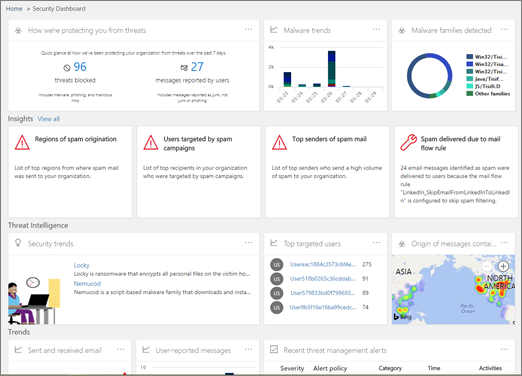
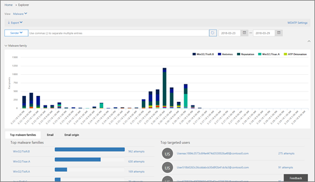
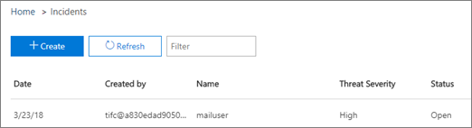
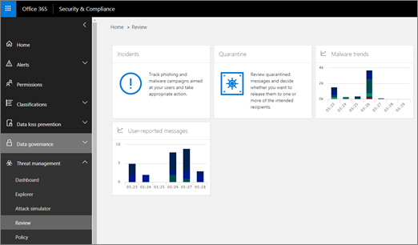

# Threat investigation and response

[!INCLUDE [Microsoft 365 Defender rebranding](../includes/microsoft-defender-for-office.md)]

**Applies To**
-	 [Microsoft Defender for Office 365 plan 2](https://go.microsoft.com/fwlink/?linkid=2148715)

Threat investigation and response capabilities in [Microsoft Defender for Office 365](office-365-atp.md) help security analysts and administrators protect their organization's Microsoft 365 for business users by:

- Making it easy to identify, monitor, and understand cyberattacks
- Helping to quickly address threats in Exchange Online, SharePoint Online, OneDrive for Business and Microsoft Teams
- Providing insights and knowledge to help security operations prevent cyberattacks against their organization
- Employing [automated investigation and response in Office 365](automated-investigation-response-office.md) for critical email-based threats

Threat investigation and response capabilities provide insights into threats and related response actions that are available in the Security & Compliance Center. These insights can help your organization's security team protect users from email- or file-based attacks. The capabilities help monitor signals and gather data from multiple sources, such as user activity, authentication, email, compromised PCs, and security incidents. Business decision makers and your security operations team can use this information to understand and respond to threats against your organization and protect your intellectual property.

## Get acquainted with threat investigation and response tools

Threat investigation and response capabilities surface in the Security & Compliance Center, as a set of tools and response workflows, including the following:

- [Threat dashboard](#threat-dashboard)
- [Explorer](#threat-explorer)
- [Incidents](#incidents)
- [Attack Simulator](#attack-simulator)
- [Automated investigation and response](automated-investigation-response-office.md)

### Threat dashboard

Use the Threat dashboard (this is also referred to as the [Security dashboard](security-dashboard.md)) to quickly see what threats have been addressed, and as a visual way to report to business decision makers how Microsoft 365 services are securing your business.

To view and use this dashboard, in the Security & Compliance Center, go to **Threat management** \> **Dashboard**.

### Threat Explorer

Use [Threat Explorer (and real-time detections)](threat-explorer.md) to analyze threats, see the volume of attacks over time, and analyze data by threat families, attacker infrastructure, and more. Threat Explorer (also referred to as Explorer) is the starting place for any security analyst's investigation workflow.

To view and use this report, in the Security & Compliance Center, go to **Threat management** \> **Explorer**.

### Incidents

Use the Incidents list (this is also called Investigations) to see a list of in flight security incidents. Incidents are used to track threats such as suspicious email messages, and to conduct further investigation and remediation.

To view the list of current incidents for your organization, in the Security & Compliance Center, go to **Threat management** \> **Review** \> **Incidents**.

### Attack Simulator

Use Attack Simulator to set up and run realistic cyberattacks in your organization, and identify vulnerable people before a real cyberattack affects your business. To learn more, see [Attack Simulator in Office 365](attack-simulator.md).

### Automated investigation and response

Use automated investigation and response (AIR) capabilities to save time and effort correlating content, devices, and people at risk from threats in your organization. AIR processes can begin whenever certain alerts are triggered, or when started by your security operations team. To learn more, see [automated investigation and response in Office 365](automated-investigation-response-office.md).

## Threat intelligence widgets

As part of the Microsoft Defender for Office 365 Plan 2 offering, security analysts can review details about a known threat. This is useful to determine whether there are additional preventative measures/steps that can be taken to keep users safe.

## How do we get these capabilities?

Microsoft 365 threat investigation and response capabilities are included in Microsoft Defender for Office 365 Plan 2, which is included in Enterprise E5 or as an add-on to certain subscriptions. To learn more, see [Defender for Office 365 Plan 1 and Plan 2](office-365-atp.md#microsoft-defender-for-office-365-plan-1-and-plan-2).

## Required roles and permissions

Microsoft Defender for Office 365 uses role-based access control. Permissions are assigned through certain roles in Azure Active Directory, the Microsoft 365 admin center, or the Security & Compliance Center.

> [!TIP]
> Although some roles, such as Security Administrator, can be assigned in the Security & Compliance Center, consider using either the Microsoft 365 admin center or Azure Active Directory instead. For information about roles, role groups, and permissions, see the following resources:
>
> - [Permissions in the Security & Compliance Center](permissions-in-the-security-and-compliance-center.md)
>
> - [Administrator role permissions in Azure Active Directory](https://docs.microsoft.com/azure/active-directory/users-groups-roles/directory-assign-admin-roles)

****

|Activity|Roles and permissions|
|---|---|
|Use the Threat dashboard (or the new [Security dashboard](security-dashboard.md)) 
 View information about recent or current threats|One of the following: <ul><li>**Global Administrator**</li><li>**Security Administrator**</li><li>**Security Reader**</li></ul> 
 These roles can be assigned in either Azure Active Directory (<https://portal.azure.com>) or the Microsoft 365 admin center (<https://admin.microsoft.com>).|
|Use [Threat Explorer (and real-time detections)](threat-explorer.md) to analyze threats|One of the following: <ul><li>**Global Administrator**</li><li>**Security Administrator**</li><li>**Security Reader**</li></ul> 
 These roles can be assigned in either Azure Active Directory (<https://portal.azure.com>) or the Microsoft 365 admin center (<https://admin.microsoft.com>).|
|View Incidents (also referred to as Investigations) 
 Add email messages to an incident|One of the following: <ul><li>**Global Administrator**</li><li>**Security Administrator**</li><li>**Security Reader**</li></ul> 
 These roles can be assigned in either Azure Active Directory (<https://portal.azure.com>) or the Microsoft 365 admin center (<https://admin.microsoft.com>).|
|Trigger email actions in an incident 
 Find and delete suspicious email messages|One of the following: <ul><li>**Global Administrator**</li><li>**Security Administrator** plus the **Search and Purge** role</li></ul> 
 The **Global Administrator** and **Security Administrator** roles can be assigned in either Azure Active Directory (<https://portal.azure.com>) or the Microsoft 365 admin center (<https://admin.microsoft.com>). 
 The **Search and Purge** role must be assigned in the Security & Compliance Center (<https://protection.office.com>).|
|Integrate Microsoft Defender for Office 365 Plan 2 with Microsoft Defender for Endpoint  
 Integrate Microsoft Defender for Office 365 Plan 2 with a SIEM server|Either the **Global Administrator** or the **Security Administrator** role assigned in either Azure Active Directory (<https://portal.azure.com>) or the Microsoft 365 admin center (<https://admin.microsoft.com>). 
 --- **plus** --- 
 An appropriate role assigned in additional applications (such as [Microsoft Defender Security Center](https://docs.microsoft.com/windows/security/threat-protection/microsoft-defender-atp/user-roles) or your SIEM server).|
|

## Next steps

- [Learn about Threat Trackers - New and Noteworthy](threat-trackers.md)

- [Find and investigate malicious email that was delivered (Office 365 Threat Investigation and Response)](investigate-malicious-email-that-was-delivered.md)

- [Integrate Office 365 Threat Investigation and Response with Microsoft Defender for Endpoint](integrate-office-365-ti-with-wdatp.md)

- [Learn about Attack Simulator](attack-simulator.md)
