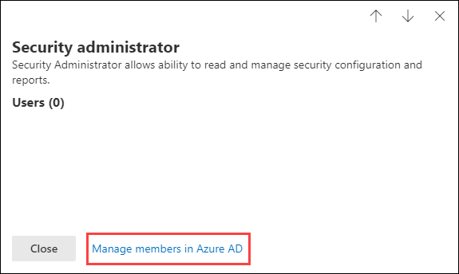
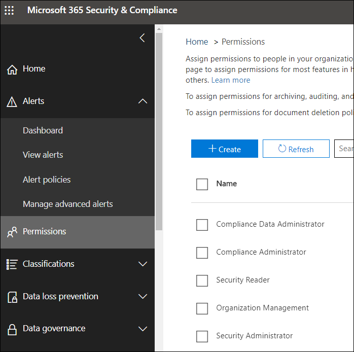

# Permissions in the Microsoft 365 compliance center and Microsoft 365 security center

[!INCLUDE [Microsoft 365 Defender rebranding](../includes/microsoft-defender-for-office.md)]

**Applies to**
- [Exchange Online Protection](exchange-online-protection-overview.md)
- [Microsoft Defender for Office 365 plan 1 and plan 2](defender-for-office-365.md)
- [Microsoft 365 Defender](../mtp/microsoft-threat-protection.md)

Your organization needs to manage security and compliance scenarios that span all the Microsoft 365 services. And you need the flexibility to give the right admin permissions to the right people in your organization's IT group. By using the Microsoft 365 security center or Microsoft 365 compliance center, you can manage permissions centrally for all tasks related to security or compliance.

After a global administrator adds users to these admin roles, these admin will have access to features and data that span all services in Microsoft 365, such as the Microsoft 365 security center, Microsoft 365 compliance center, Azure, Office 365, and Enterprise Mobility + Security.

## What the Microsoft 365 roles are

The roles that appear in the Microsoft 365 compliance center and Microsoft 365 security center are Azure Active Directory roles. These roles are designed to align with job functions in your organization's IT group, making it easy to give a person all the permissions necessary to get their job done.

****

|Role|Description|
|---|---|
|**Global administrator**|Access to all administrative features in all Microsoft 365 services. Only global administrators can assign other administrator roles. For more information, see [Global Administrator / Company Administrator](https://docs.microsoft.com/azure/active-directory/roles/permissions-reference#global-administrator--company-administrator).|
|**Compliance data administrator**|Keep track of your organization's data across Microsoft 365, make sure it's protected, and get insights into any issues to help mitigate risks. For more information, see [Compliance Data Administrator](https://docs.microsoft.com/azure/active-directory/roles/permissions-reference#compliance-data-administrator).|
|**Compliance administrator**|Help your organization stay compliant with any regulatory requirements, manage eDiscovery cases, and maintain data governance policies across Microsoft 365 locations, identities, and apps. For more information, see [Compliance Administrator](https://docs.microsoft.com/azure/active-directory/roles/permissions-reference#compliance-administrator).|
|**Security operator**|View, investigate, and respond to active threats to your Microsoft 365 users, devices, and content. For more information, see [Security Operator](https://docs.microsoft.com/azure/active-directory/roles/permissions-reference#security-operator).|
|**Security reader**|View and investigate active threats to your Microsoft 365 users, devices, and content, but (unlike the Security operator) they do not have permissions to respond by taking action. For more information, see [Security Reader](https://docs.microsoft.com/azure/active-directory/roles/permissions-reference#security-reader).|
|**Security administrator**|Control your organization's overall security by managing security policies, reviewing security analytics and reports across Microsoft 365 products, and staying up-to-speed on the threat landscape. For more information, see [Security Administrator](https://docs.microsoft.com/azure/active-directory/roles/permissions-reference#security-administrator).|
|**Global reader**|The read-only version of the **Global administrator** role. View all settings and administrative information across Microsoft 365. For more information, see [Global Reader](https://docs.microsoft.com/azure/active-directory/roles/permissions-reference#global-reader).|
|

## Global administrators can manage roles in Azure Active Directory

In the Microsoft 365 compliance center and Microsoft 365 security center, when you select a role, you can view its assignments. But to manage those assignments, you need to go to the Azure Active Directory.

For more information, see [View and assign administrator roles in Azure Active Directory](https://docs.microsoft.com/azure/active-directory/users-groups-roles/directory-manage-roles-portal).

## Managing roles in a service instead of Azure Active Directory

The roles that appear in the Microsoft 365 compliance center and Microsoft 365 security center also appear in the services where they have permissions. For example, you can see these roles in the Security & Compliance Center.

For information about how these roles are used in the Security & Compliance Center, see [Permissions in the Security & Compliance Center](permissions-in-the-security-and-compliance-center.md).

### Breaking inheritance

It's important to understand that you when you manage these roles in Azure Active Directory, you're doing so centrally for **all** Microsoft 365 services. However, when you manage a role in a specific service, such as the Security & Compliance Center, you're managing the role for **only** that specific service. The assignments and permissions for a role in a service override any permissions granted to the Azure Active Directory role.

This can be useful. For example, if a person is assigned to the Security administrator role, they don't have permissions to manage incidents. But you can use the permissions in Microsoft Defender for Endpoint to give them the specific permission for incident management in that service.

## Where to find role information for each Microsoft 365 service

By assigning a user to one of the Microsoft 365 compliance or security admin roles, you give that user permissions to a range of Microsoft 365 services. Use the links below to find more information about the specific permissions for a role in each service.

****

|Microsoft 365 service|Role info|
|---|---|
|Admin roles in Office 365 and Microsoft 365 for business plans|[Microsoft 365 admin roles](../../admin/add-users/about-admin-roles.md)|
|Azure Active Directory (Azure AD) and Azure AD Identity Protection|[Azure AD admin roles](https://docs.microsoft.com/azure/active-directory/users-groups-roles/directory-assign-admin-roles)|
|Microsoft Defender for Identity|[Microsoft Defender for Identity role groups](https://docs.microsoft.com/azure-advanced-threat-protection/atp-role-groups)|
|Azure Information Protection|[Azure AD admin roles](https://docs.microsoft.com/azure/active-directory/users-groups-roles/directory-assign-admin-roles)|
|Compliance Manager|[Compliance Manager](../../compliance/compliance-manager-setup.md#set-user-permissions-and-assign-roles)|
|Exchange Online|[Exchange role-based access control](https://docs.microsoft.com/exchange/permissions-exo/permissions-exo)|
|Intune|[Intune role-based access control](https://docs.microsoft.com/intune/role-based-access-control)|
|Managed Desktop|[Azure AD admin roles](https://docs.microsoft.com/azure/active-directory/users-groups-roles/directory-assign-admin-roles)|
|Microsoft Cloud App Security|[Role-based access control](https://docs.microsoft.com/cloud-app-security/manage-admins)|
|Security & Compliance Center|[Microsoft 365 admin roles](permissions-in-the-security-and-compliance-center.md)|
|Privileged Identity Management|[Azure AD admin roles](https://docs.microsoft.com/azure/active-directory/users-groups-roles/directory-assign-admin-roles)|
|Secure Score|[Azure AD admin roles](https://docs.microsoft.com/azure/active-directory/users-groups-roles/directory-assign-admin-roles)|
|SharePoint Online|[Azure AD admin roles](https://docs.microsoft.com/azure/active-directory/users-groups-roles/directory-assign-admin-roles) 
 [About the SharePoint admin role in Office 365](https://docs.microsoft.com/sharepoint/sharepoint-admin-role)|
|Teams/Skype for Business|[Azure AD admin roles](https://docs.microsoft.com/azure/active-directory/users-groups-roles/directory-assign-admin-roles)|
|Microsoft Defender for Endpoint|[Microsoft Defender for Endpoint role-based access control](https://docs.microsoft.com/windows/security/threat-protection/windows-defender-atp/rbac-windows-defender-advanced-threat-protection)|
|

## Coming soon

We're still working on permissions in the Microsoft 365 compliance center and Microsoft 365 security center. For example, we're currently working on support for the ability to:

- Manage roles in the Microsoft 365 compliance center and Microsoft 365 security center, instead of going to Azure Active Directory.
- Customize roles by adding or removing specific permissions.
- Create custom roles with permissions that you choose.
