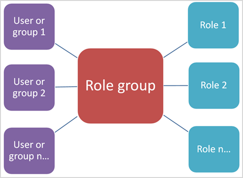
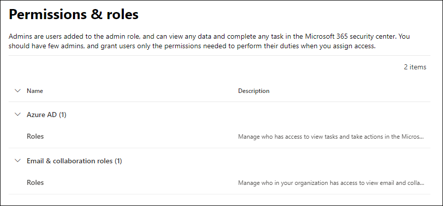

# Permissions in the Microsoft 365 security center

[!INCLUDE [Microsoft 365 Defender rebranding](../includes/microsoft-defender-for-office.md)]

**Applies to**
- [Exchange Online Protection](exchange-online-protection-overview.md)
- [Microsoft Defender for Office 365 plan 1 and plan 2](defender-for-office-365.md)
- [Microsoft 365 Defender](../defender/microsoft-365-defender.md)

You need to manage security scenarios that span all the Microsoft 365 services. And you need the flexibility to give the right admin permissions to the right people in your organization.

The Microsoft 365 security center at <https://security.microsoft.com> supports directly managing permissions for users who perform security tasks in Microsoft 365. By using the security center to manage permissions, you can manage permissions centrally for all tasks related to security.

To manage permissions in the security center, go to **Permissions & roles** or <https://security.microsoft.com/securitypermissions>. You need to be a **global administrator** or a member of the **Organization Management** role group in the security center. Specifically, the **Role Management** role allows users to view, create, and modify role groups in the security center, and by default, that role is assigned only to the **Organization Management** role group.

## Relationship of members, roles, and role groups

Permissions in the security center are based on the role-based access control (RBAC) permissions model. RBAC is the same permissions model that's used by most Microsoft 365 services, so if you're familiar with the permission structure in these services, granting permissions in the security center will be very familiar.

A **role** grants the permissions to do a set of tasks.

A **role group** is a set of roles that lets people do their jobs in the security center. For example, the Attack Simulator Administrators role group includes the Attack Simulator Admin role to create and manage all aspects of attack simulation training.

The security center includes default role groups for the most common tasks and functions that you'll need to assign. Generally, we recommend simply adding individual users as **members** to the default role groups.

## Roles and role groups in the security center

The following types of roles and role groups are available in **Permissions & roles** in the security center:

- **Azure AD roles**: You can view the roles and assigned users, but you can't manage them directly in the security center. Azure AD roles are central roles that assign permissions for **all** Microsoft 365 services.

- **Email & collaboration roles**: These are the same role groups that are available in the Security & Compliance Center, but you can manage them directly in the security center. The permissions that you assign here are specific to the Microsoft 365 security center, the Microsoft 365 compliance center, and the Security & Compliance Center, and don't cover all of the permissions that are needed in other Microsoft 365 workloads.

### Azure AD roles in the security center

When you go **Email & collaboration roles** \> **Permissions & roles** \> **Azure AD roles** \> **Roles** (or directly to <https://security.microsoft.com/aadpermissions>) you'll see the Azure AD roles that are described in this section.

When you select a role, a details flyout that contains the description of the role and the user assignments appears. But to manage those assignments, you need to click **Manage members in Azure AD** in the details flyout.

For more information, see [View and assign administrator roles in Azure Active Directory](/azure/active-directory/users-groups-roles/directory-manage-roles-portal).

 

****

|Role|Description|
|---|---|
|**Global administrator**|Access to all administrative features in all Microsoft 365 services. Only global administrators can assign other administrator roles. For more information, see [Global Administrator / Company Administrator](/azure/active-directory/roles/permissions-reference#global-administrator--company-administrator).|
|**Compliance data administrator**|Keep track of your organization's data across Microsoft 365, make sure it's protected, and get insights into any issues to help mitigate risks. For more information, see [Compliance Data Administrator](/azure/active-directory/roles/permissions-reference#compliance-data-administrator).|
|**Compliance administrator**|Help your organization stay compliant with any regulatory requirements, manage eDiscovery cases, and maintain data governance policies across Microsoft 365 locations, identities, and apps. For more information, see [Compliance Administrator](/azure/active-directory/roles/permissions-reference#compliance-administrator).|
|**Security operator**|View, investigate, and respond to active threats to your Microsoft 365 users, devices, and content. For more information, see [Security Operator](/azure/active-directory/roles/permissions-reference#security-operator).|
|**Security reader**|View and investigate active threats to your Microsoft 365 users, devices, and content, but (unlike the Security operator) they do not have permissions to respond by taking action. For more information, see [Security Reader](/azure/active-directory/roles/permissions-reference#security-reader).|
|**Security administrator**|Control your organization's overall security by managing security policies, reviewing security analytics and reports across Microsoft 365 products, and staying up-to-speed on the threat landscape. For more information, see [Security Administrator](/azure/active-directory/roles/permissions-reference#security-administrator).|
|**Global reader**|The read-only version of the **Global administrator** role. View all settings and administrative information across Microsoft 365. For more information, see [Global Reader](/azure/active-directory/roles/permissions-reference#global-reader).|
|**Attack simulation administrator**|Create and manage all aspects of [attack simulation](attack-simulation-training.md) creation, launch/scheduling of a simulation, and the review of simulation results. For more information, see [Attack Simulation Administrator](/azure/active-directory/roles/permissions-reference#attack-simulation-administrator).|
|**Attack payload author**|Create attack payloads but not actually launch or schedule them. For more information, see [Attack Payload Author](/azure/active-directory/roles/permissions-reference#attack-payload-author).|
|

### Email & collaboration roles in the security center

When you go to **Email & collaboration roles** \> **Permissions & roles** \> **Email & collaboration roles** \> **Roles** (or directly to <https://security.microsoft.com/emailandcollabpermissions>) you'll see the same role groups that are available in the Security & Compliance Center.

For complete information about these role groups, see [Permissions in the Security & Compliance Center](permissions-in-the-security-and-compliance-center.md)

#### Modify Email & collaboration role membership in the security center

1. In the security center, go to **Email & collaboration roles** \> **Permissions & roles** \> **Email & collaboration roles** \> **Roles**.

2. In the **Permissions** page that opens, select the role group that you want to modify from the list. You can click on the **Name** column header to sort the list by name, or you can click **Search**  to find the role group.

3. In the role group details flyout that appears, click **Edit** in the **Members** section.

4. In the **Editing choose members** page that appears, do one of the following steps:
   - If there are no role group members, click **Choose members**.
   - If there are existing role group members, click **Edit**

5. In the **Choose members** flyout that appears, do one of the following steps:

   - Click **Add**. In the list of users that appears, select one or more users. Or, you can click **Search**  to find and select users.

     When you've selected the users that you want to add, click **Add**.

   - Click **Remove**. Select one or more of the existing members. Or, you can click **Search**  to find and select members.

     When you've selected the users that you want to remove, click **Remove**.

6. Back on the **Choose members** flyout, click **Done**.

7. Back on the **Editing choose members** page, click **Save**.

8. Back on the role group details flyout, click **Done**.
