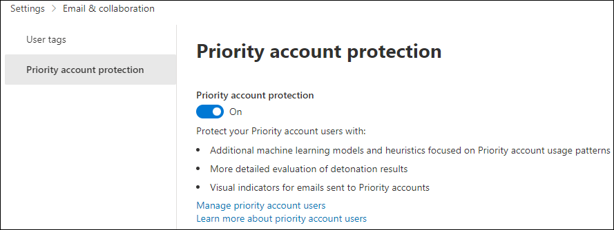

# Configure and review Priority accounts in Microsoft Defender for Office 365

[!INCLUDE [MDO Trial banner](../includes/mdo-trial-banner.md)]

**Applies to**
- [Microsoft Defender for Office 365 plan 1 and plan 2](defender-for-office-365.md)
- [Microsoft 365 Defender](../defender/microsoft-365-defender.md)

In every organization, there are people that are critical, like executives, leaders, managers, or other users who have access to sensitive, proprietary, or high priority information. You can tag these users within Microsoft Defender for Office 365 as priority accounts, allowing security teams to prioritize their focus on these critical individuals. With differentiated protection for priority accounts, users tagged as priority accounts will receive a higher level of protection against threats.

Priority accounts are targeted by attackers more often and are generally attacked with more sophisticated techniques. Differentiated protection for priority accounts focuses on this specific user set and provides higher level of protection using enhanced machine learning models. This differentiation in learning and message handling provides the highest level of protection for these accounts and helps maintain a low false positive rate, as a high rate of false positives can also have a negative impact on these users.

## Configure Priority account protection

Priority account protection is turned on by default for pre-identified critical users.

You need to be assigned permissions before you can do the procedures in this article. You have the following options:

- [Exchange Online RBAC](/exchange/permissions-exo/permissions-exo): Membership in the **Organization Management** or **Security Administrator** role groups.
- [Azure AD RBAC](../../admin/add-users/about-admin-roles.md): Membership in the **Global Administrator** or **Security Administrator** roles gives users the required permissions _and_ permissions for other features in Microsoft 365.

1. In the Microsoft 365 Defender portal at <https://security.microsoft.com>, go to **Settings** \> **Email & collaboration** \> **Priority account protection**. To go directly to the **Priority account protection** page, use <https://security.microsoft.com/securitysettings/priorityAccountProtection>.

2. On the **Priority account protection** page, turn on **Priority account protection** (:::image type="icon" source="../../media/scc-toggle-on.png" border="false":::).

    > [!div class="mx-imgBorder"]
    > 

> [!NOTE]
> We don't recommend disabling or turning off priority account protection.

If you want to use Exchange Online PowerShell to turn on priority account protection, do the following steps:

1. [Connect to Exchange Online PowerShell](/powershell/exchange/connect-to-exchange-online-powershell) and run the following command:

   ```powershell
   Set-EmailTenantSettings -EnablePriorityAccountProtection $true
   ```

2. To verify that priority account protection is turned on, run the following command to verify the EnablePriorityAccountProtection property value:

   ```powershell
   Get-EmailTenantSettings | Format-List Identity,EnablePriorityAccountProtection
   ```

   The value True means priority account protection is turned on. The value False means priority account protection is turned off.

### Assign the Priority account tag to users

Microsoft Defender for Office 365 supports priority accounts as tags that can be used as filters in alerts, reports, incidents, and more.

For more information, see [User tags in Microsoft Defender for Office 365](user-tags-about.md).

> [!NOTE]
> Currently, you can only apply user tags to mailbox users.
>
> Your organization can tag a maximum of 250 users using the Priority account tag.
>
> Each custom tag has a maximum of 10,000 users per tag and your organization can create up to 500 custom tags.

## Review differentiated protection from priority account protection

The affects of priority account protection are visible in the following features:

- [Alerts](alerts.md)
- [Custom alert policies](../../compliance/alert-policies.md#view-alerts)
- [Threat Explorer and real-time detections](threat-explorer-about.md)
- [Compromised user report](reports-email-security.md#compromised-users-report)
- [Email entity page](mdo-email-entity-page.md)
- [Threat protection status report](reports-email-security.md#threat-protection-status-report)
- [Top senders and recipients report](reports-email-security.md#top-senders-and-recipients-report)
- [Attack simulation](attack-simulation-training-simulations.md#target-users)
- [Campaign Views](campaigns.md)
- [Admin submissions and user reported messages](submissions-admin.md)
- [Quarantine](quarantine-about.md)

### Threat protection status report

The **Threat protection status** report is a single view that brings together information about malicious content and malicious email detected and blocked by Microsoft Defender for Office 365.

To view the report, do the following steps:

1. In the Microsoft 365 Defender portal at <https://security.microsoft.com>, go to **Reports** \> **Email & collaboration** \> **Email & collaboration reports** \> find **Threat protection status** and then click **View details**. To go directly to the report, use <https://security.microsoft.com/reports/TPSAggregateReportATP>.

2. The default view is **View data by Overview**. Click on this value to change the view by selecting one of the following values:
   - **View data by Email \> Phish**
   - **View data by Email \> Malware**
   - **View data by Email \> Spam**

3. Click  **Filter**.

4. On the **Filters** flyout that opens, in the **Priority accounts** section, select **Yes**, **No** or both values.

   

### Threat Explorer

Context filter within Threat Explorer helps search for emails where priority account protection was involved in the detection of the message. This allows security operations teams to be able to see the value provided by this protection. You can still filter messages by priority account tag to find all messages for the specific set of users.

To view the extra protection in Threat Explorer, do the following steps:

1. In the Microsoft 365 Defender portal at <https://security.microsoft.com>, go to **Email & collaboration** \> **Explorer**. To go directly to the **Threat Explorer** page, use <https://security.microsoft.com/threatexplorer>.

2. Select **Context** from the dropdown, and then select the checkbox next to **Priority account protection**.

> [!div class="mx-imgBorder"]
> 

### Email entity page

The email entity page is available in **Threat Explorer**. Select the subject of an email you're investigating. A gold bar will display at the top of the email flyout for that mail. Select to view the new page.

The tabs along the top of the entity page will allow you to investigate email efficiently. Click the **Analysis** tab. Priority account protection is now listed under **Threat detection details**.

## More information

- [User tags in Microsoft Defender for Office 365](user-tags-about.md)
- [Manage and monitor priority accounts](../../admin/setup/priority-accounts.md)
