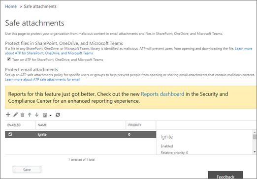

# Protect against threats

Here's a quick-start guide that breaks the configuration of Advanced Threat Protection into chunks. If you're new to threat protection features in Office 365, not sure where to begin, or if you learn best by *doing*, use this guidance as a checklist and a starting point.

> [!IMPORTANT]
> **Initial recommended settings are included for each kind of policy; however, many options are available, and you can adjust your settings to meet your specific organization's needs**. Allow approximately 30 minutes for your policies or changes to work their way through your datacenter.

## Requirements

### Subscriptions

Threat protection features are included in *all* Microsoft or Office 365 subscriptions; however, some subscriptions have advanced features. The table below lists the protection features included in this article together with the minimum subscription requirements.

> [!TIP]
> Notice that, beyond the directions to turn on auditing, *steps* start with configuring the 'anti' features (anti-malware, anti-phishing, and anti-spam), which are marked as part of Office 365 Exchange Online Protection (**EOP**). This can seem odd until you remember Advanced Threat Protection (**ATP**) contains, and builds on, EOP.

****

|Protection type|Subscription requirement|
|---|---|
|Audit logging (used for reporting purposes)|[Exchange Online](https://docs.microsoft.com/office365/servicedescriptions/exchange-online-service-description/exchange-online-service-description)|
|Anti-malware protection|[Exchange Online Protection](https://docs.microsoft.com/office365/servicedescriptions/exchange-online-protection-service-description/exchange-online-protection-service-description) (**EOP**)|
|Anti-phishing protection|[EOP](https://docs.microsoft.com/office365/servicedescriptions/exchange-online-protection-service-description/exchange-online-protection-service-description)|
|Anti-spam protection|[EOP](https://docs.microsoft.com/office365/servicedescriptions/exchange-online-protection-service-description/exchange-online-protection-service-description)|
|Zero-hour auto purge (for email)|[EOP](https://docs.microsoft.com/office365/servicedescriptions/exchange-online-protection-service-description/exchange-online-protection-service-description)|
|Protection from malicious URLs and files in email and Office documents|[Office 365 Advanced Threat Protection](https://docs.microsoft.com/office365/servicedescriptions/office-365-advanced-threat-protection-service-description) (**ATP**)|
|Turn on ATP for SharePoint, OneDrive, and Microsoft Teams workloads| [ATP](https://docs.microsoft.com/microsoft-365/security/office-365-security/protect-against-threats?view=o365-worldwide)|
|Advanced anti-phishing protection|[ATP](https://docs.microsoft.com/office365/servicedescriptions/office-365-advanced-threat-protection-service-description)|

### Roles and permissions

To configure ATP policies, you must be assigned an appropriate role in the [Security & Compliance Center](https://docs.microsoft.com/office365/servicedescriptions/office-365-platform-service-description/office-365-securitycompliance-center). Take a look at the table below for roles that can do these actions.

****

|Role or role group|Where to learn more|
|---|---|
|global administrator|[About Microsoft 365 admin roles](https://docs.microsoft.com/microsoft-365/admin/add-users/about-admin-roles)|
|Security Administrator|[Administrator role permissions in Azure Active Directory](https://docs.microsoft.com/azure/active-directory/users-groups-roles/directory-assign-admin-roles)|
|Exchange Online Organization Management|[Permissions in Exchange Online](https://docs.microsoft.com/exchange/permissions-exo/permissions-exo)  and  [Exchange Online PowerShell](https://docs.microsoft.com/powershell/exchange/exchange-online-powershell)|
|

To learn more, see [Permissions in the Security &amp; Compliance Center](permissions-in-the-security-and-compliance-center.md).

## Before you begin, turn on Audit logging for reporting and investigation

Start your audit logging early. You'll need auditing to be **ON** for certain of the steps that follow. Audit logging is available in subscriptions that include [Exchange Online](https://docs.microsoft.com/office365/servicedescriptions/exchange-online-service-description/exchange-online-service-description). In order to view data in threat protection reports, such as the [Security Dashboard](security-dashboard.md), [email security reports](view-email-security-reports.md), and [Explorer](threat-explorer.md), audit logging must be *On*. To learn more, see [Turn audit log search on or off](../../compliance/turn-audit-log-search-on-or-off.md).

## Part 1 - Anti-malware protection

[Anti-malware protection](anti-malware-protection.md) is available in subscriptions that include [EOP](https://docs.microsoft.com/office365/servicedescriptions/exchange-online-protection-service-description/exchange-online-protection-service-description).

1. In the [Security & Compliance Center](https://protection.office.com), choose **Threat management** > **Policy** > **Anti-malware**.

2. Double-click the **Default** policy, and then choose **settings**.

3. Specify the following settings:

    - In the **Malware Detection Response** section, keep the default setting of **No**.

    - In the **Common Attachment Types Filter** section, choose **On**.

4. Click **Save**.

To learn more about anti-malware policy options, see [Configure anti-malware policies](configure-anti-malware-policies.md).

## Part 2 - Anti-phishing protection

[Anti-phishing]

[Anti-phishing protection](anti-phishing-protection.md) is available in subscriptions that include [EOP](https://docs.microsoft.com/office365/servicedescriptions/exchange-online-protection-service-description/exchange-online-protection-service-description). Advanced anti-phishing protection is available in [ATP](https://docs.microsoft.com/office365/servicedescriptions/office-365-advanced-threat-protection-service-description).

The following procedure describes how to configure an ATP anti-phishing policy. The steps are similar for configuring an anti-phishing policy (without ATP).

1. In the [Security & Compliance Center](https://protection.office.com), choose **Threat management** > **Policy** > **ATP anti-phishing**.

2. Click **Default policy**.

3. In the **Impersonation** section, click **Edit**, and then specify the following settings:

   - On the **Add users to protect** tab, turn *On* protection. Then add users, such as your organization's board members, your CEO, CFO, and other senior leaders. (You can type an individual email address, or click to display a list.)

   - On the **Add domains to protect** tab, turn on **Automatically include the domains I own**. If you have custom domains, add them now.

   - On the **Actions** tab, select **Quarantine the message** for both the **impersonated user** and **impersonated domain** options. Also, turn on impersonation safety tips.

   - On the **Mailbox intelligence** tab, make sure mailbox intelligence is turned on and turn on mailbox intelligence-based impersonation protection. In the **If email is sent by an impersonated user** list, choose **Quarantine the message**.

   - On the **Add trusted senders and domains** tab, specify any trusted senders or domains that you want to add.

   - **Save** on the **Review your settings** tab after you've reviewed your settings.

4. In the **Spoof** section, click **Edit**, and then specify the following settings:

   - On the **Spoofing filter settings** tab, make sure anti-spoofing protection is turned on.

   - On the **Actions** tab, choose **Quarantine the message**.

   - **Save** on the **Review your settings** tab after you have reviewed your changes. (If you didn't make any changes, **Cancel**.)

5. Close the default policy settings page.

To learn more about your anti-phishing policy options, see [Configure ATP anti-phishing policies](configure-atp-anti-phishing-policies.md).

## Part 3 - Anti-spam protection

[Anti-spam protection](anti-spam-protection.md) is available in subscriptions that include [EOP](https://docs.microsoft.com/office365/servicedescriptions/exchange-online-protection-service-description/exchange-online-protection-service-description).

1. In the [Security & Compliance Center](https://protection.office.com), choose **Threat management** > **Policy** > **Anti-spam**.

2. On the **Custom** tab, turn on Custom settings.

3. Expand **Default spam filter policy**, click **Edit policy**, and then specify the following settings:

   - In the **Spam and bulk actions** section, set the threshold to a value of 5 or 6.

   - In the **Allow lists** section, review (and/or edit) your allowed senders and domains.

4. Click **Save**.

To learn more about your anti-spam policy options, see [Configure anti-spam policies in EOP](configure-your-spam-filter-policies.md).

## Part 4 - Protection from malicious URLs and files

Time-of-click protection from malicious URLs and files is available in subscriptions that include [Office 365 ATP](https://docs.microsoft.com/office365/servicedescriptions/office-365-advanced-threat-protection-service-description) (ATP). It's set up through [ATP Safe Attachments](atp-safe-attachments.md) and [ATP Safe Links](atp-safe-links.md) policies.

### ATP Safe Attachments policies

To set up [ATP Safe Attachments](atp-safe-attachments.md), you must define at least one ATP Safe Attachments policy.

1. In the [Security & Compliance Center](https://protection.office.com), choose **Threat management** > **Policy** > **ATP safe attachments**.

2. Select the option **Turn on ATP for SharePoint, OneDrive, and Microsoft Teams**.

3. In the **Protect email attachments** section, click the plus sign (**+**).

4. Specify the following settings:

   - In the **Name** box, type `Block malware`.

   - In the response section, choose **Block**.

   - In the **Redirect attachment** section, select the option **Enable redirect**. Specify the email address for your organization's security administrator or operator, who will review detected files.

   - In the **Applied to** section, choose **The recipient domain is**. Then, select your domain, choose **Add**, and then **OK**.

5. **Save**.

6. (**Recommended additional step**) As a global administrator or a SharePoint Online administrator, run the **[Set-SPOTenant](https://docs.microsoft.com/powershell/module/sharepoint-online/Set-SPOTenant)** cmdlet with the **DisallowInfectedFileDownload** parameter set to  *true* for your Microsoft 365 environment. (This prevents people from opening, moving, copying, or sharing files that are detected as malicious.)

To learn more, see [Set up Office 365 ATP Safe Attachments policies](set-up-atp-safe-attachments-policies.md) and [Turn on Office 365 ATP for SharePoint, OneDrive, and Microsoft Teams](turn-on-atp-for-spo-odb-and-teams.md).

### ATP Safe Links policies

To set up [ATP Safe Links](atp-safe-links.md), review and edit your default policy, and add a policy for specific users.

1. In the [Security & Compliance Center](https://protection.office.com), choose **Threat management** > **Policy** > **ATP Safe Links**.

2. Double-click the **Default** policy.

3. In the **Use safe links in** section, select the option **Microsoft 365 Apps for enterprise, Office for iOS and Android**, and then click **Save**.

4. In the **Policies that apply to specific recipients** section, click the plus sign (**+**).

5. Specify the following settings:

   - In the **Name** box, type a name, such as `Safe Links`.

   - In the **Select the action** section, choose **On**.

   - Select these options:

     - **Use safe attachments to scan downloadable content**

     - **Apply safe links to email messages sent within the organization**

     - **Do not let users click through safe links to original URL**

   - In the **Applied to** section, choose **The recipient domain is**. Then, select your domain, choose **Add**, and then **OK**.

6. **Save**.

To learn more, see [Set up Office 365 ATP Safe Links policies](set-up-atp-safe-links-policies.md).

## Part 5 - Turn on ATP for SharePoint, OneDrive, and Microsoft Teams workloads

Workloads like SharePoint, OneDrive, and Teams are built for collaboration. Using ATP helps with blocking and detection of files that are identified as malicious in team sites and document libraries. You can read more about how that works [here](https://docs.microsoft.com/microsoft-365/security/office-365-security/atp-for-spo-odb-and-teams?view=o365-worldwide).

> [!IMPORTANT]
> **Before you begin this procedure, make sure that audit logging is already turned on for your Microsoft 365 environment**. This is typically done by someone who has the Audit Logs role assigned in Exchange Online. For more information, see [Turn audit log search on or off](../../compliance/turn-audit-log-search-on-or-off.md)!

1. Go to <https://protection.office.com>, and sign in with your work or school account.

2. In the Security & Compliance Center, in the left navigation pane, under **Threat management**, choose **Policy** \> **Safe Attachments**.

   

3. Select **Turn on ATP for SharePoint, OneDrive, and Microsoft Teams**.

   

4. **Save**.

5. Review (and, as appropriate, edit) your organization's [Safe Attachments policies](set-up-atp-safe-attachments-policies.md) and [Safe Links policies](set-up-atp-safe-links-policies.md).

6. (Recommended) As a global administrator or a SharePoint Online administrator, run the **[Set-SPOTenant](https://docs.microsoft.com/powershell/module/sharepoint-online/Set-SPOTenant)** cmdlet with the _DisallowInfectedFileDownload_ parameter set to *true*.

   - Setting the parameter to *true* blocks all actions (except Delete) for detected files. People cannot open, move, copy, or share detected files.

   - Setting the parameter to *false* blocks all actions except Delete and Download. People can choose to accept the risk and download a detected file.
   > [!TIP] To learn more about using PowerShell with Microsoft 365, see [Manage Microsoft 365 with PowerShell](https://docs.microsoft.com/microsoft-365/enterprise/manage-microsoft-365-with-microsoft-365-powershell).

7. Allow up to 30 minutes for your changes to spread to all Microsoft 365 datacenters.

#### Now set up alerts for detected files

To receive notification when a file in SharePoint Online, OneDrive for Business, or Microsoft Teams has been identified as malicious, you can set up an alert.

1. In the [Security & Compliance Center](https://protection.office.com), choose **Alerts** \> **Manage alerts**.

2. Choose **New alert policy**.

3. Specify a name for the alert. For example, you could type Malicious Files in Libraries.

4. Type a description for the alert. For example, you could type Notifies admins when malicious files are detected in SharePoint Online, OneDrive, or Microsoft Teams.

5. In the **Send this alert when...** section, set:

   a. In the **Activities** list, choose **Detected malware in file**.

   b. Leave the **Users** field empty.

6. In the **Send this alert to...** section, select one or more global administrators, security administrators, or security readers who should receive notification when a malicious file is detected.

7. **Save**.

To learn more about alerts, see [Create activity alerts in the Security & Compliance Center](../../compliance/create-activity-alerts.md).

> [!NOTE]
> When you're finished configuring, use these links to start workload investigations:
>- [View information about malicious files detected in SharePoint, OneDrive, or Microsoft Teams](malicious-files-detected-in-spo-odb-or-teams.md)
>- [What to do when a malicious file is found in SharePoint Online, OneDrive, or Microsoft Teams](https://support.microsoft.com/office/01e902ad-a903-4e0f-b093-1e1ac0c37ad2)
>- [Manage quarantined messages and files as an administrator in Microsoft 365](manage-quarantined-messages-and-files.md) 

## Part 6 - Additional settings to configure

Along with configuring protection from malware, malicious URLs and files, phishing, and spam, we recommend you configure zero-hour auto purge.

### Zero-hour auto purge for email in EOP

[Zero-hour auto purge](zero-hour-auto-purge.md) (ZAP) is available in subscriptions that include [EOP](https://docs.microsoft.com/office365/servicedescriptions/exchange-online-protection-service-description/exchange-online-protection-service-description). This protection is turned on by default; however, the following conditions must be met for protection to be in effect:

- Spam actions are set to **Move message to Junk Email folder** in [anti-spam policies](anti-spam-protection.md).

- Users have kept their default [junk email settings](ensure-that-spam-is-routed-to-each-user-s-junk-email-folder.md), and haven't turned off junk email protection.

To learn more, see [Zero-hour auto purge - protection against spam and malware](zero-hour-auto-purge.md).

## Post-setup tasks

After configuring the threat protection features, make sure to monitor how those features are working! Review and revise your policies so that they do what you need them to. Also, watch for new features and service updates that can add value.

****

|What to do|Resources to learn more|
|---|---|
|See how threat protection features are working for your organization by viewing reports|[Security dashboard](security-dashboard.md) [Email security reports](view-email-security-reports.md) [Reports for Office 365 ATP](view-reports-for-atp.md) [Threat Explorer](threat-explorer.md)|
|Periodically review and revise your threat protection policies as needed|[Secure Score](../mtp/microsoft-secure-score.md) [Smart reports and insights](reports-and-insights-in-security-and-compliance.md) [Microsoft 365 threat investigation and response features](keep-users-safe-with-office-365-ti.md)|
|Watch for new features and service updates|[Standard and Targeted release options](https://docs.microsoft.com/microsoft-365/admin/manage/release-options-in-office-365) [Message Center](https://docs.microsoft.com/microsoft-365/admin/manage/message-center) [Microsoft 365 Roadmap](https://www.microsoft.com/microsoft-365/roadmap?filters=&searchterms=advanced%2Cthreat%2Cprotection) [Service Descriptions](https://docs.microsoft.com/office365/servicedescriptions/office-365-service-descriptions-technet-library)|
|Learn about recommended Standard and Strict security configurations for EOP and ATP | [Recommended settings for EOP and Office 365 ATP security](https://docs.microsoft.com/microsoft-365/security/office-365-security/recommended-settings-for-eop-and-office365-atp?view=o365-worldwide) |
