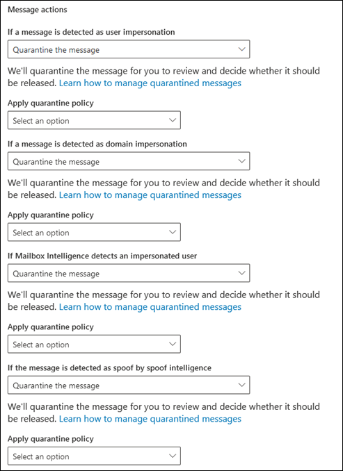
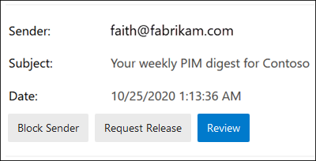

# Quarantine policies

> [!NOTE]
> The features that are described in this article are currently in Preview, aren't available to everyone, and are subject to change.

Quarantine policies (formerly known as _quarantine tags_) in Exchange Online Protection (EOP) and Microsoft Defender for Office 365 allow admins to control what users are able to do to quarantined messages based on why the message was quarantined.

Traditionally, users have been allowed or denied levels of interactivity for quarantine messages based on why the message was quarantined. For example, users can view and release messages that were quarantined by anti-spam filtering as spam or bulk, but they can't view or release messages that were quarantined as high confidence phishing or malware.

For [supported protection features](#step-2-assign-a-quarantine-policy-to-supported-features), quarantine policies specify what users are allowed to do to their own messages (messages where they're a recipient) in quarantine and in _quarantine notifications_. Quarantine notifications are the replacement for end-user spam notifications. These notifications are now controlled by quarantine policies, and contain information about quarantined messages for all supported protection features (not just anti-spam policy verdicts).

Default quarantine policies that enforce the historical user capabilities are automatically assigned to actions in the supported protection features that quarantine messages. Or, you can create custom quarantine policies and assign them to the supported protection features to allow or prevent users from performing specific actions on those types of quarantined messages.

The individual quarantine policy permissions are combined into the following preset permission groups:

- No access
- Limited access
- Full access

The individual quarantine policy permissions that are contained in the preset permission groups are described in the following table:

<br>

****

|Permission|No access|Limited access|Full access|
|---|:---:|:---:|:---:|
|**Block sender** (_PermissionToBlockSender_)||||
|**Delete** (_PermissionToDelete_)||||
|**Preview** (_PermissionToPreview_)||||
|**Allow recipients to release a message from quarantine** (_PermissionToRelease_)||||
|**Allow recipients to request a message to be released from quarantine** (_PermissionToRequestRelease_)||||
|

The default quarantine policies and their associated permission groups are described in the following table:

<br>

|Default quarantine policy|Permission group used|
|---|---|
|AdminOnlyAccessPolicy|No access|
|DefaultFullAccessPolicy|Full access|
|

If you don't like the default permissions in the preset permission groups, you can use custom permissions when you create or modify custom quarantine policies. For more information about what each permission does, see the [Quarantine policy permission details](#quarantine-policy-permission-details) section later in this article.

You create and assign quarantine policies in the Microsoft 365 Defender portal or in PowerShell (Exchange Online PowerShell for Microsoft 365 organizations with Exchange Online Mailboxes; standalone EOP PowerShell in EOP organizations without Exchange Online mailboxes).

## What do you need to know before you begin?

- You open the Microsoft 365 Defender portal at <https://security.microsoft.com>. Or to go directly to the **Quarantine policies** page, open <https://security.microsoft.com/quarantinePolicies>.

- To connect to Exchange Online PowerShell, see [Connect to Exchange Online PowerShell](/powershell/exchange/connect-to-exchange-online-powershell). To connect to standalone EOP PowerShell, see [Connect to Exchange Online Protection PowerShell](/powershell/exchange/connect-to-exchange-online-protection-powershell).

- To view, create, modify, or remove quarantine policies, you need to be a member of the **Organization Management**, **Security Administrator**, or **Quarantine Administrator** roles in the Microsoft 365 Defender portal. For more information, see [Permissions in the Microsoft 365 Defender portal](permissions-microsoft-365-security-center.md).

## Step 1: Create quarantine policies in the Microsoft 365 Defender portal

1. In the Microsoft 365 Defender portal, go to **Email & collaboration** \> **Threat policies** \> **Rules** section \> **Quarantine policies** and then select **Quarantine policies**.

2. On the **Quarantine policy** page, click  **Add custom policy**.

3. The **New policy** wizard opens. On the **Policy name** page, enter a brief but unique name in the **Policy name** box. You'll need to identify and select the quarantine policy by name in upcoming steps. When you're finished, click **Next**.

4. On the **Recipient message access** page, select one of the following values:
   - **Limited access**: The individual permissions that are included in this permission group are described earlier in this article.
   - **Set specific access (Advanced)**: Use this value to specify custom permissions. Configure the following settings that appear:
     - **Select release action preference**: Select one of the following values:
       - Blank: This is the default value.
       - **Allow recipients to release a message from quarantine**
       - **Allow recipients to request a message to be released from quarantine**
     - **Select additional actions recipients can take on quarantined messages**: Select some, all, or none of the following values:
       - **Delete**
       - **Preview**
       - **Block sender**

   These permissions and their effect on quarantined messages and in quarantine notifications are described in the [Quarantine policy permission details](#quarantine-policy-permission-details) section later in this article.

   When you're finished, click **Next**.

5. On the **End-user spam notification** page, select **Enable** to enable quarantine notifications (formerly known as end-user spam notifications). When you're finished, click **Next**.

6. On the **Review policy** page, review your settings. You can select **Edit** in each section to modify the settings within the section. Or you can click **Back** or select the specific page in the wizard.

   When you're finished, click **Submit**.

7. On the confirmation page that appears, click **Done**.

Now you're ready to assign the quarantine policy to a quarantine feature as described in the [Step 2](#step-2-assign-a-quarantine-policy-to-supported-features) section.

### Create quarantine policies in PowerShell

If you'd rather use PowerShell to create quarantine policies, connect to Exchange Online PowerShell or Exchange Online Protection PowerShell and use the **New-QuarantinePolicy** cmdlet. You have two different methods to choose from:

- [Use the _EndUserQuarantinePermissionsValue_ parameter](#use-the-enduserquarantinepermissionsvalue-parameter).
- [Use the _EndUserQuarantinePermissions_ parameter](#use-the-enduserquarantinepermissions-parameter).

These methods are described in the following sections.

#### Use the EndUserQuarantinePermissionsValue parameter

To create a quarantine policy using the _EndUserQuarantinePermissionsValue_ parameter, use the following syntax:

```powershell
New-QuarantinePolicy -Name "<UniqueName>" -EndUserQuarantinePermissionsValue <0 to 236>
```

The _EndUserQuarantinePermissionsValue_ parameter uses a decimal value that's converted from a binary value. The binary value corresponds to the available end-user quarantine permissions in a specific order. For each permission, the value 1 equals True and the value 0 equals False.

The required order and values for each individual permission in preset permission groups are described in the following table:

<br>

****

|Permission|Limited access|
|---|:---:|
|PermissionToBlockSender|1|
|PermissionToDelete|1|
|PermissionToDownload<sup>\*</sup>|0|
|PermissionToPreview|1|
|PermissionToRelease<sup>\*\*</sup>|0|
|PermissionToRequestRelease<sup>\*\*</sup>|1|
|PermissionToViewHeader<sup>\*</sup>|0|
|Binary value|01101010|
|Decimal value to use|106|
|

<sup>\*</sup> Currently, this value is always 0. For PermissionToViewHeader, the value 0 doesn't hide the **View message header** button in the details of the quarantined message (the button is always available).

<sup>\*\*</sup> Don't set both of these values to 1. Set one to 1 and the other to 0, or set both to 0.

This example creates a new quarantine policy name LimitedAccess that assigns the Limited access permissions as described in the previous table.

```powershell
New-QuarantinePolicy -Name LimitedAccess -EndUserQuarantinePermissionsValue 106
```

For custom permissions, use the previous table to get the binary value that corresponds to the permissions you want. Convert the binary value to a decimal value and use the decimal value for the _EndUserQuarantinePermissionsValue_ parameter.

For detailed syntax and parameter information, see [New-QuarantinePolicy](/powershell/module/exchange/new-quarantinepolicy).

#### Use the EndUserQuarantinePermissions parameter

To create a quarantine policy using the _EndUserQuarantinePermissionsValue_ parameter, do the following steps:

A. Store a quarantine permissions object in a variable using the **New-QuarantinePermissions** cmdlet.

<p>

B. Use the variable as the _EndUserQuarantinePermissions_ value in the **New-QuarantinePolicy** command.

##### Step A: Store a quarantine permissions object in a variable

Use the following syntax:

```powershell
$<VariableName> = New-QuarantinePermissions [-PermissionToBlockSender <$true | $False>] [-PermissionToDelete <$true | $False>] [-PermissionToPreview <$true | $False>] [-PermissionToRelease <$true | $False>] [-PermissionToRequestRelease <$true | $False>]
```

The default value for unused parameters is `$false`, so you only need to use the parameters where you want to set value to `$true`.

The following example shows how to create permission objects that correspond to the **Limited access** preset permissions group:

```powershell
$LimitedAccess = New-QuarantinePermissions -PermissionToBlockSender $true -PermissionToDelete $true -PermissionToPreview $true -PermissionToRequestRelease $true
```

To see the values that you've set, run the variable name as a command (for example, run the command `$LimitedAccess`).

For custom permissions, don't set both the _PermissionToRelease_ and _PermissionToRequestRelease_ parameters to `$true`. Set one to `$true` and leave the other as `$false`, or leave both as `$false`.

You can also modify an existing permissions object variable after you create but before you use it by using the **Set-QuarantinePermissions** cmdlet.

For detailed syntax and parameter information, see [New-QuarantinePermissions](/powershell/module/exchange/new-quarantinepermissions) and [Set-QuarantinePermissions](/powershell/module/exchange/set-quarantinepermissions).

##### Step B: Use the variable in the New-QuarantinePolicy command

After you've created and stored the permissions object in a variable, use the variable for the _EndUserQuarantinePermission_ parameter value in the following **New-QuarantinePolicy** command:

```powershell
New-QuarantinePolicy -Name "<UniqueName>" -EndUserQuarantinePermissions $<VariableName>
```

This example creates a new quarantine policy named LimitedAccess using the `$LimitedAccess` permissions object that was described and created in the previous step.

```powershell
New-QuarantinePolicy -Name LimitedAccess -EndUserQuarantinePermissions $LimitedAccess
```

For detailed syntax and parameter information, see [New-QuarantinePolicy](/powershell/module/exchange/new-quarantinepolicy).

## Step 2: Assign a quarantine policy to supported features

In _supported_ protection features that quarantine email messages, you can assign a quarantine policy to the available quarantine actions. Features that quarantine messages and the availability of quarantine policies are described in the following table:

<br>

****

|Feature|Quarantine policies supported?|Default quarantine policies used|
|---|:---:|---|
|[Anti-spam policies](configure-your-spam-filter-policies.md): <ul><li>**Spam** (_SpamAction_)</li><li>**High confidence spam** (_HighConfidenceSpamAction_)</li><li>**Phishing** (_PhishSpamAction_)</li><li>**High confidence phishing** (_HighConfidencePhishAction_)</li><li>**Bulk** (_BulkSpamAction_)</li></ul>|Yes|<ul><li>DefaultFullAccessPolicy (Full access)</li><li>DefaultFullAccessPolicy (Full access)</li><li>DefaultFullAccessPolicy (Full access)</li><li>AdminOnlyAccessPolicy (No access)</li><li>DefaultFullAccessPolicy (Full access)</li></ul>|
|Anti-phishing policies: <ul><li>[Spoof intelligence protection](set-up-anti-phishing-policies.md#spoof-settings) (_AuthenticationFailAction_)</li><li>[Impersonation protection in Defender for Office 365](set-up-anti-phishing-policies.md#impersonation-settings-in-anti-phishing-policies-in-microsoft-defender-for-office-365):<ul><li>**If message is detected as an impersonated user** (_TargetedUserProtectionAction_)</li><li>**If message is detected as an impersonated domain** (_TargetedDomainProtectionAction_)</li><li>**If mailbox intelligence detects and impersonated user** (_MailboxIntelligenceProtectionAction_)</li></ul></li></ul>|Yes|<ul><li>DefaultFullAccessPolicy (Full access)</li><li>Impersonation protection:<ul><li>DefaultFullAccessPolicy (Full access)</li><li>DefaultFullAccessPolicy (Full access)</li><li>DefaultFullAccessPolicy (Full access)</li></ul></li></ul>|
|[Anti-malware policies](configure-anti-malware-policies.md): All detected messages are always quarantined.|Yes|AdminOnlyAccessPolicy (No access)|
|[Safe Attachments protection](safe-attachments.md): <ul><li>Email messages with attachments that are quarantined as malware by Safe Attachments policies (_Enable_ and _Action_)</li><li>Files quarantined as malware by [Safe Attachments for SharePoint, OneDrive, and Microsoft Teams](mdo-for-spo-odb-and-teams.md)</li></ul>|<ul><li>Yes</li><li>No</li></ul>|<ul><li>AdminOnlyAccessPolicy (No access)</li><li>n/a</li></ul>|
|[Mail flow rules](/exchange/security-and-compliance/mail-flow-rules/mail-flow-rules) (also known as transport rules) with the action: **Deliver the message to the hosted quarantine** (_Quarantine_).|No|n/a|
|

The default quarantine policies, preset permission groups, and permissions are described at [the beginning of this article](#quarantine-policies) and [later in this article](#preset-permissions-groups).

> [!NOTE]
> If you're happy with the default end-user permissions that are provided by the default quarantine policies, you don't need to do anything. If you want to add or remove end-user capabilities (the available buttons) in quarantine notifications or in quarantined message details, you can assign a different quarantine policy to the quarantine action.

## Assign quarantine policies in supported polices in the Microsoft 365 Defender portal

### Anti-spam policies

1. In the Microsoft 365 Defender portal, go to **Email & collaboration** \> **Policies & rules** \> **Threat policies** \> **Anti-spam** in the **Rules** section.

   Or, to go directly to the **Ant-spam policies** page, use <https://security.microsoft.com/antispam>.

2. On the **Anti-spam policies** page, do one of the following steps:
   - Find and select an existing **inbound** anti-spam policy.
   - Create a new **inbound** anti-spam policy.

3. Do one of the following steps:
   - **Edit existing**: Select the policy by clicking on the name of the policy. In the policy details flyout, go to the **Actions** section and then click **Edit actions**.
   - **Create new**: In the new policy wizard, get to the **Actions** page.

4. On the **Actions** page, every verdict that has the **Quarantine message** action will also have the **Select quarantine policy** box for you to select a corresponding quarantine policy.

   **Note**: When you create a new policy, a blank **Select quarantine policy** value indicates the default quarantine policy for that verdict is used. When you later edit the policy, the blank values are replaced by the actual default quarantine policy names as described in the previous table.

   

Full instructions for creating and modifying anti-spam policies are described in [Configure anti-spam policies in EOP](configure-your-spam-filter-policies.md).

#### Anti-spam policies in PowerShell

If you'd rather use PowerShell to assign quarantine policies in anti-spam policies, connect to Exchange Online PowerShell or Exchange Online Protection PowerShell and use the following syntax:

```powershell
<New-HostedContentFilterPolicy -Name "<Unique name>" | Set-HostedContentFilterPolicy -Identity "<Policy name>"> [-SpamAction Quarantine] [-SpamQuarantineTag <QuarantineTagName>] [-HighConfidenceSpamAction Quarantine] [-HighConfidenceSpamQuarantineTag <QuarantineTagName>] [-PhishSpamAction Quarantine] [-PhishQuarantineTag <QuarantineTagName>] [-HighConfidencePhishQuarantineTag <QuarantineTagName>] [-BulkSpamAction Quarantine] [-BulkQuarantineTag <QuarantineTagName>] ...
```

**Notes**:

- The default value for the _PhishSpamAction_ and _HighConfidencePhishAction_ parameters is Quarantine, so you don't need to use those parameters when you create new spam filter polices in PowerShell. For the _SpamAction_, _HighConfidenceSpamAction_, and _BulkSpamAction_ parameters in new or existing anti-spam policies, the quarantine policy is effective only if the value is Quarantine.

  To see the important parameter values in existing anti-spam policies, run the following command:

  ```powershell
  Get-HostedContentFilterPolicy | Format-List Name,*SpamAction,HighConfidencePhishAction,*QuarantineTag
  ```

  For information about the default action values and the recommended action values for Standard and Strict, see [EOP anti-spam policy settings](recommended-settings-for-eop-and-office365.md#eop-anti-spam-policy-settings).

- When you create new anti-spam policies, a spam filtering verdict without a corresponding quarantine policy parameter means the [default quarantine policy](#step-2-assign-a-quarantine-policy-to-supported-features) for that verdict is used.

  You need to replace a default quarantine policy with a custom quarantine policy only if you want to change the default end-user capabilities on quarantined messages for that particular spam filtering verdict.

- A new anti-spam policy in PowerShell requires a spam filter policy (settings) using the **New-HostedContentFilterPolicy** cmdlet and an exclusive spam filter rule (recipient filters) using the **New-HostedContentFilterRule** cmdlet. For instructions, see [Use PowerShell to create anti-spam policies](configure-your-spam-filter-policies.md#use-powershell-to-create-anti-spam-policies).

This example creates a new spam filter policy named Research Department with the following settings:

- The action for all spam filtering verdicts is set to Quarantine.
- The custom quarantine policy named NoAccess that assigns **No access** permissions replaces any default quarantine policies that don't already assign **No access** permissions by default.

```powershell
New-HostedContentFilterPolicy -Name "Research Department" -SpamAction Quarantine -SpamQuarantineTag NoAccess -HighConfidenceSpamAction Quarantine -HighConfidenceSpamQuarantineTag NoAction -PhishSpamAction Quarantine -PhishQuarantineTag NoAction -BulkSpamAction Quarantine -BulkQuarantineTag NoAccess
```

For detailed syntax and parameter information, see [New-HostedContentFilterPolicy](/powershell/module/exchange/new-hostedcontentfilterpolicy).

This example modifies the existing spam filter policy named Human Resources. The action for the spam quarantine verdict is set to Quarantine, and the custom quarantine policy named NoAccess is assigned.

```powershell
Set-HostedContentFilterPolicy -Identity "Human Resources" -SpamAction Quarantine -SpamQuarantineTag NoAccess
```

For detailed syntax and parameter information, see [Set-HostedContentFilterPolicy](/powershell/module/exchange/set-hostedcontentfilterpolicy).

### Anti-phishing policies

Spoof intelligence is available in EOP and Defender for Office 365. User impersonation protection, domain impersonation protection, and mailbox intelligence are available only in Defender for Office 365. For more information, see [Anti-phishing policies in Microsoft 365](set-up-anti-phishing-policies.md).

1. In the Microsoft 365 Defender portal, go to **Email & collaboration** \> **Policies & rules** \> **Threat policies** \> **Anti-phishing** in the **Rules** section.

   Or, to go directly to the **Ant-spam policies** page, use <https://security.microsoft.com/antiphishing>.

2. On the **Anti-phishing** page, do one of the following steps:
   - Find and select an existing anti-phishing policy.
   - Create a new anti-phishing policy.

3. Do one of the following steps:
   - **Edit existing**: Select the policy by clicking on the name of the policy. In the policy details flyout, go to the **Protection settings** section and then click **Edit protection settings**.
   - **Create new**: In the new policy wizard, get to the **Actions** page.

4. On the **Protection settings** page, verify that the following settings are turned on and configured as required:
   - **Enabled users to protect**: Specify users.
   - **Enabled domains to protect**: Select **Include domains I own** and/or **Include custom domains** and specify the domains.
   - **Enable mailbox intelligence**
   - **Enable intelligence for impersonation protection**
   - **Enable spoof intelligence**

5. Do one of the following steps:
   - **Edit existing**: In the policy details flyout, go to the **Actions** section and then click **Edit actions**.
   - **Create new**: In the new policy wizard, get to the **Actions** page.

6. On the **Actions** page, every verdict that has the **Quarantine the message** action will also have the **Apply quarantine policy** box for you to select a corresponding quarantine policy.

   **Note**: When you create a new policy, a blank **Apply quarantine policy** value indicates the default quarantine policy for that action is used. When you later edit the policy, the blank values are replaced by the actual default quarantine policy names as described in the previous table.

   

Full instructions for creating and modifying anti-phishing polices are available in the following topics:

- [Configure anti-phishing policies in EOP](configure-anti-phishing-policies-eop.md)
- [Configure anti-phishing policies in Microsoft Defender for Office 365](configure-mdo-anti-phishing-policies.md)

#### Anti-phishing policies in PowerShell

If you'd rather use PowerShell to assign quarantine policies in anti-phishing policies, connect to Exchange Online PowerShell or Exchange Online Protection PowerShell and use the following syntax:

```powershell
<New-AntiPhishPolicy -Name "<Unique name>" | Set-AntiPhishPolicy -Identity "<Policy name>"> [-EnableSpoofIntelligence $true] [-AuthenticationFailAction Quarantine] [-SpoofQuarantineTag <QuarantineTagName>] [-EnableMailboxIntelligence $true] [-EnableMailboxIntelligenceProtection $true] [-MailboxIntelligenceProtectionAction Quarantine] [-MailboxIntelligenceQuarantineTag <QuarantineTagName>] [-EnableOrganizationDomainsProtection $true] [-EnableTargetedDomainsProtection $true] [-TargetedDomainProtectionAction Quarantine] [-TargetedDomainQuarantineTag <QuarantineTagName>] [-EnableTargetedUserProtection $true] [-TargetedUserProtectionAction Quarantine] [-TargetedUserQuarantineTag <QuarantineTagName>] ...
```

**Notes**:

- The _Enable\*_ parameters are required to turn on the specific protection features. The default value for the _EnableMailboxIntelligence_ and _EnableSpoofIntelligence_ parameters is $true, so you don't need to use these parameters when you create new anti-phish policies in PowerShell. All other _Enable\*_ parameters need to have the value $true so you can set the value Quarantine in the corresponding _\*Action_ parameters to then assign a quarantine policy. None of the _*\Action_ parameters have the default value Quarantine.

  To see the important parameter values in existing anti-phish policies, run the following command:

  ```powershell
  Get-AntiPhishPolicy | Format-List Name,Enable*Intelligence,Enable*Protection,*Action,*QuarantineTag
  ```

  For information about the default action values and the recommended action values for Standard and Strict, see [EOP anti-phishing policy settings](recommended-settings-for-eop-and-office365.md#eop-anti-phishing-policy-settings) and [Impersonation settings in anti-phishing policies in Microsoft Defender for Office 365](recommended-settings-for-eop-and-office365.md#impersonation-settings-in-anti-phishing-policies-in-microsoft-defender-for-office-365).

- When you create anti-phishing policies, an anti-phishing action without a corresponding quarantine policy parameter means the [default quarantine policy](#step-2-assign-a-quarantine-policy-to-supported-features) for that verdict is used.

  You need to replace a default quarantine policy with a custom quarantine policy only if you want to change the default end-user capabilities on quarantined messages for that particular verdict.

- A new anti-phishing policy in PowerShell requires an anti-phish policy (settings) using the **New-AntiPhishPolicy** cmdlet and an exclusive anti-phish rule (recipient filters) using the **New-AntiPhishRule** cmdlet. For instructions, see the following topics:
  - [Use PowerShell to configure anti-phishing policies in EOP](configure-anti-phishing-policies-eop.md#use-exchange-online-powershell-to-configure-anti-phishing-policies)
  - [Use Exchange Online PowerShell to configure anti-phishing policies](configure-mdo-anti-phishing-policies.md#use-exchange-online-powershell-to-configure-anti-phishing-policies)

This example creates a new anti-phish policy named Research Department with the following settings:

- The action for all spam filtering verdicts is set to Quarantine.
- The custom quarantine policy named NoAccess that assigns **No access** permissions replaces any default quarantine policies that don't already assign **No access** permissions by default.

```powershell
New-AntiPhishPolicy -Name "Research Department" -AuthenticationFailAction Quarantine -SpoofQuarantineTag NoAccess -EnableMailboxIntelligenceProtection $true -MailboxIntelligenceProtectionAction Quarantine -MailboxIntelligenceQuarantineTag NoAccess -EnableOrganizationDomainsProtection $true -EnableTargetedDomainsProtection $true -TargetedDomainProtectionAction Quarantine -TargetedDomainQuarantineTag NoAccess -EnableTargetedUserProtection $true -TargetedUserProtectionAction Quarantine -TargetedUserQuarantineTag NoAccess
```

For detailed syntax and parameter information, see [New-AntiPhishPolicy](/powershell/module/exchange/new-antiphishpolicy).

This example modifies the existing anti-phish policy named Human Resources. The action for messages detected by user impersonation and domain impersonation is set to Quarantine, and the custom quarantine policy named NoAccess is assigned.

```powershell
Set-AntiPhishPolicy -Identity "Human Resources" -EnableTargetedDomainsProtection $true -TargetedDomainProtectionAction Quarantine -TargetedDomainQuarantineTag NoAccess -EnableTargetedUserProtection $true -TargetedUserProtectionAction Quarantine -TargetedUserQuarantineTag NoAccess
```

For detailed syntax and parameter information, see [Set-AntiPhishPolicy](/powershell/module/exchange/set-antiphishpolicy).

### Anti-malware policies

1. In the Microsoft 365 Defender portal, go to **Email & collaboration** \> **Policies & rules** \> **Threat policies** \> **Anti-malware** in the **Rules** section.

   Or, to go directly to the **Anti-malware** page, use <https://security.microsoft.com/antimalwarev2>.

2. On the **Anti-malware** page, do one of the following steps:
   - Find and select an existing anti-malware policy.
   - Create a new anti-malware policy.

3. Do one of the following steps:
   - **Edit existing**: Select the policy by clicking on the name of the policy. In the policy details flyout, go to the **Protection settings** section and then click **Edit protection settings**.
   - **Create new**: In the new policy wizard, get to the **Actions** page.

4. On the **Protection settings** page, select a quarantine policy in the **Quarantine policy** box.

   **Note**: When you create a new policy, a blank **Quarantine policy** value indicates the default quarantine policy for that is used. When you later edit the policy, the blank value is replaced by the actual default quarantine policy name as described in the previous table.

#### Anti-malware policies in PowerShell

If you'd rather use PowerShell to assign quarantine policies in anti-malware policies, connect to Exchange Online PowerShell or Exchange Online Protection PowerShell and use the following syntax:

```powershell
<New-AntiMalwarePolicy -Name "<Unique name>" | Set-AntiMalwarePolicy -Identity "<Policy name>"> [-QuarantineTag <QuarantineTagName>]
```

**Notes**:

- When you create new anti-malware policies without using the QuarantineTag parameter when you create a new anti-malware policy, the default quarantine policy for malware detections is used (AdminOnlyAccessPolicy).

  You need to replace the default quarantine policy with a custom quarantine policy only if you want to change the default end-user capabilities on messages that are quarantined as malware.

  To see the important parameter values in existing anti-phish policies, run the following command:

  ```powershell
  Get-MalwareFilterPolicy | Format-Table Name,QuarantineTag
  ```

- A new anti-malware policy in PowerShell requires a malware filter policy (settings) using the **New-MalwareFilterPolicy** cmdlet and an exclusive malware filter rule (recipient filters) using the **New-MalwareFilterRule** cmdlet. For instructions, see [Use Exchange Online PowerShell or standalone EOP PowerShell to configure anti-malware policies](configure-anti-malware-policies.md#use-exchange-online-powershell-or-standalone-eop-powershell-to-configure-anti-malware-policies).

This example creates a malware filter policy named Research Department that uses the custom quarantine policy named NoAccess that assigns **No access** permissions to the quarantined messages.

```powershell
New-MalwareFilterPolicy -Name "Research Department" -QuarantineTag NoAccess
```

For detailed syntax and parameter information, see [New-MalwareFilterPolicy](/powershell/module/exchange/new-malwarefilterpolicy).

This example modifies the existing malware filter policy named Human Resources by assigning the custom quarantine policy named NoAccess that assigns **No access** permissions to the quarantined messages.

```powershell
New-MalwareFilterPolicy -Identity "Human Resources" -QuarantineTag NoAccess
```

For detailed syntax and parameter information, see [Set-MalwareFilterPolicy](/powershell/module/exchange/set-malwarefilterpolicy).

### Safe Attachments policies in Defender for Office 365

1. In the Microsoft 365 Defender portal, go to **Email & collaboration** \> **Policies & rules** \> **Threat policies** \> **Safe Attachments** in the **Policies** section.

   Or, to go directly to the **Safe Attachments** page, use <https://security.microsoft.com/safeattachmentv2>.

2. On the **Safe Attachments** page, do one of the following steps:
   - Find and select an existing Safe Attachments policy.
   - Create a new Safe Attachments policy.

3. Do one of the following steps:
   - **Edit existing**: Select the policy by clicking on the name of the policy. In the policy details flyout, go to the **Settings** section and then click **Edit settings**.
   - **Create new**: In the new policy wizard, get to the **Settings** page.

4. On the **Settings** page, do the following steps:
   1. **Safe Attachments unknown malware response**: Select **Block**, **Replace**, or **Dynamic Delivery**.
   2. Select a quarantine policy in the **Quarantine policy** box.

   **Note**: When you create a new policy, a blank **Quarantine policy** value indicates the default quarantine policy is used. When you later edit the policy, the blank value is replaced by the actual default quarantine policy name as described in the previous table.

Full instructions for creating and modifying Safe Attachments policies are described in [Set up Safe Attachments policies in Microsoft Defender for Office 365](set-up-safe-attachments-policies.md).

#### Safe Attachments policies in PowerShell

If you'd rather use PowerShell to assign quarantine policies in Safe Attachments policies, connect to Exchange Online PowerShell or Exchange Online Protection PowerShell and use the following syntax:

```powershell
<New-SafeAttachmentPolicy -Name "<Unique name>" | Set-SafeAttachmentPolicy -Identity "<Policy name>"> -Enable $true -Action <Block | Replace | DynamicDelivery> [-QuarantineTag <QuarantineTagName>]
```

**Notes**:

- The _Action_ parameter values Block, Replace, or DynamicDelivery can result in quarantined messages (the value Allow does not quarantine messages). The value of the _Action_ parameter in meaningful only when the value of the _Enable_ parameter is `$true`.

- When you create new Safe Attachments policies without using the QuarantineTag parameter, the default quarantine policy for Safe Attachments detections in email is used (AdminOnlyAccessPolicy).

  You need to replace the default quarantine policy with a custom quarantine policy only if you want to change the default end-user capabilities on email messages that are quarantined by Safe Attachments policies.

  To see the important parameter values, run the following command:

  ```powershell
  Get-SafeAttachmentPolicy | Format-List Name,Enable,Action,QuarantineTag
  ```

- A new Safe Attachments policy in PowerShell requires a safe attachment policy (settings) using the **New-SafeAttachmentPolicy** cmdlet and an exclusive safe attachment rule (recipient filters) using the **New-SafeAttachmentRule** cmdlet. For instructions, see [Use Exchange Online PowerShell or standalone EOP PowerShell to configure Safe Attachments policies](set-up-safe-attachments-policies.md#use-exchange-online-powershell-or-standalone-eop-powershell-to-configure-safe-attachments-policies).

This example creates a safe attachment policy named Research Department that blocks detected messages and uses the custom quarantine policy named NoAccess that assigns **No access** permissions to the quarantined messages.

```powershell
New-SafeAttachmentPolicy -Name "Research Department" -Enable $true -Action Block -QuarantineTag NoAccess
```

For detailed syntax and parameter information, see [New-MalwareFilterPolicy](/powershell/module/exchange/new-malwarefilterpolicy).

This example modifies the existing safe attachment policy named Human Resources by assigning the custom quarantine policy named NoAccess that assigns **No access** permissions.

```powershell
Set-SafeAttachmentPolicy -Identity "Human Resources" -QuarantineTag NoAccess
```

For detailed syntax and parameter information, see [Set-MalwareFilterPolicy](/powershell/module/exchange/set-malwarefilterpolicy).

## Configure global quarantine notification settings in the Microsoft 365 Defender portal

The global settings for quarantine policies allow you to customize the quarantine notifications that are sent to recipients of quarantined messages. For more information about these notifications, see [Quarantine notifications](use-spam-notifications-to-release-and-report-quarantined-messages.md).

1. In the Microsoft 365 Defender portal, go to **Email & collaboration** \> **Threat policies** \> **Rules** section \> **Quarantine policies** and then select **Quarantine policies**.

2. On the **Quarantine policy** page, select **Global settings**.

3. In the **Quarantine notification settings** flyout that opens, configure some or all of the following settings:

   - **Display name**: Customize the sender's display name that's used in quarantine notifications.

     For each language that you've added, select the language in the second language box (don't click on the X) and enter the text value you want in the **Display name** box.

     The following screenshot shows the customized display name in a quarantine notification:

     

   - **Disclaimer**: Add a custom disclaimer to the bottom of quarantine notifications. The localized text, **A disclaimer from your organization:** is always included first, followed by the text you specify.

     For each language that you've added, select the language in the second language box  (don't click the X) and enter the text value you want in the **Disclaimer** box.

     The following screenshot shows the customized disclaimer in a quarantine notification:

     

   - **Choose language**: Quarantine notifications are already localized based on the recipient's language settings. You can specify customized text in different languages for the **Display name** and **Disclaimer** values.

     Select at least one language from the first language box and then click **Add**. You can select multiple languages by clicking **Add** after each one. A section language box shows all of the languages that you've selected:

     

   - **Use my company logo**: Select this option to replace the default Microsoft logo that's use at the top of quarantine notifications. Before you do this, you need to follow the instructions in [Customize the Microsoft 365 theme for your organization](../../admin/setup/customize-your-organization-theme.md) to upload your custom logo.

     The following screenshot shows a custom logo in a quarantine notification:

     

   - **Send end-user spam notification every (days)**: Select the frequency for quarantine notifications.

## View quarantine policies in the Microsoft 365 Defender portal

1. In the Microsoft 365 Defender portal, go to **Email & collaboration** \> **Threat policies** \> **Rules** section \> **Quarantine policies** and then select **Quarantine policies**.

2. The **Quarantine policy** page shows the list of policies by **Name** and **Last updated** date.

3. To view the settings of built-in or custom quarantine policies, select the quarantine policy from the list by clicking on the name.

4. To view the global settings, click **Global settings**

### View quarantine policies in PowerShell

If you'd rather use PowerShell to view quarantine policies, do any of the following steps:

- To view a summary list of all built-in or custom policies, run the following command:

  ```powershell
  Get-QuarantinePolicy | Format-Table Name
  ```

- To view the settings of built-in or custom quarantine policies, replace \<QuarantinePolicyName\> with the name of the quarantine policy, and run the following command:

  ```powershell
  Get-QuarantinePolicy -Identity "<QuarantinePolicyName>"
  ```

- To view the global settings for quarantine notifications, run the following command:

  ```powershell
  Get-QuarantinePolicy -QuarantinePolicyType GlobalQuarantinePolicy
  ```

For detailed syntax and parameter information, see [Get-HostedContentFilterPolicy](/powershell/module/exchange/get-hostedcontentfilterpolicy).

## Modify quarantine policies in the Microsoft 365 Defender portal

1. In the Microsoft 365 Defender portal, go to **Email & collaboration** \> **Threat policies** \> **Rules** section \> **Quarantine policies** and then select **Quarantine policies**.

2. On the **Quarantine policies** page, select the policy by clicking on the name.

3. After you select the policy, click the  **Edit policy** icon that appears.

4. The **Edit policy** wizard that opens is virtually identical to the **New policy** wizard as described in the [Create quarantine policies in the Microsoft 365 Defender portal](#step-1-create-quarantine-policies-in-the-microsoft-365-defender-portal) section earlier in this article.

   The main difference is: you can't rename an existing policy.

5. When you're finished modifying the policy, go to the **Summary** page and click **Submit**.

### Modify quarantine policies in PowerShell

If you'd rather use PowerShell to modify a custom quarantine policy, replace \<QuarantinePolicyName\> with the name of the quarantine policy, and use the following syntax:

```powershell
Set-QuarantinePolicy -Identity "<QuarantinePolicyName>" [Settings]
```

The available settings are the same as described for creating quarantine policies earlier in this article.

For detailed syntax and parameter information, see [Set-QuarantinePolicy](/powershell/module/exchange/set-quarantinepolicy).

## Remove quarantine policies in the Microsoft 365 Defender portal

**Notes**:

- You can't remove built-in quarantine policies.
- Before you remove a custom quarantine policy, verify that it's not being used. For example, run the following command in PowerShell:

  ```powershell
  Get-HostedContentFilterPolicy | Format-List Name,*QuarantineTag; Get-AntiPhishPolicy | Format-List Name,*QuarantineTag; Get-MalwareFilterPolicy | Format-List Name,QuarantineTag; Get-SafeAttachmentPolicy | Format-List Name,QuarantineTag
  ```

  If the quarantine policy is being used, [replace the assigned quarantine policy](#step-2-assign-a-quarantine-policy-to-supported-features) before you remove it.

1. In the Microsoft 365 Defender portal, go to **Email & collaboration** \> **Threat policies** \> **Rules** section \> **Quarantine policies** and then select **Quarantine policies**.

2. On the **Quarantine policy** page, select the custom quarantine policy that you want to remove by clicking on the name.

3. After you select the policy, click the  **Delete policy** icon that appears.

4. Click **Remove policy** in the confirmation dialog that appears.

### Remove quarantine policies in PowerShell

If you'd rather use PowerShell to remove a custom quarantine policy, replace \<QuarantinePolicyName\> with the name of the quarantine policy, and run the following command:

```powershell
Remove-QuarantinePolicy -Identity "<QuarantinePolicyName>"
```

For detailed syntax and parameter information, see [Remove-QuarantinePolicy](/powershell/module/exchange/remove-quarantinepolicy).

## System alerts for quarantine release requests

By default, the default alert policy named **User requested to release a quarantined message** automatically generates a medium severity alert and sends notification messages to members of the following role groups whenever a user requests the release of a quarantined message:

- Quarantine Administrator
- Security Administrator
- Organization Management (global administrator)

Admins can customize the email notification recipients or create a custom alert policy for additional options.

For more information about alert policies, see [Alert policies in Microsoft 365](../../compliance/alert-policies.md).

## Quarantine policy permission details

The following sections describe the effects of preset permission groups and individual permissions in the details of quarantined messages and in quarantine notifications.

### Preset permissions groups

The individual permissions that are included in preset permission groups are listed in the table at the beginning of this article.

#### No access

If the quarantine policy assigns the **No access** permissions (admin only access), users will not able to see those messages that are quarantined:

- **Quarantined message details**: No messages will show in the end user view.
- **Quarantine notifications**: No notifications will be sent for those messages.

#### Limited access

If the quarantine policy assigns the **Limited access** permissions, users get the following capabilities:

- **Quarantined message details**: The following buttons are available:
  - **Request release**
  - **View message headers**
  - **Preview message**
  - **Remove from quarantine**
  - **Block sender**

  

- **Quarantine notifications**: The following buttons are available:
  - **Block sender**
  - **Request release**
  - **Review**

  

#### Full access

If the quarantine policy assigns the **Full access** permissions (all available permissions), users get the following capabilities:

- **Quarantined message details**: The following buttons are available:
  - **Release message**
  - **View message headers**
  - **Preview message**
  - **Remove from quarantine**
  - **Block sender**

  

- **Quarantine notifications**: The following buttons are available:
  - **Block sender**
  - **Release**
  - **Review**

  

### Individual permissions

#### Block sender permission

The **Block sender** permission (_PermissionToBlockSender_) controls access to the button that allows users to conveniently add the quarantined message sender to their Blocked Senders list.

- **Quarantined message details**:
  - **Block sender** permission enabled: The **Block sender** button is available.
  - **Block sender** permission disabled: The **Block sender** button is not available.

- **Quarantine notifications**:
  - **Block sender** permission enabled: The **Block sender** button is available.
  - **Block sender** permission disabled: The **Block sender** button is not available.

For more information about the Blocked Senders list, see [Block messages from someone](https://support.microsoft.com/office/274ae301-5db2-4aad-be21-25413cede077#__toc304379667) and [Use Exchange Online PowerShell to configure the safelist collection on a mailbox](configure-junk-email-settings-on-exo-mailboxes.md#use-exchange-online-powershell-to-configure-the-safelist-collection-on-a-mailbox).

#### Delete permission

The **Delete** permission (_PermissionToDelete_) controls the ability to of users to delete their messages (messages where the user is a recipient) from quarantine.

- **Quarantined message details**:
  - **Delete** permission enabled: The **Remove from quarantine** button is available.
  - **Delete** permission disabled: The **Remove from quarantine** button is not available.

- **Quarantine notifications**: No effect.

#### Preview permission

The **Preview** permission (_PermissionToPreview_) controls the ability to of users to preview their messages in quarantine.

- **Quarantined message details**:
  - **Preview** permission enabled: The **Preview message** button is available.
  - **Preview** permission disabled: The **Preview message** button is not available.

- **Quarantine notifications**: No effect.

#### Allow recipients to release a message from quarantine permission

The **Allow recipients to release a message from quarantine** permission (_PermissionToRelease_) controls the ability of users to release their quarantined messages directly and without the approval of an admin.

- **Quarantined message details**:
  - Permission enabled: The **Release message** button is available.
  - Permission disabled: The **Release message** button is not available.

- **Quarantine notifications**:
  - Permission enabled: The **Release** button is available.
  - Permission disabled: The **Release** button is not available.

#### Allow recipients to request a message to be released from quarantine permission

The **Allow recipients to request a message to be released from quarantine** permission (_PermissionToRequestRelease_) controls the ability of users to _request_ the release of their quarantined messages. The message is only released after an admin approves the request.

- **Quarantined message details**:
  - Permission enabled: The **Request release** button is available.
  - Permission disabled: The **Request release** button is not available.

- **Quarantine notifications**:
  - Permission enabled: The **Request release** button is available.
  - Permission disabled: The **Request release** button is not available.
