# Quarantine tags

> [!NOTE]
> The features that are described in this article are currently in Preview, aren't available to everyone, and are subject to change.

Quarantine tags in Exchange Online Protection (EOP) allow admins to control what users are able to do to their quarantined messages based on how the message arrived in quarantine.

EOP has traditionally allowed or prevented certain levels of interactivity for messages in [quarantine](find-and-release-quarantined-messages-as-a-user.md) and in [end-user spam notifications](use-spam-notifications-to-release-and-report-quarantined-messages.md). For example, end-users can view and release messages that were quarantined by anti-spam filtering as spam or bulk, but they can't view or release messages that were quarantined as high confidence phishing.

For [supported protection features](#step-2-assign-a-quarantine-tag-to-supported-features), quarantine tags specify what users are allowed to do in end-user spam notification messages and in their quarantined messages in quarantine (messages where the user is a recipient). Default quarantine tags are automatically assigned to enforce the historical capabilities for end-users on quarantined messages. Or, you can create and assign custom quarantine tags to allow or prevent end-users from performing specific actions on quarantined messages.

The individual permissions are combined into the following preset permission groups:

- No access
- Limited access
- Full access

The available individual permissions and what's included or not included in the preset permission groups are described in the following table:

|Permission|No access|Limited access|Full access|
|---|:---:|:---:|:---:|
|**Allow sender** (_PermissionToAllowSender_)||||
|**Block sender** (_PermissionToBlockSender_)||||
|**Delete** (_PermissionToDelete_)||||
|**Preview** (_PermissionToPreview_)||||
|**Allow recipients to release a message from quarantine** (_PermissionToRelease_)||||
|**Allow recipients to request a message to be released from quarantine** (_PermissionToRequestRelease_)||||
|

If you don't like the default permissions in the preset permission groups, you can use custom permissions when you create or modify custom quarantine tags. For more information about what each permission does, see the [Quarantine tag permission details](#quarantine-tag-permission-details) section later in this article.

You create and assign quarantine tags in the Security & Compliance Center or in PowerShell (Exchange Online PowerShell for Microsoft 365 organizations with Exchange Online Mailboxes; standalone EOP PowerShell in EOP organizations without Exchange Online mailboxes).

## What do you need to know before you begin?

- You open the Security & Compliance Center at <https://protection.office.com/>. To go directly to the **Quarantine tags** page, open <https://protection.office.com/quarantineTags>.

- To connect to Exchange Online PowerShell, see [Connect to Exchange Online PowerShell](/powershell/exchange/connect-to-exchange-online-powershell). To connect to standalone EOP PowerShell, see [Connect to Exchange Online Protection PowerShell](/powershell/exchange/connect-to-exchange-online-protection-powershell).

- To view, create, modify, or remove quarantine tags, you need to be a member of the **Organization Management** or **Security Administrator** roles in the [Security & Compliance Center](permissions-in-the-security-and-compliance-center.md).

## Step 1: Create quarantine tags in the Security & Compliance Center

1. In the Security & Compliance Center, go to **Threat management** \> **Policy** and then select **Quarantine tags**.

2. On the **Quarantine tags** page, select **Add custom tag**.

3. The **New tag** wizard opens. On the **Tag name** page, enter a brief but unique name in the **Tag name** field. You'll need to identify and select the tag by name in upcoming steps. When you're finished, click **Next**.

4. On the **Recipient message access** page, select one of the following values:
   - **No access**
   - **Limited access**
   - **Full access**

   The individual permissions that are included in these permission groups are described earlier in this article.

   To specify custom permissions, select **Set specific access (Advanced)** and configure the following settings:

     - **Select release action preference**: Select one of the following values:
       - **No release action**: This is the default value.
       - **Allow recipients to release a message from quarantine**
       - **Allow recipients to request a message to be released from quarantine**

     - **Select additional actions recipients can take on quarantined messages**: Select some, all, or none of the following values:
       - **Delete**
       - **Preview**
       - **Allow sender**
       - **Block sender**

   These permissions and their effect on quarantined messages and in end-user spam notifications are described in the [Quarantine tag permission details](#quarantine-tag-permission-details) section later in this article.

   When you're finished, click **Next**.

5. On the **Summary** page that appears, review your settings. You can click **Edit** on each setting to modify it.

   When you're finished, click **Submit**.

6. Click **Done** on the confirmation page that appears.

Now you are ready to assign the quarantine tag to a quarantine feature as described in the [Step 2](#step-2-assign-a-quarantine-tag-to-supported-features) section.

### Create quarantine tags in PowerShell

If you'd rather use PowerShell to create quarantine tags, connect to Exchange Online PowerShell or Exchange Online Protection PowerShell and use the **New-QuarantineTag** cmdlet. You have two different methods to choose from:

- Use the _EndUserQuarantinePermissionsValue_ parameter.
- Use the _EndUserQuarantinePermissions_ parameter.

These methods are described in the following sections.

#### Use the EndUserQuarantinePermissionsValue parameter

To create a quarantine tag using the _EndUserQuarantinePermissionsValue_ parameter, use the following syntax:

```powershell
New-QuarantineTag -Name "<UniqueName>" -EndUserQuarantinePermissionsValue <0 to 236>
```

The _EndUserQuarantinePermissionsValue_ parameter uses a decimal value that's converted from a binary value. The binary value corresponds to the available end-user quarantine permissions in a specific order. For each permission, the value 1 equals True and the value 0 equals False.

The required order and values for each individual permission in preset permission groups are described in the following table:

****

|Permission|No access|Limited access|Full access|
|---|:---:|:---:|:---:|
|PermissionToAllowSender|0|0|1|
|PermissionToBlockSender|0|1|1|
|PermissionToDelete|0|1|1|
|PermissionToDownload<sup>\*</sup>|0|0|0|
|PermissionToPreview|0|1|1|
|PermissionToRelease<sup>\*\*</sup>|0|0|1|
|PermissionToRequestRelease<sup>\*\*</sup>|0|1|0|
|PermissionToViewHeader<sup>\*</sup>|0|0|0|
|Binary value|00000000|01101010|11101100|
|Decimal value to use|0|106|236|

<sup>\*</sup> Currently, this value is always 0. For PermissionToViewHeader, the value 0 doesn't hide the **View message header** button in the details of the quarantined message (the button is always available).

<sup>\*\*</sup> Don't set both of these values to 1. Set one to 1 and the other to 0, or set both to 0.

This example creates a new quarantine tag name NoAccess that assigns the No access permissions as described in the previous table.

```powershell
New-QuarantineTag -Name NoAccess -EndUserQuarantinePermissionsValue 0
```

For Limited access permissions, use the value 106. For Full access permissions, use the value 236.

For custom permissions, use the previous table to get the binary value that corresponds to the permissions you want. Convert the binary value to a decimal value and use the decimal value for the _EndUserQuarantinePermissionsValue_ parameter.

For detailed syntax and parameter information, see [New-QuarantineTag](/powershell/module/exchange/new-quarantinetag).

#### Use the EndUserQuarantinePermissions parameter

To create a quarantine tag using the _EndUserQuarantinePermissionsValue_ parameter, do the following steps:

A. Store a quarantine permissions object in a variable using the **New-QuarantinePermissions** cmdlet.

<p>

B. Use the variable as the _EndUserQuarantinePermissions_ value in the **New-QuarantineTag** command.

##### Step A: Store a quarantine permissions object in a variable

Use the following syntax:

```powershell
$<VariableName> = New-QuarantinePermissions [-PermissionToAllowSender <$true | $False>] [-PermissionToBlockSender <$true | $False>] [-PermissionToDelete <$true | $False>] [-PermissionToPreview <$true | $False>] [-PermissionToRelease <$true | $False>] [-PermissionToRequestRelease <$true | $False>]
```

The default value for any unused parameters is `$false`, so you only need to use the parameters where you want to set value to `$true`.

The following examples show how to create permission objects that correspond to the preset permissions groups:

- **No access**:

  ```powershell
  $NoAccess = New-QuarantinePermissions
  ```

- **Limited access**:

  ```powershell
  $LimitedAccess = New-QuarantinePermissions -PermissionToBlockSender $true -PermissionToDelete $true -PermissionToPreview $true -PermissionToRequestRelease $true
  ```

- **Full access**:

  ```powershell
  $FullAccess = New-QuarantinePermissions -PermissionToAllowSender $true -PermissionToBlockSender $true -PermissionToDelete $true -PermissionToPreview $true -PermissionToRelease $true
  ```

To see the values that you've set, run the variable name as a command (for example, run the command `$NoAccess`).

For custom permissions, don't set both the _PermissionToRelease_ and _PermissionToRequestRelease_ parameters to `$true`. Set one to `$true` and leave the other as `$false`, or leave both as `$false`.

You can also modify an existing permissions object variable after you create but before you use it by using the **Set-QuarantinePermissions** cmdlet.

For detailed syntax and parameter information, see [New-QuarantinePermissions](/powershell/module/exchange/new-quarantinepermissions) and [Set-QuarantinePermissions](/powershell/module/exchange/set-quarantinepermissions).

##### Step B: Use the variable in the New-QuarantineTag command

After you've created and stored the permissions object in a variable, use the variable for the _EndUserQuarantinePermission_ parameter value in the following **New-QuarantineTag** command:

```powershell
New-QuarantineTag -Name "<UniqueName>" -EndUserQuarantinePermissions $<VariableName>
```

This example creates a new quarantine tag named LimitedAccess using the `$LimitedAccess` permissions object that was described and created in the previous step.

```powershell
New-QuarantineTag -Name LimitedAccess -EndUserQuarantinePermissions $LimitedAccess
```

For detailed syntax and parameter information, see [New-QuarantineTag](/powershell/module/exchange/new-quarantinetag).

## Step 2: Assign a quarantine tag to supported features

In _supported_ protection features that quarantine messages or files (automatically or as a configurable action), you can assign a quarantine tag to the available quarantine actions. Features that quarantine messages and the availability of quarantine tags are described in the following table:

****

|Feature|Quarantine tags supported?|Default quarantine tags used|
|---|:---:|---|
|[Anti-spam policies](configure-your-spam-filter-policies.md): <ul><li>**Spam** (_SpamAction_)</li><li>**High confidence spam** (_HighConfidenceSpamAction_)</li><li>**Phishing email** (_PhishSpamAction_)</li><li>**High confidence phishing email** (_HighConfidencePhishAction_)</li><li>**Bulk email** (_BulkSpamAction_)</li></ul>|Yes|<ul><li>DefaultSpamTag (Full access)</li><li>DefaultHighConfSpamTag (Full access)</li><li>DefaultPhishTag (Full access)</li><li>DefaultHighConfPhishTag (No access)</li><li>DefaultBulkTag (Full access)</li></ul>
|Anti-phishing policies: <ul><li>[Spoof intelligence protection](set-up-anti-phishing-policies.md#spoof-settings) (_AuthenticationFailAction_)</li><li>[Impersonation protection](set-up-anti-phishing-policies.md#impersonation-settings-in-anti-phishing-policies-in-microsoft-defender-for-office-365):<sup>\*</sup> <ul><li>**If email is sent by an impersonated user** (_TargetedUserProtectionAction_)</li><li>**If email is sent by an impersonated domain** (_TargetedDomainProtectionAction_)</li><li>**Mailbox intelligence** \> **If email is sent by an impersonated user** (_MailboxIntelligenceProtectionAction_)</li></ul></li></ul></ul>|No|n/a|
|[Anti-malware policies](configure-anti-malware-policies.md): All detected messages are always quarantined.|No|n/a|
|[Safe Attachments for SharePoint, OneDrive, and Microsoft Teams](mdo-for-spo-odb-and-teams.md)|No|n/a|
|[Mail flow rules](/exchange/security-and-compliance/mail-flow-rules/mail-flow-rules) (also known as transport rules) with the action: **Deliver the message to the hosted quarantine** (_Quarantine_).|No|n/a|
|

<sup>\*</sup> Impersonation protection settings are available only in anti-phishing policies in Microsoft Defender for Office 365.

If you're happy with the end-user permissions that are provided by the default quarantine tags, you don't need to do anything. If you want to customize the end-user capabilities (available buttons) in end-user spam notifications or in quarantined message details, you can assign a custom quarantine tag.

### Assign quarantine tags in anti-spam policies in the Security & Compliance Center

Full instructions for creating and modifying anti-spam policies are described in [Configure anti-spam policies in EOP](configure-your-spam-filter-policies.md).

1. In the Security & Compliance Center, go to **Threat management** \> **Policy** \> and then select **Anti-spam**. Or, open <https://protection.office.com/antispam>.

2. Find and select an existing anti-spam policy to edit, or create a new anti-spam policy.

3. In the policy details flyout, expand the **Spam and bulk actions** section.

4. If you've selected **Quarantine message** for the action of an available spam filtering verdict, the **Apply quarantine policy tag** box is available for you to select the quarantine tag for that verdict.

   **Note**: When you create a new policy, a blank quarantine tag value for a spam filtering verdict indicates the default quarantine tag for that verdict is used. When you later edit the policy, the blank values are replaced by the actual default quarantine tag names as described in the previous table.

   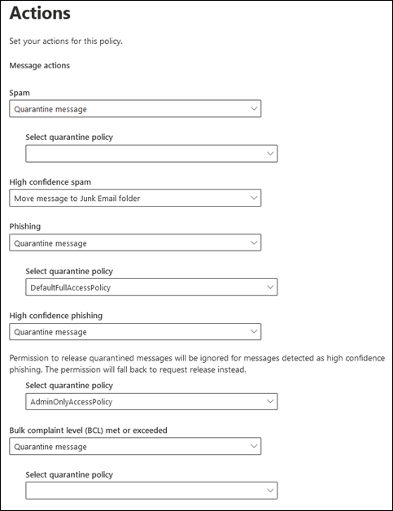

5. When you're finished, click **Save**.

#### Assign quarantine tags in anti-spam policies in PowerShell

If you'd rather use PowerShell to assign quarantine tags in anti-spam policies, connect to Exchange Online PowerShell or Exchange Online Protection PowerShell and use the following syntax:

```powershell
<New-HostedContentFilterPolicy -Name "<Unique name>" | Set-HostedContentFilterPolicy -Identity "<Policy name>">  [-SpamAction Quarantine] [-SpamQuarantineTag <QuarantineTagName>] [-HighConfidenceSpamAction Quarantine] [-HighConfidenceSpamQuarantineTag <QuarantineTagName>] [-PhishSpamAction Quarantine] [-PhishQuarantineTag <QuarantineTagName>] [-HighConfidencePhishQuarantineTag <QuarantineTagName>] [-BulkSpamAction Quarantine] [-BulkQuarantineTag <QuarantineTagName>] ...
```

**Notes**:

- The default value for the _HighConfidencePhishAction_ parameter is Quarantine, so you don't need to set the Quarantine action for high confidence phishing detections in new anti-spam policies. For all other spam filtering verdicts in new or existing anti-spam policies, the quarantine tag is only effective if the action value is Quarantine. To see the action values in existing anti-spam policies, run the following command:

  ```powershell
  Get-HostedContentFilterPolicy | Format-Table Name,*SpamAction,HighConfidencePhishAction
  ```

  For information about the default action values and the recommended action values for Standard and Strict, see [EOP anti-spam policy settings](recommended-settings-for-eop-and-office365.md#eop-anti-spam-policy-settings).

- A spam filtering verdict without a corresponding quarantine tag parameter means the [default quarantine tag](#step-2-assign-a-quarantine-tag-to-supported-features) for that verdict is used.

  You only need to replace a default quarantine tag with a custom quarantine tag if you want to change the default end-user capabilities on quarantined messages.

- A new anti-spam policy in PowerShell requires a spam filter policy (settings) using the **New-HostedContentFilterPolicy** cmdlet and a new spam filter rule (recipient filters) using the **New-HostedContentFilterRule** cmdlet. For instructions, see [Use PowerShell to create anti-spam policies](configure-your-spam-filter-policies.md#use-powershell-to-create-anti-spam-policies).

This example creates a new spam filter policy named Research Department with the following settings:

- The action for all spam filtering verdicts is set to Quarantine.
- The custom quarantine tag named NoAccess that assigns **No access** permissions replaces any default quarantine tags that don't already assign **No access** permissions by default.

```powershell
New-HostedContentFilterPolicy -Name Research Department -SpamAction Quarantine -SpamQuarantineTag NoAccess -HighConfidenceSpamAction Quarantine -HighConfidenceSpamQuarantineTag NoAction -PhishSpamAction Quarantine -PhishQuarantineTag NoAction -BulkSpamAction Quarantine -BulkQuarantineTag NoAccess
```

For detailed syntax and parameter information, see [New-HostedContentFilterPolicy](/powershell/module/exchange/new-hostedcontentfilterpolicy).

This example modifies the existing spam filter policy named Human Resources. The action for the spam quarantine verdict is set to Quarantine, and the custom quarantine tag named NoAccess is assigned.

```powershell
Set-HostedContentFilterPolicy -Identity "Human Resources" -SpamAction Quarantine -SpamQuarantineTag NoAccess
```

For detailed syntax and parameter information, see [Set-HostedContentFilterPolicy](/powershell/module/exchange/set-hostedcontentfilterpolicy).

## Configure global quarantine notification settings in the Security & Compliance Center

The global settings for quarantine tags allow you to customize the end-user spam notifications that are sent to recipients of messages that were quarantined. For more information about these notifications, see [End-user spam notifications](use-spam-notifications-to-release-and-report-quarantined-messages.md).

1. In the Security & Compliance Center, go to **Threat management** \> **Policy** and then select **Quarantine tags**.

2. On the **Quarantine tags** page, select **Global settings**.

3. In the **Quarantine notification settings** flyout that opens, configure some or all of the following settings:

   - **Use my company logo**: Select this option to replace the default Microsoft logo that's use at the top of end-user spam notifications. Before you do this, you need to follow the instructions in [Customize the Microsoft 365 theme for your organization](../../admin/setup/customize-your-organization-theme.md) to upload your custom logo.

     The following screenshot shows a custom logo in an end-user spam notification:

     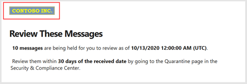

   - **Choose language**: End-user spam notifications are already localized based on the recipient's language settings. You can specify customized text in different languages for the **Display name** and **Disclaimer** values.

     Select at least one language from the first language box and then click **Add**. You can select multiple languages by clicking **Add** after each one. A section language box shows all of the languages that you've selected:

     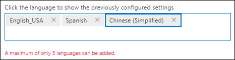

   - **Display name**: Customize the sender's display name that's used in end-user spam notifications.

     For each language that you've added, select the language in the second language box (don't click on the X) and enter the text value you want in the **Display name** box.

     The following screenshot shows the customized display name in an end-user spam notification:

     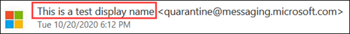

   - **Disclaimer**: Add a custom disclaimer to the bottom of end-user spam notifications. The localized text, **A disclaimer from your organization:** is always included first, followed by the text you specify.

     For each language that you've added, select the language in the second language box  (don't click the X) and enter the text value you want in the **Disclaimer** box.

     The following screenshot shows the customized disclaimer in an end-user spam notification:

     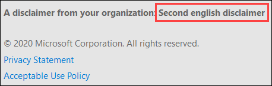

## View quarantine tags in the Security & Compliance Center

1. In the Security & Compliance Center, go to **Threat management** \> **Policy** and then select **Quarantine tags**.

- To view the settings of built-in or custom quarantine tags, select the quarantine tag from the list (don't select the check box).

- To view the global settings, select **Global settings**

### View quarantine tags in PowerShell

If you'd rather use PowerShell to view quarantine tags, do any of the following steps:

- To view a summary list of all built-in or custom tags, run the following command:

  ```powershell
  Get-QuarantineTag | Format-Table Name
  ```

- To view the settings of built-in or custom quarantine tags, replace \<TagName\> with the name of the quarantine tag, and run the following command:

  ```powershell
  Get-QuarantineTag -Identity "<TagName>"
  ```

- To view the global settings, run the following command:

  ```powershell
  Get-QuarantineTag -QuarantineTagType GlobalQuarantineTag
  ```

For detailed syntax and parameter information, see [Get-HostedContentFilterPolicy](/powershell/module/exchange/get-hostedcontentfilterpolicy).

## Remove quarantine tags in the Security & Compliance Center

**Notes**:

- You can't remove built-in quarantine tags.

- Before you remove a custom quarantine tag, verify that it's not being used. For example, run the following command in PowerShell:

  ```powershell
  Get-HostedContentFilterPolicy | Format-List Name,*QuarantineTag
  ```

  If the quarantine tag is being used, [replace the assigned quarantine tag](#step-2-assign-a-quarantine-tag-to-supported-features) before you remove it.

1. In the Security & Compliance Center, go to **Threat management** \> **Policy** and then select **Quarantine tags**.

2. On the **Quarantine tags** page, select the custom quarantine tag that you want to remove, and the click **Delete tag**.

3. Click **Remove tag** in the confirmation dialog that appears.

### Remove quarantine tags in PowerShell

If you'd rather use PowerShell to remove a custom quarantine tag, replace \<TagName\> with the name of the quarantine tag, and run the following command:

```powershell
Remove-QuarantineTag -Identity "<TagName>"
```

For detailed syntax and parameter information, see [Remove-QuarantineTag](/powershell/module/exchange/remove-quarantinetag).

## Quarantine tag permission details

The following sections describe the effects of preset permission groups and individual permissions in the details of quarantined messages and in end-user spam notifications.

### Preset permissions groups

The individual permissions that are included in preset permission groups are listed in the table at the beginning of this article.

#### No access

If the quarantine tag assigns the **No access** permissions (no permissions), users still get some baseline capabilities:

- **Quarantined message details**: The **View message header** button is always available.

  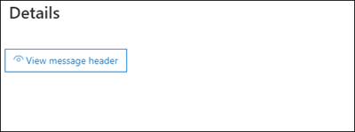

- **End-user spam notifications**: The **Review** button that takes the user to the message in quarantine is always available.

  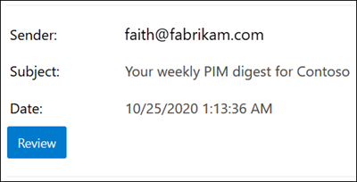

#### Limited access

If the quarantine tag assigns the **Limited access** permissions, users get the following capabilities:

- **Quarantined message details**: The following buttons are available:
  - **Request release**
  - **View message header**
  - **Preview message**
  - **Block sender**
  - **Remove from quarantine**

  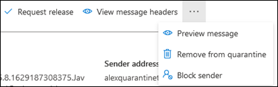

- **End-user spam notifications**: The following buttons are available:
  - **Block sender**
  - **Review**

  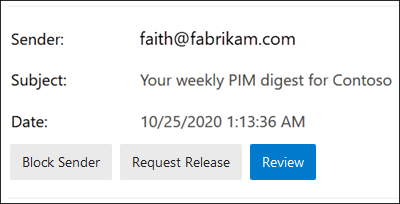

#### Full access

If the quarantine tag assigns the **Full access** permissions (all available permissions), users get the following capabilities:

- **Quarantined message details**: The following buttons are available:
  - **Release message**
  - **View message header**
  - **Preview message**
  - **Block sender**
  - **Allow sender**
  - **Remove from quarantine**

  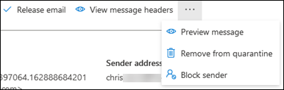

- **End-user spam notifications**: The following buttons are available:
  - **Block sender**
  - **Release**
  - **Review**

  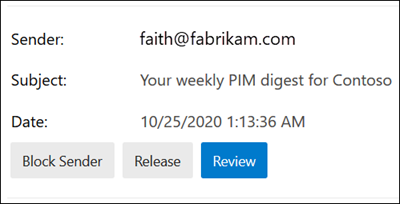

### Individual permissions

> [!NOTE]
> Remember, users always get the buttons described in the [No access](#no-access) section. These buttons are not included in the individual permission descriptions.

#### Allow sender permission

The **Allow sender** permission (_PermissionToAllowSender_) controls access to the button that allows users to conveniently add the quarantined message sender to their Safe Senders list.

- **Quarantined message details**:
  - **Allow sender** permission enabled: The **Allow sender** button is available.
  - **Allow sender** permission disabled: The **Allow sender** button is not available.

- **End-user spam notifications**: No effect.

For more information about the Safe Senders list, see [Prevent trusted senders from being blocked](https://support.microsoft.com/office/274ae301-5db2-4aad-be21-25413cede077#__toc304379666) and [Use Exchange Online PowerShell to configure the safelist collection on a mailbox](configure-junk-email-settings-on-exo-mailboxes.md#use-exchange-online-powershell-to-configure-the-safelist-collection-on-a-mailbox).

#### Block sender permission

The **Block sender** permission (_PermissionToBlockSender_) controls access to the button that allows users to conveniently add the quarantined message sender to their Blocked Senders list.

- **Quarantined message details**:
  - **Block sender** permission enabled: The **Block sender** button is available.
  - **Block sender** permission disabled: The **Block sender** button is not available.

- **End-user spam notifications**:
  - **Block sender** permission disabled: The **Block sender** button is not available.
  - **Block sender** permission enabled: The **Block sender** button is available.

For more information about the Blocked Senders list, see [Block messages from someone](https://support.microsoft.com/office/274ae301-5db2-4aad-be21-25413cede077#__toc304379667) and [Use Exchange Online PowerShell to configure the safelist collection on a mailbox](configure-junk-email-settings-on-exo-mailboxes.md#use-exchange-online-powershell-to-configure-the-safelist-collection-on-a-mailbox).

#### Delete permission

The **Delete** permission (_PermissionToDelete_) controls the ability to of users to delete their messages (messages where the user is a recipient) from quarantine.

- **Quarantined message details**:
  - **Delete** permission enabled: The **Remove from quarantine** button is available.
  - **Delete** permission disabled: The **Remove from quarantine** button is not available.

- **End-user spam notifications**: No effect.

#### Preview permission

The **Preview** permission (_PermissionToPreview_) controls the ability to of users to preview their messages in quarantine.

- **Quarantined message details**:
  - **Preview** permission enabled: The **Preview message** button is available.
  - **Preview** permission disabled: The **Preview message** button is not available.

- **End-user spam notifications**: No effect.

#### Allow recipients to release a message from quarantine permission

The **Allow recipients to release a message from quarantine** permission (_PermissionToRelease_) controls the ability of users to release their quarantined messages directly and without the approval of an admin.

- **Quarantined message details**:
  - Permission enabled: The **Release message** button is available.
  - Permission disabled: The **Release message** button is not available.

- **End-user spam notifications**:
  - Permission enabled: The **Release** button is available.
  - Permission disabled: The **Release** button is not available.

#### Allow recipients to request a message to be released from quarantine permission

The **Allow recipients to request a message to be released from quarantine** permission (_PermissionToRequestRelease_) controls the ability of users to _request_ the release of their quarantined messages. The message is only released after an admin approves the request.

- **Quarantined message details**:
  - Permission enabled: The **Request release** button is available.
  - Permission disabled: The **Request release** button is not available.

- **End-user spam notifications**: The **Release** button is not available.