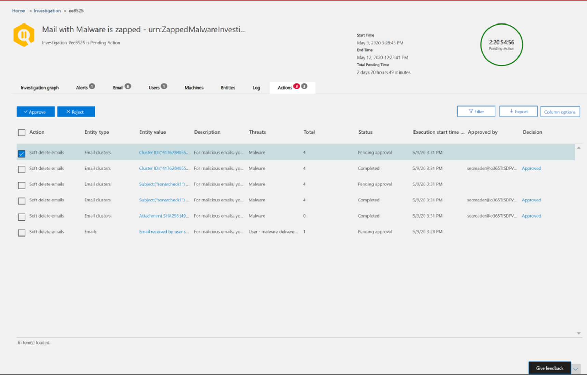
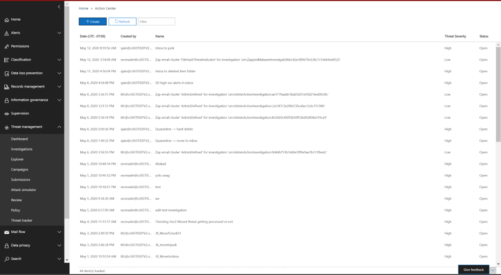
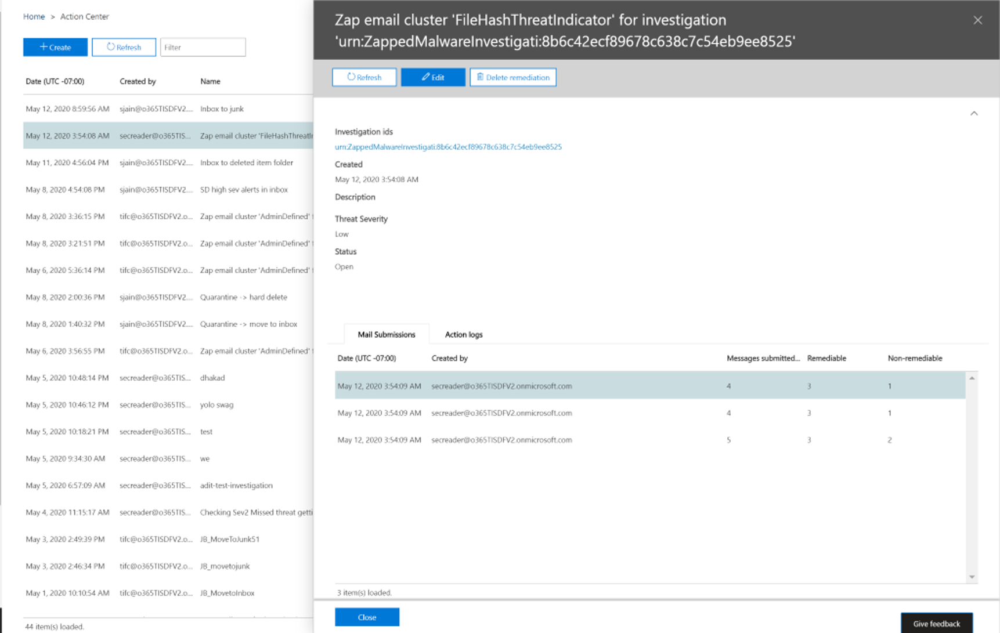

# Remediate malicious email delivered in Office 365

[!INCLUDE [Microsoft 365 Defender rebranding](../includes/microsoft-defender-for-office.md)]

Remediation means taking a prescribed action against a threat. Malicious email sent to your organization can be cleaned up either by the system, through zero-hour auto purge (ZAP), or by security teams through remediation actions like *move to inbox*, *move to junk*, *move to deleted items*, *soft delete*, or *hard delete*. Microsoft Defender for Office 365 P2/E5 enables security teams to remediate threats in email and collaboration functionality through manual and automated investigation.

> [!NOTE]
> To remediate malicious email, security teams need the *search and purge* role assigned to them. Role assignment is done through permissions in the security and compliance center.

## What you need to know before you begin

Admins can take required action on emails, but to get those actions approved, they must have the *search and purge* role assigned to them via **Security & Compliance Center** \> **Permissions**. Without the "search and purge" role added to one of the role-groups, they won't be able to execute the action.

## Manual and automated remediation

*Manual hunting* occurs when security teams identify threats manually by using the search and filtering capabilities in Threat Explorer. Manual email remediation can be triggered through any email view (*Malware*, *Phish*, or *All email*) after you identify a set of emails that need to be remediated.

> [!div class="mx-imgBorder"]
> 

Security teams can use Threat Explorer to select emails in several ways:

- Choose emails by hand: Use filters in various views. Select up to 100 emails to remediate.

- Query selection: Select an entire query by using the top **select all** button. The same query is also shown in action center mail submission details.

- Query selection with exclusion: Sometimes security operations teams may want to remediate emails by selecting an entire query and excluding certain emails from the query manually. To do so, an admin can use the **Select all** check box and scroll down to exclude emails manually. The query can hold a maximum of 1,000 emails. The maximum number of exclusions is 100.

Once emails are selected through Threat Explorer, you can start remediation by taking direct action or by queuing up emails for an action:

- Direct approval: When actions like *move to inbox*, *move to junk*, *move to deleted items*, *soft delete*, or *hard delete* are selected by security personnel who have appropriate permissions, and the next steps in remediation are followed, the remediation process begins to execute the selected action. A temporary flyout shows remediation in progress.

- Two-step approval: An "add to remediation" action can be taken by admins who don't have appropriate permissions or who need to wait to execute the action. In this case, the targeted emails are added to a remediation container. Approval is needed before the remediation is executed.

**Automated investigation and response** actions are triggered by alerts or by security operations teams from Threat Explorer. These may include recommended remediation actions that must be approved by a security operations team. These actions are included on the **Action** tab in the automated investigation.

> [!div class="mx-imgBorder"]
> 

All remediations (either direct approval or two-step approval) that were created in Threat Explorer as well as approved actions coming from automated investigations are displayed in the Action Center. Access these via the left navigation panel under **Review** \> **Action Center**.

> [!div class="mx-imgBorder"]
> 

Action Center shows all remediation actions for the past 30 days. Actions taken through Threat Explorer are listed by the name that the security operations team provided when the remediation was created. Actions taken through automated investigations have titles that begin with the related alert that triggered the investigation, such as "Zap email cluster... ."

Open any remediation item to view details about it, including its name, creation date, description, threat severity, and status. It also shows the following two tabs.

- **Mail submission** tab: Displays the number of emails submitted through Threat Explorer or automated investigations to be remediated. These emails can be actionable or not actionable.

  > [!div class="mx-imgBorder"]
  > 

  - **Actionable**: Emails in the following cloud mailbox locations can be acted on and moved:
    - Inbox
    - Junk
    - Deleted folder
    - Soft-deleted folder

      > [!NOTE]
      > Currently, only a user with access to the mailbox can recover items from a soft-deleted folder.

  - **Not actionable**: Emails in the following locations can't be acted on or moved in remediation actions:
    - Quarantine
    - Hard-deleted folder
    - On-premises/external
    - Failed/dropped

  Suspicious messages are categorized as either remediable or nonremediable. In most cases, remediable and nonremediable messages combine equals total messages submitted. But in rare cases this may not be true. This can happen because of system delays, timeouts, or expired messages. Messages expire based on the Threat Explorer retention period for your organization.

  Unless you're remediating old messages after your organization's Threat Explorer retention period, it's advisable to retry remediating items if you see number inconsistencies. For system delays, remediation updates are typically refreshed within a few hours.

  If your organization's retention period for email in Threat Explorer is 30 days and you're remediating emails going back 29-30 days, mail submission counts may not always add up. The emails might have started moving out of the retention period already.

  If remediations are stuck in the "In progress" state for a while, it's likely due to system delays. It could take up to a few hours to remediate. You might see variations in mail submission counts, as some of the emails may not have been included the query at the start of remediation due to system delays. It is a good idea to retry remediating in such cases.

  > [!NOTE]
  > For best results, remediation should be done in batches of 50,000 or fewer.

  Only remediable emails are acted on during remediation. Nonremediable emails can't be remediated by the Office 365 email system, as they aren't stored in cloud mailboxes.

  Admins can take actions on emails in quarantine if necessary, but those emails will expire out of quarantine if they're not manually purged. Emails quarantined because of malicious content aren't accessible by users, so security personnel don't have to take any action to get rid of threats in quarantine. If the emails are on-premises or external, the user can be contacted to address the suspicious email. Or the admins can use separate email server/security tools for removal. These emails can be identified by applying the *delivery location = on-prem* external filter in Threat Explorer. For failed or dropped email, or email not accessible by users, there won't be any email to mitigate, since these mails don't reach the mailbox.

  The following image shows how a submission looks in Action Center. A remediation can contain multiple submissions. If multiple actions get approved through one automated investigation, each email or email cluster action appears in the same remediation as a different submission.

  > [!div class="mx-imgBorder"]
  > 

  Select a mail submission item to show the details of that remediation, such as the query (when remediation is triggered through automated investigations or Threat Explorer through selecting a query) and the start and end times of remediation. It also displays a list of messages that were submitted for remediation. As messages move out of the Threat Explorer retention period, the messages disappear from this list. The list also shows individual messages that are remediable.

- **Action logs**: This tab shows the messages remediated, including approved date, admin who approved the action, action, status, and counts.

  Status can be:

  - **Started**: Remediation is triggered.
  - **Queued**: Remediation is queued up for mitigation of emails.
  - **In progress**: Mitigation is in progress.
  - **Completed**: Mitigation on all remediable emails either completed successfully or with some failures.
  - **Failed**: No remediations were successful.

  As only remediable emails can be acted on, each email's cleanup is shown as successful or failed. From the total remediable emails, successful and failed mitigations are reported.

  - **Success**: The desired action on remediable emails was accomplished. For example: An admin wants to remove emails from mailboxes, so the admin takes the action of soft-deleting emails. If a remediable email isn't found in the original folder after the action is taken, the status will show as successful.

  - **Failure**: The desired action on remediable emails failed. For example: An admin wants to remove emails from mailboxes, so the admin takes the action of soft-deleting emails. If a remediable email is still found in the mailbox after the action is taken, status will show as failed.

  - **NEW**: Addition of column "Already in destination" in Action Log: Since we've got the latest delivery location in Explorer and we want to utilize it for making smarter moves across the experiences, we are utilizing the latest delivery location in remediation by not sending signals to remediate if the message has already been remediated. This will help you understand the exact number of messages that need to be remediated. As we will not be remediating already remediated messages with the same actions, we are introducing another column named "Already in destination". This means that the action you wish to perform was taken previously on the email, hence the email is already present in the destination folder. Since actions can only be taken on messages in inbox, junk, deleted folder, and soft deleted folder from Explorer, these are remediable messages. So this column shows only messages that are remediable. For instance, a soft delete action is performed on the message present in the inbox, then the message will get successfully actioned. The next time a soft delete is performed on the same message, it will show under the column "Already in destination".
Already in destination" count is a part of remediable count. So,
    Remediable = Successful + Failed + Already in destination 
For most of the cases, unless there are ingestion delays where signals tend to get delayed/ lost sometimes.

  Select any item in the action log to display remediation details. If the details say "successful" or "not found in mailbox", that item was already removed from the mailbox. Sometimes there's a systemic error during remediation. In those cases, it's a good idea to retry remediation.

  In case of remediating large batches, you can also export the messages send for remediation via Mail Submission and messages which got remediated via Action Logs. The export limit is increased to 100,000 records.

  Remediation is a powerful tool to mitigate threats and address suspicious emails. It helps keep an organization secure.
